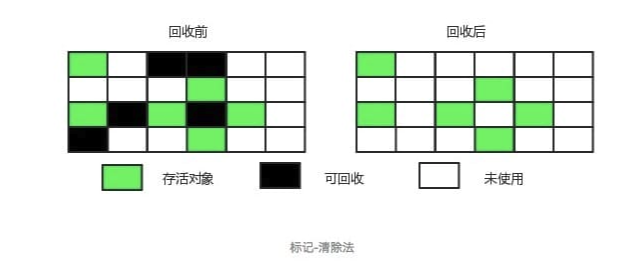

# 双亲委派机制
## 为什么需要双亲委派机制
双亲委派保证类加载器，自下而上的委派，又自上而下的加载，<font size=4 color="green">保证每一个类在各个类加载器中都是同一个类</font>。

一个非常明显的目的就是保证java官方的类库<JAVA_HOME>\lib和扩展类库<JAVA_HOME>\lib\ext的加载安全性，不会被开发者覆盖。

例如类java.lang.Object，它存放在rt.jar之中，无论哪个类加载器要加载这个类，最终都是委派给启动类加载器加载，因此Object类在程序的各种类加载器环境中都是同一个类。

如果开发者自己开发开源框架，也可以自定义类加载器，利用双亲委派模型，保护自己框架需要加载的类不被应用程序覆盖。

## loadClass过程
1、先检查类是否已经被加载过

2、若没有加载则调用父加载器的loadClass()方法进行加载

3、若父加载器为空则默认使用启动类加载器作为父加载器。

4、如果父类加载失败，抛出ClassNotFoundException异常后，再调用自己的findClass()方法进行加载。

## 破坏双亲委派
### why
因为在某些情况下父类加载器需要委托子类加载器去加载class文件。受到加载范围的限制，父类加载器无法加载到需要的文件，以Driver接口为例，由于Driver接口定义在jdk当中的，而其实现由各个数据库的服务商来提供，比如mysql的就写了MySQL Connector，那么问题就来了，DriverManager（也由jdk提供）要加载各个实现了Driver接口的实现类，然后进行管理，但是DriverManager由启动类加载器加载，只能记载JAVA_HOME的lib下文件，而其实现是由服务商提供的，由系统类加载器加载，这个时候就需要启动类加载器来委托子类来加载Driver实现，从而破坏了双亲委派，这里仅仅是举了破坏双亲委派的其中一个情况。

### 破坏双亲委派的实现
我们结合Driver来看一下在spi（Service Provider Inteface）中如何实现破坏双亲委派。

先从DriverManager开始看，平时我们通过DriverManager来获取数据库的Connection：

```js
String url = "jdbc:mysql://localhost:3306/xxx";
Connection conn = java.sql.DrivaerManager.getConnection(url,"root","root");
```

在调用DriverManager的时候，会先初始化类，调用其中的静态块：
```js
static {
    loadInitialDrivers();
    println("JDBC DriverManager initialized");
}

private static void loadInitialDrivers () {
    ...
    // 加载Driver的实现类
    AccessController.doPrivileged(new PrivilegedAction<void>() {
        public void run() {
            ServiceLoader<Driver> loadedDrivers = ServiceLoader.load(Driver.class);
            Iterator<Driver> driversIterator = loadedDrivers.iterator();
            try{
                while(driversIterator.hasNext()){
                    driversIterator.next();
                }
            } catch(Throwable t){

            }
            return null;
        }
    });
    ...
}
```

重点来看一下ServiceLoader.load(Driver.class)：

```js
public static <S> ServiceLoader<S> load(Class<S> service) {
    //获取当前线程中的上下文类加载器
    ClassLoader cl = Thread.currentThread().getContextClassLoader();
    return ServiceLoader.load(service, cl);
}
```

可以看到，load方法调用获取了当前线程中的上下文类加载器，那么上下文类加载器放的是什么加载器呢？

在sun.misc.Launcher中，我们找到了答案，在Launcher初始化的时候，会获取AppClassLoader，然后将其设置为上下文类加载器，而这个AppClassLoader，就是之前上文提到的系统类加载器Application ClassLoader，所以上下文类加载器默认情况下就是系统加载器。


# GC
[详细](https://mp.weixin.qq.com/s/_AKQs-xXDHlk84HbwKUzOw)


# jvm调优命令

[详细](https://www.cnblogs.com/ityouknow/p/5714703.html)

## jps
JVM Process Status Tool,显示指定系统内所有的HotSpot虚拟机进程。

### 命令格式
jps [options] [hostid]

### option参数
- l : 输出主类全名或jar路径
- q : 只输出LVMID
- m : 输出JVM启动时传递给main()的参数
- v : 输出JVM启动时显示指定的JVM参数

其中[option]、[hostid]参数也可以不写。

### 示例
```js
$ jps -l -m
  28920 org.apache.catalina.startup.Bootstrap start
  11589 org.apache.catalina.startup.Bootstrap start
  25816 sun.tools.jps.Jps -l -m
```

## jstat
jstat(JVM statistics Monitoring)是用于监视虚拟机运行时状态信息的命令，它可以显示出虚拟机进程中的类装载、内存、垃圾收集、JIT编译等运行数据。

### 命令格式
jstat [option] LVMID [interval] [count]

### 参数
- [option] : 操作参数
- LVMID : 本地虚拟机进程ID
- [interval] : 连续输出的时间间隔
- [count] : 连续输出的次数


### option 参数总览
| Option |	Displays… |
| ---- | ---- |
|class	|class loader的行为统计。Statistics on the behavior of the class loader.|
|compiler	| HotSpt JIT编译器行为统计。Statistics of the behavior of the HotSpot Just-in-Time compiler.|
|gc	|垃圾回收堆的行为统计。Statistics of the behavior of the garbage collected heap.|
|gccapacity	|各个垃圾回收代容量(young,old,perm)和他们相应的空间统计。Statistics of the capacities of the generations and their corresponding spaces.|
|gcutil	|垃圾回收统计概述。Summary of garbage collection statistics.|
|gccause|	垃圾收集统计概述（同-gcutil），附加最近两次垃圾回收事件的原因。Summary of garbage collection statistics (same as -gcutil), with the cause of the last and|
|gcnew|	新生代行为统计。Statistics of the behavior of the new generation.|
|gcnewcapacity|	新生代与其相应的内存空间的统计。Statistics of the sizes of the new generations and its corresponding spaces.|
|gcold	|年老代和永生代行为统计。Statistics of the behavior of the old and permanent generations.|
|gcoldcapacity	|年老代行为统计。Statistics of the sizes of the old generation.|
|gcpermcapacity	|永生代行为统计。Statistics of the sizes of the permanent generation.|
|printcompilation	|HotSpot编译方法统计。HotSpot compilation method statistics.|

### option 参数详解
-class

监视类装载、卸载数量、总空间以及耗费的时间
```js
$ jstat -class 11589
 Loaded  Bytes  Unloaded  Bytes     Time   
  7035  14506.3     0     0.0       3.67
```
- Loaded : 加载class的数量
- Bytes : class字节大小
- Unloaded : 未加载class的数量
- Bytes : 未加载class的字节大小
- Time : 加载时间


-gc

垃圾回收堆的行为统计，常用命令
```js
$ jstat -gc 1262
 S0C    S1C     S0U     S1U   EC       EU        OC         OU        PC       PU         YGC    YGCT    FGC    FGCT     GCT   
26112.0 24064.0 6562.5  0.0   564224.0 76274.5   434176.0   388518.3  524288.0 42724.7    320    6.417   1      0.398    6.815
```
C即Capacity 总容量，U即Used 已使用的容量

- S0C : survivor0区的总容量
- S1C : survivor1区的总容量
- S0U : survivor0区已使用的容量
- S1C : survivor1区已使用的容量
- EC : Eden区的总容量
- EU : Eden区已使用的容量
- OC : Old区的总容量
- OU : Old区已使用的容量
- PC 当前perm的容量 (KB)
- PU perm的使用 (KB)
- YGC : 新生代垃圾回收次数
- YGCT : 新生代垃圾回收时间
- FGC : 老年代垃圾回收次数
- FGCT : 老年代垃圾回收时间
- GCT : 垃圾回收总消耗时间
  
```js
$ jstat -gc 1262 2000 20
```
这个命令意思就是每隔2000ms输出1262的gc情况，一共输出20次


## jmap
jmap(JVM Memory Map)命令用于生成heap dump文件<font size=4 color = "green">（在故障定位(尤其是OOM)和性能分析的时候，经常会用到一些文件辅助我们排除代码问题。 这些文件记录了JVM运行期间的内存占用、线程执行等情况，这就是我们常说的dump文件）</font>，如果不使用这个命令，还阔以使用-XX:+HeapDumpOnOutOfMemoryError参数来让虚拟机出现OOM的时候·自动生成dump文件。
jmap不仅能生成dump文件，还阔以查询finalize执行队列、Java堆和永久代的详细信息，如当前使用率、当前使用的是哪种收集器等。

### 命令格式
jmap [option] LVMID

### option参数

- dump : 生成堆转储快照
- finalizerinfo : 显示在F-Queue队列等待Finalizer线程执行finalizer方法的对象
- heap : 显示Java堆详细信息
- histo : 显示堆中对象的统计信息
- permstat : to print permanent generation statistics
- F : 当-dump没有响应时，强制生成dump快照

### 示例
-dump

常用格式
```
-dump::live,format=b,file=<filename> pid 
```

dump堆到文件,format指定输出格式，live指明是活着的对象,file指定文件名

```
$ jmap -dump:live,format=b,file=dump.hprof 28920
  Dumping heap to /home/xxx/dump.hprof ...
  Heap dump file created
```
dump.hprof这个后缀是为了后续可以直接用MAT(Memory Anlysis Tool)打开。


-heap

打印heap的概要信息，GC使用的算法，heap的配置及wise heap的使用情况,可以用此来判断内存目前的使用情况以及垃圾回收情况

```js
$ jmap -heap 28920
  Attaching to process ID 28920, please wait...
  Debugger attached successfully.
  Server compiler detected.
  JVM version is 24.71-b01  

  using thread-local object allocation.
  Parallel GC with 4 thread(s)//GC 方式  

  Heap Configuration: //堆内存初始化配置
     MinHeapFreeRatio = 0 //对应jvm启动参数-XX:MinHeapFreeRatio设置JVM堆最小空闲比率(default 40)
     MaxHeapFreeRatio = 100 //对应jvm启动参数 -XX:MaxHeapFreeRatio设置JVM堆最大空闲比率(default 70)
     MaxHeapSize      = 2082471936 (1986.0MB) //对应jvm启动参数-XX:MaxHeapSize=设置JVM堆的最大大小
     NewSize          = 1310720 (1.25MB)//对应jvm启动参数-XX:NewSize=设置JVM堆的‘新生代’的默认大小
     MaxNewSize       = 17592186044415 MB//对应jvm启动参数-XX:MaxNewSize=设置JVM堆的‘新生代’的最大大小
     OldSize          = 5439488 (5.1875MB)//对应jvm启动参数-XX:OldSize=<value>:设置JVM堆的‘老生代’的大小
     NewRatio         = 2 //对应jvm启动参数-XX:NewRatio=:‘新生代’和‘老生代’的大小比率
     SurvivorRatio    = 8 //对应jvm启动参数-XX:SurvivorRatio=设置年轻代中Eden区与Survivor区的大小比值 
     PermSize         = 21757952 (20.75MB)  //对应jvm启动参数-XX:PermSize=<value>:设置JVM堆的‘永生代’的初始大小
     MaxPermSize      = 85983232 (82.0MB)//对应jvm启动参数-XX:MaxPermSize=<value>:设置JVM堆的‘永生代’的最大大小
     G1HeapRegionSize = 0 (0.0MB)  

  Heap Usage://堆内存使用情况
  PS Young Generation
  Eden Space://Eden区内存分布
     capacity = 33030144 (31.5MB)//Eden区总容量
     used     = 1524040 (1.4534378051757812MB)  //Eden区已使用
     free     = 31506104 (30.04656219482422MB)  //Eden区剩余容量
     4.614088270399305% used //Eden区使用比率
  From Space:  //其中一个Survivor区的内存分布
     capacity = 5242880 (5.0MB)
     used     = 0 (0.0MB)
     free     = 5242880 (5.0MB)
     0.0% used
  To Space:  //另一个Survivor区的内存分布
     capacity = 5242880 (5.0MB)
     used     = 0 (0.0MB)
     free     = 5242880 (5.0MB)
     0.0% used
  PS Old Generation //当前的Old区内存分布
     capacity = 86507520 (82.5MB)
     used     = 0 (0.0MB)
     free     = 86507520 (82.5MB)
     0.0% used
  PS Perm Generation//当前的 “永生代” 内存分布
     capacity = 22020096 (21.0MB)
     used     = 2496528 (2.3808746337890625MB)
     free     = 19523568 (18.619125366210938MB)
     11.337498256138392% used  

  670 interned Strings occupying 43720 bytes.
```


## jstack
jstack用于生成java虚拟机当前时刻的线程快照。线程快照是当前java虚拟机内每一条线程正在执行的方法堆栈的集合，生成线程快照的主要目的是定位线程出现长时间停顿的原因，如线程间死锁、死循环、请求外部资源导致的长时间等待等。 线程出现停顿的时候通过jstack来查看各个线程的调用堆栈，就可以知道没有响应的线程到底在后台做什么事情，或者等待什么资源。 如果java程序崩溃生成core文件，jstack工具可以用来获得core文件的java stack和native stack的信息，从而可以轻松地知道java程序是如何崩溃和在程序何处发生问题。另外，jstack工具还可以附属到正在运行的java程序中，看到当时运行的java程序的java stack和native stack的信息, 如果现在运行的java程序呈现hung的状态，jstack是非常有用的。

### 命令格式
jstack [option] LVMID

### option参数

- F : 当正常输出请求不被响应时，强制输出线程堆栈
- l : 除堆栈外，显示关于锁的附加信息
- m : 如果调用到本地方法的话，可以显示C/C++的堆栈

### 示例

```js
$ jstack -l 11494|more
2016-07-28 13:40:04
Full thread dump Java HotSpot(TM) 64-Bit Server VM (24.71-b01 mixed mode):

"Attach Listener" daemon prio=10 tid=0x00007febb0002000 nid=0x6b6f waiting on condition [0x0000000000000000]
   java.lang.Thread.State: RUNNABLE

   Locked ownable synchronizers:
        - None

"http-bio-8005-exec-2" daemon prio=10 tid=0x00007feb94028000 nid=0x7b8c waiting on condition [0x00007fea8f56e000]
   java.lang.Thread.State: WAITING (parking)
        at sun.misc.Unsafe.park(Native Method)
        - parking to wait for  <0x00000000cae09b80> (a java.util.concurrent.locks.AbstractQueuedSynchronizer$ConditionObject)
        at java.util.concurrent.locks.LockSupport.park(LockSupport.java:186)
        at java.util.concurrent.locks.AbstractQueuedSynchronizer$ConditionObject.await(AbstractQueuedSynchronizer.java:2043)
        at java.util.concurrent.LinkedBlockingQueue.take(LinkedBlockingQueue.java:442)
        at org.apache.tomcat.util.threads.TaskQueue.take(TaskQueue.java:104)
        at org.apache.tomcat.util.threads.TaskQueue.take(TaskQueue.java:32)
        at java.util.concurrent.ThreadPoolExecutor.getTask(ThreadPoolExecutor.java:1068)
        at java.util.concurrent.ThreadPoolExecutor.runWorker(ThreadPoolExecutor.java:1130)
        at java.util.concurrent.ThreadPoolExecutor$Worker.run(ThreadPoolExecutor.java:615)
        at org.apache.tomcat.util.threads.TaskThread$WrappingRunnable.run(TaskThread.java:61)
        at java.lang.Thread.run(Thread.java:745)

   Locked ownable synchronizers:
        - None
      .....
```

# Java内存区域
- 方法区（方法区是一个 JVM 规范，永久代与元空间都是其一种实现方式。在 JDK 1.8 之后，原来永久代的数据被分到了堆和元空间中。元空间存储类的元信息，静态变量和常量池等放入堆中。）
- 堆
- 虚拟机栈
- 本地方法栈
- 程序计数器

程序计数器、虚拟机栈、本地方法栈这3个区域是线程私有的，会随线程消亡而自动回收，所以不需要管理。

因此<font size=4 color="green">垃圾收集只需要关注堆和方法区</font>。

## 常量池，字符串常量池，运行时常量池区别

### 字符串常量池
全局字符串池里的内容是在类加载完成，经过验证，准备阶段之后在堆中生成字符串对象实例，然后将该字符串对象实例的引用值存到string pool中（记住：string pool中存的是引用值而不是具体的实例对象，具体的实例对象是在堆中开辟的一块空间存放的。）

### 常量池

class文件中除了包含类的版本、字段、方法、接口等描述信息外，还有一项信息就是常量池(constant pool table)，用于存放编译器生成的各种字面量(Literal)和符号引用(Symbolic References)。 字面量就是我们所说的常量概念，如文本字符串、被声明为final的常量值等。 符号引用是一组符号来描述所引用的目标，符号可以是任何形式的字面量，只要使用时能无歧义地定位到目标即可（它与直接引用区分一下，直接引用一般是指向方法区的本地指针，相对偏移量或是一个能间接定位到目标的句柄）。


### 运行时常量池
jvm在执行某个类的时候，必须经过加载、连接、初始化，而连接又包括验证、准备、解析三个阶段。而当类加载到内存中后，jvm就会将class常量池中的内容存放到运行时常量池中，由此可知，运行时常量池也是每个类都有一个。类在解析之后，将符号引用替换成直接引用，与全局常量池中的引用值保持一致。

### 变化


# GC触发条件

## YGC
大多数情况下，对象直接在年轻代中的Eden区进行分配，如果Eden区域没有足够的空间，那么就会触发YGC（Minor GC），YGC处理的区域只有新生代。因为大部分对象在短时间内都是可收回掉的，因此YGC后只有极少数的对象能存活下来，而被移动到S0区（采用的是复制算法）。

当触发下一次YGC时，会将Eden区和S0区的存活对象移动到S1区，同时清空Eden区和S0区。当再次触发YGC时，这时候处理的区域就变成了Eden区和S1区（即S0和S1进行角色交换）。每经过一次YGC，存活对象的年龄就会加1。


## FGC
下面4种情况，对象会进入到老年代中：

- YGC时，To Survivor区不足以存放存活的对象，对象会直接进入到老年代。
- 经过多次YGC后，如果存活对象的年龄达到了设定阈值，则会晋升到老年代中。
- 动态年龄判定规则，To Survivor区中相同年龄的对象，如果其大小之和占到了 To Survivor区一半以上的空间，那么大于此年龄的对象会直接进入老年代，而不需要达到默认的分代年龄。
- 大对象：由-XX:PretenureSizeThreshold启动参数控制，若对象大小大于此值，就会绕过新生代, 直接在老年代中分配。

当晋升到老年代的对象大于了老年代的剩余空间时，就会触发FGC（Major GC），FGC处理的区域同时包括新生代和老年代。除此之外，还有以下4种情况也会触发FGC：
- 老年代的内存使用率达到了一定阈值（可通过参数调整），直接触发FGC。
- 空间分配担保：在YGC之前，会先检查老年代最大可用的连续空间是否大于新生代所有对象的总空间。如果小于，说明YGC是不安全的，则会查看参数 HandlePromotionFailure 是否被设置成了允许担保失败，如果不允许则直接触发Full GC；如果允许，那么会进一步检查老年代最大可用的连续空间是否大于历次晋升到老年代对象的平均大小，如果小于也会触发 Full GC。
- Metaspace（元空间）在空间不足时会进行扩容，当扩容到了-XX:MetaspaceSize 参数的指定值时，也会触发FGC。
- System.gc() 或者Runtime.gc() 被显式调用时，触发FGC。


# 如何判断对象已成垃圾
## 引用计数
引用计数其实就是为每一个内存单元设置一个计数器，当被引用的时候计数器加一，当计数器减少为 0 的时候就意味着这个单元再也无法被引用了，所以可以立即释放内存。

缺陷：循环引用

## 可达性分析
可达性分析其实就是利用标记-清除(mark-sweep)，就是标记可达对象，清除不可达对象。至于用什么方式清，清了之后要不要整理这都是后话。

标记-清除具体的做法是定期或者内存不足时进行垃圾回收，从根引用(GC Roots)开始遍历扫描，将所有扫描到的对象标记为可达，然后将所有不可达的对象回收了。

所谓的根引用包括全局变量、栈上引用、寄存器上的等

<font size=5 color = "green">而不论标记-清楚还是引用计数，其实都只关心引用类型，像一些整型啥的就不需要管。

所以 JVM 还需要判断栈上的数据是什么类型，这里又可以分为保守式 GC、半保守式 GC、和准确式 GC。</font>

## 保守式GC
保守式 GC 指的是 JVM 不会记录数据的类型，也就是无法区分内存上的某个位置的数据到底是引用类型还是非引用类型。

因此只能靠一些条件来猜测是否有指针指向。比如在栈上扫描的时候根据所在地址是否在 GC 堆的上下界之内，是否字节对齐等手段来判断这个是不是指向 GC 堆中的指针。

之所以称之为保守式 GC 是因为不符合猜测条件的肯定不是指向 GC 堆中的指针，因此那块内存没有被引用，而符合的却不一定是指针，所以是保守的猜测。

但是就有可能出现恰好有数值的值就是地址的值。

这就混乱了，所以就不能确定这是指针，只能保守认为就是指针。

因此肯定不会有误杀对象的情况。只会有对象已经死了，但是有疑似指针的存在指向它，误以为它还活着而放过了它的情况发生。


## 半保守式GC
半保守式GC，在对象上会记录类型信息而其他地方还是没有记录，因此从根扫描的话还是一样，得靠猜测。

但是得到堆内对象了之后，就能准确知晓对象所包含的信息了，因此之后 tracing 都是准确的，所以称为半保守式 GC。

现在可以得知半保守式 GC 只有根直接扫描的对象无法移动，从直接对象再追溯出去的对象可以移动，所以半保守式 GC 可以使用移动部分对象的算法，也可以使用标记-清除这种不移动对象的算法。

而保守式 GC 只能使用标记-清除算法。

## 准确式 GC
相信大家看下来已经知道准确意味 JVM 需要清晰的知晓对象的类型，包括在栈上的引用也能得知类型等。

能想到的可以在指针上打标记，来表明类型，或者在外部记录类型信息形成一张映射表。

HotSpot 用的就是映射表，这个表叫 OopMap。

在 HotSpot 中，对象的类型信息里会记录自己的 OopMap，记录了在该类型的对象内什么偏移量上是什么类型的数据，而在解释器中执行的方法可以通过解释器里的功能自动生成出 OopMap 出来给 GC 用。

被 JIT 编译过的方法，也会在特定的位置生成 OopMap，记录了执行到该方法的某条指令时栈上和寄存器里哪些位置是引用。

这些特定的位置主要在：

- 循环的末尾（非 counted 循环）
- 方法临返回前 / 调用方法的call指令后
- 可能抛异常的位置


这些位置就叫作安全点(safepoint)。

那为什么要选择这些位置插入呢？因为如果对每条指令都记录一个 OopMap 的话空间开销就过大了，因此就选择这些个关键位置来记录即可。

<font size=4 color="blue">所以在 HotSpot 中 GC 不是在任何位置都能进入的，只能在安全点进入。</font>

至此我们知晓了可以在类加载时计算得到对象类型中的 OopMap，解释器生成的 OopMap 和 JIT 生成的 OopMap ，所以 GC 的时候已经有充足的条件来准确判断对象类型。

因此称为准确式 GC。

其实还有个 JNI 调用，它们既不在解释器执行，也不会经过 JIT 编译生成，所以会缺少 OopMap。

在 HotSpot 是通过句柄包装来解决准确性问题的，像 JNI 的入参和返回值引用都通过句柄包装起来，也就是通过句柄再访问真正的对象。

这样在 GC 的时候就不用扫描 JNI 的栈帧，直接扫描句柄表就知道 JNI 引用了 GC 堆中哪些对象了。


# 在什么情况下，GC会对程序产生影响
不管YGC还是FGC，都会造成一定程度的程序卡顿（即Stop The World问题：GC线程开始工作，其他工作线程被挂起），即使采用ParNew、CMS或者G1这些更先进的垃圾回收算法，也只是在减少卡顿时间，而并不能完全消除卡顿。

那到底什么情况下，GC会对程序产生影响呢

- FGC过于频繁：FGC通常是比较慢的，少则几百毫秒，多则几秒，正常情况FGC每隔几个小时甚至几天才执行一次，对系统的影响还能接受。但是，一旦出现FGC频繁（比如几十分钟就会执行一次），这种肯定是存在问题的，它会导致工作线程频繁被停止，让系统看起来一直有卡顿现象，也会使得程序的整体性能变差。

- YGC耗时过长：一般来说，YGC的总耗时在几十或者上百毫秒是比较正常的，虽然会引起系统卡顿几毫秒或者几十毫秒，这种情况几乎对用户无感知，对程序的影响可以忽略不计。但是如果YGC耗时达到了1秒甚至几秒（都快赶上FGC的耗时了），那卡顿时间就会增大，加上YGC本身比较频繁，就会导致比较多的服务超时问题。
- FGC耗时过长：FGC耗时增加，卡顿时间也会随之增加，尤其对于高并发服务，可能导致FGC期间比较多的超时问题，可用性降低，这种也需要关注。
- YGC过于频繁：即使YGC不会引起服务超时，但是YGC过于频繁也会降低服务的整体性能，对于高并发服务也是需要关注的。

# 排查FGC问题的实践指南
## 1. 清楚从程序角度，有哪些原因导致FGC？ 
- 大对象：系统一次性加载了过多数据到内存中（比如SQL查询未做分页），导致大对象进入了老年代。
- 内存泄漏：频繁创建了大量对象，但是无法被回收（比如IO对象使用完后未调用close方法释放资源），先引发FGC，最后导致OOM.
- 程序频繁生成一些长生命周期的对象，当这些对象的存活年龄超过分代年龄时便会进入老年代，最后引发FGC. （即本文中的案例）
- 程序BUG导致动态生成了很多新类，使得 Metaspace 不断被占用，先引发FGC，最后导致OOM.
- 代码中显式调用了gc方法，包括自己的代码甚至框架中的代码。
- JVM参数设置问题：包括总内存大小、新生代和老年代的大小、Eden区和S区的大小、元空间大小、垃圾回收算法等等。

## 2. 清楚排查问题时能使用哪些工具
公司的监控系统：大部分公司都会有，可全方位监控JVM的各项指标。

JDK的自带工具，包括jmap、jstat等常用命令：

查看堆内存各区域的使用率以及GC情况
> jstat -gcutil -h20 pid 1000


查看堆内存中的存活对象，并按空间排序
> jmap -histo pid | head -n20


dump堆内存文件
> jmap -dump:format=b,file=heap pid


可视化的堆内存分析工具：JVisualVM、MAT等


## 3. 排查指南

- 查看监控，以了解出现问题的时间点以及当前FGC的频率（可对比正常情况看频率是否正常）
- 了解该时间点之前有没有程序上线、基础组件升级等情况。
- 了解JVM的参数设置，包括：堆空间各个区域的大小设置，新生代和老年代分别采用了哪些垃圾收集器，然后分析JVM参数设置是否合理。
- 再对步骤1中列出的可能原因做排除法，其中元空间被打满、内存泄漏、代码显式调用gc方法比较容易排查。
- 针对大对象或者长生命周期对象导致的FGC，可通过 jmap -histo 命令并结合dump堆内存文件作进一步分析，需要先定位到可疑对象。
- 通过可疑对象定位到具体代码再次分析，这时候要结合GC原理和JVM参数设置，弄清楚可疑对象是否满足了进入到老年代的条件才能下结论。


# jvm内存结构


元空间是方法区的实现


以一段代码执行为例

```java
User user = new User();
user.setName();
```

# 类加载

JVM遇到`new`指令时，首先将去检查这个指令的参数是否能在常量池中定位到这个类的符号引用，并且检查这个符号引用代表的类是否已被加载、解析、初始化过，如果检测到User类尚未加载，触发类加载

## 加载

类加载器读取User.class文件，解析二进制流，将类的元数据存到元空间中，同时在堆中创建Class对象

```sql
对象实例（在堆）：
┌────────────────────┐
│  Mark Word         │
│  Klass Pointer ─────────────┐
└────────────────────┘        │
                              ▼
                        元空间 Metaspace（本地内存）
                        ┌────────────────────┐
                        │  InstanceKlass     │
                        │  字段、方法、结构等 │
                        └────────────────────┘

Class 对象（堆中）：
┌────────────────────┐
│ java.lang.Class<User> │ ←───┘
└────────────────────┘
```

## 解析

校验字节码格式、语义合法性等，防止JVM崩溃

为类的静态变量分配堆内存并赋零值

将运行时常量池的静态变量和方法的符号引用转换为直接引用，即具体内存地址

## 初始化

对静态变量赋值并执行静态代码块

完成Class对象在堆内存中的初始化，使得可通过反射访问

# 对象实例化

## 内存分配

在类加载检查通过后，在堆（新生代Eden区）分配对象内存。对象所需的内存大小在类加载完成后便可确定，分配内存方式有“指针碰撞”和“空闲列表”两种，选择哪种分配方式由Java堆是否规整决定，而Java堆是否规整又由所采用的垃圾收集器是否带有压缩整理功能决定。

### 内存分配两种方式：

- 指针碰撞：
    - 适用场合：堆内存规整（即没有内存碎片）的情况下
    - 原理：用过的内存全都整合到一边，没有用过的内存放到另一边，中间有一个分界指针，只需要向着未被使用的内存方向将该指针移动对象内存大小位置即可
    - 使用该分配方式的GC收集器：Serial、ParNew
- 空闲列表：
    - 适用场合：堆内存不规整的情况下
    - 原理：JVM维护一个列表，该列表会记录哪些内存块是可用的，在分配的时候，找一块足够大的内存块来划分给对象实例，最后更新列表记录
    - 使用该分配方式的GC收集器：CMS

### 内存分配并发问题

JVM采用两种方式保证线程安全

- CAS+失败重试
- TLAB（Thread-Local Allocation Buffer，线程本地分配缓冲区）：为每个线程预先在Eden区分配一块内存，JVM在给线程中的对象分配内存先，首先在TLAB分配，当对象大于TLAB中的剩余内存或TLAB的内存已用尽时，再采用上述的CAS+失败重试进行内存分配


对象的内存布局为：

- 对象头：存储哈希码、锁状态、GC分代年龄、指向方法区的类的元数据

- 实例数据：存储字段

- 对齐填充：确保对象大小为8字节的整数倍

## 对象初始化

### 初始化零值

### 设置对象头

对象头包括：

1. 标记字段：用于存储自身的运行时数据，如哈希码、GC分代年龄、锁状态标志、线程持有的锁、偏向线程id、偏向时间戳等
2. 类型指针：指向对象所属的类在方法区的元数据结构klass

##### 执行init方法

## 引用赋值

在虚拟机栈中的当前栈帧中，`new`指令会把堆中对象的引用放到操作数栈（作为中转站存储临时变量），然后存入局部变量表

## 对象访问定位

对象的访问方式由虚拟机实现而定，目前主流的方式有：使用句柄、直接指针

##### 句柄

Java堆上会划分一块内存作为句柄池，reference找那个存储的就是对象的句柄地址，而句柄中包含了对象实例数据与对象类型数据各自的具体地址信息


##### 直接指针

如果使用直接指针访问，reference中存储的直接就是对象的地址


对比

使用句柄访问的好处是reference存储的是稳定的句柄地址，在对象被移动时只会改变句柄中的实例数据指针，而reference本身不需要修改；使用直接指针访问的好处是速度快，节省了一次指针定位的时间开销

# 方法调用

#### 创建栈帧

在虚拟机栈中压入`setName`方法栈帧

其中，局部变量表存储如`this`引用，指向堆中的对象，操作数栈存储临时数据，动态链接指向当前方法所属类的运行时常量池的引用。

以虚方法调用为例（非虚方法在类加载时会将符号引用解析为直接引用）

1. 首次调用（未缓存）

   ```java
   // 假设调用obj.method()
   // 运行时常量池中，符号引用"method"被替换为0x7f3e8010（方法入口地址）
   ```

    1. 解析符号引用（如 `com/example/MyClass.myMethod`）：根据常量池索引，从运行时常量池中提取符号引用
    2. 根据对象的实际类型（对象头的klass pointer）找到对应类的方法表（vtable），再通过固定索引确定方法入口地址
    3. 缓存直接引用：将解析后的方法入口地址写入运行时常量池的对应位置（覆盖符号引用）

2. 后续调用（已缓存）

   ```java
   // 字节码指令：invokevirtual #5
   // "#5" 是运行时常量池的索引，指向已解析的直接引用
   ```

    1. 直接读取运行时常量池：调用指令（invokevirtual）直接从运行时常量池中读取已缓存的直接引用（方法入口地址）
    2. 跳转到入口地址：直接执行改地址对应的机器码，无需重新解析符号引用或查找方法表

​

PC寄存器保存方法退出后回到原方法的下一指令地址

### 方法执行

执行字节码指令，将其翻译成机器码执行，如果是热点代码（被频繁调用），会将其字节码编译为机器码，存入方法区的codecache，下次执行就能直接执行，无需编译。


# JVM垃圾回收

## GC分类

- Partial GC
    - Young GC：只收集新生代的GC
    - Old GC：只收集老年代的GC，只有CMS的concurrent collection是这个模式
    - Mixed GC：收集整个新生代和部分老年代的GC，只有G1有这个模式
- Full GC：收集整个堆，包括新生代、老年代、永久代（如果存在的话）等所有部分的模式

## GC触发机制

- Young GC：当新生代的eden区分配满的时候触发。
- Full GC：
    - 调用System.gc()
    - 老年代空间不足
    - 在Young GC触发前，先检查老年代的连续空间是否大于新生代对象总大小或者历次晋升到老年代对象的平均大小，如果是，则进行Young GC，否则Full GC。

## 判断对象可回收方法

##### 引用计数法

给对象添加一个引用计数器：

- 每当有一个地方引用它，计数器就加1
- 当引用失效，计数器就减1
- 任何时候计数器为0的对象就是不可能再被使用的

这个方法实现简单，效率高，但目前主流JVM没有选择该算法管理内存，主要原因是很难解决对象之间的循环引用问题。

##### 可达性分析算法

该算法基本思想就是，通过一系列称为“GC Roots”的对象作为起点，从这些节点开始向下搜索，节点所走过的路径称为引用链，当一个对象到GC Roots没有任何引用链相连的话，则证明此对象是不可用的，需要被回收。

##### 可以作为GC Roots的对象

- 虚拟机栈（栈帧中的局部变量表）中引用的对象
- 本地方法栈（Native方法）中引用的对象
- 方法区中类静态属性引用的对象
- 方法区中常量引用的对象
- 所有被同步锁持有的对象
- JNI引用的对象

# 引用类型总结

##### 1、强引用

```java
String strongReference = new String("abc");
```

如果一个对象具有强引用，当内存空间不足时，即使Jvm抛出OutOfMemoryError，垃圾回收器也绝不会回收它

##### 2、软引用

```java
// 软引用
String str = new String("abc");
SoftReference<String> softReference = new SoftReference<String>(str);
```

软引用的作用是实现内存敏感缓存，在内存充足时保留对象，内存不足时自动释放，既能提升性能，又能避免内存溢出（OOM）

3、弱引用

```java
String str = new String("abc");
WeakReference<String> weakReference = new WeakReference<>(str);
str = null; //此时堆中的String@"abc"对象只剩下弱引用，可以被收集
```

由此引出Threadlocal的一个问题：

已知Threadlocal实际是用线程持有的ThreadLocalMap，来保存Threadlocal和对应的值`tab[i] = new Entry(key, value)`

当Threadlocal置为空时，导致键失去强引用，只剩下弱引用，而值仍然强引用，GC时就会回收键，而值无法回收，会引发内存泄漏，需调用set或get或remove方法。

```java
ThreadLocal<User> userThreadLocal = new ThreadLocal<>();
userThreadLocal.set(new User("Alice")); // Entry(弱引用ThreadLocal, 强引用User)
userThreadLocal = null; // 此时ThreadLocal 实例失去强引用
// GC 后，Entry 的键（ThreadLocal）被回收，变为 null，但值（User）仍被强引用
// 若不处理，会导致值无法回收，引发内存泄漏
```

4、虚引用

```java
String str = new String("abc");
ReferenceQueue queue = new ReferenceQueue();
// 创建虚引用，要求必须与一个引用队列关联
PhantomReference pr = new PhantomReference(str, queue);
```

虚引用主要用来跟踪对象被垃圾回收的活动，当垃圾回收器要回收一个对象时，如果发现它还有虚引用，就会在回收内存前，把这个虚引用加入到与之关联的引用队列中，程序可以通过判断引用队列中是否已经加入虚引用，来了解对象是否要被回收。


如何判断类是无用类

方法区主要回收无用类，无用类需满足三个条件

- 该类所有实例都已经被回收
- 加载该类的类加载器已经被回收
- 该类对应的`java.lang.Class`对象没在任何地方被引用，无法在任何地方通过反射访问该类

# 垃圾收集算法

##### 标记-清除算法



将存活的对象进行标记，然后清理掉未被标记的对象

不足：

- 标记和清除的效率都不高
- 产生大量内存碎片，导致无法给大对象分配内存

##### 复制算法


将内存分为两块，每次只使用其中一块，当该块内存使用完后，就将存活的对象复制到另一块内存，然后再把使用的空间清理掉，解决了内存碎片的问题

不足：

- 可用内存变小
- 不适合老年代，如果存活对象多，复制性能会变差

现在商业虚拟机采用这种算法回收新生代，将新生代划分为eden区和两块survivor区，每次使用eden区和其中一块survivor区，在回收时，将eden和survivor中还存活的对象复制到另一款survivor区中，然后清理eden和使用过的那块survivor区。

eden和survivor的比例默认为8:1，保证了内存的利用率达到90%，如果每次有多于10%的对象存活，需要依赖老年代进行分配担保，即借用老年代的空间存储放不下的对象

##### 标记-整理算法


先标记存活的对象，然后让所有存活的对象向一端移动，最后直接清理边界以外的内存。由于多了整理这一步，所以效率不高，适用于老年代，因为垃圾回收频率不高。

#### 垃圾收集器


##### Serial收集器

只使用一条垃圾收集线程完成垃圾收集工作，并且必须暂停其他所有的工作线程，直到收集结束


##### ParNew收集器

使用多线程进行垃圾收集，工作时也需要STW


##### Parallel Scavenge收集器

与Parnew一样是多线程收集器

其他收集器的关注点是尽可能缩短垃圾收集时用户线程停顿时间，而Parallel Scavenge的目标是达到一个可控制的吞吐量（吞吐量优先），**即CPU用于运行用户代码的时间占总时间的比值**。

停顿时间越短就越适合需要与用户交互的程序，良好的响应速度能提升用户体验。而高吞吐量则可以高效率利用CPU时间，尽快完成程序的运算任务，主要适合在后台运算而不需要太多交互的任务。

缩短停顿时间是以牺牲吞吐量和新生代空间来换取的，新生代空间变小，垃圾回收变得频繁，导致吞吐量下降。

可以通过开关参数`-XX:+UseAdaptiveSizePolicy`打开GC自适应的调节策略，就不需要手动指定新生代的大小、Eden和Survivor区的比例、晋升老年代对象年龄`-XX:MaxTenuringThreshold`等细节参数，虚拟机会根据当前系统的运行情况收集性能监控信息，动态调整这些参数以提供最适合的停顿时间或最大的吞吐量。

##### CMS收集器

CMS（Concurrent Mark Sweep）收集器是一种以获取最短回收停顿时间为目标的收集器，适合在注重用户体验的应用上使用

CMS是HostSpot虚拟机第一款真正意义上的并发收集器，它第一次实现了让垃圾收集线程与用户线程同时工作

CMS使用**标记清除**算法

- 运作过程：
- 初始标记：短暂停顿，标记根对象
- 并发标记：同时开启GC和用户线程，用一个闭包结构去记录可达对象。但在这个阶段结束，这个闭包结构并不能保证包含当前所有的可达对象。因为用户线程可能会不断更新引用域，所以GC线程无法保证可达性分析的实时性
- 重新标记：为了修正并发标记期间因用户程序继续运作而导致标记产生变动的那一部分对象的标记记录，停顿时间比初始标记稍久，远比并发标记阶段时间短
- 并发清除：不需要停顿，GC线程开始对未标记的区域做清扫


主要优点

并发收集、低停顿

明显缺点：

- 吞吐量低：低停顿时间是以牺牲吞吐量为代价的，导致CPU利用率不够高
- 无法处理浮动垃圾，可能出现Concurrent Mode Failure。浮动垃圾是指并发清除阶段由于用户线程继续运行而产生的垃圾，这部分垃圾只能到下一次GC时才能回收。由于浮动垃圾的存在，因此需要预留出一部分内存，意味着CMS收集不能像其他收集器那样等待老年代快满的时候再回收。如果预留的内存不够存放浮动垃圾，就会出现Concurrent Mode Failure，这时虚拟机将临时启用**Serial Old**来代替CMS
- 标记清除算法导致空间碎片，往往出现老年代空间剩余，但无法找到足够大的连续空间分配当前对象，不得不提前触发一次Full GC。

##### G1（Garbage-First）收集器

是一款面向服务端应用的垃圾收集器，在多CPU和大内存的场景下有很好性能

其他收集器进行收集的范围都是整个新生代或老年代，而G1可以直接对新生代和老年代一起回收

G1把堆分成多个大小相等的独立区域（Region），新生代和老年代不再物理隔离


通过引入Region的概念，将原来一整块内存空间划分成多个小空间，使得每个小空间可以单独进行垃圾回收。这种划分方式使得可预测的停顿时间模型成为可能。通过记录每个Region垃圾回收时间以及回收所获得的空间（这两个值是通过过去回收的经验获得），并维护一个优先列表，每次根据允许的收集时间，优先回收价值最大的Region。

每个Region都有一个Remembered Set，用来记录该Region对象的外部引用所在的Region，在做可达性分析的时候就可以避免全堆扫描


如果不计算维护 Remembered Set 的操作，G1 收集器的运作大致可划分为以下几个步骤：

- 初始标记
- 并发标记
- 最终标记：为了修正在并发标记期间因用户程序继续运作而导致标记产生变动的那一部分标记记录，虚拟机将这段时间对象变化记录在线程的Remembered Set Logs中，最终标记阶段需要把Remembered Set Logs的数据合并到Remembered Set，这阶段需要停顿线程，但可并行执行
- 筛选回收：首先对各个Region中的回收价值和成本进行排序，根据用户所期望的GC停顿时间来制定回收计划

具备以下特点：

- 空间整合：整体来看是基于“标记 - 整理”算法实现的收集器，从局部(两个 Region 之间)上来看是基于“复制”算法实现的，在回收某个 Region 时，将 **存活对象复制到其他空闲 Region**，清空原 Region 后直接重用，避免碎片JVM调优

- 可预测的停顿：能让使用者明确指定在一个长度为M毫秒的时间片段内，消耗在GC上的时间不得超过N毫秒

  ```shell
  -XX:MaxGCPauseMillis=50  # 期望单次 GC 暂停时间 ≤50ms
  ```


# 分析GC

**症状**：应用出现周期性卡顿、响应延迟、吞吐量下降

##### 使用jstat分析GC情况

`jstat -<option> [-t] [-h<lines>] <vmid> [<interval> [<count>]]`

比如 `jstat -gc -h3 31736 1000 10`表示分析进程 id 为 31736 的 gc 情况，每隔 1000ms 打印一次记录，打印 10 次停止，每 3 行后打印指标头部。

**jstat返回的统计信息解释**

```shell
S0C    S1C    S0U    S1U      EC       EU        OC         OU       MC     MU    CCSC   CCSU   YGC     YGCT    FGC    FGCT     GCT

1. 新生代（Young Generation）
	S0C (Survivor 0 Capacity)：Survivor 0 区的总容量（单位 KB/MB）。
  S1C (Survivor 1 Capacity)：Survivor 1 区的总容量。
	S0U (Survivor 0 Used)：Survivor 0 区已使用的内存量。
	S1U (Survivor 1 Used)：Survivor 1 区已使用的内存量。
	EC (Eden Capacity)：Eden 区的总容量。
	EU (Eden Used)：Eden 区已使用的内存量。
2. 老年代（Old Generation）
	OC (Old Capacity)：老年代的总容量。
	OU (Old Used)：老年代已使用的内存量。
3. 元空间（Metaspace）
	MC (Metaspace Capacity)：元空间（类元数据存储区）的总容量。
	MU (Metaspace Used)：元空间已使用的内存量。
4. 压缩类空间（Compressed Class Space）
  CCSC (Compressed Class Space Capacity)：压缩类空间的总容量（用于压缩指针的类元数据）。
  CCSU (Compressed Class Space Used)：压缩类空间已使用的内存量。
 
垃圾回收统计指标
1. Young GC 事件
	YGC (Young Generation GC Count)：Young GC 发生的总次数。
	YGCT (Young Generation GC Time)：所有 Young GC 累计耗时（秒）。
2. Full GC 事件
	FGC (Full GC Count)：Full GC 发生的总次数。
	FGCT (Full GC Time)：所有 Full GC 累计耗时（秒）。
3. 总 GC 时间
	GCT (Total GC Time)：所有 GC 事件（Young GC + Full GC）的总耗时（秒）。
```

**关键指标健康状态判断**

1. **Young GC 频繁**

- **判断条件**：`YGC` 短时间内快速增加（如每秒超过 2 次）。
- 可能原因：
    - **Eden 区过小**：检查 `EC` 容量是否合理（通常 Eden 应占新生代的 80%~90%）。
    - **对象分配速率过高**：观察 `EU` 增长速率是否异常（如瞬间占满）。

2. **Full GC 频繁**

- **判断条件**：`FGC` 每分钟超过 1 次。
- 可能原因：
    - **老年代内存不足**：`OU` 接近 `OC`（如 `OU/OC > 90%`），可能存在内存泄漏。
    - **元空间不足**：`MU` 接近 `MC`，需检查类加载器或调整 `-XX:MaxMetaspaceSize`。

3. **GC 时间过长**

- **判断条件**：`YGCT` 单次超过 50ms 或 `FGCT` 单次超过 1s。
- 可能原因：
    - **堆内存过大**：导致单次 GC 遍历时间增加。
    - **垃圾回收器选择不当**：如 CMS 或 G1 更适合低延迟场景


##### 如何开启GC日志

1、启动命令

```shell
java -XX:+PrintGCDetails -XX:+PrintGCDateStamps -Xloggc:./gc.log -jar your_app.jar
```

2、在不重启服务的情况下，开启GC打印

- 使用jcmd（需 JDK 9+ 支持完整功能）：`jcmd <PID> VM.log [options]`

  ```shell
  jcmd <PID> VM.log output=file=gc.log,what=gc,decorators=uptime,tags
  # output=file=gc.log：输出到文件 gc.log（路径可自定义）。
  # what=gc：仅记录 GC 事件。
  # decorators=uptime,tags：添加时间戳和 GC 类型标签
  ```

- 使用jinfo（无法设置文件路径）：`jinfo -flag [+|-]name vmid` 开启或者关闭对应名称的参数

  ```shell
  # 查看开启gc情况：
  jinfo  -flag  PrintGC 17340
  # 返回结果如下，则说明已开启GC打印
  -XX:-PrintGC
  
  # 开启GC打印
  jinfo  -flag  +PrintGC 17340
  ```

  使用jinfo示例：

  **场景**：JDK 8 服务已运行，需动态开启 GC 日志到文件

  **启动时预配置日志路径**（必须）

  ```shell
  java -Xloggc:gc.log -XX:+PrintGC -XX:+PrintGCDetails -jar your_app.jar
  ```

  **动态开启其他参数**

  ```shell
  jinfo -flag +PrintGCTimeStamps <PID>  # 添加时间戳
  ```

# 分析内存

##### **使用MAT**

**基础概念**

- Heap Dump：Java进程堆内存在一个时间点的快照
- Shallow Heap：一个对象结构自身所占用的内存大小，不包括其属性引用对象所占的内存
- Retained Set：一个对象被GC回收后，所有能被回收的对象集合
- Retained Heap：一个对象被GC回收后，可释放的内存（包括其引用的对象）大小
- Dominator Tree：描述对象间依赖关系
- OQL：MAT专用统一查询语言，类似SQL
- Outgoing References：对象引用的外部对象
- Incoming References：引用当前对象的对象，即当前对象被哪些对象引用了


**定位**

获取堆快照 dump 文件（堆转储需要先执行 Full GC，线上服务使用时请注意影响），一般用三种方式：

- 使用 JDK 提供的 jmap 工具，命令是 `jmap -dump:format=b,file=文件名 进程号`。当进程接近僵死时，可以添加 -F 参数强制转储：`jmap -F -dump:format=b,file=文件名 进程号`。
- 本地运行的 Java 进程，直接在 MAT 使用 File → accquire heap dump 功能获取。
- 启动 Java 进程时配置JVM参数：`-XX:-HeapDumpOnOutOfMemoryError`，当发生 OOM 时无需人工干预会自动生成 dump文件。指定目录用 `-XX:HeapDumpPath=文件路径` 来设置


1、使用Dominator tree


开始 Dump 分析时，首先应使用 Dominator tree 了解各支配树起点对象所支配内存的大小，进而了解哪几个起点对象是 GC 无法释放大内存的原因，当个别对象支配树的 Retained Heap 很大存在明显倾斜时，可以重点分析占比高的对象支配关系，展开子树进一步定位到问题根因。

2、使用Histogram直方图

罗列每个类实例的数量、累计内存占比

3、使用Leak Suspects

自动检测内存泄漏功能

##### 内存泄漏原因

应该被回收的对象没有被回收

- **静态集合类引起内存泄漏**

  静态集合类的生命周期和JVM一致，所以静态集合引用的对象不能被释放

  ```java
  public class OOM {
   static List list = new ArrayList();
  
   public void oomTests(){
     Object obj = new Object();
  
     list.add(obj);
    }
  }
  ```

- **单例模式**

  单例在初始化后会以静态变量的方式在JVM的整个生命周期存在，如果单例对象持有外部的引用，这个外部引用无法被回收，导致内存泄漏

- **IO连接**

  创建的连接如果不调用close方法，会持续占用内存，无法回收

- **变量作用域不合理**

  一个变量定义作用域大于其使用范围，可能存在内存泄漏

  ```java
  public class Simple {
      Object object;
      public void method1(){
          object = new Object();
          //...其他代码
          //由于作用域原因，method1执行完成之后，object 对象所分配的内存不会马上释放
          object = null;
      }
  }
  ```

- **引用了外部类的非静态内部类**

  非静态内部类（或匿名类）的初始化总是需要依赖外部类的实例，非静态内部类默认持有外部类的引用，可直接访问外部类所有成员（包括私有），若非静态内部类长期被引用，会导致外部类无法回收

- **Hash值发生变化**

  对象的Hash值改变，使用HashMap、HashSet等容器时，由于对象修改之后的Hash值发生变化，会导致无法从容器中单独删除当前对象

- **TheadLocal**

  有两种可能导致内存泄漏

    - Threadlocal实例在线程的ThreadlocalMap的Entry中，被包装为弱引用的键，存入的值为强引用，如果Threadlocal实例被置空，由于Entry的键是弱引用，在Threadlocal实例被回收后，会变为空，但值仍为强引用，如果不调用Threadlocal的get()/set()/remove()方法（会清理键为空的Entry），残留Entry会占用内存
    - 线程池场景下，线程被复用，导致线程不会销毁，线程中的Threadlocal也就无法回收

# 分析锁竞争

jstack

# 性能优化思路

## CPU

1. 使用top命令

   主要关注`id` 空闲CPU百分比

2. 负载

   使用`top`或`uptime`命令查看负载情况

    - 单核的负载达到 1，总 load 的值约为 1；
    - 双核的每核负载都达到 1，总 load 约为 2；
    - 四核的每核负载都达到 1，总 load 约为 4。

3. CPU繁忙程度

   使用`vmstat`命令

   比较关注的有下面几列：

    - **b** ：如果系统有负载问题，就可以看一下 b 列（Uninterruptible Sleep），表示处于不可中断睡眠状态的进程数量，通常是等待 I/O，可能是读盘或者写盘动作比较多；
    - **si/so** ：Swap In每秒从交换分区读回内存的数据量 ，Swap Out：每秒从内存写入交换分区的数据量，siso高，说明物理内存不足，频繁使用swap；
    - **cs** ：每秒钟上下文切换（**Context Switch**）的数量，如果上下文切换过于频繁，就需要考虑是否是进程或者线程数开的过多


### 思路

1. 代码优化
    - 减少冗余计算
        - 将循环内的可外提的固定计算移到循环外
        - 使用缓存（如HashMap）存储频繁访问的数据，避免重复计算
    - 选择高效的数据结构
        - 根据场景选择ArrayList（随机访问快）或LinkedList（插入删除快）
        - 使用StringBuilder代替String拼接，避免不可变对象带来的性能损耗
    - 避免不必要的对象创建
        - 重用对象（如对象池），减少GC压力
        - 优先使用基本类型（int），而非包装类（Integer），避免自动装箱拆箱
    - 异常处理优化
        - 避免在频繁调用的代码路径中使用try-catch（异常构造开销大）
        - 用预检查（如if判断）代替异常捕获
    - 合理使用线程池
        - 通过ThreadPoolExecutor控制线程数量，避免过多线程导致上下文切换
    - 减少锁竞争
        - 用细粒度锁（如何ConcurrentHashMap的分段锁）代替粗粒度锁
        - 使用无锁数据结构（如AtomicInteger）优化读多写少场景
    - 利用并发工具类
        - 使用CompletableFuture或ForkJoinPool实现异步任务编排
        - 通过CountDownLatch/CyclicBarrier协调多线程执行
    - 优化CPU缓存
        - 数据布局紧凑（如使用数组而非链表），提高缓存命中率
        - 避免伪共享导致cache miss，通过@Contented填充缓存行
    - IO优化
        - 使用NIO（`Selector`）或异步框架（如Netty）减少阻塞
        - 压缩传输数据（如JSON用Protobuf替代）降低序列化开销。
2. JVM优化
    - 内存管理
        - 合理设置堆大小（`-Xms`/`-Xmx`），避免频繁GC（如Young GC和Full GC）
        - 选择适合的垃圾收集器
            - **低延迟**：ZGC、Shenandoah。
            - **高吞吐**：G1、Parallel GC
    - JIT编译优化
        - 保持方法简短，便于JIT内联（方法内联可减少调用开销）
        - 避免动态类加载影响热点代码优化
    - 逃逸分析与栈上分配
        - JVM自动将未逃逸对象分配在栈上，减少堆内存分配和GC压力
3. 算法和数据结构优化
    - 选择低时间复杂度算法
        - 例如用哈希表（`O(1)`）替代线性搜索（`O(n)`）
        - 优先选择快速排序（`O(n log n)`）而非冒泡排序（`O(n²)`）
    - 空间换时间
        - 预计算并缓存结果（如斐波那契数列的备忘录模式）
        - 使用布隆过滤器（Bloom Filter）快速过滤无效请求

## 内存

1. 使用`top`
    - **VIRT** 这里是指虚拟内存，一般比较大，不用做过多关注；
    - **RES** 我们平常关注的是这一列的数值，它代表了进程实际占用的内存，平常在做监控时，主要监控的也是这个数值；
    - **SHR** 指的是共享内存，比如可以复用的一些 so 文件等
2. 防止伪共享导致cache miss（由于缓存一致性，使得线程访问同一被修改过的缓存行失效，需要重新从主存加载整个缓存行），可通过内存对齐或内存填充优化
3. 大页

## IO

1. 使用iostat

   

    - **%util**：设备利用率，表示设备在统计时间内处理IO请求的时间占比，这个数字超过 80%，就证明 I/O 的负荷已经非常严重了
    - **avgqu-sz**：平均队列长度，表示在统计时间内设备的IO请求队列中等待处理的请求数量的平均值，越小越好
    - **await**：IO请求平均等待时间，通常情况下应该是小于 5ms 的，如果这个值超过了 10ms，则证明等待的时间过长了。
    - **Svctm**：设备处理单个IO请求的平均服务时间

2. 零拷贝


