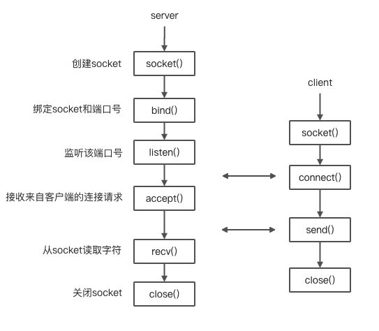

# 同步和异步
同步与异步同步和异步关注的是消息通信机制 (synchronous communication/ asynchronous communication)

- 所谓同步，就是在发出一个*调用*时，在没有得到结果之前，该*调用*就不返回。但是一旦调用返回，就得到返回值了。换句话说，就是由*调用者*主动等待这个*调用*的结果。
- 而异步则是相反，*调用*在发出之后，这个调用就直接返回了，所以没有返回结果。换句话说，当一个异步过程调用发出后，调用者不会立刻得到结果。而是在*调用*发出后，*被调用者*通过状态、通知来通知调用者，或通过回调函数处理这个调用。

典型的异步编程模型比如Node.js举个通俗的例子：

>你打电话问书店老板有没有《分布式系统》这本书，如果是同步通信机制，书店老板会说，你稍等，”我查一下"，然后开始查啊查，等查好了（可能是5秒，也可能是一天）告诉你结果（返回结果）。而异步通信机制，书店老板直接告诉你我查一下啊，查好了打电话给你，然后直接挂电话了（不返回结果）。然后查好了，他会主动打电话给你。在这里老板通过“回电”这种方式来回调。

 # 阻塞与非阻塞
 阻塞和非阻塞关注的是程序在等待调用结果（消息，返回值）时的状态.阻塞调用是指调用结果返回之前，当前线程会被挂起。调用线程只有在得到结果之后才会返回。
 
 非阻塞调用指在不能立刻得到结果之前，该调用不会阻塞当前线程。
 
 >还是上面的例子，你打电话问书店老板有没有《分布式系统》这本书，你如果是阻塞式调用，你会一直把自己“挂起”，直到得到这本书有没有的结果，如果是非阻塞式调用，你不管老板有没有告诉你，你自己先一边去玩了， 当然你也要偶尔过几分钟check一下老板有没有返回结果。在这里阻塞与非阻塞与是否同步异步无关。跟老板通过什么方式回答你结果无关。


# Socket
## 什么是socket
在网络编程中，网络上的两个程序通过一个双向的通信连接实现数据的交换，这个连接的一端称为一个socket。

socket套接字是通信的基石，是支持TCP/IP协议的网络通信的基本操作单元。它是网络通信过程中端点的抽象表示，包含进行网络通信必须的五种信息：连接使用的协议，本地主机的IP地址，本地进程的协议端口，远程主机的IP地址，远程进程的协议端口。

## Socket原理
Socket实质上提供了进程通信的端点。进程通信之前，双方首先必须各自创建一个端点，否则是没有办法建立联系并相互通信的。正如打电话之前，双方必须各自拥有一台电话机一样。
套接字之间的连接过程可以分为三个步骤：服务器监听，客户端请求，连接确认。

1. 服务器监听：是服务器端套接字并不定位具体的客户端套接字，而是处于等待连接的状态，实时监控网络状态。
2. 客户端请求：是指由客户端的套接字提出连接请求，要连接的目标是服务器端的套接字。为此，客户端的套接字必须首先描述它要连接的服务器的套接字，指出服务器端套接字的地址和端口号，然后就向服务器端套接字提出连接请求。
3. 连接确认：是指当服务器端套接字监听到或者说接收到客户端套接字的连接请求，它就响应客户端套接字的请求，建立一个新的线程，把服务器端套接字的描述发给客户端，一旦客户端确认了此描述，连接就建立好了。而服务器端套接字继续处于监听状态，继续接收其他客户端套接字的连接请求。



# TCP实现
```js
public static void main(String[] args) {
    try {
        ServerSocket serverSocket = new ServerSocket();
        Socket socket = serverSocket.accept();
        new TcpServerThread(socket).run();
    } catch (IOException e) {
        e.printStackTrace();
    }
}


class TcpServerThread extends Thread {
    private Socket socket;

    public TcpServerThread(Socket socket) {
        this.socket = socket;
    }

    @Override
    public void run() {
        try {
            InputStream inputStream = socket.getInputStream();
            OutputStream outputStream = socket.getOutputStream();

            int len = 0;
            byte[] bufferArr = new byte[1024];
            len = inputStream.read(bufferArr);
            String content = new String(bufferArr, 0, len);
            String sendData = new String(String.valueOf(content.length()));
            outputStream.write(sendData.getBytes(), 0, sendData.length());
            outputStream.flush();
        } catch (IOException e) {
            e.printStackTrace();
        }
    }
}


class TcpClient {
    public void connect() {
        try {
            Socket socket = new Socket("127.0.0.1", 650000);
            InputStream inputStream = socket.getInputStream();
            OutputStream outputStream = socket.getOutputStream();
            byte[] sendData = "hi".getBytes();
            outputStream.write(sendData, 0, sendData.length);
            outputStream.flush();

            int len = 0;
            byte[] bufferArr = new byte[1024];
            len = inputStream.read(bufferArr);
            String content = new String(bufferArr, 0, len);
            System.out.println(content);
        } catch (UnknownHostException e) {
            e.printStackTrace();
        } catch (IOException e) {
            e.printStackTrace();
        }
    }
}
```

# UDP实现
```js
class UDPServer {
    public void udpConnect() throws IOException {
        DatagramSocket socket = new DatagramSocket(65001);
        byte[] buff = new byte[100];
        DatagramPacket packet = new DatagramPacket(buff, buff.length);
        // 接受客户端发送过来的内容，并将内容封装成DatagramPacket对象
        socket.receive(packet);
        byte[] data = packet.getData();
        String content = new String(data, 0, packet.getLength());
        System.out.println(content);
        byte[] sendedContent = String.valueOf(content.length()).getBytes();
        DatagramPacket packetToClient = new DatagramPacket(sendedContent, sendedContent.length, packet.getAddress(), packet.getPort());
        socket.send(packetToClient);
    }
}

class UDPClient {
    public void udpConnect() throws IOException {
        // 发送数据报
        DatagramSocket socket = new DatagramSocket();
        byte[] buf = "hi".getBytes();
        // 将IP地址封装成InetAddress对象
        InetAddress address = InetAddress.getByName("127.0.0.1");
        // 将要发送给服务端的数据封装成DatagramPacket
        DatagramPacket packet = new DatagramPacket(buf, buf.length, address, 65001);
        socket.send(packet);

        // 接收服务端数据报
        byte[] data = new byte[100];
        DatagramPacket receivePacket = new DatagramPacket(data, data.length);
        socket.receive(receivePacket);
        String content = new String(receivePacket.getData(), 0, receivePacket.getLength());
        System.out.println(content);

    }
}
```

# NIO

## 普通多线程服务器
多个客户端同时向服务端发送请求，服务端做出的措施是开启多个线程来匹配相对应的客户端，并且每个线程去独自完成他们的客户端请求。

例子
```js
// 服务端
public class MyServer{
      private static ExecutorService executorService = Executors.newCachedThreadPool();  //创建一个线程池
        private static class HandleMsg implements Runnable{      //一旦有新的客户端请求，创建这个线程进行处理
        Socket client;          //创建一个客户端
        public HandleMsg(Socket client){        //构造传参绑定
            this.client = client;
        }
         @Override
        public void run() {
            BufferedReader bufferedReader = null;       //创建字符缓存输入流
            PrintWriter printWriter = null;         //创建字符写入流
            try {
                bufferedReader = new BufferedReader(new InputStreamReader(client.getInputStream())); //获取客户端的输入流
                printWriter = new PrintWriter(client.getOutputStream(),true);   //获取客户端的输出流，true是随时刷新
                String inputLine = null;
                long a = System.currentTimeMillis();
                while ((inputLine = bufferedReader.readLine())!=null){
                    printWriter.println(inputLine);
                }
                long b = System.currentTimeMillis();
                System.out.println("此线程花费了："+(b-a)+"秒！");
            } catch (IOException e) {
                e.printStackTrace();
            }finally {
                try {
                    bufferedReader.close();
                    printWriter.close();
                    client.close();
                } catch (IOException e) {
                    e.printStackTrace();
                }
            }
        }
    }   
     public static void main(String[] args) throws IOException {  //服务端的主线程是用来循环监听客户端请求
        ServerSocket server = new ServerSocket(8686);   //创建一个服务端且端口为8686
        Socket client = null;
        while (true){           //循环监听
            client = server.accept();       //服务端监听到一个客户端请求
            System.out.println(client.getRemoteSocketAddress()+"地址的客户端连接成功!");
            executorService.submit(new HandleMsg(client));   //将该客户端请求通过线程池放入HandlMsg线程中进行处理
        }
    }
}


// 客户端
public class MyClient {
    public static void main(String[] args) throws IOException {
        Socket client = null;
        PrintWriter printWriter = null;
        BufferedReader bufferedReader = null;
        try {
            client = new Socket();
            client.connect(new InetSocketAddress("localhost",8686));
            printWriter = new PrintWriter(client.getOutputStream(),true);
            printWriter.println("hello");
            printWriter.flush();

            bufferedReader = new BufferedReader(new InputStreamReader(client.getInputStream()));            //读取服务器返回的信息并进行输出
            System.out.println("来自服务器的信息是："+bufferedReader.readLine());
        } catch (IOException e) {
            e.printStackTrace();
        }finally {
            printWriter.close();
            bufferedReader.close();
            client.close();
        }
    }
}
```

但是试想一下：如果一个客户端请求中，在IO写入到服务端过程中加入Sleep，使每个请求占用服务端线程10秒然后有大量的客户端请求，每个请求都占用那么长时间那么服务端的并发能力就会大幅度下降这并不是因为服务端有多少繁重的任务，而仅仅是因为服务线程在等待IO（因为accept，read，write都是阻塞式的）让高速运行的CPU去等待及其低效的网络IO是非常不合算的行为。

## New IO
New IO成功的解决了上述问题，它是怎样解决的呢？

IO处理客户端请求的最小单位是线程

而NIO使用了比线程还小一级的单位：通道（Channel）

可以说，NIO中只需要一个线程就能完成所有接收，读，写等操作


NIO三大核心：
- Selector 选择器
- Buffer 缓冲区
- Channel 通道

NIO 常常被叫做非阻塞 IO，主要是因为 NIO 在网络通信中的非阻塞特性被广泛使用。

NIO 实现了 IO 多路复用中的 Reactor 模型，一个线程 Thread 使用一个选择器 Selector 通过轮询的方式去监听多个通道 Channel 上的事件，从而让一个线程就可以处理多个事件。

## NIO TCP服务端
```js
public class MyNioServer {
    private Selector selector;          //创建一个选择器
    private final static int port = 8686;
    private final static int BUF_SIZE = 10240;

    private void initServer() throws IOException {
        //创建通道管理器对象selector
        this.selector=Selector.open();

        //创建一个通道对象channel
        ServerSocketChannel channel = ServerSocketChannel.open();
        channel.configureBlocking(false);       //将通道设置为非阻塞
        channel.socket().bind(new InetSocketAddress(port));       //将通道绑定在8686端口
        //将上述的通道管理器和通道绑定，并为该通道注册OP_ACCEPT事件
        //注册事件后，当该事件到达时，selector.select()会返回（一个key），如果该事件没到达selector.select()会一直阻塞
        SelectionKey selectionKey = channel.register(selector,SelectionKey.OP_ACCEPT);

        while (true){       //轮询
            selector.select();          //这是一个阻塞方法，一直等待直到有数据可读，返回值是key的数量（可以有多个）
            Set keys = selector.selectedKeys();         //如果channel有数据了，将生成的key放入keys集合中
            Iterator iterator = keys.iterator();        //得到这个keys集合的迭代器
            while (iterator.hasNext()){             //使用迭代器遍历集合
                SelectionKey key = (SelectionKey) iterator.next();       //得到集合中的一个key实例
                iterator.remove();          //拿到当前key实例之后记得在迭代器中将这个元素删除，非常重要，否则会出错
                if (key.isAcceptable()){         //判断当前key所代表的channel是否在Acceptable状态，如果是就进行接收
                    doAccept(key);
                }else if (key.isReadable()){
                    doRead(key);
                }else if (key.isWritable() && key.isValid()){
                    doWrite(key);
                }else if (key.isConnectable()){
                    System.out.println("连接成功！");
                }
            }
        }
    }

    public void doAccept(SelectionKey key) throws IOException {
        ServerSocketChannel serverChannel = (ServerSocketChannel) key.channel();
        System.out.println("ServerSocketChannel正在循环监听");
        SocketChannel clientChannel = serverChannel.accept();
        clientChannel.configureBlocking(false);
        clientChannel.register(key.selector(),SelectionKey.OP_READ);
    }

    public void doRead(SelectionKey key) throws IOException {
        SocketChannel clientChannel = (SocketChannel) key.channel();
        ByteBuffer byteBuffer = ByteBuffer.allocate(BUF_SIZE);
        long bytesRead = clientChannel.read(byteBuffer);
        while (bytesRead>0){
            /* 切换读写 */
            byteBuffer.flip();
            byte[] data = byteBuffer.array();
            String info = new String(data).trim();
            System.out.println("从客户端发送过来的消息是："+info);
            byteBuffer.clear();
            bytesRead = clientChannel.read(byteBuffer);
        }
        if (bytesRead==-1){
            clientChannel.close();
        }
    }

    public void doWrite(SelectionKey key) throws IOException {
        ByteBuffer byteBuffer = ByteBuffer.allocate(BUF_SIZE);
        byteBuffer.flip();
        SocketChannel clientChannel = (SocketChannel) key.channel();
        while (byteBuffer.hasRemaining()){
            clientChannel.write(byteBuffer);
        }
        byteBuffer.compact();
    }

    public static void main(String[] args) throws IOException {
        MyNioServer myNioServer = new MyNioServer();
        myNioServer.initServer();
    }
}
```
### SelectionKey
SelectionKey是通道和选择器交互的核心组件比如在SocketChannel上绑定一个Selector，并注册为连接事件：
```js
SocketChannel clientChannel = SocketChannel.open();
clientChannel.configureBlocking(false);
clientChannel.connect(new InetSocketAddress(port));
clientChannel.register(selector, SelectionKey.OP_CONNECT);
```

核心在register()方法，它返回一个SelectionKey对象来检测channel事件是那种事件, 可以使用以下方法：

```js
selectionKey.isAcceptable();
selectionKey.isConnectable();
selectionKey.isReadable();
selectionKey.isWritable();
```

服务端便是通过这些方法 在轮询中执行相对应操作

当然通过Channel与Selector绑定的key也可以反过来拿到他们

```js
Channel  channel  = selectionKey.channel();
Selector selector = selectionKey.selector();
```

在Channel上注册事件时，我们也可以顺带绑定一个Buffer：
```js
clientChannel.register(key.selector(), SelectionKey.OP_READ,ByteBuffer.allocateDirect(1024));
```
或者绑定一个Object：
```js
selectionKey.attach(Object);
Object anthorObj = selectionKey.attachment();
```

## TCP客户端
```js
public class MyNioClient {
    private Selector selector;          //创建一个选择器
    private final static int port = 8686;
    private final static int BUF_SIZE = 10240;
    private static ByteBuffer byteBuffer = ByteBuffer.allocate(BUF_SIZE);

    private void  initClient() throws IOException {
        this.selector = Selector.open();
        SocketChannel clientChannel = SocketChannel.open();
        clientChannel.configureBlocking(false);
        clientChannel.connect(new InetSocketAddress(port));
        clientChannel.register(selector, SelectionKey.OP_CONNECT);
        while (true){
            selector.select();
            Iterator<SelectionKey> iterator = selector.selectedKeys().iterator();
            while (iterator.hasNext()){
                SelectionKey key = iterator.next();
                iterator.remove();
                if (key.isConnectable()){
                    doConnect(key);
                }else if (key.isReadable()){
                    doRead(key);
                }
            }
        }
    }

    public void doConnect(SelectionKey key) throws IOException {
        SocketChannel clientChannel = (SocketChannel) key.channel();
        if (clientChannel.isConnectionPending()){
            clientChannel.finishConnect();
        }
        clientChannel.configureBlocking(false);
        String info = "服务端你好!!";
        byteBuffer.clear();
        byteBuffer.put(info.getBytes("UTF-8"));
        byteBuffer.flip();
        clientChannel.write(byteBuffer);
        //clientChannel.register(key.selector(),SelectionKey.OP_READ);
        clientChannel.close();
    }

    public void doRead(SelectionKey key) throws IOException {
        SocketChannel clientChannel = (SocketChannel) key.channel();
        clientChannel.read(byteBuffer);
        byte[] data = byteBuffer.array();
        String msg = new String(data).trim();
        System.out.println("服务端发送消息："+msg);
        clientChannel.close();
        key.selector().close();
    }

    public static void main(String[] args) throws IOException {
        MyNioClient myNioClient = new MyNioClient();
        myNioClient.initClient();
    }
}
```