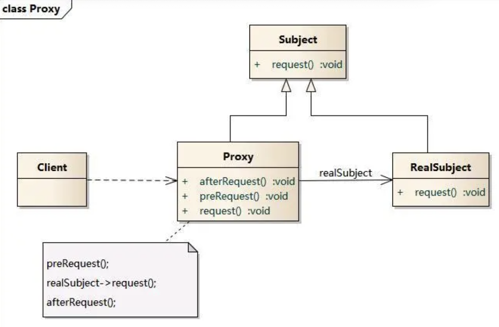
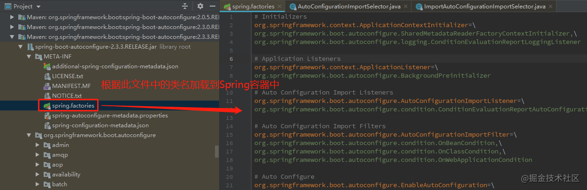
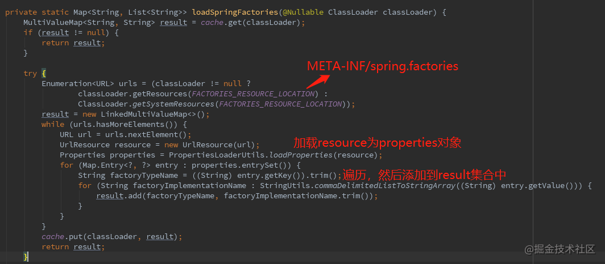
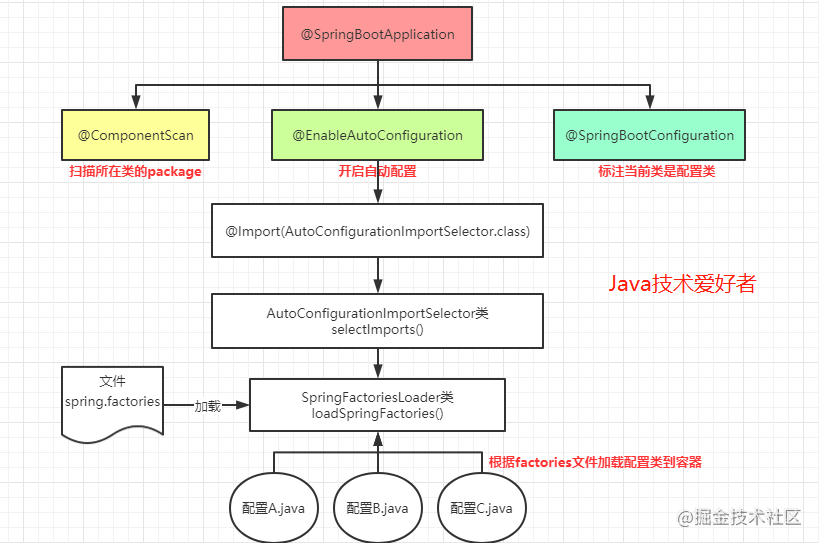
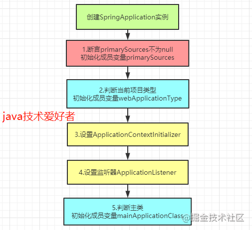
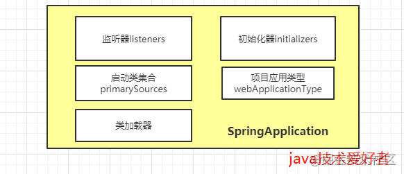
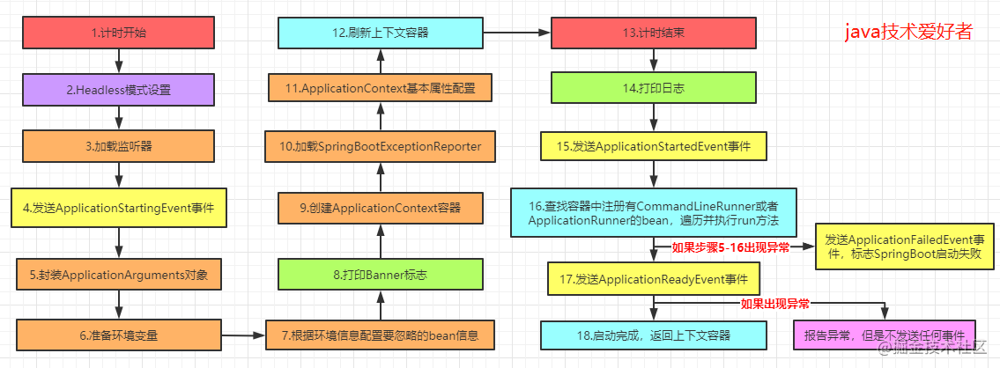

# 微服务
微服务是一种开发软件的架构和组织方法，其中软件由通过明确定义的 API 进行通信的小型独立服务组成。这些服务由各个小型独立团队负责。

微服务架构使应用程序更易于扩展和更快地开发，从而加速创新并缩短新功能的上市时间。
## 整体式架构与微服务架构
通过整体式架构，所有进程紧密耦合，并可作为单项服务运行。这意味着，如果应用程序的一个进程遇到需求峰值，则必须扩展整个架构。随着代码库的增长，添加或改进整体式应用程序的功能变得更加复杂。这种复杂性限制了试验的可行性，并使实施新概念变得困难。整体式架构增加了应用程序可用性的风险，因为许多依赖且紧密耦合的进程会扩大单个进程故障的影响。

使用微服务架构，将应用程序构建为独立的组件，并将每个应用程序进程作为一项服务运行。这些服务使用轻量级 API 通过明确定义的接口进行通信。这些服务是围绕业务功能构建的，每项服务执行一项功能。由于它们是独立运行的，因此可以针对各项服务进行更新、部署和扩展，以满足对应用程序特定功能的需求。

# IOC
## 何为控制，控制的是什么
是 bean 的创建、管理的权利，控制 bean 的整个生命周期。
## 何为反转，反转了什么
把这个权利交给了 Spring 容器，而不是自己去控制，就是反转。由之前的自己主动创建对象，变成现在被动接收别人给我们的对象的过程，这就是反转。

## 好处
解耦

它把对象之间的依赖关系转成用配置文件来管理，由 Spring IoC Container 来管理。

在项目中，底层的实现都是由很多个对象组成的，对象之间彼此合作实现项目的业务逻辑。但是，很多很多对象紧密结合在一起，一旦有一方出问题了，必然会对其他对象有所影响，所以才有了解藕的这种设计思想

# AOP
定义注解
```js
@Retention(RetentionPolicy.RUNTIME)
@Target(ElementType.METHOD)
public @interface GlobalErrorCatch {

}
```
然后再指定注解形式的 pointcuts 及 around advice


```js
@Aspect
@Component
public class TestAdvice {
   // 1. 定义所有带有 GlobalErrorCatch 的注解的方法为 Pointcut
   @Pointcut("@annotation(com.example.demo.annotation.GlobalErrorCatch)")
   private void globalCatch(){}
   // 2. 将 around advice 作用于 globalCatch(){} 此 PointCut 
   @Around("globalCatch()")
   public Object handlerGlobalResult(ProceedingJoinPoint point) throws Throwable {
       try {
           return point.proceed();
       } catch (Exception e) {
           System.out.println("执行错误" + e);
           return ServiceResultTO.buildFailed("系统错误");
       }
   }

}
```

## 原理
代理

Client 是直接和 Proxy 打交道的，Proxy 是 Client 要真正调用的 RealSubject 的代理，它确实执行了 RealSubject 的 request 方法，不过在这个执行前后 Proxy 也加上了额外的 PreRequest()，afterRequest() 方法，注意 Proxy 和 RealSubject 都实现了 Subject 这个接口，这样在 Client 看起来调用谁是没有什么分别的（面向接口编程，对调用方无感，因为实现的接口方法是一样的），Proxy 通过其属性持有真正要代理的目标对象（RealSubject）以达到既能调用目标对象的方法也能在方法前后注入其它逻辑的目的


首先 Java 源代码经过编译生成字节码，然后再由 JVM 经过类加载，连接，初始化成 Java 类型，可以看到字节码是关键，静态和动态的区别就在于字节码生成的时机
## 静态代理
由程序员创建代理类或特定工具自动生成源代码再对其编译。在编译时已经将接口，被代理类（委托类），代理类等确定下来，在程序运行前代理类的.class文件就已经存在了.
```js
public interface Subject {
   public void request();
}

public class RealSubject implements Subject {
   @Override
   public void request() {
       // 卖房
       System.out.println("卖房");
   }
}

public class Proxy implements Subject {

   private RealSubject realSubject;

   public Proxy(RealSubject subject) {
       this.realSubject = subject;
   }


   @Override
   public void request() {
    // 执行代理逻辑
       System.out.println("卖房前");

       // 执行目标对象方法
       realSubject.request();

       // 执行代理逻辑
       System.out.println("卖房后");
   }

   public static void main(String[] args) {
       // 被代理对象
       RealSubject subject = new RealSubject();

       // 代理
       Proxy proxy = new Proxy(subject);

       // 代理请求
       proxy.request();
   }
}
```

### 劣势
1. 代理类只代理一个委托类（其实可以代理多个，但不符合单一职责原则），也就意味着如果要代理多个委托类，就要写多个代理（别忘了静态代理在编译前必须确定）
2. 第一点还不是致命的，再考虑这样一种场景：如果每个委托类的每个方法都要被织入同样的逻辑，比如说我要计算前文提到的每个委托类每个方法的耗时，就要在方法开始前，开始后分别织入计算时间的代码，那就算用代理类，它的方法也有无数这种重复的计算时间的代码

## 动态代理
在程序运行后通过反射创建生成字节码再由 JVM 加载而成。
### JDK动态代理
```js
// 委托类
public class RealSubject implements Subject {
   @Override
   public void request() {
       // 卖房
       System.out.println("卖房");
   }
}


import java.lang.reflect.InvocationHandler;
import java.lang.reflect.Method;
import java.lang.reflect.Proxy;

public class ProxyFactory {

   private Object target;// 维护一个目标对象

   public ProxyFactory(Object target) {
       this.target = target;
   }

   // 为目标对象生成代理对象
   public Object getProxyInstance() {
       return Proxy.newProxyInstance(target.getClass().getClassLoader(), target.getClass().getInterfaces(),
               new InvocationHandler() {

                   @Override
                   public Object invoke(Object proxy, Method method, Object[] args) throws Throwable {
                       System.out.println("计算开始时间");
                       // 执行目标对象方法
                       method.invoke(target, args);
                       System.out.println("计算结束时间");
                       return null;
                   }
               });
   }

   public static void main(String[] args) {
       RealSubject realSubject = new RealSubject();
       System.out.println(realSubject.getClass());
       Subject subject = (Subject) new ProxyFactory(realSubject).getProxyInstance();
       System.out.println(subject.getClass());
       subject.request();
   }
}
打印结果如下:
shell
原始类:class com.example.demo.proxy.staticproxy.RealSubject
代理类:class com.sun.proxy.$Proxy0
计算开始时间
卖房
计算结束时间
```
#### 好处
由于动态代理是程序运行后才生成的，哪个委托类需要被代理到，只要生成动态代理即可，避免了静态代理那样的硬编码，另外所有委托类实现接口的方法都会在 Proxy 的 InvocationHandler.invoke() 中执行，这样如果要统计所有方法执行时间这样相同的逻辑，可以统一在 InvocationHandler 里写， 也就避免了静态代理那样需要在所有的方法中插入同样代码的问题，代码的可维护性极大的提高了。

### Spring AOP 的实现为啥却不用JDK动态代理
JDK 动态代理虽好，但也有弱点，我们注意到 newProxyInstance 的方法签名
```js
public static Object newProxyInstance(ClassLoader loader,
                                         Class<?>[] interfaces,
                                         InvocationHandler h);
```
注意第二个参数 Interfaces 是委托类的接口，是必传的， JDK 动态代理是通过与委托类实现同样的接口，然后在实现的接口方法里进行增强来实现的，<font color="green">这就意味着如果要用 JDK 代理，委托类必须实现接口，</font>这样的实现方式看起来有点蠢，更好的方式是什么呢，<font color="green">直接继承自委托类</font>不就行了，这样委托类的逻辑不需要做任何改动，CGlib 就是这么做的。


### CGLib动态代理
AOP 就是用的 CGLib 的形式来生成的，JDK 动态代理使用 Proxy 来创建代理类，增强逻辑写在 InvocationHandler.invoke() 里，CGlib 动态代理也提供了类似的  Enhance 类，增强逻辑写在 MethodInterceptor.intercept() 中，也就是说所有委托类的非 final 方法都会被方法拦截器拦截，在说它的原理之前首先来看看它怎么用的
```js
public class MyMethodInterceptor implements MethodInterceptor {
   @Override
   public Object intercept(Object obj, Method method, Object[] args, MethodProxy proxy) throws Throwable {
       System.out.println("目标类增强前！！！");
       //注意这里的方法调用，不是用反射哦！！！
       Object object = proxy.invokeSuper(obj, args);
       System.out.println("目标类增强后！！！");
       return object;
   }
}

public class CGlibProxy {
   public static void main(String[] args) {
       //创建Enhancer对象，类似于JDK动态代理的Proxy类，下一步就是设置几个参数
       Enhancer enhancer = new Enhancer();
       //设置目标类的字节码文件
       enhancer.setSuperclass(RealSubject.class);
       //设置回调函数
       enhancer.setCallback(new MyMethodInterceptor());

       //这里的creat方法就是正式创建代理类
       RealSubject proxyDog = (RealSubject) enhancer.create();
       //调用代理类的eat方法
       proxyDog.request();
   }
}
```
打印如下
```
代理类:class com.example.demo.proxy.staticproxy.RealSubject$$EnhancerByCGLIB$$889898c5
目标类增强前！！！
卖房
目标类增强后！！！
```
可以看到主要就是利用 Enhancer 这个类来设置委托类与方法拦截器，这样委托类的所有非 final 方法就能被方法拦截器拦截，从而在拦截器里实现增强

#### CGlib 动态代理使用上的限制
第一点之前已经已经说了，只能代理委托类中任意的非 final 的方法，另外它是通过继承自委托类来生成代理的，所以如果委托类是 final 的，就无法被代理了（final 类不能被继承）
#### JDK 动态代理的拦截对象是通过反射的机制来调用被拦截方法的，CGlib 呢，它通过什么机制来提升了方法的调用效率。
由于反射的效率比较低，所以 CGlib 采用了FastClass 的机制来实现对被拦截方法的调用。FastClass 机制就是对一个类的方法建立索引，通过索引来直接调用相应的方法，建议参考下https://www.cnblogs.com/cruze/p/3865180.html这个链接好好学学

# Spring启动流程 
[详细](https://mp.weixin.qq.com/s/ut3mRwhfqXNjrBtTmI0oWg)

# springboot启动流程
SpringBoot相对于spring，内置了tomcat，通过启动类启动，配置也集中在一个application.yml/properties中。
## 启动类
```js
@SpringBootApplication
public class SpringmvcApplication {
    public static void main(String[] args) {
        SpringApplication.run(SpringmvcApplication.class, args);
    }
}
```
把启动类分解一下，实际上就是两部分:
- @SpringBootApplication注解
- 一个main()方法，里面调用SpringApplication.run()方法。
## @SpringBootApplication
```php
@Target(ElementType.TYPE)
@Retention(RetentionPolicy.RUNTIME)
@Documented
@Inherited
@SpringBootConfiguration
@EnableAutoConfiguration
@ComponentScan(excludeFilters = { @Filter(type = FilterType.CUSTOM, classes = TypeExcludeFilter.class),@Filter(type = FilterType.CUSTOM, classes = AutoConfigurationExcludeFilter.class) })
public @interface SpringBootApplication {

}
```
很明显，@SpringBootApplication注解由三个注解组合而成，分别是：

- @ComponentScan
- @EnableAutoConfiguration
- @SpringBootConfiguration

###  @ComponentScan
```php
@Retention(RetentionPolicy.RUNTIME)
@Target(ElementType.TYPE)
@Documented
@Repeatable(ComponentScans.class)
public @interface ComponentScan {
    
}
```
这个注解的作用是告诉Spring扫描哪个包下面类，加载符合条件的组件(比如贴有@Component和@Repository等的类)或者bean的定义。
所以有一个basePackages的属性，如果默认不写，则从声明@ComponentScan所在类的package进行扫描。
所以启动类最好定义在Root package下，因为一般我们在使用@SpringBootApplication时，都不指定basePackages的。
### @EnableAutoConfiguration
```php
@Target(ElementType.TYPE)
@Retention(RetentionPolicy.RUNTIME)
@Documented
@Inherited
@AutoConfigurationPackage
@Import(AutoConfigurationImportSelector.class)
public @interface EnableAutoConfiguration {
    
}
```
这是一个复合注解，看起来很多注解，实际上关键在@Import注解，它会加载AutoConfigurationImportSelector类，然后就会触发这个类的selectImports()方法。根据返回的String数组(配置类的Class的名称)加载配置类。

```php
public class AutoConfigurationImportSelector implements DeferredImportSelector, BeanClassLoaderAware,
ResourceLoaderAware, BeanFactoryAware, EnvironmentAware, Ordered {
    //返回的String[]数组，是配置类Class的类名
    @Override
    public String[] selectImports(AnnotationMetadata annotationMetadata) {
        if (!isEnabled(annotationMetadata)) {
            return NO_IMPORTS;
        }
        AutoConfigurationEntry autoConfigurationEntry = getAutoConfigurationEntry(annotationMetadata);
        //返回配置类的类名
        return StringUtils.toStringArray(autoConfigurationEntry.getConfigurations());
    }
}
```
我们一直点下去，就可以找到最后的幕后英雄，就是SpringFactoriesLoader类，通过loadSpringFactories()方法加载META-INF/spring.factories中的配置类。


这里使用了spring.factories文件的方式加载配置类，提供了很好的扩展性。

所以@EnableAutoConfiguration注解的作用其实就是开启自动配置，自动配置主要则依靠这种加载方式来实现。

### @SpringBootConfiguration
继承自@Configuration，二者功能也一致，标注当前类是配置类， 并会将当前类内声明的一个或多个以@Bean注解标记的方法的实例纳入到spring容器中，并且实例名就是方法名。

## 小结


## SpringApplication类
接下来讲main方法里执行的这句代码，这是SpringApplication类的静态方法run()。
```php
//启动类的main方法
public static void main(String[] args) {
    SpringApplication.run(SpringmvcApplication.class, args);
}

//启动类调的run方法
public static ConfigurableApplicationContext run(Class<?> primarySource, String... args) {
    //调的是下面的，参数是数组的run方法
    return run(new Class<?>[] { primarySource }, args);
}

//和上面的方法区别在于第一个参数是一个数组
public static ConfigurableApplicationContext run(Class<?>[] primarySources, String[] args) {
    //实际上new一个SpringApplication实例，调的是一个实例方法run()
    return new SpringApplication(primarySources).run(args);
}
```
通过上面的源码，发现实际上最后调的并不是静态方法，而是实例方法，需要new一个SpringApplication实例，这个构造器还带有一个primarySources的参数。所以我们直接定位到构造器。

```php
public SpringApplication(ResourceLoader resourceLoader, Class<?>... primarySources) {
    this.resourceLoader = resourceLoader;
    //断言primarySources不能为null，如果为null，抛出异常提示
    Assert.notNull(primarySources, "PrimarySources must not be null");
    //启动类传入的Class
    this.primarySources = new LinkedHashSet<>(Arrays.asList(primarySources));
    //判断当前项目类型，有三种：NONE、SERVLET、REACTIVE
    this.webApplicationType = WebApplicationType.deduceFromClasspath();
    //设置ApplicationContextInitializer
    setInitializers((Collection) getSpringFactoriesInstances(ApplicationContextInitializer.class));
    //设置监听器
    setListeners((Collection) getSpringFactoriesInstances(ApplicationListener.class));
    //判断主类，初始化入口类
    this.mainApplicationClass = deduceMainApplicationClass();
}

//判断主类
private Class<?> deduceMainApplicationClass() {
    try {
        StackTraceElement[] stackTrace = new RuntimeException().getStackTrace();
        for (StackTraceElement stackTraceElement : stackTrace) {
            if ("main".equals(stackTraceElement.getMethodName())) {
                return Class.forName(stackTraceElement.getClassName());
            }
        }
    }
    catch (ClassNotFoundException ex) {
        // Swallow and continue
    }
    return null;
}
```


创建了SpringApplication实例之后，就完成了SpringApplication类的初始化工作，这个实例里包括监听器、初始化器，项目应用类型，启动类集合，类加载器。如图所示。



得到SpringApplication实例后，接下来就调用实例方法run()。继续看。

```php
public ConfigurableApplicationContext run(String... args) {
    //创建计时器
    StopWatch stopWatch = new StopWatch();
    //开始计时
    stopWatch.start();
    //定义上下文对象
    ConfigurableApplicationContext context = null;
    Collection<SpringBootExceptionReporter> exceptionReporters = new ArrayList<>();
    //Headless模式设置
    configureHeadlessProperty();
    //加载SpringApplicationRunListeners监听器
    SpringApplicationRunListeners listeners = getRunListeners(args);
    //发送ApplicationStartingEvent事件
    listeners.starting();
    try {
        //封装ApplicationArguments对象
        ApplicationArguments applicationArguments = new DefaultApplicationArguments(args);
        //配置环境模块
        ConfigurableEnvironment environment = prepareEnvironment(listeners, applicationArguments);
        //根据环境信息配置要忽略的bean信息
        configureIgnoreBeanInfo(environment);
        //打印Banner标志
        Banner printedBanner = printBanner(environment);
        //创建ApplicationContext应用上下文
        context = createApplicationContext();
        //加载SpringBootExceptionReporter
        exceptionReporters = getSpringFactoriesInstances(SpringBootExceptionReporter.class,
                                                         new Class[] { ConfigurableApplicationContext.class }, context);
        //ApplicationContext基本属性配置
        prepareContext(context, environment, listeners, applicationArguments, printedBanner);
        //刷新上下文
        refreshContext(context);
        //刷新后的操作，由子类去扩展
        afterRefresh(context, applicationArguments);
        //计时结束
        stopWatch.stop();
        //打印日志
        if (this.logStartupInfo) {
            new StartupInfoLogger(this.mainApplicationClass).logStarted(getApplicationLog(), stopWatch);
        }
        //发送ApplicationStartedEvent事件，标志spring容器已经刷新，此时所有的bean实例都已经加载完毕
        listeners.started(context);
        //查找容器中注册有CommandLineRunner或者ApplicationRunner的bean，遍历并执行run方法
        callRunners(context, applicationArguments);
    }
    catch (Throwable ex) {
        //发送ApplicationFailedEvent事件，标志SpringBoot启动失败
        handleRunFailure(context, ex, exceptionReporters, listeners);
        throw new IllegalStateException(ex);
    }

    try {
        //发送ApplicationReadyEvent事件，标志SpringApplication已经正在运行，即已经成功启动，可以接收服务请求。
        listeners.running(context);
    }
    catch (Throwable ex) {
        //报告异常，但是不发送任何事件
        handleRunFailure(context, ex, exceptionReporters, null);
        throw new IllegalStateException(ex);
    }
    return context;
}
```
结合注释和源码，其实很清晰了，为了加深印象，画张图看一下整个流程。

