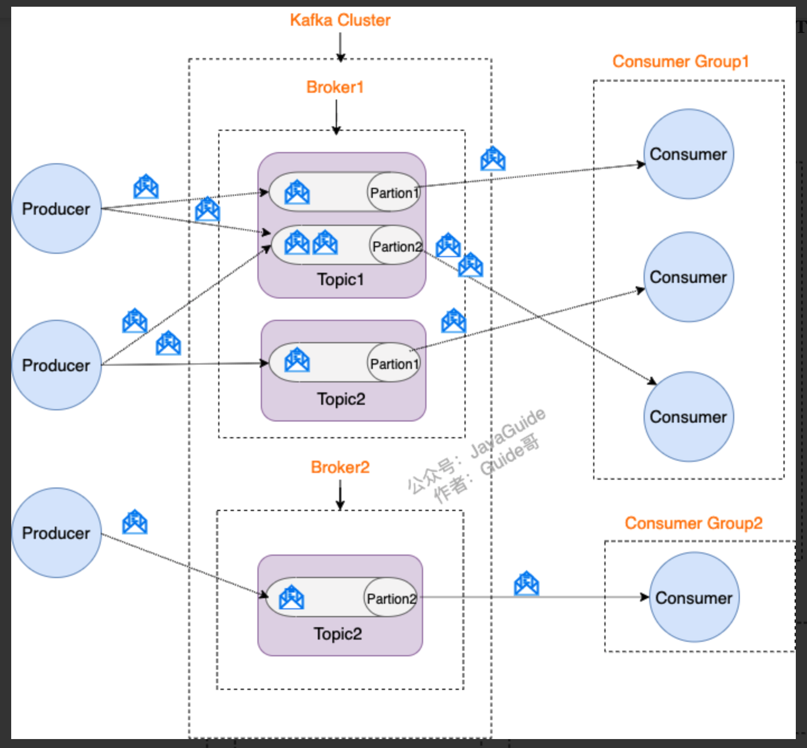
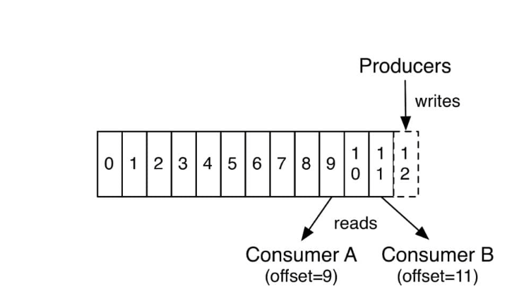

# Kafka



## kafka如何保证消息的消费顺序

kafka只能保证分区内的消息顺序消费，不能保证整个topic级别的消费顺序

比如有一个topic：orders，有三个分区：p-0，p-1，p-2

有一批订单创建事件如下：

```
order-101
order-102
order-103
order-104
order-105
```

producer写入这些事件时，如果没有设置key，kafka会使用round-robin轮询的方式将这些消息写入不同的分区

此时在topic层面上看到的消息是乱序的

消费端是一个consumer group，有3个实例，分别消费一个分区，消息的消费顺序可能是

```
consumer-0: order-101, order-104
consumer-1: order-102, order-105
consumer-2: order-103
```

**如何解决**

1. 一个topic只对应一个partition

2. 使用key，把有顺序要求的消息绑定到同一个partition，如下

   ```java
   ProducerRecord<String, String> record = new ProducerRecord<>("orders", "user-123", "order-101");
   ```

   这样，所有和user-123相关的订单消息都会被hash到同一个partition，kafka能保证这些消息顺序性

   同时一个partition只会对应同一个消费组中的一个消费者，所以始终由同一个消费者处理这些顺序的消息


## kafka如何保证消息不丢失

### 生产者丢失消息的情况
生产者(Producer) 调用send方法发送消息之后，消息可能因为网络问题并没有发送过去

在使用kafkaTemplate异步发送消息时，启用**失败回调+延迟重试机制**

```java
public class KafkaProducerWithRetry {

    private final KafkaTemplate<String, String> kafkaTemplate;
    private final int maxRetries = 3;

    public KafkaProducerWithRetry(KafkaTemplate<String, String> kafkaTemplate) {
        this.kafkaTemplate = kafkaTemplate;
    }

    public void sendMessageWithRetry(String topic, String key, String value) {
        sendInternal(topic, key, value, 0);
    }

    private void sendInternal(String topic, String key, String value, int attempt) {
        kafkaTemplate.send(topic, key, value).addCallback(
            success -> {
                System.out.println("发送成功，offset: " + success.getRecordMetadata().offset());
            },
            failure -> {
                if (attempt < maxRetries) {
                    System.err.println("发送失败，第 " + (attempt + 1) + " 次重试，原因：" + failure.getMessage());
                    // 简单延迟重试，也可以用 ScheduledExecutorService 做延迟
                    try {
                        Thread.sleep(1000L * (attempt + 1)); // 递增延迟
                    } catch (InterruptedException e) {
                        Thread.currentThread().interrupt();
                    }
                    sendInternal(topic, key, value, attempt + 1);
                } else {
                    System.err.println("消息发送失败，超过最大重试次数：" + maxRetries);
                    // 可写入补偿机制，比如保存DB、发送报警等
                }
            }
        );
    }
}
```

### 消费者丢失消息的情况

消费者拉取到分区的某个消息后，会自动提交“下一条消息”的offset，表示下一个要消费的消息所在的分区的位置



如果当消费者刚拿到这个消息准备进行消费的时候，突然挂掉，消息实际上没有被消费，但是offset被自动提交，导致这个消息丢失

**解决办法**

手动关闭自动提交offset，等真正消费完消息后，再自己手动提交offset

```java
@KafkaListener(topics = "my-topic", groupId = "my-group")
public void listen(ConsumerRecord<String, String> record, Acknowledgment ack) {
    try {
        // 业务处理
        processMessage(record.value());

        // 手动提交 offset
        ack.acknowledge();
    } catch (Exception e) {
        // 记录日志、重试或发送到死信队列
        log.error("消息处理失败：{}", record, e);
    }
}
```

但是，这个解决办法会导致重复消费的问题，比如消费者消费完消息后，还没提交offset，就挂掉了，那等恢复后再从消息队列中取消息，还是取回之前处理过的消息；

可以通过redis判断是否处理过该消息

### kafka弄丢了消息

kafka的分区有多副本机制（每个分区的副本不能超过broker数）保证消息存储的安全性，即leader和follower，我们发送的消息会被发送到leader副本中，然后follower副本会从leader副本中拉取消息进行同步，生产者与消费者只与leader交互

**假如leader所在的broker突然挂掉，那么就要从follower副本重新选一个leader，但是旧leader的数据还有一些没有被follower同步，就会造成消息丢失**

**解决办法**

- 设置acks=all

  acks默认值为1，代表生产者发送的消息被leader副本接收之后就算被成功发送，当配置acks=all，表示要所有副本全都收到消息，生产者才会收到来自服务器的响应

- 设置replication.factor >=3

  保证每个分区(partition) 至少有 3 个副本

- 设置 min.insync.replicas > 1

  这样配置代表消息至少要被写入到2个副本（包含leader）才算是成功发送

  为了保证整个kafka服务的高可用，需要确保replication.factor > min.insync.replicas，因为如果两者相等，有一个副本挂掉，实际可用的副本少于min.insync.replicas，Kafka 直接拒绝写入（抛异常 `NotEnoughReplicasException`）；一般推荐设置成 **replication.factor = min.insync.replicas + 1**

- 设置 unclean.leader.election.enable = false

  配置为false，当leader副本发生故障时，就不会从follower副本中和leader同步程度低的副本中选择leader（Kafka 会周期性地检查 follower 副本的同步状态，如果 follower 副本在一段时间内落后 leader 的太多数据（或宕机），就会从 ISR 中被移除），这样降低了消息丢失的可能性

  > **Kafka 0.11.0.0 版本开始 unclean.leader.election.enable 参数的默认值由原来的 true 改为 false**

## kafka如何保证消息不重复消费

**kafka 出现消息重复消费的原因**

- 消费者消费数据后没有成功提交offset
- kafka认为消费者服务假死，触发分区rebalance，将分区分配给其他消费者实例，原消费者实际处理了消息但长时间未提交offset，导致新的实例从上次提交的offset重新拉取消息

**解决方案**

- 消费者做幂等校验，比如redis的set和mysql的主键
- 关闭自动提交，enable.auto.commit设置为false
    - 处理完消息再提交：依旧有消息重复消费的风险，和自动提交一样
    - 拉取到消息即提交：会有消息丢失的风险。允许消息延时的场景，一般会采用这种方式。然后，通过定时任务在业务不繁忙（比如凌晨）的时候做数据兜底（业务处理失败时，将关键字段放入本地db或redis，每天凌晨执行补偿任务）