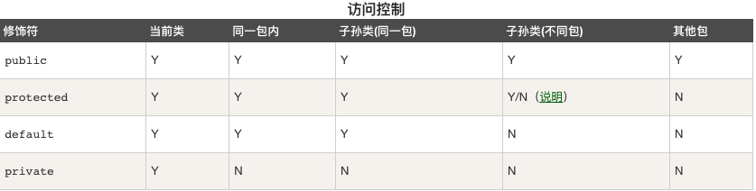
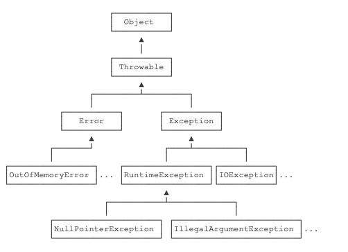

# 面向对象三大特性
## 封装
将类的某些信息隐藏在类内部，不允许外部程序直接访问，而是通过该类提供的方法来实现对隐藏信息的操作和访问。比如model类的字段一般都用private修饰，然后通过set和get方法来设置和获取。

封装的目的
> 增强了安全性和简化编程，使用者不必了解具体的实现细节，而只要通过对外公开的访问方法，来使用类的成员。
## 继承
可以理解为，在一个现有的类的基础之上，增加新的方法或重写已有的方法，从而产生一个新类。

继承的好处
> 使用继承和组合复用(就是把父类定义为子类的一个属性)，都是一种增量式的开发模式，这种方式带来的好处就是不需要修改原有的代码，因此不会给原有代码带来BUG，也不用因为对原有的代码的修改而重新进行测试。

## 多态
多态就是一种类型表现出多种状态，比如一个Car类的变量可以绑定一个BMW实例或者BENZ实例。

多态的好处
> 消除类之间的耦合关系，使程序更容易扩展，只需要让新定义的类去实现接口并实现所有的方法，而无需对原有的代码做任何修改。

# 抽象类和接口的意义
接口和抽象类都可以体现多态性，但是抽象类对事物进行抽象，更多的是为了继承，为了扩展，为了实现代码的重用，子类和父类之间体现的是is-a关系；接口则更多的体现一种行为约束，一种规则，一旦实现了这个接口，就要给出这个接口中所有方法的具体实现，也就是说实现类对于接口中所有的方法都是有意义的。

# 抽象类和接口的区别
1. 抽象类可以提供成员方法的实现细节，而接口中只能存在public abstract 方法；

2. 抽象类中的成员变量可以是各种类型的，而接口中的成员变量只能是public static final类型的；

3. 接口中不能含有静态代码块以及静态方法，而抽象类可以有静态代码块和静态方法；

4. 一个类只能继承一个抽象类，而一个类却可以实现多个接口。

# 面向对象7大原则
[详细](https://blog.csdn.net/J080624/article/details/84930351)
1. 单一职责原则
> 每个类（接口）应该专注于做一件事，常常可见接口多继承现象。
2. 里氏替换原则
> 超类存在的地方，子类是可替换的。里氏替换原则告诉我们，在软件中将一个基类对象替换成它的子类对象，程序将不会产生任何错误和异常，反过来则不成立。如果一个软件实体使用的是一个子类对象的话，那么它不一定能够使用基类对象。
里氏替换原则是实现开闭原则的重要方式之一，由于使用基类对象的地方都可以使用子类对象，因此在程序中尽量使用基类类型来对对象进行定义，而在运行时再确定其子类类型，用子类对象来替换父类对象。
3. 依赖倒置原则
> 实现尽量依赖抽象(抽象类或者接口)，不依赖具体实现。
4. 接口隔离原则
> 每个接口中不存在子类用不到却必须实现的方法，如果不然，就要将接口拆分。使用多个隔离的接口，比使用单个接口（多个接口方法集合到一个的接口）要好。
5. 迪米特法则
> 又叫最少知道原则，一个软件实体应当尽可能少的与其他实体发生相互作用。
6. 开闭原则
> 软件实体面向扩展开放，面向修改关闭。在程序需要进行拓展的时候，不能去修改原有的代码，而是要扩展原有代码，实现一个热插拔的效果。所以一句话概括就是：为了使程序的扩展性好，易于维护和升级。想要达到这样的效果，我们需要使用接口和抽象类等。
7. 聚合复用原则
> 尽量使用合成/聚合达到复用，尽量少用继承。原则： 一个类中有另一个类的对象。即多用组合，少用继承。

# 访问控制修饰符
- default (即默认，什么也不写）: 在同一包内可见，不使用任何修饰符。使用对象：类、接口、变量、方法。

- private : 在同一类内可见。使用对象：变量、方法。 注意：不能修饰类（外部类）

- public : 对所有类可见。使用对象：类、接口、变量、方法

- protected : 对同一包内的类和所有子类可见。使用对象：变量、方法。 注意：不能修饰类（外部类）。

# 函数式编程和面向对象编程
## 定义
- 函数式编程，顾名思义，这种编程是以函数思维做为核心，在这种思维的角度去思考问题。这种编程最重要的基础是λ演算，接受函数当作输入和输出。

- 面向对象编程，这种编程是把问题看作由对象的属性与对象所进行的行为组成。基于对象的概念，以类作为对象的模板，把类和继承作为构造机制，以对象为中心，来思考并解决问题。

## 优点
- 函数式编程支持闭包和高阶函数，闭包是一种可以起函数的作用并可以如对象般操作的对象；而高阶函数是可以以另一个函数作为输入值来进行编程。支持惰性计算，这就可以在求值需要表达式的值得时候进行计算，而不是固定在变量时计算。还有就是可以用递归作为控制流程。函数式编程所编程出来的代码相对而言少很多，而且更加简洁明了。
- 面向对象编程面向对象有三个主要特征，分别是封装性、继承性和多态性。类的说明展现了封装性，类作为对象的模板，含有私有数据和公有数据，封装性能使数据更加安全依赖的就是类的特性，使得用户只能看到对象的外在特性，不能看到对象的内在属性，用户只能访问公有数据不能直接访问到私有数据。类的派生功能展现了继承性，继承性是子类共享父类的机制，但是由于封装性，继承性也只限于公有数据的继承（还有保护数据的继承），子类在继承的同时还可以进行派生。而多态性是指对象根据接收的信息作出的行为的多态，不同对象接收同一信息会形成多种行为。

## 缺点
- 函数式编程所有的数据都是不可以改变的，严重占据运行资源，导致运行速度也不够快。

- 面向对象编程为了编写可以重用的代码导致许多无用代码的产生，并且许多人为了面向对象而面向对象导致代码给后期维护带来很多麻烦。

# 成员变量和局部变量的区别
- 成员变量：

    - 成员变量定义在类中，在整个类中都可以被访问。

    - 成员变量随着对象的建立而建立，随着对象的消失而消失，存在于对象所在的堆内存中。

    - 成员变量有默认初始化值。

- 局部变量：

    - 局部变量只定义在局部范围内，如：函数内，语句内等，只在所属的区域有效。

    - 局部变量存在于栈内存中，作用的范围结束，变量空间会自动释放。

    - 局部变量没有默认初始化值

# Java是值传递
在方法被调用时，实参通过形参把它的内容副本传入方法内部，此时形参接收到的内容是实参值的一个拷贝，因此在方法内对形参的任何操作，都仅仅是对这个副本的操作，不影响原始值的内容。

# 零拷贝
## 总结
>传统 IO 的工作方式，从硬盘读取数据，然后再通过网卡向外发送，我们需要进行 4 次上下文切换，和 4 次数据拷贝，其中 2次数据拷贝发生在内存里的缓冲区和对应的硬件设备之间，这个是由 DMA 完成，另外 2 次则发生在内核态和用户态之间，这个数据搬移工作是由 CPU 完成的。
>
>为了提高文件传输的性能，于是就出现了零拷贝技术，它通过一次系统调用（sendfile 方法）合并了磁盘读取与网络发送两个操作，降低了上下文切换次数。另外，拷贝数据都是发生在内核中的，天然就降低了数据拷贝的次数。
>
>Kafka 和 Nginx 都有实现零拷贝技术，这将大大提高文件传输的性能。
>
>零拷贝技术是基于 PageCache 的，PageCache 会缓存最近访问的数据，提升了访问缓存数据的性能，同时，为了解决机械硬盘寻址慢的问题，它还协助 I/O 调度算法实现了 IO

# Java异常
因为Java的异常是<kbd>class</kbd>，它的继承关系如下：

从继承关系可知：Throwable是异常体系的根，它继承自Object。Throwable有两个体系：Error和Exception，Error表示严重的错误，程序对此一般无能为力，例如：

- OutOfMemoryError：内存耗尽
- NoClassDefFoundError：无法加载某个Class
- StackOverflowError：栈溢出

而Exception则是运行时的错误，它可以被捕获并处理。

某些异常是应用程序逻辑处理的一部分，应该捕获并处理。例如：

- NumberFormatException：数值类型的格式错误
- FileNotFoundException：未找到文件
- SocketException：读取网络失败
还有一些异常是程序逻辑编写不对造成的，应该修复程序本身。例如：

- NullPointerException：对某个null的对象调用方法或字段
- IndexOutOfBoundsException：数组索引越界

Exception又分为两大类：

1. RuntimeException以及它的子类；
2. 非RuntimeException（包括IOException、ReflectiveOperationException等等）
   
Java规定：

- 必须捕获的异常，包括Exception及其子类，但不包括RuntimeException及其子类，这种类型的异常称为Checked Exception。

- 不需要捕获的异常，包括Error及其子类，RuntimeException及其子类。

 >注意：编译器对RuntimeException及其子类不做强制捕获要求，不是指应用程序本身不应该捕获并处理RuntimeException。是否需要捕获，具体问题具体分析。

# linux
## 常用的文件、目录命令

- ls：用户查看目录下的文件，ls -a可以用来查看隐藏文件，ls -l可以用于查看文件的详细信息，包括权限、大小、所有者等信息。

- touch：用于创建文件。如果文件不存在，则创建一个新的文件，如果文件已存在，则会修改文件的时间戳。

- cat：cat是英文concatenate的缩写，用于查看文件内容。使用cat查看文件的话，不管文件的内容有多少，都会一次性显示，所以他不适合查看太大的文件。

- more：more和cat有点区别，more用于分屏显示文件内容。可以用空格键向下翻页，b键向上翻页

- less：和more类似，less用于分行显示

- tail：可能是平时用的最多的命令了，查看日志文件基本靠他了。一般用户tail -fn 100 xx.log查看最后的100行内容

## 常用的权限命令

- chmod：修改权限命令。一般用+号添加权限，-号删除权限，x代表执行权限，r代表读取权限，w代表写入权限，常见写法比如chmod +x 文件名 添加执行权限。

还有另外一种写法，使用数字来授权，因为r=4，w=2，x=1，平时执行命令chmod 777 文件名这就是最高权限了。

第一个数字7=4+2+1代表着所有者的权限，第二个数字7代表所属组的权限，第三个数字代表其他人的权限。

常见的权限数字还有644，所有者有读写权限，其他人只有只读权限，755代表其他人有只读和执行权限。

- chown：用于修改文件和目录的所有者和所属组。一般用法chown user 文件用于修改文件所有者，chown user:user 文件修改文件所有者和组，冒号前面是所有者，后面是组。

## 常用的压缩命令

- zip：压缩zip文件命令，比如zip test.zip 文件可以把文件压缩成zip文件，如果压缩目录的话则需添加-r选项。

- unzip：与zip对应，解压zip文件命令。unzip xxx.zip直接解压，还可以通过-d选项指定解压目录。

- gzip：用于压缩.gz后缀文件，gzip命令不能打包目录。需要注意的是直接使用gzip 文件名源文件会消失，如果要保留源文件，可以使用gzip -c 文件名 > xx.gz，解压缩直接使用gzip -d xx.gz

- tar：tar常用几个选项，-x解打包，-c打包，-f指定压缩包文件名，-v显示打包文件过程，一般常用tar -cvf xx.tar 文件来打包，解压则使用tar -xvf xx.tar。

Linux的打包和压缩是分开的操作，如果要打包并且压缩的话，按照前面的做法必须先用tar打包，然后再用gzip压缩。当然，还有更好的做法就是-z命令，打包并且压缩。

使用命令tar -zcvf xx.tar.gz 文件来打包压缩，使用命令tar -zxvf xx.tar.gz来解压缩