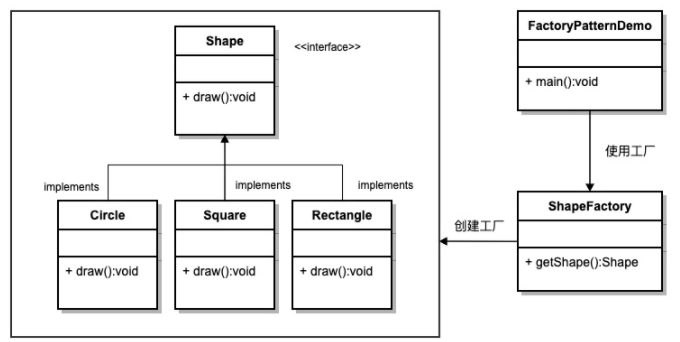
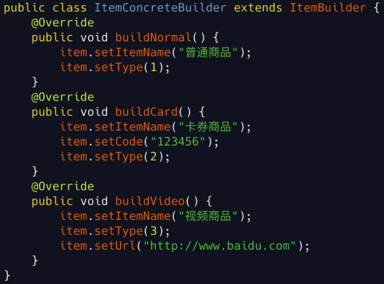
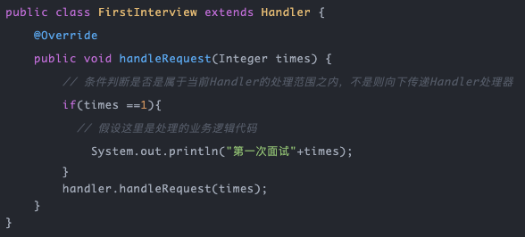

# 单例模式

## 定义
在当前进程中，通过单例模式创建的类有且只有一个实例。

## 特点
- 在Java应用中，单例模式能保证在一个JVM中，该对象只有一个实例存在
- 构造器必须是私有的，外部类无法通过调用构造器方法创建该实例
- 没有公开的set方法，外部类无法调用set方法创建该实例
- 提供一个公开的get方法获取唯一的这个实例

## 好处
- 某些类创建比较频繁，对于一些大型的对象，这是一笔很大的系统开销
- 省去了new操作符，降低了系统内存的使用频率，减轻GC压力
- 系统中某些类，如spring里的controller，控制着处理流程，如果该类可以创建多个的话，系统完全乱了
- 避免了对资源的重复占用

## 枚举实现单例模式
```java
public class SingletonObject {


    private SingletonObject(){

    }

    /**
     * 枚举类型是线程安全的，并且只会装载一次
     */
    private enum Singleton{
        INSTANCE;

        private final SingletonObject instance;

        Singleton(){
            instance = new SingletonObject();
        }

        private SingletonObject getInstance(){
            return instance;
        }
    }

    public static SingletonObject getInstance(){

        return Singleton.INSTANCE.getInstance();
    }
}
```
## 双重校验锁
```java
public class Singleton {
    private volatile static Singleton singleton;
    private Singleton() {
    }
    public static Singleton getSingleton() {
        if (singleton == null) {
            synchronized (Singleton.class) {
                if (singleton == null) {
                    singleton = new Singleton();
                }
            }
        }
        return singleton;
    }
}
```
在单例模式的双重校验锁中，singleton这个实例必须加volatile，防止指令重排，比如上面new对象的时候，经过了三个步骤，1.分配内存空间；
2调用构造器，初始化实例；3返回地址给引用，线程A可能的步骤是132，这没问题，但是此时如果有个线程B，在A执行1，3步骤后，在最初if判断里，由于在步骤3中已经把对象指向空间了，所以不等于null，所以线程B直接return singleton，但是它还没有完成构造。

## 反射破坏单例模式
```java
Singleton s1 = Singleton.getInstance();
 
Constructor<Singleton> constructor = Singleton.class.getDeclaredConstructor();
constructor.setAccessible(true);
Singleton s2 = constructor.newInstance();

System.out.println(s1.hashCode());
System.out.println(s2.hashCode());
```

## 问题：为什么不用静态方法而用单例模式？

两者其实都能实现我们加载的最终目的，但是他们一个是基于对象，一个是面向对象的，就像我们不面向对象也能解决问题一样，面向对象的代码提供一个更好的编程思想。

如果一个方法和他所在类的实例对象无关，那么它就应该是静态的，反之他就应该是非静态的。如果我们确实应该使用非静态的方法，但是在创建类时又确实只需要维护一份实例时，就需要用单例模式了。

我们的电商系统中就有很多类，有很多配置和属性，这些配置和属性是一定存在了，又是公共的，同时需要在整个生命周期中都存在，所以只需要一份就行，这个时候如果需要我再需要的时候new一个，再给他分配值，显然是浪费内存并且再赋值没什么意义。

所以我们用单例模式或静态方法去维持一份这些值有且只有这一份值，但此时这些配置和属性又是通过面向对象的编码方式得到的，我们就应该使用单例模式，或者不是面向对象的，但他本身的属性应该是面对对象的，我们使用静态方法虽然能同样解决问题，但是最好的解决方案也应该是使用单例模式。


# 工厂模式
## 普通工厂模式


## 抽象工厂模式
先创建一个抽象工厂方法


再创建一个商品工厂去继承抽象工厂方法。


# 建造者模式
当我们需要实列化一个复杂的类，以得到不同结构类型和不同的内部状态的对象时，我们可以用不同的类对它们的实列化操作逻辑分别进行封装，这些类我们就称之为建造者。

## 举例
在电商中有多种不同类型的商品 普通实物商品，电子卡券商品，虚拟视频学习商品 等多种不同的商品，他们都是商品但是他们的属性却不一样，电子卡券：独有券码，学习视频：独有视频链接等。

那我们要怎么实现这种这种创建商品呢？

我们先看下最普通的创建方式：

我们先创建一个基础商品Item类：


这里我们可以看到根据请求类型，也可以完全创建出我们想要的类型商品，但是一个商品属性不可能只有这么一点属性，那以后扩展更多呢？那这个代码我们看上去就会很臃肿，也不好维护。


<font size=4 color="green">接下来我们就看下建造者模式怎么去实现：</font>

第一步：创建我们的抽象建造者类。这里面我们看下有三个抽象方法，来确定不同的商品类型，我们调用不同的方法，达到解偶的思想


第二步：创建具体建造者类。对抽象建造者类的抽象方法进行实现赋值，达到我们所需要的结果。



第三步：创建我们的导演类。指导我们怎么去创建对象，这个我们是可以简化的，视具体使用场景确定吧！


最后就是看我们的测试结果了。在省略导演类的时候其实我们也完全可以的构建出我们想要的结果，因为我这写的是测试demo所以没有写传参，这个大家可以根据自己的实际应用场景去做改造。


与普通的写法相比建造者模式的写法使的这个代码可读性高，而且易扩展，不同类型的商品达到了解耦合的效果。


# 原型模式
原型模式其实就是一种克隆对象的方法，在我们的编码时候是很常见的，比如我们常用的的BeanUtils.copyProperties就是一种对象的浅copy，其实现在我们实例化对象操作并不是特别耗费性能，所以在针对一些特殊场景我们还是需要克隆那些已经实例化的对象的：

- 依赖外部资源或硬件密集型操作，比如数据库查询，或者一些存在IO操作的场景
- 获取相同对象在相同状态的拷贝从而不需要重复创建获取状态的操作的情况

# 责任链模式
将请求的发送和接收解耦，让多个接收对象都有机会处理这个请求。将这些接收对象串成一条链，并沿着这条链传递这个请求，直到链上的某个接收对象能够处理它为止。

## 实现
假设现在去一家公司面试，第一次去一面，第二次去二面，第三次去直接过了。那这个模拟面试代码怎么写呢？

首先我们还是定义一个抽象Handler处理器，同时添加一个抽象处理方法 handleRequest，后面我只需要编写具体的处理器来继承Handler类


其次构建第一次面试Handler，内部实现handleRequest方法，判断一下是否是当前处理应该处理的业务逻辑，不是则向下传递。同样的第二次的SecondInterview和FirstInterview代码基本是一致的，我就不给大家贴出来了，直接看最后一个




这个结果可以很明显的看出，根据我们传参，不同的Handler根据自己的职责处理着自己的业务，这就是责任链。


## 框架的应用
责任链在很多框架源码中也有体现。比如开始学SpringMVC中的 ServletFilter

以及Spring中的 SpringInterceptor 这里面其实都是运用了责任链模式的思想，达到框架的可扩展性的同时也遵循着开闭原则。

作为常见的RPC框架的DUBBO其实里面也同样有这个责任链的思想。

# 观察者模式
当一个对象的状态发生改变时，已经登记的其他对象能够观察到这一改变从而作出自己相对应的改变。通过这种方式来达到减少依赖关系，解耦合的作用。

## 例子

先创建一个主题定义，定义添加删除关系以及通知订阅者


其次再创建的具体主题，并且构建一个容器来维护订阅关系，支持添加删除关系，以及通知订阅者


创建一个观察者接口，方便我们管理


最后就是创建具体的观察者类，实现观察者接口的update方法，处理本身的业务逻辑


最后就是看测试结果了，通过ConcreteSubject 维护了一个订阅关系，在通过notifyObservers 方法通知订阅者之后，观察者都获取到消息从而处理自己的业务逻辑。


## 框架应用

观察者模式在框架的中的应用也是应该很多

第一种  熟悉JDK的人应该知道 在java.util 包下 除了常用的 集合 和map之外还有一个Observable类，他的实现方式其实就是观察者模式。里面也有添加、删除、通知等方法。

这里需要注意是的 他是用Vector 作为订阅关系的容器，同时在他的定义方法中都添加synchronized关键字修饰类，以达到线程安全的目的

这里我贴出了关键源码，感兴趣的同学可以自己打开并且观看每个方法的注释。


第二种 在Spring中有一个ApplicationListener，也是采用观察者模式来处理的，ApplicationEventMulticaster作为主题，里面有添加，删除，通知等。

spring有一些内置的事件，当完成某种操作时会发出某些事件动作，他的处理方式也就上面的这种模式，当然这里面还有很多，我没有细讲，有兴趣的同学可以仔细了解下Spring的启动过程。

```java
import java.util.EventListener;

/**
 * Interface to be implemented by application event listeners.
 * Based on the standard {@code java.util.EventListener} interface
 *  for the Observer design pattern. // 这里也已经说明是采用观察者模式
 *
 * <p>As of Spring 3.0, an ApplicationListener can generically declare the event type
 * that it is interested in. When registered with a Spring ApplicationContext, events
 * will be filtered accordingly, with the listener getting invoked for matching event
 * objects only.
 *
 * @author Rod Johnson
 * @author Juergen Hoeller
 * @param <E> the specific ApplicationEvent subclass to listen to
 * @see org.springframework.context.event.ApplicationEventMulticaster //主题
 */
@FunctionalInterface
public interface ApplicationListener<E extends ApplicationEvent> extends EventListener {

 /**
  * Handle an application event.
  * @param event the event to respond to
  */
 void onApplicationEvent(E event);

}
```

第三种  Google Guava的事件处理机制Guava EventBus 他的实现也是采用设计模式中的观察者设计模式。

EventBus 当前实现有两种方式：

- EventBus  // 同步阻塞模式
- AsyncEventBus  // 异步非阻塞模式


EventBus内部也提供来一系列的方法来供我们方便使用：

- register 方法作为添加观察者

- unregister方法删除观察者

- post 方法发送通知消息等

使用起来非常方便。添加@Subscribe注解就可以创建一个订阅者了，具体的使用方式可以看看官网。

## 现实业务改造举例

框架应用的例子这么多，在业务场景中其实也有很多地方可以使用到，这里我还是给大家举一个例子。

在新用户注册成功之后我们需要给用户做两件事情，第一是发送注册成功短信，第二是给用发送新人优惠券。

看到这个问题 大家可能首先会想到用MQ消息处理呀，是的，用消息确实可以的，但是这里我们用观察者模式来实现这个问题，同时可以给大家演示一下，同步或者异步的问题。


这里我们新写了两个观察者，主要看第一个SendNewPersonCouponObserver，这里了异步开启新的线程去处理我们的业务逻辑，当我们关心返回值的时候可以用Future来获取返回结果，当不关心的返回值的化，直接开启普通线程就可以了。

这个举例整体其实还是比较简单的主要是为了说清楚异步线程处理，当然如果用Guava EventBus也可以实现。而且也不复杂，感兴趣的朋友可以自己去试试。

当前现在有更加好的中间件<font size=4 color="green">MQ消息队列</font>来处理这个业务问题，使得我们更加从容的面对这类场景问题，但是一些资源不足，不想引入新的系统。还是可以用这种方式来处理问题的。


# 策略模式
抽象了出了接口，将业务逻辑封装成一个一个的实现类，任意地替换。在复杂场景（业务逻辑较多）时比直接 if else 来的好维护些。
## 例子
举个例子，汽车大家肯定都不陌生，愿大家早日完成汽车梦，汽车的不同档(concreteStrategy）就好比不同的策略，驾驶者选择几档则汽车按几档的速度前进，整个选择权在驾驶者（context）手中。

首先还是先定义抽象策略

```java
public interface GearStrategy {

    // 定义策略执行方法
    void algorithm(String param);
}
```

其次定义具体档位策略，实现algorithm方法。

```java
public class GearStrategyOne implements GearStrategy {

    @Override
    public void algorithm(String param) {
        System.out.println("当前档位" + param);
    }
}
```


最后就是实现运行时环境（Context），你可以定义成StrategyFactory，但都是一个意思。

在main方法里面的测试demo，可以看到通过不同的type类型，可以实现不同的策略，这就是策略模式主要思想。


```java
public class Context {
  // 缓存所有的策略，当前是无状态的，可以共享策略类对象
    private static final Map<String, GearStrategy> strategies = new HashMap<>();

    // 第一种写法
    static {
        strategies.put("one", new GearStrategyOne());
    }

    public static GearStrategy getStrategy(String type) {
        if (type == null || type.isEmpty()) {
            throw new IllegalArgumentException("type should not be empty.");
        }
        return strategies.get(type);
    }

    // 第二种写法
    public static GearStrategy getStrategySecond(String type) {
        if (type == null || type.isEmpty()) {
            throw new IllegalArgumentException("type should not be empty.");
        }
        if (type.equals("one")) {
            return new GearStrategyOne();
        }
        return null;
    }


    public static void main(String[] args) {
        // 测试结果
        GearStrategy strategyOne = Context.getStrategy("one");
        strategyOne.algorithm("1档");
         // 结果：当前档位1档
        GearStrategy strategyTwo = Context.getStrategySecond("one");
        strategyTwo.algorithm("1档");
        // 结果：当前档位1档
    }

}
```

在Context里面定义了两种写法：

- 第一种是维护了一个strategies的Map容器。用这种方式就需要判断每种策略是否可以共享使用，它只是作为算法的实现。
- 第二种是直接通过有状态的类，每次根据类型new一个新的策略类对象。这个就需要根据实际业务场景去做的判断。

## 框架的应用
策略模式在框架中也在一个很常见的地方体现出来了，而且大家肯定都有使用过。

那就是JDK中的线程池ThreadPoolExecutor


首先都是类似于这样定义一个线程池，里面实现线程池的异常策略。

这个线程池的异常策略就是用的策略模式的思想。


在源码中有RejectedExecutionHandler这个抽象异常策略接口，同时它也有四种拒绝策略。关系图如下：


这就已经达到了行为解偶的思想。同时也避免了长串的if else 判断。

## 优点：

- 算法策略可以自由实现切换
- 扩展性好，加一个策略，只需要增加一个类

## 缺点：

- 策略类数量多
- 需要维护一个策略枚举，让别人知道你当前具有哪些策略
