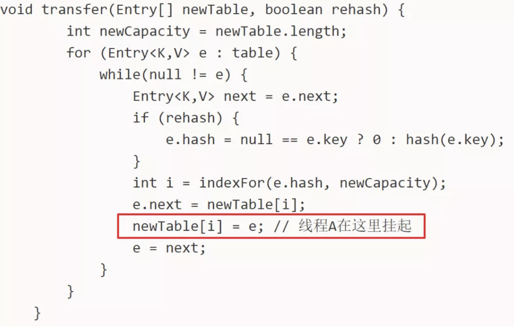
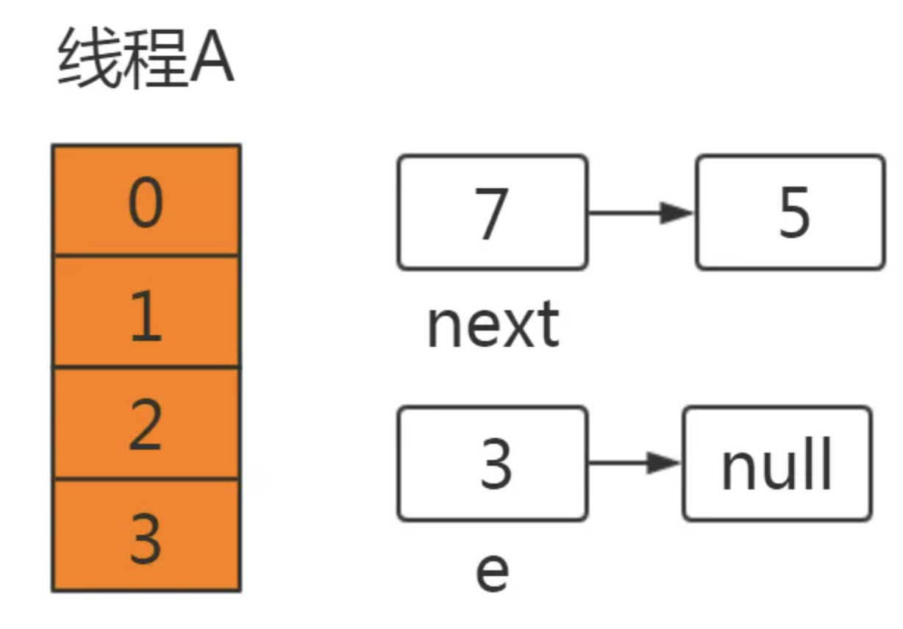
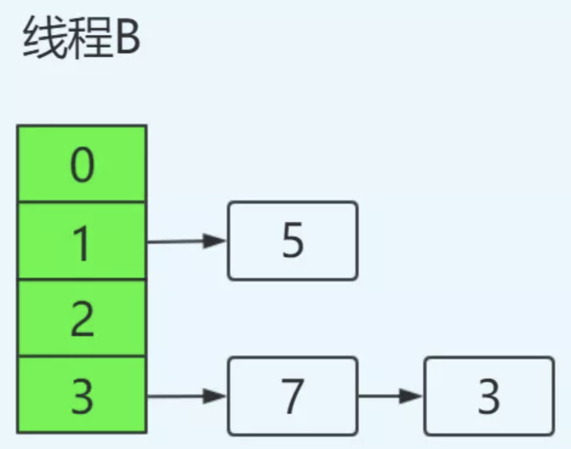
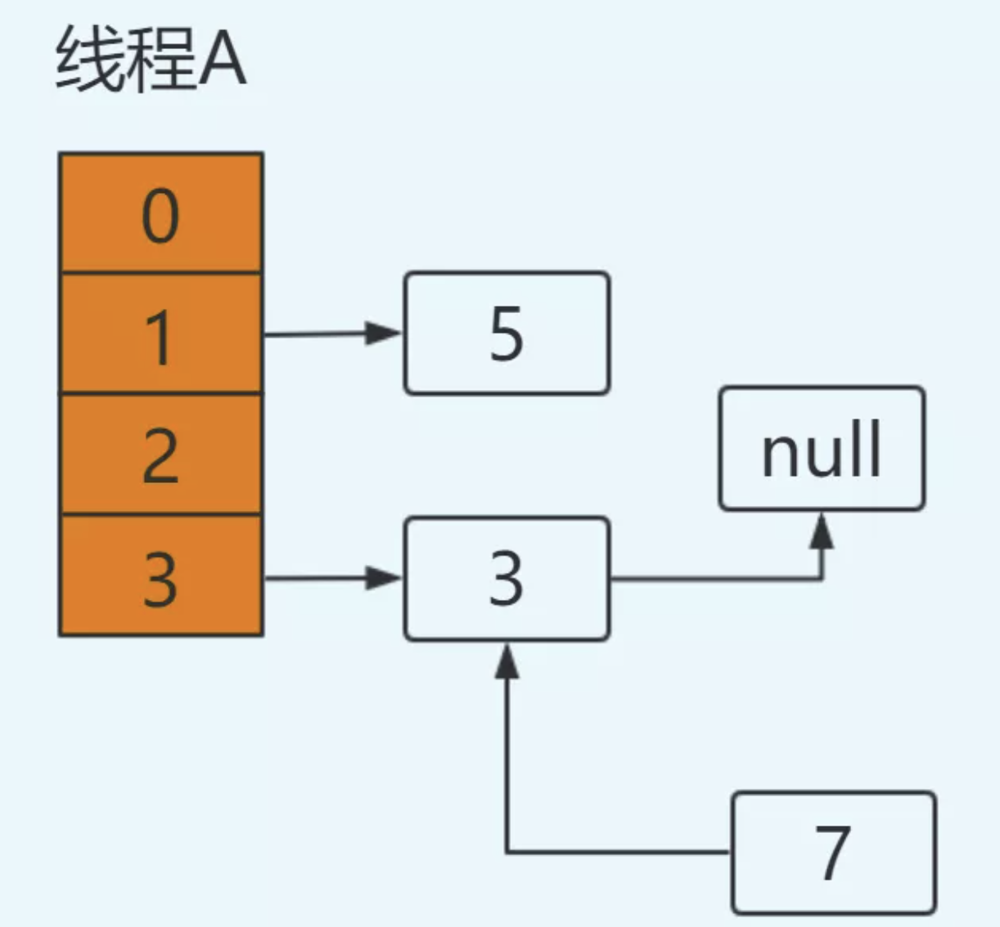
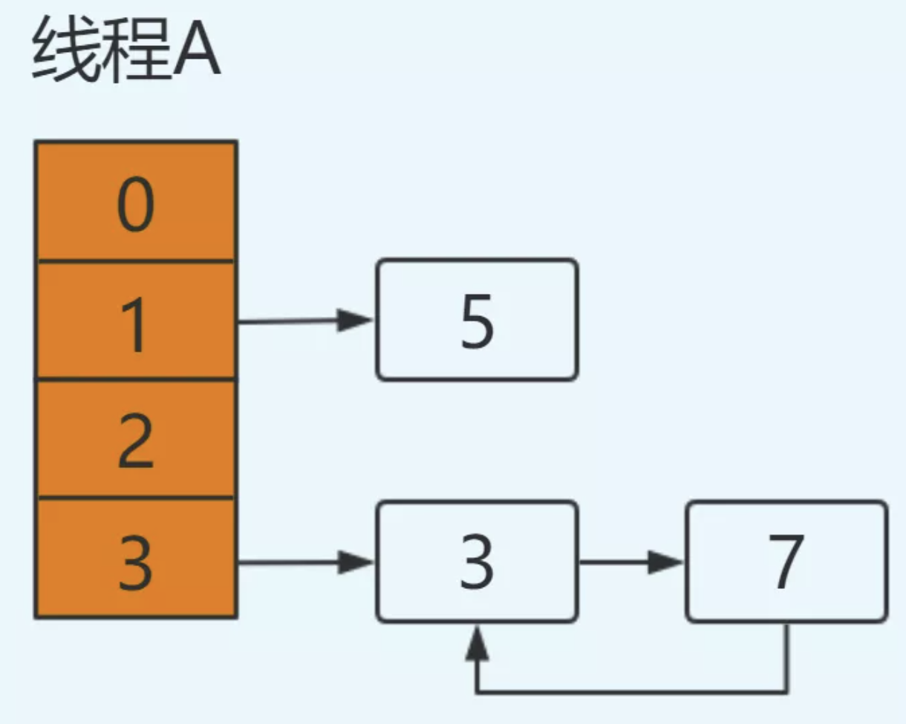
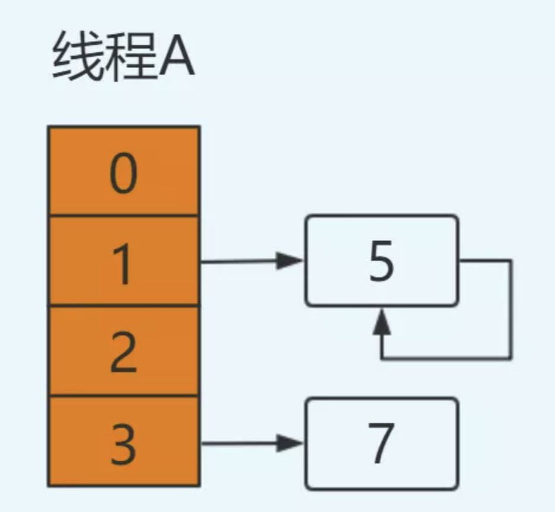
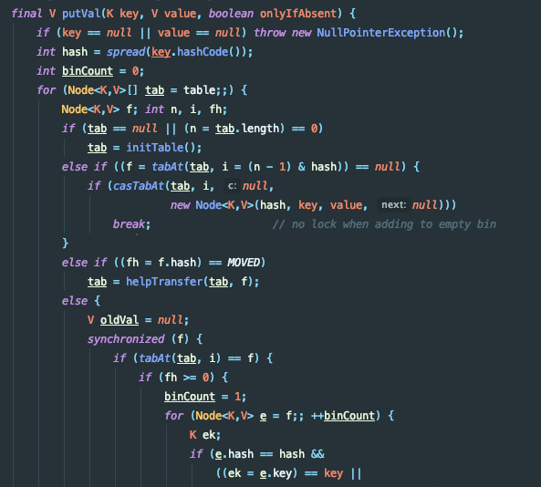

# HashMap
## HashMap为什么不安全
[详情](https://mp.weixin.qq.com/s/VtIpj-uuxFj5Bf6TmTJMTw)
### jdk1.7中的HashMap
#### 1. 扩容造成死循环

在后续操作中只要涉及轮询hashmap的数据结构，就会在这里发生死循环，造成悲剧。

#### 2. 扩容造成数据丢失
跟前文提到的几乎一样
也是同一操作造成的问题。 

### jdk1.8中的HashMap
在jdk1.8中对HashMap进行了优化，在发生hash碰撞，不再采用头插法方式，而是直接插入链表尾部，因此不会出现环形链表的情况，但是在多线程的情况下仍然不安全。
#### put操作时会发生数据覆盖

# ConcurrentHashMap
## 1.7
从结构上说，1.7版本的ConcurrentHashMap采用分段锁机制，里面包含一个Segment数组，Segment继承与ReentrantLock，Segment则包含HashEntry的数组，HashEntry本身就是一个链表的结构，具有保存key、value的能力能指向下一个节点的指针。

实际上就是相当于每个Segment都是一个HashMap，默认的Segment长度是16，也就是支持16个线程的并发写，Segment之间相互不会受到影响。

### put流程
其实发现整个流程和HashMap非常类似，只不过是先定位到具体的Segment，然后通过ReentrantLock去操作而已，后面的流程我就简化了，因为和HashMap基本上是一样的。

1. 计算hash，定位到segment，segment如果是空就先初始化
2. 使用ReentrantLock加锁，如果获取锁失败则尝试自旋，自旋超过次数就阻塞获取，保证一定获取锁成功
3. 遍历HashEntry，就是和HashMap一样，数组中key和hash一样就直接替换，不存在就再插入链表，链表同样

## 1.8
1.8抛弃分段锁，转为用CAS+synchronized来实现，同样HashEntry改为Node，也加入了红黑树的实现。主要还是看put的流程。
### put流程
1. 首先计算hash，遍历node数组，如果node是空的话，就通过CAS+自旋的方式初始化
2. 如果当前数组位置是空则直接通过CAS自旋写入数据
3. 如果hash==MOVED，说明需要扩容，执行扩容
4. 如果都不满足，就使用synchronized写入数据，写入数据同样判断链表、红黑树，链表写入和HashMap的方式一样，key hash一样就覆盖，反之就尾插法，链表长度超过8就转换成红黑树
   

# ArrayList
ArrayList就是数组列表，主要用来装载数据，当我们装载的是基本类型的数据int，long，boolean，short，byte…的时候我们只能存储他们对应的包装类，它的主要底层实现是数组Object[] elementData。

与它类似的是LinkedList，和LinkedList相比，它的查找和访问元素的速度较快，但新增，删除的速度较慢。

小结：ArrayList底层是用数组实现的存储。

特点：查询效率高，增删效率低，线程不安全。使用频率很高。

## ArrayList（int initialCapacity）不会初始化数组大小

## ArrayList的遍历和LinkedList遍历性能比较如何？
论遍历ArrayList要比LinkedList快得多，ArrayList遍历最大的优势在于内存的连续性，CPU的内部缓存结构会缓存连续的内存片段，可以大幅降低读取内存的性能开销。