# Collection

## Set

### TreeSet

基于红黑树实现(TreeMap)，支持有序性操作（实现了NavigableSet接口），例如根据一个范围查找元素的操作，但是查找效率不如HashSet，HashSet查找的效率是O(1)，TreeSet查找的效率是O(logn)

```java
TreeSet<Integer> set = new TreeSet<>(List.of(1, 3, 5, 7, 9));
Set<Integer> subset = set.subSet(3, true, 7, false); // [3,5] 根据布尔值控制是否包含边界
Set<Integer> head = set.headSet(5, true); // [1,3,5]
```

### HashSet

基于哈希表实现，支持快速查找，但不支持有序性操作

#### HashSet如何检查重复

调用HashMap的put方法，如果返回的是null，说明插入成功，没有重复，如果返回有值（该key的前一个val）

```java
// Returns: true if this set did not already contain the specified element
// 返回值：当 set 中没有包含 add 的元素时返回真
public boolean add(E e) {
        return map.put(e, PRESENT)==null;
}
```


### LinkedHashSet

基于 `LinkedHashMap` 实现，内部使用双向链表维护元素的插入顺序，相比HashMap.Node多了两个字段，before：前一个插入的Entry，after：后一个插入的Entry，注意：node的是next指针

```java
static class Entry<K,V> extends HashMap.Node<K,V> {
    Entry<K,V> before, after;
}

+--------+        +--------+        +--------+
|  "A"   | <----> |  "B"   | <----> |  "C"   |
+--------+        +--------+        +--------+
 ↑ Hash桶                       ↑ 插入顺序链表
```

## List

### ArrayList

底层是通过数组实现，允许放入null元素，非线程安全；

ArrayList有一个容量capacity，表示底层数组的实际大小，如果容量不足，会自动增大底层数组的大小

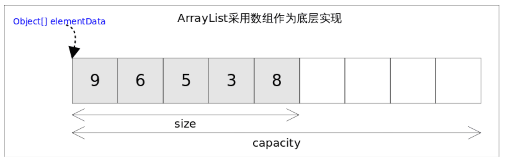

#### ArrayList自动扩容

向数组添加元素时，会先检查添加后元素的个数是否会超出当前数组的长度，如果超出，就会对数组进行扩容（内部使用ensureCapacityInternal，外部在实际添加大量元素前，可使用ensureCapacity方法增加ArrayList容量），插入第一个元素时，数组容量扩为10

数组扩容时，会将老数组的元素拷贝到新的数组（`elementData = Arrays.copyOf(elementData, newCapacity`)，每次增长是原来的1.5倍（`newCapacity = oldCapacity + (oldCapacity >> 1)`）

在实际使用时，应该尽量避免数组容量的扩张。当我们可预知要保存的元素的多少时，要在构造ArrayList实例时，就指定其容量，以避免数组扩容的发生。或者根据实际需求，通过调用ensureCapacity方法来手动增加ArrayList实例的容量

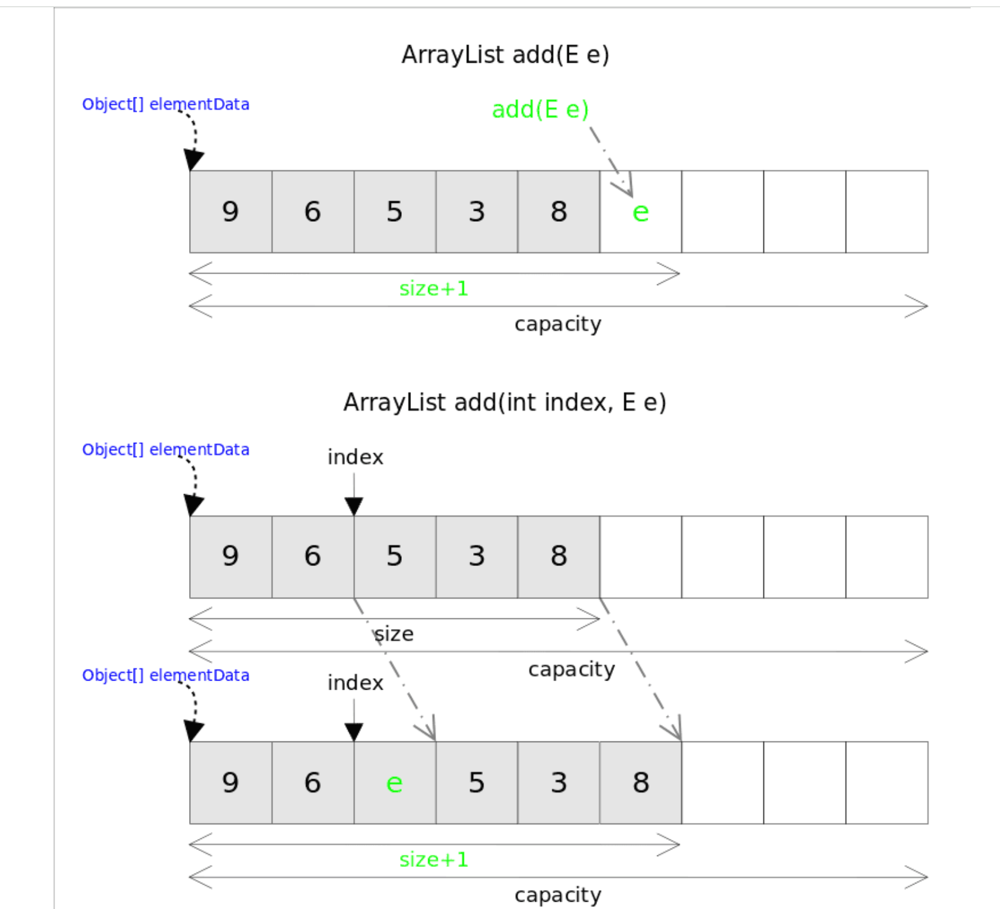

#### ArrayList为什么查询快，增删慢

`ArrayList` 底层是连续内存的数组，可以通过索引快速定位到元素

```java
E element = elementData[index];  // 直接通过下标访问
```

增删慢是因为插入或删除时，需要将新元素后面的元素都向后或向前移一位

#### ArrayList的Fail-Fast机制

ArrayList采用快速失败机制，在**遍历集合时，如果集合结构发生了“并发修改”，立刻抛出 `ConcurrentModificationException` 异常**，而不是继续执行可能导致错误的操作

`ArrayList` 有一个字段

```java
protected transient int modCount = 0;
```

每当结构性修改（如 `add()`、`remove()`、`clear()`）发生时，`modCount` 就会自增

非结构性修改（如 `set(index, value)`）不会更改 `modCount`

`ArrayList` 的迭代器在创建时会保存 `modCount` 的值

```java
int expectedModCount = modCount;
```

在调用 `next()`、`remove()` 等方法时，会进行检查

```java
if (modCount != expectedModCount)
    throw new ConcurrentModificationException();
```

**哪些遍历会抛异常**

```java
List<String> list = new ArrayList<>(List.of("a", "b", "c"));

for (String s : list) {
    if (s.equals("b")) {
        list.remove(s); // 🚨 抛异常
    }
}

Iterator<String> it = list.iterator();

while (it.hasNext()) {
    String s = it.next();
    list.remove(s); // 🚨 抛异常
}

for (int i = 0; i < list.size(); i++) {
    list.remove(i); // 🚨 会跳元素，也可能抛异常（不是一定）
}
```

**哪些遍历不会抛异常**

```java
Iterator<String> it = list.iterator();
while (it.hasNext()) {
    String s = it.next();
    if (s.equals("b")) {
        it.remove(); // ✅ 正确做法
    }
}

CopyOnWriteArrayList<String> list = new CopyOnWriteArrayList<>(List.of("a", "b", "c"));
for (String s : list) {
    if (s.equals("b")) {
        list.remove(s); // ✅ 不抛异常，线程安全，但开销较大
    }
}
```


### CopyOnWriteArrayList

CopyOnWriteArrayList采用写时复制的思想：

即读取元素时不加锁，从底层数组中读取；对其进行修改操作时加锁，会复制底层数组O(n)，创建一个新数组副本，再在新数组中进行修改，写入完成后，再将新的数组设置为当前的底层数组

写时复制适合读多写少的并发场景，能极大提高系统的并发性能

**缺点**

- 内存占用：每次修改操作，都要复制一份原始数据，占用额外的内存空间，数据量大时可能会导致内存不足
- 写操作开销，每次写操作都需要复制一份原始数据，再进行修改和替换，增大了写操作开销
- 数据一致性问题：在写完之后不是立即生效，先复制，再写，再替换，在这个过程中读到的数据就是旧数据

**add源码**

```java
// 插入元素到 CopyOnWriteArrayList 的尾部
public boolean add(E e) {
    final ReentrantLock lock = this.lock;
    // 加锁
    lock.lock();
    try {
        // 获取原来的数组
        Object[] elements = getArray();
        // 原来数组的长度
        int len = elements.length;
        // 创建一个长度+1的新数组，并将原来数组的元素复制给新数组
        Object[] newElements = Arrays.copyOf(elements, len + 1);
        // 元素放在新数组末尾
        newElements[len] = e;
        // array指向新数组
        setArray(newElements);
        return true;
    } finally {
        // 解锁
        lock.unlock();
    }
}
```

**读取元素源码**（弱一致性）

```java
// 底层数组，只能通过getArray和setArray方法访问
private transient volatile Object[] array; // volatile保证可见性，写线程对 array 的修改，对其他线程立即可见

public E get(int index) {
    return get(getArray(), index);
}

final Object[] getArray() {
    return array;
}

private E get(Object[] a, int index) {
    return (E) a[index];
}
```

**获取列表中元素个数**

```java
public int size() {
    return getArray().length;
}
```

`CopyOnWriteArrayList`中的`array`数组每次复制都刚好能够容纳下所有元素，并不像`ArrayList`那样会预留一定的空间。因此，`CopyOnWriteArrayList`中并没有`size`属性`CopyOnWriteArrayList`的底层数组的长度就是元素个数，因此`size()`方法只要返回数组长度就可以了

**删除元素**

```java
public E remove(int index) {
    // 获取可重入锁
    final ReentrantLock lock = this.lock;
    // 加锁
    lock.lock();
    try {
         //获取当前array数组
        Object[] elements = getArray();
        // 获取当前array长度
        int len = elements.length;
        //获取指定索引的元素(旧值)
        E oldValue = get(elements, index);
        int numMoved = len - index - 1;
        // 判断删除的是否是最后一个元素
        if (numMoved == 0)
             // 如果删除的是最后一个元素，直接复制该元素前的所有元素到新的数组
            setArray(Arrays.copyOf(elements, len - 1));
        else {
            // 分段复制，将index前的元素和index+1后的元素复制到新数组
            // 新数组长度为旧数组长度-1
            Object[] newElements = new Object[len - 1];
            System.arraycopy(elements, 0, newElements, 0, index);
            System.arraycopy(elements, index + 1, newElements, index,
                             numMoved);
            //将新数组赋值给array引用
            setArray(newElements);
        }
        return oldValue;
    } finally {
         // 解锁
        lock.unlock();
    }
}
```

#### CopyOnWriteArrayList为什么并发安全且性能比Vector好

CopyOnWriteArrayList修改时加锁（reentrantlock），Vector读取和修改时都加锁（synchronized）

## Queue

### ConcurrentLinkedQueue

底层结构——链表

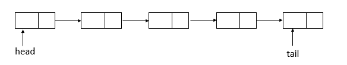

**offer函数源码**

```java
public boolean offer(E e) {
    // 元素不为null
    checkNotNull(e);
    // 新生一个结点
    final Node<E> newNode = new Node<E>(e);

    for (Node<E> t = tail, p = t;;) { // 无限循环
        // q为p结点的下一个结点
        Node<E> q = p.next;
        if (q == null) { // q结点为null
            // p is last node
            if (p.casNext(null, newNode)) { // 比较并进行替换p结点的next域
                // Successful CAS is the linearization point
                // for e to become an element of this queue,
                // and for newNode to become "live".
                if (p != t) // p不等于t结点，不一致    // hop two nodes at a time
                    // 比较并替换尾结点
                    casTail(t, newNode);  // Failure is OK.
                // 返回
                return true;
            }
            // Lost CAS race to another thread; re-read next
        }
        else if (p == q) // p结点等于q结点
            // We have fallen off list.  If tail is unchanged, it
            // will also be off-list, in which case we need to
            // jump to head, from which all live nodes are always
            // reachable.  Else the new tail is a better bet.
            // 原来的尾结点与现在的尾结点是否相等，若相等，则p赋值为head，否则，赋值为现在的尾结点
            p = (t != (t = tail)) ? t : head;
        else
            // Check for tail updates after two hops.
            // 重新赋值p结点
            p = (p != t && t != (t = tail)) ? t : q;
    }
}
```

offer将指定元素插入到链表的尾部，过程如下（假设单线程添加元素，连续添加10、20两个元素）

初始状态

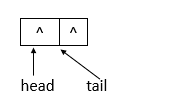

添加10

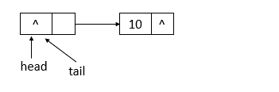

添加20

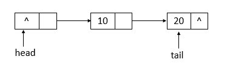

**poll函数源码**

```java
public E poll() {
    restartFromHead:
    for (;;) { // 无限循环
        for (Node<E> h = head, p = h, q;;) { // 保存头节点
            // item项
            E item = p.item;

            if (item != null && p.casItem(item, null)) { // item不为null并且比较并替换item成功
                // Successful CAS is the linearization point
                // for item to be removed from this queue.
                if (p != h) // p不等于h    // hop two nodes at a time
                    // 更新头节点
                    updateHead(h, ((q = p.next) != null) ? q : p); 
                // 返回item
                return item;
            }
            else if ((q = p.next) == null) { // q结点为null
                // 更新头节点
                updateHead(h, p);
                return null;
            }
            else if (p == q) // p等于q
                // 继续循环
                continue restartFromHead;
            else
                // p赋值为q
                p = q;
        }
    }
}
```

poll移除链表的头部，如果链表为空，则返回null，过程如下（假设单线程操作，状态为之前offer10、20后的状态，poll两次）

初始状态


第一次poll

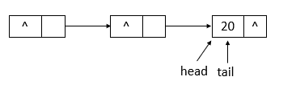

第二次poll

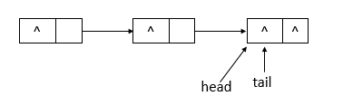

**remove操作源码**

```java
public boolean remove(Object o) {
    // 元素为null，返回
    if (o == null) return false;
    Node<E> pred = null;
    for (Node<E> p = first(); p != null; p = succ(p)) { // 获取第一个存活的结点
        // 第一个存活结点的item值
        E item = p.item;
        if (item != null &&
            o.equals(item) &&
            p.casItem(item, null)) { // 找到item相等的结点，并且将该结点的item设置为null
            // p的后继结点
            Node<E> next = succ(p);
            if (pred != null && next != null) // pred不为null并且next不为null
                // 比较并替换next域
                pred.casNext(p, next);
            return true;
        }
        // pred赋值为p
        pred = p;
    }
    return false;
}

final Node<E> succ(Node<E> p) {
    // p结点的next域
    Node<E> next = p.next;
    // 如果next域为自身，则返回头节点，否则，返回next
    return (p == next) ? head : next;
}
```

操作流程

初始状态

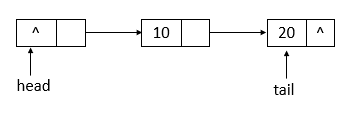

执行一次remove(10)

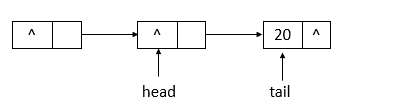

执行一次remove(20)


#### HOPS延迟更新策略

- tail指针更新时机：当tail指针的next不为null时，会执行定位队列真正尾结点的操作，找到尾结点，执行插入后，通过casTail进行tail的更新；当tail的next为null时，只插入节点，不更新tail
- head指针更新时机：当head指针的next的item为null时，会执行定位队列真正头节点的操作，找到头节点，执行删除后，通过updateHead进行head更新；当head的next的item不为null时，只删除节点不更新head

这样做的原因是，如果有大量入队操作，每次都需要cas进行tail更新，汇总起来对性能也是较大的损耗，通过这个策略可以减少cas更新操作，提升入队操作效率

### ArrayBlockingQueue

- ArrayBlockingQueue内部维护一个定长的数组用于存储元素
- 通过使用Reentrantlock对读写操作进行同步
- 通过Condition实现线程间的等待和唤醒
    - 当队列已满时，生产者线程会调用 `notFull.await()` 方法让生产者进行等待，等待队列非满时插入（非满条件）
    - 当队列为空时，消费者线程会调用 `notEmpty.await()`方法让消费者进行等待，等待队列非空时消费（非空条件）
    - 当有新的元素被添加时，生产者线程会调用 `notEmpty.signal()`方法唤醒正在等待消费的消费者线程
    - 当队列中有元素被取出时，消费者线程会调用 `notFull.signal()`方法唤醒正在等待插入元素的生产者线程

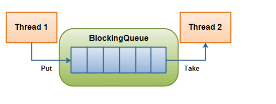

#### ArrayBlockingQueue和ConcurrentLinkedQueue区别

`ArrayBlockingQueue` 和 `ConcurrentLinkedQueue` 是 Java 并发包中常用的两种队列实现，它们都是线程安全的

- 底层实现：`ArrayBlockingQueue` 基于数组实现，而 `ConcurrentLinkedQueue` 基于链表实现
- 是否有界：`ArrayBlockingQueue` 是有界队列，必须在创建时指定容量大小，而 `ConcurrentLinkedQueue` 是无界队列，可以动态地增加容量
- 是否阻塞：`ArrayBlockingQueue` 支持阻塞（put和take）和非阻塞（offer和poll）两种获取和新增元素的方式（一般只会使用前者）， `ConcurrentLinkedQueue` 是无界的，仅支持非阻塞式获取和新增元素

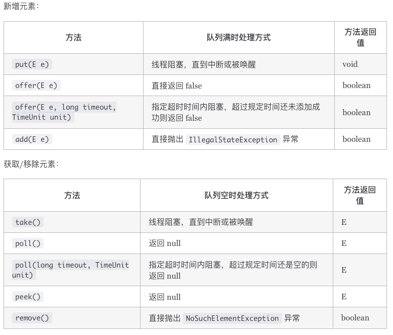

### BlockingDeque

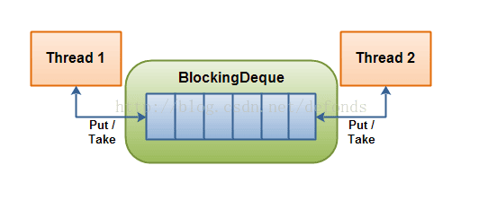

唯一实现：LinkedBlockingDeque

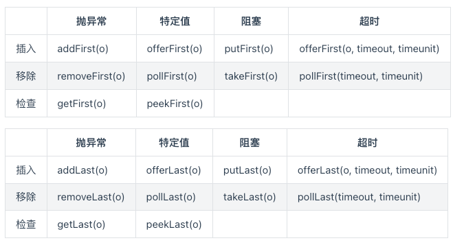

### DelayQueue延迟队列

`DelayQueue` 是 Java 并发包中一个 **无界阻塞队列**，用于放置实现了 `Delayed` 接口的元素，只有当元素的延迟时间到了，才能从队列中取出。常用于：

- 定时任务调度
- 缓存失效队列
- 超时控制等场景

注入其中的元素必须实现 java.util.concurrent.Delayed 接口，该接口定义:

```java
public interface Delayed extends Comparable<Delayed< {
    public long getDelay(TimeUnit timeUnit);
}
```

| 特性                        | 描述                           |
| --------------------------- | ------------------------------ |
| 元素必须实现 `Delayed` 接口 | 包含延迟时间和排序逻辑         |
| 出队顺序                    | 按延迟时间从小到大             |
| `take()` 会阻塞             | 直到有元素到期可取             |
| 无界队列                    | 没有容量限制，但要注意内存控制 |

例子

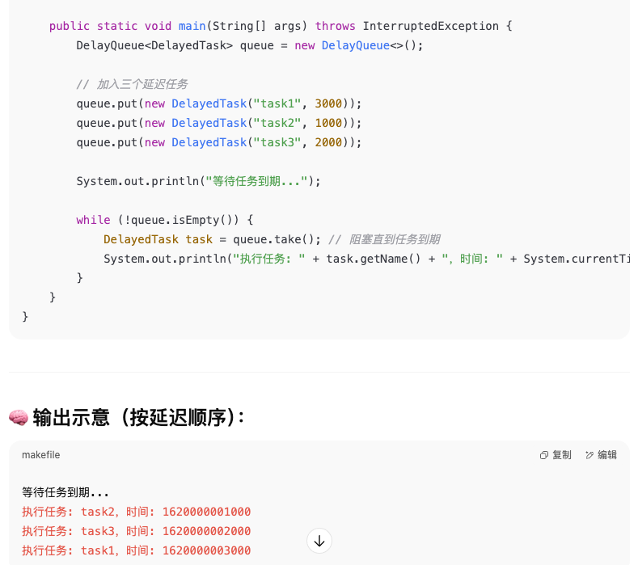

# Map

## HashMap

### 1.8之前

底层是数组加链表实现

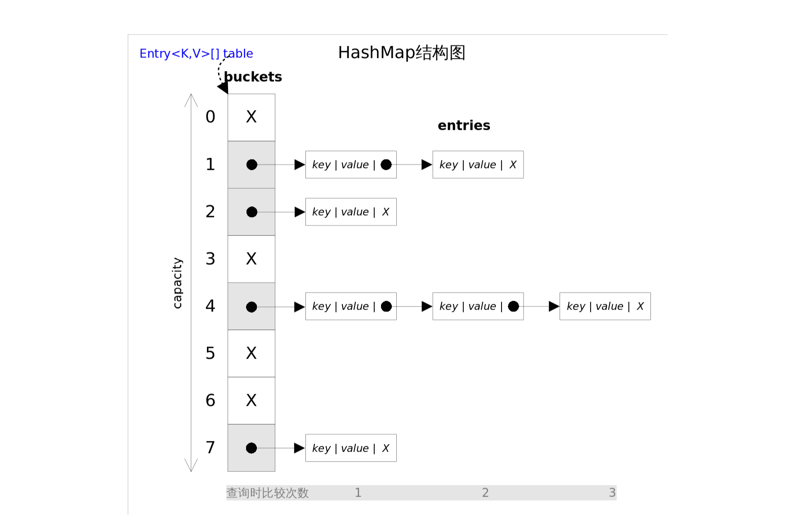

通过key的hashcode再经过扰动函数（减少碰撞）处理得到hash值，再进行`(n-1)&hash`得到数组下标，如果当前位置有元素，就判断val是否相同，如果相同，就覆盖，否则加到链表中

1.8扰动函数

```java
    static final int hash(Object key) {
      int h;
      // key.hashCode()：返回散列值也就是hashcode
      // ^：按位异或
      // >>>:无符号右移，忽略符号位，空位都以0补齐
      return (key == null) ? 0 : (h = key.hashCode()) ^ (h >>> 16);
  }
```

1.7扰动函数

```java
static int hash(int h) {
    // This function ensures that hashCodes that differ only by
    // constant multiples at each bit position have a bounded
    // number of collisions (approximately 8 at default load factor).

    h ^= (h >>> 20) ^ (h >>> 12);
    return h ^ (h >>> 7) ^ (h >>> 4);
}
```

相比于 JDK1.8 的 hash 方法 ，JDK 1.7 的 hash 方法的性能会稍差一点点，因为毕竟扰动了 4 次

### 1.8之后

插入节点，**当链表长度大于阈值（默认为8）时**，会调用treeifyBin函数，这个方法会先判断当前数组长度是否小于64，如果是，则执行resize方法，对数组扩容（增长为原来的2倍），否则就将链表转换为红黑树

#### **桶最大长度是MAXIMUM_CAPACITY = 1<<30，即2^30，1.8之前也是一样**

#### 为什么是8和64

- 泊松分布表明，链表长度达到8的概率极低，所以设置为8，能达到性能和空间效率的平衡
- 数组长度为64，同样是实践验证的经验值

#### 为什么转换为红黑树

因为链表的查询效率是O(n)，红黑树的查询效率是O(logn)，当链表较短的时候，两者查询效率相当，但是链表变长时，红黑树查询性能更优

红黑树是为了解决二叉查找树的缺陷，因为二叉查找树在某些情况下会退化成线性结构

#### 为什么优先扩容而不是直接转换为红黑树

扩容数组能降低哈希冲突，在数组长度低于64的情况下，扩容数组的效率比转换红黑树更优，红黑树需要保持自平衡，过早引入红黑树会增加复杂度

#### HashMap的长度为什么是2的幂次方

- 位运算更高效：当长度为2的幂次方时，hash跟length的取余运算`hash % length`等价于length-1和hash的与运算`hash & (length-1)`
- 更好地保证哈希值均匀分布：最好的情况会有一半值在数组前半部分，一半值在数组后半部分

#### 什么时候会resize

- 当键值对个数超过阈值（capacity * loadFactor），capacity是数组长度，一开始是16，loadFactor是负载因子，默认为0.75f
- 链表长度达到8且数组长度小于64

#### HashMap多线程导致死循环问题

1.8之前的hashmap在多线程环境下，扩容操作可能会导致死循环问题，因为使用的是**头插法**，多个线程对链表中的节点操作可能会导致**环形链表**，使得查询元素的时候陷入死循环，无法结束

解决办法：1.8使用了尾插法，避免出现环形链表，但仍然不是线程安全，可能出现数据丢失（覆盖）问题

#### HashMap为什么不是线程安全

两个线程同时进行put操作，线程1先判断是否哈希冲突，判断完后，cpu时间片耗尽，于是挂起，此时线程2获取到时间片执行，也是先判断是否哈希冲突，判断无冲突后（此时线程1的节点还没赋值），完成插入操作，然后线程1再次获得时间片执行，进行插入操作（之前已判断过哈希冲突），导致线程2的插入数据被线程1的覆盖了

```java
public V put(K key, V value) {
    return putVal(hash(key), key, value, false, true);
}

final V putVal(int hash, K key, V value, boolean onlyIfAbsent,
                   boolean evict) {
    // ...
    // (n - 1) & hash 确定元素存放在哪个桶中，桶为空，新生成结点放入桶中(此时，这个结点是放在数组中)
    if ((p = tab[i = (n - 1) & hash]) == null) // 判断是否出现 hash 碰撞
        tab[i] = newNode(hash, key, value, null);
    // 桶中已经存在元素（处理hash冲突）
    else {
    // ...
}
```

#### HashMap常见遍历方式

```java
// entrySet
for (Map.Entry<Integer, String> entry : map.entrySet()) {
    System.out.println("Key: " + entry.getKey() + ", Value: " + entry.getValue());
}

// keySet
for (Integer key : map.keySet()) {
    String value = map.get(key);
    System.out.println("Key: " + key + ", Value: " + value);
}

// Lambda
map.forEach((key, value) -> {
    System.out.println("Key: " + key + ", Value: " + value);
});

// parallelStream
map.entrySet().parallelStream().forEach(entry -> {
    System.out.println(Thread.currentThread().getName() +
                       " -> Key: " + entry.getKey() +
                       ", Value: " + entry.getValue());
});
```

当遍历不存在阻塞时, parallelStream 的性能是最低的：

```java
Benchmark               Mode  Cnt     Score      Error  Units
Test.entrySet           avgt    5   288.651 ±   10.536  ns/op
Test.keySet             avgt    5   584.594 ±   21.431  ns/op
Test.lambda             avgt    5   221.791 ±   10.198  ns/op
Test.parallelStream     avgt    5  6919.163 ± 1116.139  ns/op
```

加入阻塞代码`Thread.sleep(10)`后, parallelStream 的性能才是最高的:

```
Benchmark               Mode  Cnt           Score          Error  Units
Test.entrySet           avgt    5  1554828440.000 ± 23657748.653  ns/op
Test.keySet             avgt    5  1550612500.000 ±  6474562.858  ns/op
Test.lambda             avgt    5  1551065180.000 ± 19164407.426  ns/op
Test.parallelStream     avgt    5   186345456.667 ±  3210435.590  ns/op
```

#### HashMap和HashTable区别

- HashTable是线程安全（put和get都用synchronized修饰），HashMap非线程安全
- HashMap支持key和value为null，但key只能有一个null，null为值能有多个；HashTable不能传入null的key和val
- HashMap的初始容量是16，扩容是*2，如果给定初始化大小，会将其扩充为2的幂次方大小（大于等于给定容量的最小的2^n，比如给定容量为20，会把内部容量调整为32，即2^5）；HashTable初始容量是11，扩容是2n+1，如果给定初始化大小，会直接使用这个值
- HashMap的链表会转换为红黑树；HashTable不会
- HashMap的哈希函数经过多次扰动以减少冲突；HashTable直接使用键的hashCode方法


## ConcurrentHashMap

### 1.8之前

Segment数组，每个Segment含有一个HashEntry数组，HashEntry数组的元素就是HashEntry的链表

```shell
ConcurrentHashMap
  └── Segment<K, V>[] segments  // 默认长度为16（可配置）
           └── HashEntry<K,V>[] table   // 每个 Segment 维护自己的 Hash 桶数组
                     └── HashEntry<K,V> next 链表结构（头插）
```

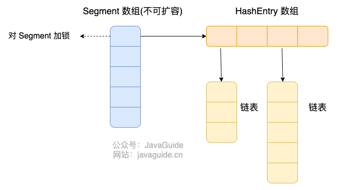

### 1.8

Node数组+链表/红黑树

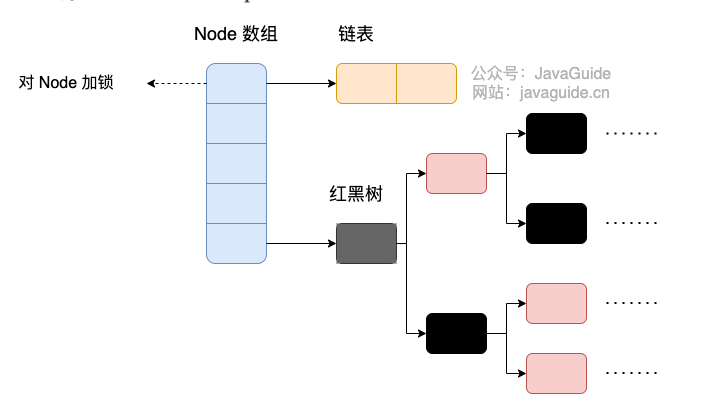

#### ConcurrentHashMap和HashTable的区别

- ConcurrentHashMap的底层结构是数组+链表/红黑树；HashTable是数组+链表
- ConcurrentHashMap1.8前使用分段锁实现线程安全，1.8开始，使用synchronized+cas实现线程安全；HashTable使用synchronized（同一把）实现线程安全

#### ConcurrentHashMap线程安全具体实现

1.8之前，分段锁，Segment继承了ReentrantLock，所以是一种可重入锁，put的时候直接调lock方法

```java
static class Segment<K,V> extends ReentrantLock implements Serializable {
}
```

Segment个数一旦初始化就不能改变，默认是16，也就是说同时支持16个线程并发写

读不加锁，HashEntry的value用volatile修饰

1.8之后，通过synchronized锁住当前的链表或红黑树的头节点，通过cas进行更新

同样读不加锁，Node的value用volatile修饰

#### 为什么ConcurrentHashMap的key和value不能为null，而HashMap可以

1. 在并发环境中不容许语意模糊，比如map.get(key) == null，无法判断是key不存在还是值为null，而在单线程时可以，HashMap允许一个key为null，放在Node[0]
2. 当val是null时，cas操作无法安全判断值是否未被修改

如果确实需要区分值为null和没有值，可以使用Optional，比如

```java
Map<String, Optional<String>> userNicknames = new HashMap<>();

// 用户 ID 为 "123"，有昵称但为空
userNicknames.put("123", Optional.of("Alice"));

// 用户 ID 为 "456"，明确表示没有昵称（不是值为 null，而是业务含义就是没有）
userNicknames.put("456", Optional.empty());

Optional<String> nicknameOpt = userNicknames.get("123");

if (nicknameOpt != null && nicknameOpt.isPresent()) {
    System.out.println("昵称是: " + nicknameOpt.get());
} else if (nicknameOpt != null) {
    System.out.println("用户没有昵称");
} else {
    System.out.println("用户不存在");
}
```


#### ConcurrentHashMap不能保证复合操作的原子性

ConcurrentHashMap可以保证单个操作的原子性，如put、get、remove、containsKey

但不能保证复合操作的原子性，比如，有两个线程想要插入元素

```java
// 线程 A
if (!map.containsKey(key)) {
map.put(key, value);
}
// 线程 B
if (!map.containsKey(key)) {
map.put(key, anotherValue);
}
/**
可能的执行顺序：
1、线程 A 判断 map 中不存在 key
2、线程 B 判断 map 中不存在 key
3、线程 B 将 (key, anotherValue) 插入 map
4、线程 A 将 (key, value) 插入 map
*/
```

预期结果是（key，anotherValue），但实际结果是(key, value)

**如何保证？**

```
// 线程 A
map.putIfAbsent(key, value);
// 线程 B
map.putIfAbsent(key, anotherValue);
// 或者
// 线程 A
map.computeIfAbsent(key, k -> value);
// 线程 B
map.computeIfAbsent(key, k -> anotherValue);
```

