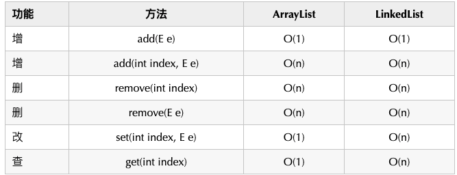

# HashMap

HashMap由数组和链表构成，在Java7是Entry数组，Java8是Node数组，都是存了key-value的结构。（俗称桶）

Java8之后，<font size=4 color="red">一个桶存储的链表长度大于等于 8 时会将链表转换为[红黑树](../算法/数据结构.md)</font>，红黑树的引入巧妙的将原本get方法O(n)的时间复杂度降低到了O(logn)。

节点插入链表的时候，<font size=4 color="green">Java8之前是头插法</font>，即新来的节点会取代原有的节点，原有的节点会顺推到链表中去。

<font size=4 color="green">Java8后，都是用尾插法</font>，因为防止扩容导致死循环。

## get方法


## put方法


## 扩容机制
### 什么时候resize

两个因素
- Capacity：HashMap当前长度
- LoadFactor：负载因子，默认值0.75f。

怎么理解呢，就比如当前的容量大小为100，当你存进第76个的时候，判断发现需要进行resize了，那就进行扩容，但是HashMap的扩容也不是简单的扩大点容量这么简单的。

### 扩容过程
- 扩容：创建一个新的Entry空数组，长度是原来的2倍。
- Rehash：遍历原Entry数组，把所有的Entry重新Hash到新数组。

### 为什么要重新Hash

因为长度扩大以后，Hash的规则也随之改变。

> Hash的公式---> index = HashCode（Key） & （Length - 1）

## 默认初始化长度

初始化大小是16


为啥用位运算，在创建HashMap的时候，阿里巴巴规范插件会提醒我们最好赋初值，而且最好是2的幂。这样是为了位运算的方便，<font size=4 color="green">位与运算比算数计算的效率高了很多</font>，之所以选择16，是为了服务将Key映射到index的算法。


## HashMap为什么不安全
[详情](https://mp.weixin.qq.com/s/VtIpj-uuxFj5Bf6TmTJMTw)
### jdk1.7中的HashMap
#### 1. 扩容造成死循环


在后续操作中只要涉及轮询hashmap的数据结构，就会在这里发生死循环，造成悲剧。

#### 2. 扩容造成数据丢失
跟前文提到的几乎一样
也是同一操作造成的问题。 


### jdk1.8中的HashMap
在jdk1.8中对HashMap进行了优化，在发生hash碰撞，不再采用头插法方式，而是直接插入链表尾部，因此不会出现环形链表的情况，但是在多线程的情况下仍然不安全。
#### put操作时会发生数据覆盖


# ConcurrentHashMap

<font size=4 color="green">注意，<kbd>HashMap</kbd> 允许插入键为 null 的键值对。但是因为无法调用 null 的 hashCode() 方法，也就无法确定该键值对的桶下标，只能通过强制指定一个桶下标来存放。HashMap 使用第 0 个桶存放键为 null 的键值对。但是<kbd>ConcurrentHashMap</kbd>不支持</font>

## 1.7
从结构上说，1.7版本的ConcurrentHashMap采用分段锁机制，里面包含一个Segment数组，Segment继承与ReentrantLock，Segment则包含HashEntry的数组，HashEntry本身就是一个链表的结构，具有保存key、value的能力能指向下一个节点的指针。

实际上就是相当于每个Segment都是一个HashMap，默认的Segment长度是16，也就是支持16个线程的并发写，Segment之间相互不会受到影响。

### put流程
其实发现整个流程和HashMap非常类似，只不过是先定位到具体的Segment，然后通过ReentrantLock去操作而已，后面的流程我就简化了，因为和HashMap基本上是一样的。

1. 计算hash，定位到segment，segment如果是空就先初始化
2. 使用ReentrantLock加锁，如果获取锁失败则尝试自旋，自旋超过次数就阻塞获取，保证一定获取锁成功
3. 遍历HashEntry，就是和HashMap一样，数组中key和hash一样就直接替换，不存在就再插入链表，链表同样

## 1.8
1.8抛弃分段锁，转为用CAS+synchronized来实现，同样HashEntry改为Node，也加入了红黑树的实现。主要还是看put的流程。
### put流程
1. 首先计算hash，遍历node数组，如果node是空的话，就通过CAS+自旋的方式初始化
2. 如果当前数组位置是空则直接通过CAS自旋写入数据
3. 如果hash==MOVED，说明需要扩容，执行扩容
4. 如果都不满足，就使用synchronized写入数据，写入数据同样判断链表、红黑树，链表写入和HashMap的方式一样，key hash一样就覆盖，反之就尾插法，链表长度超过8就转换成红黑树
   


# ArrayList
ArrayList就是数组列表，主要用来装载数据，当我们装载的是基本类型的数据int，long，boolean，short，byte…的时候我们只能存储他们对应的包装类，它的主要底层实现是数组Object[] elementData。

与它类似的是LinkedList，和LinkedList相比，它的查找和访问元素的速度较快，但新增，删除的速度较慢。

小结：ArrayList底层是用数组实现的存储。

特点：查询效率高，增删效率低，线程不安全。使用频率很高。

ArrayList可以通过构造方法在初始化的时候指定底层数组的大小。

通过无参构造方法的方式ArrayList()初始化，则赋值底层数Object[] elementData为一个默认空数组Object[] DEFAULTCAPACITY_EMPTY_ELEMENTDATA = {}所以数组容量为0，只有真正对数据进行添加add时，才分配<font size=4 color ="green">默认DEFAULT_CAPACITY = 10的初始容量</font>。


## 扩容
添加元素时使用 ensureCapacityInternal() 方法来保证容量足够，如果不够时，需要使用 grow() 方法进行扩容，新容量的大小为 ```oldCapacity + (oldCapacity >> 1)```，即 oldCapacity+oldCapacity/2。其中 oldCapacity >> 1 需要取整，所以新容量大约是旧容量的 1.5 倍左右。（oldCapacity 为偶数就是 1.5 倍，为奇数就是 1.5 倍-0.5）

扩容操作需要调用 ```Arrays.copyOf()``` 把原数组整个复制到新数组中，这个操作代价很高，因此最好在创建 ArrayList 对象时就指定大概的容量大小，减少扩容操作的次数。

```java
public boolean add(E e) {
    ensureCapacityInternal(size + 1);  // Increments modCount!!
    elementData[size++] = e;
    return true;
}

private void ensureCapacityInternal(int minCapacity) {
    if (elementData == DEFAULTCAPACITY_EMPTY_ELEMENTDATA) {
        minCapacity = Math.max(DEFAULT_CAPACITY, minCapacity);
    }
    ensureExplicitCapacity(minCapacity);
}

private void ensureExplicitCapacity(int minCapacity) {
    modCount++;
    // overflow-conscious code
    if (minCapacity - elementData.length > 0)
        grow(minCapacity);
}

private void grow(int minCapacity) {
    // overflow-conscious code
    int oldCapacity = elementData.length;
    int newCapacity = oldCapacity + (oldCapacity >> 1);
    if (newCapacity - minCapacity < 0)
        newCapacity = minCapacity;
    if (newCapacity - MAX_ARRAY_SIZE > 0)
        newCapacity = hugeCapacity(minCapacity);
    // minCapacity is usually close to size, so this is a win:
    elementData = Arrays.copyOf(elementData, newCapacity);
}
```


## ArrayList的遍历和LinkedList遍历性能比较如何？
论遍历ArrayList要比LinkedList快得多，ArrayList遍历最大的优势在于内存的连续性，CPU的内部缓存结构会缓存连续的内存片段，可以大幅降低读取内存的性能开销。

## ArrayList和LinkedList比较


1. 改查选择 ArrayList；
2. 增删在尾部的选择 ArrayList；
3. 其他情况下，如果时间复杂度一样，推荐选择 ArrayList，因为 overhead 更小，或者说内存使用更有效率。

### get时间复杂度有区别的原因
因为 ArrayList 是用数组来实现的，而数组和链表的最大区别就是数组是可以<font size=4 color="green">随机访问的（random access）</font>。

## ArrayList和Vector区别
1. Vector线程安全（通过synchronized）
2. ArrayList扩容是原来的1.5倍，Vector是原来的2倍