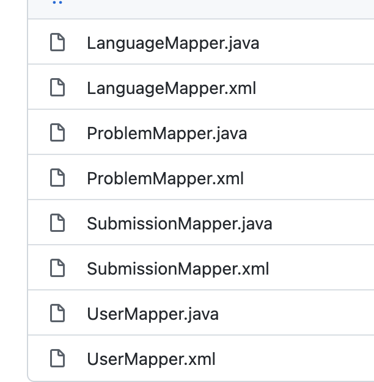
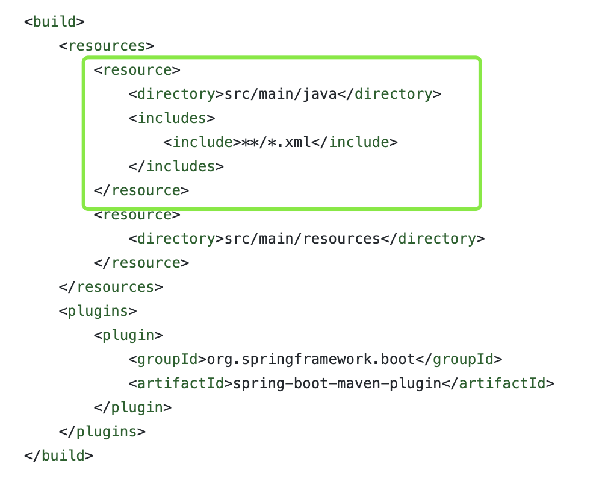
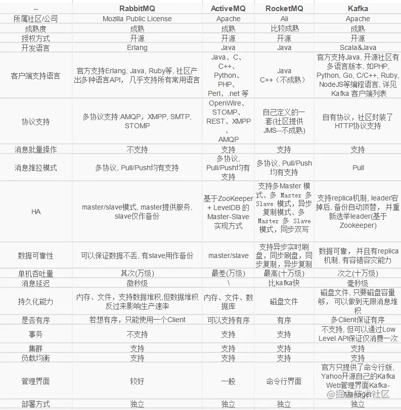

# 为什么要做这个项目
之前没有全栈开发的经验，不是做前端就是负责后端，没有试过自己独立去完成从构思到落地一个项目。同时想要通过做一个项目来学习一下springboot，而恰好之前在美国也经常刷lc，所以想自己实现属于自己的oj平台。
# 介绍
是一个仿leetcode写的网站，主要用到Springboot，mysql，activemq。
# 系统架构&主要流程
主要说一下后端，后端分为应用服务和判题服务，应用服务就是处理用户的request，判题服务专门处理判题。

用户在网页上编写代码，然后点击提交，后端收到提交请求后，会把提交信息包括：

```
- submission_id
- code
- date
- user_id
- language
- 使用内存（初始为0）
- 运行使用时间（初始为0）
- 通过率
```
持久化到mysql，存储到mysql成功的话，就会返回ok，让客户端跳转到提交列表页面，然后调用接口同步获取提交运行的结果（利用sseemitter作消息推送）。

同时将submission_id作为消息发送到mq（通过事务来保证消息发送不丢失，事务成功提交，则消息被自动签收，如果事务回滚，则消息会被再次传送）。

判题机服务作为消费者，收到消息后，首先通过redis判断是否消费过这个submission_id（防止重复消费），接着根据submission_id从数据库取到submission对象，将其中的code存到一个脚本文件（比如java的话就存储为java文件），然后通过java的runtime（可以执行系统命令）执行相对应脚本文件，调用从网上找的一个脚本获取运行时间和内存。

判题过程就是一个for循环，遍历testcase，通过对testcase的答案和脚本运行结果比较，得到通过率，然后更新到mysql。

最后得到结果会通过sseemitter返回给客户端，完成一次提交操作。


# 遇到的问题
## 一
一直报错说找不到我的xml文件，后来发现是因为在maven工程中，xml文件建议写在resources目录下，但是我是直接写在包下的，maven在运行的时候会自动忽略，因此在pom.xml文件中重新指明资源文件配置<include>**/*.xml</include> 



## 二
如何获取运行时间和内存的问题。

解决办法是在网上找到一个python的脚本，在脚本中调用运行提交代码的方法，如何在判题服务中调用这个脚本。

## 三（还没解决）
安全问题，有可能用户会输入一些恶意代码，如果我不加鉴别，直接把提交的代码保存并运行，有可能损害本地机器。

# mq比较


## ActiveMq
activemq是推模式的

我们来想一下推模式有什么好处？

<font size=4 color="green">消息实时性高</font>， Broker 接受完消息之后可以立马推送给 Consumer。

<font size=4 color="green">对于消费者使用来说更简单</font>，简单啊就等着，反正有消息来了就会推过来。

推模式有什么缺点？

<font size=4 color="green">推送速率难以适应消费速率</font>，推模式的目标就是以最快的速度推送消息，当生产者往 Broker 发送消息的速率大于消费者消费消息的速率时，随着时间的增长消费者那边可能就“爆仓”了，因为根本消费不过来啊。当推送速率过快就像 DDos 攻击一样消费者就傻了。

并且不同的消费者的消费速率还不一样，身为 Broker 很难平衡每个消费者的推送速率，如果要实现自适应的推送速率那就需要在推送的时候消费者告诉 Broker ，我不行了你推慢点吧，然后 Broker 需要维护每个消费者的状态进行推送速率的变更。

这其实就增加了 Broker 自身的复杂度。

所以说推模式难以根据消费者的状态控制推送速率，适用于<font size=4 color="green">消息量不大、消费能力强要求实时性高的情况下</font>。
所以在GCode中会限定用户连续提交的频率不能太高。

## Rocketmq
rocketmq是拉模式。

拉模式指的是 Consumer 主动向 Broker 请求拉取消息，即 Broker 被动的发送消息给 Consumer。

我们来想一下拉模式有什么好处？

拉模式主动权就在消费者身上了，消费者可以根据自身的情况来发起拉取消息的请求。假设当前消费者觉得自己消费不过来了，它可以根据一定的策略停止拉取，或者间隔拉取都行。

拉模式下 Broker 就相对轻松了，它只管存生产者发来的消息，至于消费的时候自然由消费者主动发起，来一个请求就给它消息呗，从哪开始拿消息，拿多少消费者都告诉它，它就是一个没有感情的工具人，消费者要是没来取也不关它的事。

<font size=4 color="green">拉模式可以更合适的进行消息的批量发送</font>，基于推模式可以来一个消息就推送，也可以缓存一些消息之后再推送，但是推送的时候其实不知道消费者到底能不能一次性处理这么多消息。而拉模式就更加合理，它可以参考消费者请求的信息来决定缓存多少消息之后批量发送。

<font size=4 color="green">拉模式有什么缺点？</font>

<font size=4 color="green">消息延迟</font>，毕竟是消费者去拉取消息，但是消费者怎么知道消息到了呢？所以它只能不断地拉取，但是又不能很频繁地请求，太频繁了就变成消费者在攻击 Broker 了。因此需要降低请求的频率，比如隔个 2 秒请求一次，你看着消息就很有可能延迟 2 秒了。

<font size=4 color="green">消息忙请求</font>，忙请求就是比如消息隔了几个小时才有，那么在几个小时之内消费者的请求都是无效的，在做无用功。

<font size=4 color="green">长轮询</font>

RocketMQ 和 Kafka 都是利用“长轮询”来实现拉模式