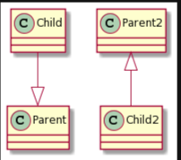
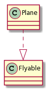
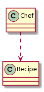
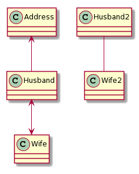
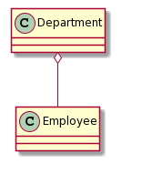

泛化

泛化关系就是类的继承，java 中对应 `extends` 关键字

```java
@startuml
Child --|> Parent
@enduml
```



实现

实现关系，对应 `implements` 关键字

```
@startuml
Plane ..|> Flyable
@enduml
```



依赖

某个类依赖另一个类

```
@startuml
Chef ..> Recipe
@enduml

class Chef {
    public void cook(Recipe recipe) {  // 参数依赖
        
    }
}
```



关联

某个类的成员变量引用另一个类

```
@startuml
Address <-- Husband
Husband <--> Wife
Husband2 -- Wife2
@enduml
```



聚合

聚合关系相对于组合弱一些，整体与部分是可分离的。 比如部门与员工，部门有许多员工，员工离职了部门仍然存在，不受影响。即某个类引用另一个类，另一个类可以单独存在，不依赖于整体

```
@startuml
Department o-- Employee
@enduml
```



组合

组合关系中，整体与部分是不可分离的，整体与部分的生命周期保持一致，少了对方自己的存在无意义

```
@startuml
Body "1" *-- "2" Arm
Body "1" *-- "2" Leg
@enduml
```

