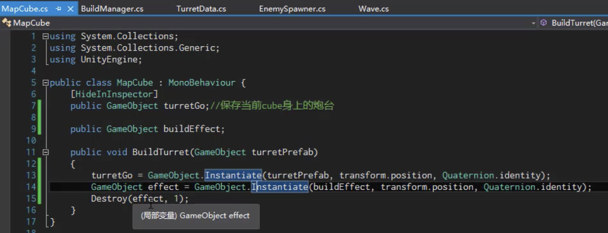
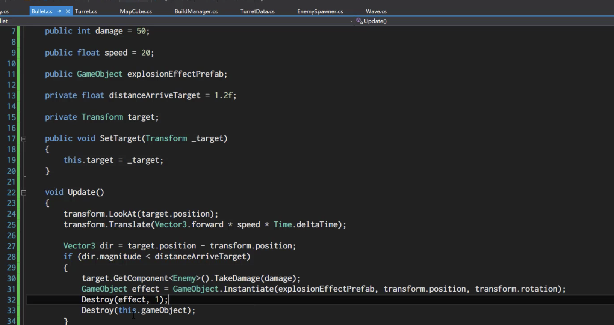

# 介绍
扫雷+塔防的游戏：玩家可以把地图方块反转，当前的方块有可放置炮台和不可放置以及升级炮台三种状态（放置时可以暂停，玩家可以自己决定升不升级），敌人每一轮的速度会递增，放置炮台会消耗相应的金钱，炮台分三种，对应不同的价格（厉害的贵一点）升级炮塔需要花费金钱，目标是在敌人到达终点前消灭它们，到下一关。

# 我的工作
1. 搭建场景，利用mapcube创建方块（创建一个空物体（object)即是我们的环境，然后把多个mapcube放在这个object下）
2. 创建炮塔：创建六个prefab（类似于模板）三个类型的炮塔和对应的升级版、用canvas创建选择炮台的ui（用一个tooglegroup）
创建炮台prefab：导入炮台素材（在unity素材商店获取）

3. 监听炮塔的选择，创建一个manager来控制，注册三个按钮的onvaluechange事件，然后更新manager的selected的炮台 
4. 设置mapcube的layer，限定只有它可以被点击 （同时注意当选择ui和地图重合时，不作反应），mapcube还要判断当前位有没炮塔
5. 判断哪个mapcube被点击了，用射线检测（因为cube之间有一定的空隙，不一定能碰撞上）然后得到这个cube
6. 
7. 用animation创建没钱的动画
8. 利用粒子系统（particle system） 创建建造炮塔的特效（泥土飞扬），mapcube要持有这个特效的引用 
9. 
10. 为炮塔添加攻击范围，添加sphere collider组件。给敌人添加tag，当判断到进入范围的collider的tag是敌人，就攻击。通过layer设置只有敌人层和炮塔层产生碰撞（提高性能）。在炮塔的prefab下创建一个炮弹生成的位置和炮弹
11. 设定攻击频率
12. 
13. 实现子弹跟随敌人，利用transform.lookat
14. 
15. 
16. （本来）子弹和敌人的碰撞处理：在sphere collider设置trigger，触发检测，调用敌人的掉血方法，创建攻击特效，销毁子弹本身
17. 
18. 但是失败了，于是直接在update里，通过计算敌人到子弹的距离来实现销毁,(最后记得销毁特效和子弹）
19. 
20. 炮塔转向
21. 

# bug
## 现象
如果炮台放在靠近终点，有时敌人到达终点后，子弹会停在空中
## 原因
 如果炮塔放置在离终点比较近的时候，因为我设置的是敌人离开炮塔的范围的时候就会从炮台的list移除，但是当敌人到达终点的时候会直接销毁，就不会触发到炮塔将list的第一个元素移除的方法，子弹就会一直攻击list的第一个敌人，导致报空指针异常

## 解决
在update方法里增添一个判断判断target是否为空，空的话直接销毁子弹。

同时敌人销毁后，要更新炮台中的敌人list
