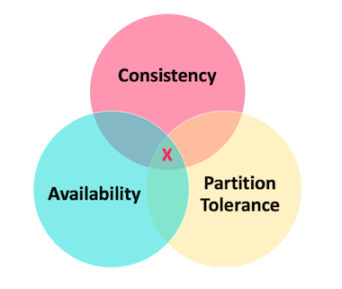
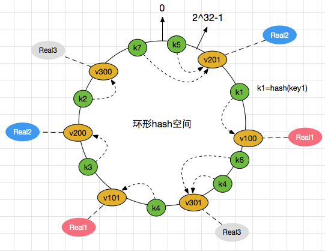
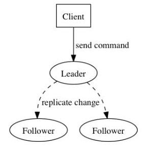
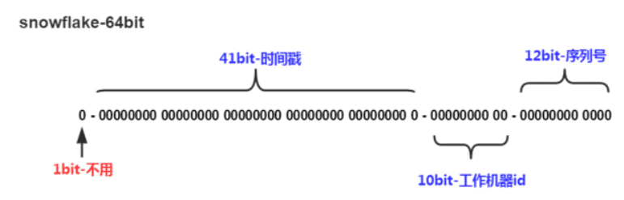
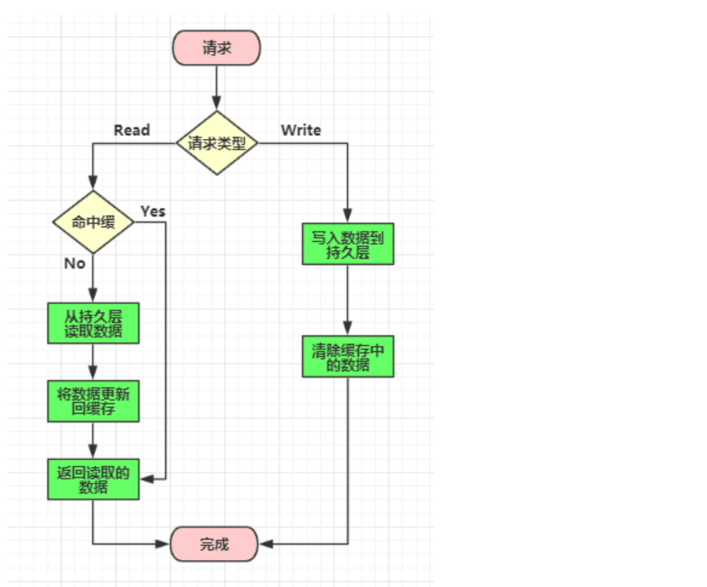
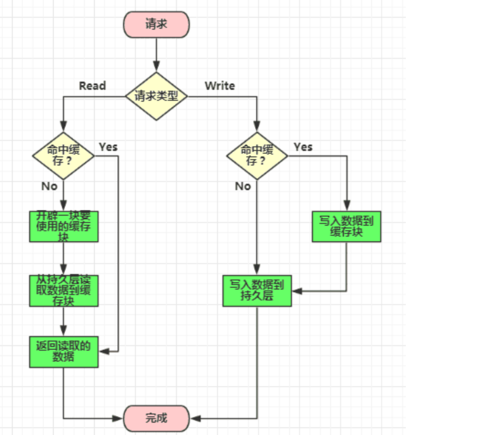

# CAP&BASE理论

## CAP理论



- **一致性（Consistency）** : 所有节点访问同一份最新的数据副本，比如节点A有新增数据，节点B也要和节点A同步，保持数据一致
- **可用性（Availability）**: 非故障的节点在合理的时间内返回合理的响应（不是错误或者超时的响应）
- **分区容错性（Partition Tolerance）** : 分布式系统出现网络分区的时候，仍然能够对外提供服务

**什么是网络分区**

分布式系统中，多个节点之间的网络本来是连通的，但是因为某些故障（比如部分节点网络出了问题）某些节点之间不连通了，整个网络就分成了几块区域，这就叫 **网络分区**。（即节点A和节点B因为网络原因断连了）

**分布式系统理论上不可能选择 CA 架构，只能选择 CP 或者 AP 架构。** 比如 ZooKeeper、HBase 就是 CP 架构，Cassandra、Eureka 就是 AP 架构，Nacos 不仅支持 CP 架构也支持 AP 架构。CAP 理论中分区容错性 P 是一定要满足的，在此基础上，只能满足可用性 A 或者一致性 C。

> 比如节点A和节点B构成一个分布式系统，假如出现网络分区，即A和B断网，无法通信。
>
> 假如选择保持C，一致性
>
> 节点A接收到请求，但无法同步给B，为了保证一致性，节点A只能拒绝请求（否则会造成不一致），即为了一致性，放弃了可用性
>
> 假如选择保持A，可用性
>
> 节点A收到请求，直接写入成功，B此时也对外提供服务，但由于网络不通，节点A和B数据不一致。比如用户在节点A下单，显式成功，但是访问节点B查询订单，返回为空。为了保证可用性，放弃了一致性


## BASE 理论

**BASE** 是 **Basically Available（基本可用）**、**Soft-state（软状态）** 和 **Eventually Consistent（最终一致性）**

**BASE 理论本质上是对 CAP 的延伸和补充，更具体地说，是对 CAP 中 AP 方案的一个补充**

### 实现最终一致性的具体方式

- **读时修复** : 在读取数据时，检测数据的不一致，进行修复。比如 Cassandra 的 Read Repair 实现，具体来说，在向 Cassandra 系统查询数据的时候，如果检测到不同节点的副本数据不一致，系统就自动修复数据。

- **写时修复** : 在写入数据，检测数据的不一致时，进行修复。比如 Cassandra 的 Hinted Handoff 实现。具体来说，Cassandra 集群的节点之间远程写数据的时候，如果写失败 就将数据缓存下来，然后定时重传，修复数据的不一致性。

- **异步修复** : 这个是最常用的方式，通过定时对账检测副本数据的一致性，并修复

比较推荐 **写时修复**，这种方式对性能消耗比较低


# 一致性算法

## 一致性哈希算法

构建一个0~2^32的哈希环，将每个节点的名字进行hash，然后投影到环上，当要写入数据时，对数据的key哈希计算后，放入环中，根据顺时针找离该hash(key)值最近的节点（即查找大于该值的最近的节点）

> 一致性哈希使用 **2³² 哈希空间**，是因为大多数 hash 函数（如 CRC32、MurmurHash）返回 32 位整数，值域刚好是 `0 ~ 2³² - 1`，形成一个闭环可以模拟哈希环。这个大小既高效又足够均匀分布 key 和节点。

为了避免 key 过于集中在某个节点（比如 key hash > 所有节点时回绕到 A），我们使用虚拟节点技术，将每个真实节点均匀散布在哈希环上多个位置

可以使用TreeMap<Integer, Node>实现这个哈希环

```java
private static final TreeMap<Integer, String> hashRing = new TreeMap<>();
private static String getNodeForHash(int keyHash) {
    SortedMap<Integer, String> tailMap = hashRing.tailMap(keyHash);
    int nodeHash = tailMap.isEmpty() ? hashRing.firstKey() : tailMap.firstKey();
    return hashRing.get(nodeHash);
}
```



### 一致性哈希目的

主要是为了在分布式系统中，节点动态变化时（增删节点），尽可能少地迁移已有的 Key。“一致性”指的是：**在节点变化（增/删）后，尽量保持大多数 key 的映射关系不变**

**传统哈希取模**

```
int index = hash(key) % N;  // N 是节点数
```

但是，当添加/删除节点时，节点总数N改变，导致几乎所有key的分配都会变化，引发大量数据迁移，影响系统稳定性和可用性

**使用一致性哈希**

- 新增节点：只影响该新增节点顺时针前一个节点区域的部分key
- 删除节点：只影响落在该删除节点原本负责的区间内的key

不再是全量迁移，而是局部调整

## Paxos算法

在一个分布式系统中，多个节点要共同决定一个值（比如某条日志、一个配置项、选主），但节点之间可能通信延迟、丢包、宕机；paxos要解决的，就是在可能出现失败和网络分区的前提下，安全地达成一次共识

Paxos将系统中的角色分为`提议者 (Proposer)`，`决策者 (Acceptor)`，和`最终决策学习者 (Learner)`

- `Proposer`: 提出提案 (Proposal)。Proposal信息包括提案编号 (Proposal ID) 和提议的值 (Value)。

- `Acceptor`: 参与决策，回应Proposers的提案。收到Proposal后可以接受提案，若Proposal获得多数Acceptors的接受，则称该Proposal被批准。

- `Learner`: 不参与决策，从Proposers/Acceptors学习最新达成一致的提案(Value)

**过程**

1. **第一阶段: Prepare阶段**Proposer向Acceptors发出Prepare请求，Acceptors针对收到的Prepare请求进行Promise承诺
    1. `Prepare`: Proposer生成全局唯一且递增的Proposal ID (可使用时间戳加Server ID)，向所有Acceptors发送Prepare请求，这里无需携带提案内容，只携带Proposal ID即可
    2. `Promise`: Acceptors收到Prepare请求后，做出“两个承诺，一个应答”
        1. 承诺1: 不再接受Proposal ID小于等于(注意: 这里是<= )当前请求的Prepare请求
        2. 承诺2: 不再接受Proposal ID小于(注意: 这里是< )当前请求的Propose请求
        3. 应答: 不违背以前作出的承诺下，回复已经Accept过的提案中Proposal ID最大的那个提案的Value和Proposal ID，没有则返回空值
2. **第二阶段: Accept阶段**：Proposer收到多数Acceptors承诺的Promise后，向Acceptors发出Propose请求，Acceptors针对收到的Propose请求进行Accept处理
    1. `Propose`: Proposer 收到多数Acceptors的Promise应答后，从应答中选择Proposal ID最大的提案的Value，作为本次要发起的提案。如果所有应答的提案Value均为空值，则可以自己随意决定提案Value。然后携带当前Proposal ID，向所有Acceptors发送Propose请求
    2. `Accept`: Acceptor收到Propose请求后，在不违背自己之前作出的承诺下，接受并持久化当前Proposal ID和提案Value
3. **第三阶段: Learn阶段：**Proposer在收到多数Acceptors的Accept之后，标志着本次Accept成功，决议形成，将形成的决议发送给所有Learners

举例

```
有 3 个 Acceptor：A1、A2、A3
有 2 个 Proposer：P1、P2

每个 Proposer 想让自己当主（提议的值就是自己的节点 ID）

#初始状态
所有 Acceptor 当前都没承诺过任何提案
Paxos 最小投票多数是 ⌊N/2⌋+1 = 2

P1 发出 Prepare(#1, 值=P1)
向 A1、A2、A3 发送 Prepare(#1)

所有 Acceptor 都没承诺过编号 >1 的提案，于是都回复 OK

P1 获得多数回复，进入 Accept 阶段

向 A1、A2、A3 发送 Accept(#1, 值=P1)
A1 和 A2 同意并保存值=P1，P1 被接受

P2 同时也发出 Prepare(#2, 值=P2)
向 A1、A2、A3 发 Prepare(#2)

A1 和 A2 已经承诺过 #1 的 Accept，收到 #2 后仍然会返回：
OK（因为 2 > 1），但我之前接受过的值是 P1

所以 P2 收到多数回复时，会发现：
有 Acceptor 曾经接受过 P1

Paxos 协议规定：必须提案之前已被接受过的值（P1）
于是，P2 虽然原本想提 P2，但现在只能提议 P1

#最终一致性
P1 提出 P1，被多数 Acceptor 接受

P2 后来提出 P2，但由于有节点已经接受了 P1，所以它也只能提 P1

所有 Acceptors 的值最终一致为 P1
```


## Raft算法

Raft将系统中的角色分为`领导者(Leader)`、`跟从者(Follower)`和`候选人(Candidate)`

1. `Leader`: 接受客户端请求，并向Follower同步请求日志，当日志同步到大多数节点上后告诉Follower提交日志
2. `Follower`: 接受并持久化Leader同步的日志，在Leader告之日志可以提交之后，提交日志
3. `Candidate`: Leader选举过程中的临时角色



Raft要求系统在任意时刻最多只有一个Leader，正常工作期间只有Leader和Followers

**选举过程**

- 初始时，所有节点都是Follower，都在等待接收 Leader 的心跳
- 每个 Follower 设置一个**随机的选举超时时间**（比如 150ms ~ 300ms 之间）
- 如果在这段时间内**没收到 Leader 的心跳**，它就会将其当前term加一然后转换为Candidate，首先给自己投票并且给集群中的其他服务器发送 RequestVote RPC
- 其他节点判断是否同意Candidate为Leader
    - 当前 term 还没投过票（只能投一次），如果已经投给其他人了，就拒绝当前请求
    - 请求者的日志要“至少不比自己旧”（日志指“客户端请求操作的指令序列（命令日志）”**，由 Leader 接收并复制到所有 Follower 上，以实现整个集群状态的一致性。）
        - 比较：
            - 候选者的 **最后一条日志的 term**
            - 如果 term 相同，再比较 **index**
        - 如果候选者的日志比当前节点旧，就拒绝投票
- Candidate有三种情况的结果
    - 赢得了多数的选票，成功选举为Leader
    - 收到了Leader的消息，表示有其它服务器已经抢先当选了Leader
    - 没有服务器赢得多数的选票，Leader选举失败，等待选举时间超时后发起下一次选举
- 选举出Leader后，Leader通过定期向所有Followers发送心跳信息维持其统治。若Follower一段时间未收到Leader的心跳则认为Leader可能已经挂了，再次发起Leader选举过程

### 怎么防止脑裂

**由于网络分区或故障，集群中出现多个节点同时认为自己是主节点（Leader）**，导致系统出现不一致甚至数据损坏

- **多数派投票机制（Quorum）** ：最常用，
    - 任意一个节点成为 Leader **必须得到多数派支持**
    - 网络分区后，**少数派无法选主**
- 单点仲裁机制（Single Arbiter）：当节点数量很少，无法组成多数派（如仅有两个节点）时，引入一个 **仲裁节点（Quorum Witness / Arbitrator）**，两个节点和仲裁节点进行投票，形成多数裁决
- Lease + 心跳监控：主节点定期发送心跳（延长租约lease），只有 Lease 未过期的节点才可视为主


> 假设你要设计一个分布式选主 + 日志同步系统：
>
> - 用 **Paxos**：你得先实现选主、再扩展成 Multi-Paxos 来同步日志，还要处理提案冲突、值恢复、leader lease 等复杂边界。
> - 用 **Raft**：直接内置选主、心跳、日志同步、日志提交机制，带状态机复制，功能齐全，文档还写得很好（Raft 论文 = 教程）。
>
> > 所以现代项目大多选用 **Raft** 而非 Paxos。


# 全局唯一ID

## 数据库方式实现

### 使用mysql实现

在每个数据库节点的my.cnf设置auto_increment_increment（步长1~65535，等于分库的数量，比如分了3个库，步长为3）和auto_increment_offset（起始编号1~65535），保证ID自增且不重复

缺点：强依赖DB，DB异常时整个系统不可用，主从切换时的不一致可能会导致重复发号，**ID发号性能瓶颈限制在单台MySQL的读写性能**

### 使用redis实现

使用INCR或INCRBY自增原子命令

但是单机存在性能瓶颈，所以一般使用redis集群，每个节点都是一个id生成器，所以也会遇到和mysql一样的问题，需要设置分段和步长

例如有3个redis节点

```shell
# 例如：节点 A 起始值设置为 1
SET uid:{A} 1

# 节点 B 起始值设置为 2
SET uid:{B} 2

# 节点 C 起始值设置为 3
SET uid:{C} 3
# Redis Cluster 通过 {} 中的内容计算哈希槽，以上方式可以让每个key落在不同的槽上
```

然后通过以下方式获取id

```
Long id = jedis.incrBy(uid:{A}, 300); # 得到id为1 ~ 301，本地使用 [1, 4, 7, ..., 298] 分发id
```

## 雪花算法

将 64-bit位分割成多个部分，每个部分代表不同的含义。而 Java中64bit的整数是Long类型，所以在 Java 中 SnowFlake 算法生成的 ID 就是 long 来存储的

- **第1位**占用1bit，其值始终是0，可看做是符号位不使用
- **第2位**开始的41位是时间戳，41-bit位可表示2^41个数，每个数代表毫秒，那么雪花算法可用的时间年限是`(1L<<41)/(1000L360024*365)`=69 年的时间
- **中间的10-bit位**可表示机器数，即2^10 = 1024台机器，但是一般情况下我们不会部署这么台机器。如果我们对IDC（互联网数据中心）有需求，还可以将 10-bit 分 5-bit 给 IDC，分5-bit给工作机器。这样就可以表示32个IDC，每个IDC下可以有32台机器，具体的划分可以根据自身需求定义
- **最后12-bit位**是自增序列（从0开始），可表示2^12 = 4096个数

这样的划分之后相当于**在一毫秒一个数据中心的一台机器上可产生4096个有序的不重复的ID**。但是我们 IDC 和机器数肯定不止一个，所以毫秒内能生成的有序ID数是翻倍的。



### 雪花算法的问题与解决

#### 问题

- 时钟回拨问题：雪花算法的 ID 中包含了 **时间戳字段**，如果服务器的系统时间出现回拨（即时间被调小了），那就可能出现
    - 当前生成的时间戳小于上一次生成 ID 的时间戳
    - 导致生成的 ID **与之前生成的 ID 重复或无序**
- 趋势递增，而不是绝对递增：
    - 不同节点的时间戳是一样的
    - 在同一毫秒内生成多个 ID，会使用 **序列号（sequence）** 来区分
    - 多节点并发时可能顺序乱（比如先返回的是 B 节点生成的 ID），比如
        - A 节点生成：时间戳=1000，序列号=1 ⇒ ID=10001
        - B 节点生成：时间戳=1000，序列号=2 ⇒ ID=10002
        - 网络调度或并发处理下，先拿到 ID=10002，后拿到 ID=10001
- 不能在同一台机器部署多个发号器实例（即提供分布式id的服务）
    - 因为一个id格式是41位时间戳+10位机器id+12位序列号
    - 同一台物理机器上运行多个发号服务实例，如果 **没有设置不同的机器ID**，那么它们会生成 **完全相同的 ID 序列**
        - 实例 A：机器ID = 1，时间戳 = 1000，序列号 = 1 → ID = X
        - 实例 B：同样的配置，生成的 ID 也是 X ⇒ **重复冲突！**

#### 解决

- 时钟回拨：UidGenerator 使用了 **时间回拨保护机制**，分两种情况处理：
    - 小量回拨（比如几毫秒）：系统会阻塞等待时钟 catch-up 回来（Sleep），**不发号，避免重复**
    - 大量回拨（如几十秒）：系统会直接抛出异常，并打印警告日志，提示人工介入
- 趋势递增：优化ID格式，增量**秒数**（28位）+机器号（22位）+序列号（13位），递增更平滑稳定
- 多实例冲突：实例启动时自动往数据库注册节点，返回唯一且自增的workerId

## 为什么不使用UUID

- UUID 太长（通常是 128 位），不利于存储和传输
- UUID 是随机生成的，无法排序


# 分布式锁

## 基于数据库实现分布式锁

### 基于数据库表

```sql
CREATE TABLE database_lock (
	`id` BIGINT NOT NULL AUTO_INCREMENT,
	`resource` int NOT NULL COMMENT '锁定的资源',
	`description` varchar(1024) NOT NULL DEFAULT "" COMMENT '描述',
	PRIMARY KEY (id),
	UNIQUE KEY uiq_idx_resource (resource) # 创建一个唯一索引
) ENGINE=InnoDB DEFAULT CHARSET=utf8mb4 COMMENT='数据库分布式锁表';

```

当想要获取锁时，可以插入一条数据，唯一索引保证了只有一个线程能插入成功

```sql
INSERT INTO database_lock(resource, description) VALUES (1, 'lock');
```

当需要释放锁时，可以删除这条数据

```sql
DELETE FROM database_lock WHERE resource=1;
```

### 基于悲观锁

要使用悲观锁，我们必须关闭mysql数据库的自动提交属性`set autocommit=0;`，因为MySQL默认使用autocommit模式，也就是说，当你执行一个更新操作（select... for update）后，MySQL会立刻将结果进行提交

```sql
//0.开始事务
begin;/begin work;/start transaction; (三者选一就可以)
//1.查询出商品信息
select status from t_goods where id=1 for update;
//2.根据商品信息生成订单
insert into t_orders (id,goods_id) values (null,1);
//3.修改商品status为2
update t_goods set status=2;
//4.提交事务
commit;/commit work;
```

上面的查询语句中，我们使用了`select…for update`的方式，这样就通过开启排他锁的方式实现了悲观锁。此时在t_goods表中，id为1的 那条数据就被我们锁定了，其它的事务必须等本次事务提交之后才能执行。这样我们可以保证当前的数据不会被其它事务修改。

上面我们提到，使用`select…for update`会把数据给锁住，不过我们需要注意一些锁的级别，MySQL InnoDB默认行级锁。行级锁都是基于索引的，如果一条SQL语句用不到索引是不会使用行级锁的，会使用表级锁把整张表锁住，这点需要注意。

### 基于乐观锁

使用版本号实现乐观锁

使用版本号时，可以在数据初始化时指定一个版本号，每次对数据的更新操作都对版本号执行+1操作。并判断当前版本号是不是该数据的最新的版本号。只有version还是刚开始查到的version时，才会更新成功，如果更新成功，说明获取锁成功

```
1.查询出商品信息
select (status,version) from t_goods where id=#{id}
2.根据商品信息生成订单
3.修改商品status为2
update t_goods 
set status=2,version=version+1
where id=#{id} and version=#{version};
```

这个方式有局限性：乐观锁如果只在应用层实现，而数据库允许外部系统绕过逻辑直接修改表，那就失去了并发控制效果，容易导致脏写（即新写覆盖旧写导致数据丢失）。推荐的做法是：把带有乐观锁逻辑的操作**写到数据库的存储过程（stored procedure）里**，所有外部系统如果要更新数据，**必须调用这个存储过程**

### 缺陷

对数据库依赖，开销问题，行锁变表锁问题，无法解决数据库单点和可重入（同一个线程/节点是否能在已经持有锁的情况下再次获得锁而不阻塞）的问题

## Redis实现分布式锁

### 最基本的Jedis方案

**加锁**： set NX PX + 重试 + 重试间隔

向Redis发起如下命令: `SET productId:lock 0xx9p03001 NX PX 30000` 其中，"productId"由自己定义，可以是与本次业务有关的id，"0xx9p03001"是一串随机值，必须保证全局唯一(否则解锁时会误删别人的锁)，“NX"指的是当且仅当key(也就是案例中的"productId:lock”)在Redis中不存在时，返回执行成功，否则执行失败。"PX 30000"指的是在30秒后，key将被自动删除。执行命令后返回成功，表明服务成功的获得了锁。

```java
@Override
public boolean lock(String key, long expire, int retryTimes, long retryDuration) {
    // use JedisCommands instead of setIfAbsense
    boolean result = setRedis(key, expire);

    // retry if needed
    while ((!result) && retryTimes-- > 0) {
        try {
            log.debug("lock failed, retrying..." + retryTimes);
            Thread.sleep(retryDuration);
        } catch (Exception e) {
            return false;
        }

        // use JedisCommands instead of setIfAbsense
        result = setRedis(key, expire);
    }
    return result;
}

private boolean setRedis(String key, long expire) {
    try {
        RedisCallback<String> redisCallback = connection -> {
            JedisCommands commands = (JedisCommands) connection.getNativeConnection();
            String uuid = SnowIDUtil.uniqueStr();
            lockFlag.set(uuid);
            return commands.set(key, uuid, NX, PX, expire); // 看这里
        };
        String result = redisTemplate.execute(redisCallback);
        return !StringUtil.isEmpty(result);
    } catch (Exception e) {
        log.error("set redis occurred an exception", e);
    }
    return false;
}
```

**解锁**： 采用lua脚本： 在删除key之前，一定要判断服务A持有的value与Redis内存储的value是否一致。如果贸然使用服务A持有的key来删除锁，则会误将服务B的锁释放掉

```lua
if redis.call("get", KEYS[1])==ARGV[1] then
	return redis.call("del", KEYS[1])
else
	return 0
end
```

比如，如果服务 A 拿到锁（服务A加锁：SET lock_key "A" NX PX 10000）之后执行比较慢，锁已经 **过期被自动删除**，然后此时服务 B 又抢到了锁（服务B加锁：SET lock_key "B" NX PX 10000），结果服务 A 代码结束时，还以为自己持有锁，于是执行DEL lock_key，这会误删服务B的锁，导致并发安全问题。

### Redis实现可重入锁

加锁：

- `KEYS[1]`：锁的 key

- `ARGV[1]`：客户端唯一标识，如 UUID + threadId

- `ARGV[2]`：过期时间（毫秒

```lua
if redis.call("exists", KEYS[1]) == 0 then
    -- 锁不存在，设置锁，设置客户端标识和重入次数为 1
    redis.call("hset", KEYS[1], "clientId", ARGV[1])
    redis.call("hset", KEYS[1], "count", 1)
    redis.call("pexpire", KEYS[1], ARGV[2])
    return 1
end

if redis.call("hget", KEYS[1], "clientId") == ARGV[1] then
    -- 已持有锁，重入次数 +1
    redis.call("hincrby", KEYS[1], "count", 1)
    redis.call("pexpire", KEYS[1], ARGV[2])
    return 1
end

-- 锁已被其他客户端持有，失败
return 0
```

解锁

```lua
if redis.call("hget", KEYS[1], "clientId") == ARGV[1] then
    local count = tonumber(redis.call("hincrby", KEYS[1], "count", -1))
    if count == 0 then
        return redis.call("del", KEYS[1])
    else
        return 0
    end
end
return -1  -- 不是持有者，不能释放
```


### 基于Redlock

目的是提升分布式锁的**安全性和可用性**

1. **客户端生成一个全局唯一的锁标识**（UUID 或 Snowflake ID）
2. **依次尝试在 N 个 Redis 实例上加锁**（例如 5 个），使用相同的 key 和唯一值，带过期时间（如 PX=30000 毫秒）
3. 如果能在**大多数节点（比如 5 个中至少 3 个）成功加锁**，并且**总耗时小于锁的过期时间**，认为加锁成功。
4. 如果加锁失败或超时，要在所有已加锁的 Redis 实例上执行解锁（删除键）。
5. 解锁时也要校验 value 是否一致**（防止误删别的客户端的锁），一般通过 Lua 脚本。

RedLock 不适用于 Redis Cluster，**Redis 集群中的节点**是**分片的、协同工作的整体**，每个节点只负责一部分槽（slot），**并不独立**；而 **RedLock 要求的 Redis 实例**必须是**彼此独立、不共享槽、不复制、不协调的多个 Redis 实例**

### 基于Redisson

```java
RLock lock = redissonClient.getLock("myLock");
// 尝试加锁（最多等待 10 秒，加锁成功后 30 秒自动释放）
boolean success = lock.tryLock(10, 30, TimeUnit.SECONDS);
```

Redisson 内部会做的第一件事就是

执行 Lua 脚本，尝试在 Redis 中设置锁（set NX PX）

- 设置的 value 是 `UUID + ThreadId`，用于识别当前线程

- 如果设置成功（返回值为 1）：

    - 表示你获取到了锁

    - Redisson 会启动一个 **看门狗定时续租线程**（如果你没指定 `leaseTime`），即一个后台线程，会每隔10秒检查一下，如果客户端A还持有锁key，那么就会不断的延长锁key的生存时间

第二步：获取失败时自动订阅锁释放通知

如果执行 Lua 脚本返回 0（锁已存在）

- Redisson 会 **订阅该锁的释放事件**（Redis 发布/订阅机制）

- 等待锁被释放时收到通知，再**再次尝试获取锁**

- 如果超时（比如例子中是10s）仍未成功，则返回 `false`

### 方案比较

1. 借助Redis实现分布式锁时，有一个共同的缺陷: 当获取锁被决绝后，需要不断的循环，重新发送获取锁(创建key)的请求，直到请求成功。这就造成空转，浪费宝贵的CPU资源。
2. RedLock算法本身有争议，并不能保证健壮性。
3. Redisson实现分布式锁时，除了将key新增到某个指定的master节点外，还需要由master自动异步的将key和value等数据同步至绑定的slave节点上。那么问题来了，如果master没来得及同步数据，突然发生宕机，那么通过故障转移和主备切换，slave节点被迅速升级为master节点，新的客户端加锁成功，旧的客户端的watch dog发现key存在，误以为旧客户端仍然持有这把锁，这就导致同时存在多个客户端持有同名锁的问题了。

## 基于Zookeeper

1. **创建一个锁目录**，比如 `/locks`，用来存放锁节点。

2. **客户端请求锁时，在 `/locks` 下创建一个临时顺序节点**，比如 `/locks/lock-0000000001`。

3. ZooKeeper 会给每个顺序节点自动分配一个递增的序号，序号最小的客户端获得锁。

4. 客户端判断自己创建的节点是否是序号最小的：

    - 是：获得锁，执行业务逻辑。

    - 不是：监听（watch）序号比自己小的那个节点的删除事件，等待它释放锁。

5. 当前持锁客户端完成后，删除自己创建的顺序节点，通知下一个等待的客户端获得锁。

```java
String lockPath = "/locks/mylock";

// 1. 创建临时顺序节点
String ourPath = zk.create(lockPath + "/lock-", null, 
                          CreateMode.EPHEMERAL_SEQUENTIAL);

// 2. 获取所有锁节点，判断自己序号是否最小
List<String> children = zk.getChildren(lockPath, false);
Collections.sort(children);

if (ourPath.endsWith(children.get(0))) {
    // 我是最小，获得锁
    doBusiness();
} else {
    // 监听比自己序号小的前一个节点
    String prevNode = getPrevNode(ourPath, children);
    zk.exists(lockPath + "/" + prevNode, new Watcher() {
        public void process(WatchedEvent event) {
            if (event.getType() == Event.EventType.NodeDeleted) {
                // 前一个节点被删除，尝试重新获取锁
                tryLock();
            }
        }
    });
}
```

# 分布式事务

## 2PC两阶段提交

2PC是一种分布式事务协议，用于确保跨多个数据库或服务的数据一致性

阶段1：准备阶段（Prepare Phase）

- 协调者向所有参与者发送prepare消息
- 每个参与者执行本地事务但不提交，执行成功回复协调者yes，失败回复no

阶段2：提交阶段（Commit Phase）

- 如果所有参与者都回复yes，协调者发送commit指令，所有参与者正式提交
- 如果任一参与者回复no，协调者发送rollback指令，所有参与者回滚

### 2PC的缺点

- 同步阻塞：所有参与者在准备后必须等待协调者指令，期间占用资源（锁、连接）
- 单点故障：协调者一旦宕机，参与者将一直阻塞，事务无法继续
- 无法自动恢复：如果参与者收到 `prepare` 后崩溃，重启时无法自行判断事务是否应提交或回滚
- **网络抖动导致的数据不一致**：第二阶段中协调者向参与者发送commit命令之后，一旦此时发生网络抖动，导致一部分参与者接收到了commit请求并执行，可其他未接到commit请求的参与者无法执行事务提交。进而导致整个分布式系统出现了数据不一致
- 性能差：多个阶段 + 网络往返 + 锁资源，会严重影响性能

## 3PC三阶段提交

- CanCommit：协调者向所有参与者发送CanCommit命令，询问是否执行事务提交操作
- PreCommit：协调者向所有参与者发生PreCommit命令，询问是否可以进行事务的预提交操作，参与者接收到PreCommit请求后，执行事务操作，但不提交，释放锁，如参与者成功的执行了事务操作，则返回Yes响应，进入最终commit阶段。一旦参与者中有向协调者发送了No响应，或因网络造成超时，协调者没有接到参与者的响应，协调者向所有参与者发送abort请求，参与者接受abort命令执行事务的中断
- DoCommit：在前两个阶段中所有参与者的响应反馈均是YES后，协调者向参与者发送DoCommit命令正式提交事务，如协调者没有接收到参与者发送的ACK响应，会向所有参与者发送abort请求命令，执行事务的中断

| 出现问题位置 | 行为                                                      |
| ------------ | --------------------------------------------------------- |
| 第1阶段失败  | 协调者直接发送 rollback                                   |
| 第2阶段失败  | 协调者/参与者可根据日志回滚（未真正提交）                 |
| 协调者崩溃   | 参与者根据超时策略自动回滚，**不会阻塞**（相比2PC更安全） |

## TCC

TCC（Try-Confirm-Cancel）又被称补偿事务，TCC与2PC的思想很相似，事务处理流程也很相似，但2PC是应用于在DB层面，TCC则可以理解为在应用层面的2PC，是需要我们编写业务逻辑来实现

**核心思想是："针对每一个业务操作，都要注册（实现）三个对应的阶段性接口 —— 尝试（Try）、确认（Confirm）、取消（Cancel）"**

| 阶段                | 作用                                                         |
| ------------------- | ------------------------------------------------------------ |
| **Try**（尝试）     | 检查资源是否充足、**预留资源（锁定）**，但**不执行真正业务** |
| **Confirm**（确认） | 所有服务准备就绪后，**正式提交业务操作**（如扣钱、扣库存）   |
| **Cancel**（取消）  | 若有失败或超时，**释放资源、回滚操作**，恢复初始状态         |

### TCC缺点

- 应用侵入性强：TCC由于基于在业务层面，至使每个操作都需要有try、confirm、cancel三个接口。
- 开发难度大：代码开发量很大，要保证数据一致性confirm和cancel接口还必须实现幂等性

## SAGA

核心思想：将一个长事务拆分为多个本地子事务（每个服务执行自己的操作，并独立提交），并为每个子事务定义对应的“补偿操作”以保证最终一致性。

### **SAGA vs TCC 的本质区别：**

| 对比维度         | SAGA                                             | TCC                                                          |
| ---------------- | ------------------------------------------------ | ------------------------------------------------------------ |
| **事务处理顺序** | **先提交**每个子事务，如果失败就执行**补偿操作** | 所有子事务先**尝试（Try）不提交**，等全部成功再**统一提交（Confirm）**，否则**回滚（Cancel）** |
| **失败处理方式** | 回滚前面已成功的操作（补偿）                     | 直接取消全部操作（无需补偿）                                 |
| **粒度**         | 每个子事务是一个完整的数据库事务                 | Try / Confirm / Cancel 是人为拆出来的三个操作                |
| **操作提交时机** | **立即提交**（Try 即为真正操作）                 | **延迟提交**（Try 不提交）                                   |
| **适用场景**     | 长事务、允许补偿的业务                           | 高一致性要求、可控业务逻辑                                   |
| **复杂度**       | 补偿逻辑复杂                                     | 实现接口多（侵入性强）                                       |

# 分布式缓存

### Cache Aside旁路缓存



```java
// Read
data = cache.get(id);
if (data == null) {
    data = db.get(id);
    cache.put(id, data);
}

// Write
db.save(data);
cache.invalid(data.id);
```

#### 为什么不可以先删除cache，再更新db

会造成db和cache数据不一致

比如：请求1修改数据A，先把cache的数据A删除 -> 请求2随后读取数据A，因为cache的数据A已被删除，所以从db读取数据A，然后将数据A（旧值）更新到cache （脏回写）-> 请求1修改db中的数据A（新值）

**但是，先修改db，再删除cache，也有可能出现数据不一致**

比如：请求1读取数据A，数据A一开始不存在cache中，所以请求1从db读取数据A -> 随后请求2更新数据A（新值），更新完db后，要删除cache，但是请求1还没有将读取的数据更新到cache，此时cache没有该值，所以不用执行删除 -> 随后请求1将读取到的数据A（旧值）更新到cache（脏回写）

但这个概率很小，因为请求1读取旧的数据A再更新到cache（写cache），往往会先于请求2更新新的数据A到db（写db），写cache比写db快很多

#### 解决办法

- 数据库和缓存数据强一致场景：更新 db 的时候同样更新 cache，不过我们需要加一个锁/分布式锁来保证更新 cache 的时候不存在线程安全问题。

- 可以短暂地允许数据库和缓存数据不一致的场景：更新 db 的时候同样更新 cache，但是给缓存加一个比较短的过期时间，这样的话就可以保证即使数据不一致的话影响也比较小

- 延迟双删策略

  ```java
  // 线程 A 的操作
  updateDB();                 // 更新数据库 
  deleteCache();              // 删除缓存 
  Thread.sleep(500);          // 等待并发读写操作结束
  deleteCache();              // 再删一次缓存（确保脏回写被清理）
  ```


### Read/Write Through读写穿透

缓存代理了DB读取、写入的逻辑，可以把缓存看成唯一的存储



### Write Behind异步缓存写入

这种模式下所有的操作都走缓存，缓存里的数据再通过**异步的方式同步**到数据库里面。所以系统的写性能能够大大提升了