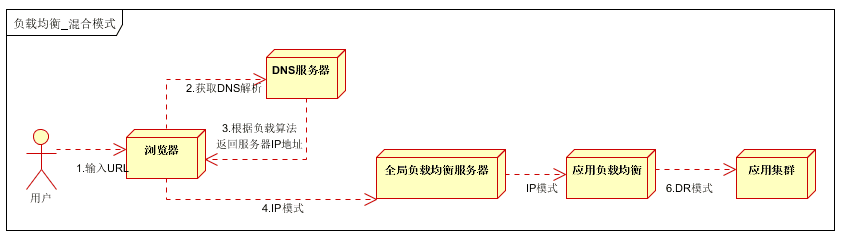

# 限流

当流量超过服务极限能力时，系统可能会出现卡死，崩溃的情况，限流就是当高并发或瞬时高并发时，为了保证系统的稳定性、可用性，系统以牺牲部分请求为代价或者延迟处理请求为代价，保证系统整体服务可用

## 三种限流算法

- 令牌桶（token bucket）

    - 先有一个木桶，系统按照固定速度，往桶里加入Token，如果桶已经满了就不再添加。当有请求到来时，会各自拿走一个Token，取到Token才能继续进行请求处理。

    - 如果一段时间没有请求时，桶内就会积累一些Token，下次一旦有突发流量，只要Token足够，也能依次处理，所以令牌桶算法的特点是允许突发流量

      

- 桶漏法（Leaky Bucket）

    - 漏桶法（Leaky Bucket）**是限流算法中最经典的一种，主要用于**平滑输出请求流量
    - 有一个固定大小的桶（缓冲区），水以任意速率流入桶中（表示请求流入），但水是**以固定速率漏出**的（表示请求被处理）。
      如果水流得太快、桶满了，多出来的水就**溢出被丢弃**（即拒绝服务）

- **计数器** 计数器限流算法也是比较常用的，主要用来限制总并发数，比如数据库连接池大小、线程池大小、程序访问并发数等都是使用计数器算法。也是最简单粗暴的算法。

    - 使用AomicInteger来进行统计当前正在并发执行的次数，如果超过域值就简单粗暴的直接响应给用户，说明系统繁忙，请稍后再试或其它跟业务相关的信息。
        - 弊端：使用 AomicInteger 简单粗暴超过域值就拒绝请求，可能只是瞬时的请求量高，也会拒绝请求
    - 使用Semaphore信号量来控制并发执行的次数，如果超过域值信号量，则进入阻塞队列中排队等待获取信号量进行执行。如果阻塞队列中排队的请求过多超出系统处理能力，则可以在拒绝请求。
        - 相对Atomic优点：如果是瞬时的高并发，可以使请求在阻塞队列中排队，而不是马上拒绝请求，从而达到一个流量削峰的目的
    - 采用ThreadPoolExecutor java线程池：固定线程池大小,超出固定线程池和最大的线程数，拒绝线程请求

# 降级和熔断

## 容错

服务之间的依赖关系，如果有被依赖的服务挂了以后，造成其他服务也会出现请求堆积、资源占用，慢慢扩散到所有服务，引发雪崩效应。容错就是要解决这类问题，常见的方式包括：

- 主动超时：http请求主动设置一个超时时间，超时直接返回，不会造成服务堆积
- 限流：限制最大并发数
- 熔断：当错误数超过阈值时（异常率高）快速失败，不调用后端服务，同时隔一定时间放几个请求去重试后端服务是否能正常调用，如果成功则关闭熔断状态，失败则继续快速失败，直接返回。（此处有重试，重试就是弹性恢复的能力）
- 隔离：把每个依赖或调用的服务都隔离开来，防止级联失败引起整体服务不可用
- 降级：服务失败或异常后，返回指定的默认信息

## 服务降级

由于爆炸性的流量冲击，对一些服务进行有策略的放弃，以此缓解系统压力，保证目前主要业务的正常运行。

主要针对非正常情况下的应急服务措施：当此时一些业务服务无法执行时，给出一个统一的返回结果。

### 降级服务的特征

- 原因：整体负荷超出整体负载承受能力
- 目的：保证重要或基本服务正常运行，非重要服务延迟使用或暂停使用
- 大小：降低服务粒度（将一个业务系统拆分成多个微服务，每个服务应该负责多少功能、承载多少逻辑），考虑整体模块粒度大小，将粒度控制在合适的范围内
- 可控性：在服务粒度大小的基础上增加服务的可控性，后台服务开关的功能是一项必要配置（单机可配置文件，其他可使用数据库和缓存），可分为手动控制和自动控制
- 次序：一般从外围延伸服务开始降级，需要有一定的配置项，重要性低的优先降级，比如可以分组设置等级1-10，当服务需要降级到某一级别时，进行相关配置

### 降级方式

- 延迟服务：比如发表言论，是重要服务，能立刻在页面显示正常，但可以延迟给用户添加积分，放到一个缓存里，等服务平稳后再执行
- 关闭服务：比如直接关闭相关文章的推荐
- 页面跳转：直接跳转到一个预置页面
- 写降级：比如秒杀抢购，可以只写缓存，后台使用一个异步线程去刷数据库，保证最终一致性
- 读降级：当后端服务异常、数据库不可用时，只从缓存中读，有可能是旧数据，所以适合对读一致性要求不高的场景


## 服务熔断

熔断机制是应对雪崩效应（一个微服务故障，导致依赖他的上游服务也失败，进而整个服务链路大范围瘫痪）的一种微服务链路保护机制，当链路中的某个微服务不可用或响应时间太长时，会进行服务的降级，从而熔断该节点微服务的调用，快速返回“错误”的响应信息。

### 和服务降级的区别

服务熔断对服务提供proxy，即使用熔断代理，当下游服务正常时，就调用正常的服务，当检测到下游异常时，阻断调用，快速失败，防止出现串联故障，导致雪崩效应。

```shell
[用户服务] ---[熔断代理]---> [订单服务]
                  |
          ↓服务异常则走 fallback
            返回“系统繁忙”
```

服务熔断一般是某个服务（下游服务）故障引起，而服务降级一般是从整体负荷考虑

- 共性

    - 目的：都是从可用性、可靠性触发，提高系统的容错能力
    - 最终表现：是某些应用不可达或不可用，以保证整体系统稳定
    - 粒度：一般都是 服务级别
    - 自治：对其自治性要求很高，都要求具有较高的自动处理机制

- 区别

    - 触发原因：服务熔断通常是下游服务故障引起，服务降级通常为整体系统考虑

    - 管理目标：熔断是每个微服务都需要，是一个框架级的处理；服务降级一般关注业务，对业务进行考虑，决定在哪一层进行处理

    - 实现方式：代码实现差异

      熔断实现

      ```java
      @CircuitBreaker(name = "orderService")
      public String getOrder(String id) {
          return restTemplate.getForObject("http://order-service/order/" + id, String.class);
      }
      // @CircuitBreaker：表示熔断控制代理是否允许执行 getProduct 方法
      // 如果熔断器打开，直接抛异常
      ```

      降级实现

      ```java
      public String getUser(String id) {
          try {
              return restTemplate.getForObject("http://user-service/user/" + id, String.class);
          } catch (Exception e) {
              // 纯降级逻辑，没有熔断机制
              return fallbackUser(id, e);
          }
      }
      
      public String fallbackUser(String id, Throwable t) {
          return "默认用户信息";
      }
      ```

      联合实现

      ```java
      @CircuitBreaker(name = "productService", fallbackMethod = "fallback")
      public String getProduct(String id) {
          // 主调用逻辑
          return restTemplate.getForObject("http://product-service/api/product/" + id, String.class);
      }
      
      public String fallback(String id, Throwable t) {
          // 降级逻辑，返回兜底内容
          return "默认商品信息（商品服务异常）";
      }
      ```

### 服务熔断实现方案

- Hystrix（Netflix）已停更

  ```java
  @HystrixCommand(fallbackMethod = "fallback")
  public String callRemoteService() {
      return restTemplate.getForObject(...);
  }
  ```

- Resilience4j

  ```java
  @CircuitBreaker(name = "myService", fallbackMethod = "fallback")
  public String getData() {
      return remoteCall();
  }
  ```

- Sentinel（阿里）

  ```java
  @SentinelResource(value = "getOrder", fallback = "orderFallback", blockHandler = "orderBlock")
  public String getOrder(String id) {
      return httpClient.call(...);
  }
  ```


# 负载均衡

负载均衡是将负载进行平衡，分摊到多个操作单元进行执行。是解决高性能，单点故障（高可用），扩展性（水平伸缩）的终极解决方案

## 负载均衡原理

采用横向扩展的方式，通过添加机器来满足大型网站服务的处理能力


## 负载均衡的作用（解决的问题）

- 解决并发能力，提高应用处理性能（增加吞吐量，加强网络处理能力）
- 提供故障转移，实现高可用
- 通过添加或减少服务器数量，提供网站伸缩性（扩展性）
- 安全防护，负载均衡设备上做一些过滤，黑白名单等处理

## 负载均衡分类

### DNS负载均衡


利用域名解析实现负载均衡，DNS往往作为第一级负载均衡

### IP负载均衡


在网络层通过修改请求目标地址进行负载均衡

用户请求数据包到达负载均衡服务器后，负载均衡服务器在操作系统内核进程获取网络数据包，根据负载均衡算法得到一台真实服务器地址，然后将请求的目的地址修改为获得的真实IP地址，不需要经过用户进程处理

真实服务器处理完成后，响应数据包回到负载均衡服务器，负载均衡服务器再将数据包源地址修改为自身的ip地址，发送给用户浏览器

IP负载均衡，真实物理服务器返回给负载均衡服务器，存在两种方式：

1. 负载均衡服务器在修改目的ip地址的同时修改源地址。将数据包源地址设为自身ip，即源地址转换（snat）
2. 将负载均衡服务器同时作为真实物理服务器集群的网关服务器。（服务器需要设置负载均衡服务器为默认网关）

### 链路层负载均衡


数据分发时，不修改ip地址，只修改目标mac地址，配置真实物理服务器集群所有机器虚拟ip和负载均衡服务器ip地址一致，达到不修改数据包的源地址和目标地址，进行数据分发的目的

实际处理服务器ip和数据请求目的ip一致，不需要经过负载均衡服务器进行地址转换，可将响应数据包直接返回给用户浏览器，避免负载均衡服务器网卡带宽成为瓶颈。也称为直接路由模式（DR模式）

### 混合型负载均衡

方式一

适合动静分离的场景，反向代理可以起到缓存和动态请求分发的作用，当有静态资源（比如index.html）存在代理服务器时，直接返回给客户端，如果是动态请求则请求到应用负载均衡


方式二

适合动态请求场景



## 负载均衡服务器

- 四层负载均衡
    - LVS：重量级软件，本身不支持正则表达式，部署起来比较麻烦，但是性能高，应用范围广，一般的大型互联网公司都有用到
    - HAProxy：轻量级软件，支持的负载均衡策略非常多，较灵活
    - Nginx：轻量级软件，支持的协议少（HTTP、HTTPS和Email协议），对于Session支持不友好
- 七层负载均衡
    - HAProxy：全面支持七层代理，灵活性高，支持Session会话保持
    - Nginx：可以针对HTTP应用进行分流，正则规则灵活，支持高并发，部署简单
    - Apache：性能较差，一般不考虑
    - MySQL Proxy：官方的数据库中间件，可以实现读写分离，负载均衡等功能，但是对分表分库支持不完善（可选替代品：Atlas，Cobar，TDDL）

## 负载均衡算法

- 轮询法
    - 轮询法(Round Robin)
        - 将请求按顺序轮流地分配到后端服务器上，它均衡地对待后端的每一台服务器，而不关心服务器实际的连接数和当前的系统负载。
    - 加权轮询法(Weight Round Robin)
        - 不同的后端服务器可能机器的配置和当前系统的负载并不相同，因此它们的抗压能力也不相同。给配置高、负载低的机器配置更高的权重，让其处理更多的请求；而配置低、负载高的机器，给其分配较低的权重，降低其系统负载，加权轮询能很好地处理这一问题，并将请求顺序且按照权重分配到后端。
    - 平滑加权轮询法(Smooth Weight Round Robin)
- 随机法
    - 随机法(Random)
        - 通过系统的随机算法，根据后端服务器的列表大小值来随机选取其中的一台服务器进行访问。由概率统计理论可以得知，随着客户端调用服务端的次数增多， 其实际效果越来越接近于平均分配调用量到后端的每一台服务器，也就是轮询的结果。
    - 加权随机法(Weight Random)
        - 与加权轮询法一样，加权随机法也根据后端机器的配置，系统的负载分配不同的权重。不同的是，它是按照权重随机请求后端服务器，而非顺序。
- 哈希
    - 源地址哈希法(Hash)
        - 源地址哈希的思想是根据获取客户端的IP地址，通过哈希函数计算得到的一个数值，用该数值对服务器列表的大小进行取模运算，得到的结果便是客服端要访问服务器的序号。采用源地址哈希法进行负载均衡，同一IP地址的客户端，当后端服务器列表不变时，它每次都会映射到同一台后端服务器进行访问
- 连接数法
    - 最小连接数法(Least Connections)
        - 最小连接数算法比较灵活和智能，由于后端服务器的配置不尽相同，对于请求的处理有快有慢，它是根据后端服务器当前的连接情况，动态地选取其中当前积压连接数最少的一台服务器来处理当前的请求，尽可能地提高后端服务的利用效率，将负责合理地分流到每一台服务器

# 容灾

容灾是指为了保证关键业务和应用在经历各种灾难后，仍然能够最大限度的提供正常服务的所进行的一系列系统计划及建设和管理行为。

容灾能力**基于数据复制**和**故障转移**。

## 容灾实现

- **数据容灾**是指建立一个异地的数据系统，该系统是本地关键应用数据的一个实时复制（异地部署同步数据）
- **应用容灾**是指在数据容灾的基础上，在异地建立一套完整的与本地生产系统相当的备份应用系统，在灾难发生时，备端系统迅速接管业务继续运行（即同一服务部署多个副本）