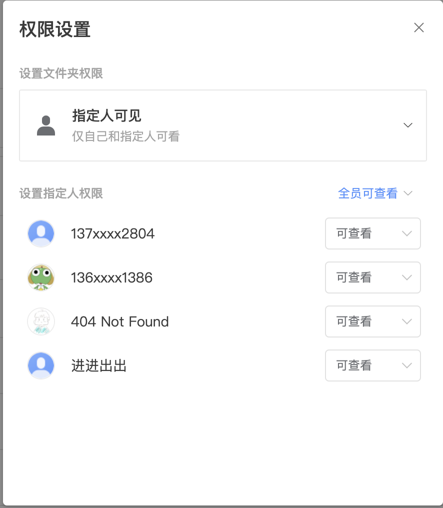
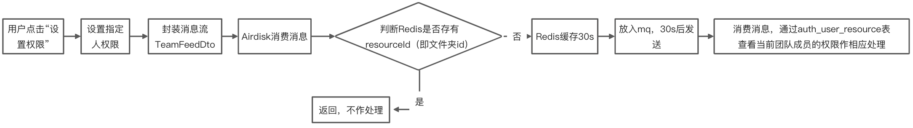

# 实现需求
- 团队动态发布
- 返回团队信息列表
# 项目中遇到的难题
## 返回团队信息列表的优化
需求是要返回当前用户所在的所有团队的首页信息，我需要在其中增加一个动态信息流的字段。

所以一开始我的做法是通过循环遍历用户所在的团队，通过团队id去获取消息中心的动态信息，但后来测试的时候感觉有点慢，因为发现每次请求消息中心，最快也要200ms，如果有5个团队，就要1s了。需要优化。

所以就想到加缓存，加了缓存还不够，就想到用线程池，就是每次进入该方法新建一个线程池。后来发现了可以用AsyncResttemplate，原理是一样的，每次调用会启动一个新线程。

目前平均400~500ms，中缓存更快，只要200ms以内。

## 设置权限
当用户设置文件夹权限时，有可能需要点击多次（设置个别用户可查看或不可查看），如果每点击一次就发送一次消息，会造成消息冗余，用户体验也不好。

第一次发送消息的时候，将teamFeedDto的resourceId即文件夹id存到redis，保存30s，同时设置mq延迟消费。

在30s内，此后对相同文件夹设置权限的消息都会返回，从而减少消息冗余

# 学到的东西
- 要彻底理解需求，再去实现，比如有个需求是团队空间的更新时间要以文档或文件夹最后更新时间为准，而不仅仅是团队属性编辑的更新时间（比如更改团队名字，权限），所以我要实现的是当文件或文件夹更新时间发生变化的时候要跟团队的更新时间做一下比较，以最近的时间为准。而当时想到的文件或文件夹更新时间就是根据创建，编辑，重命名为准，但是忽略了文件的更新时间更新同时也应该触发它所在文件夹的更新时间的更新。
- 考虑实现方案要更加全面，一开始想到是当用户做了某操作，我就直接同步的发送消息动态给消息中心，但是这会增加响应时间，后来我同事就建议用消息队列，将信息先发给消息队列，然后服务端作为消费者处理，这样响应时间不会受到很大影响，同时，我消费了消息并发送给消息中心后，还可以做持久化处理，方便后序工作的优化。
