# 基础
[详细](https://mp.weixin.qq.com/s/J3kCOJwyv2nzvI0_X0tlnA)


# 事务隔离级别
- 读未提交：一个事务还没提交时，它做的变更就能被别的事务看到。
- 读已提交：一个事务提交之后，它做的变更才会被其他事务看到。
- 可重复读：一个事务执行过程中看到的数据，总是跟这个事务在启动时看到的数据是一致的。当然在可重复读隔离级别下，未提交变更对其他事务也是不可见的。
- 串行化：对于同一行记录，“写”会加“写锁”，“读”会加“读锁”，当出现读写锁冲突的时候，后访问的事务必须等前一个事务执行完成，才能继续执行。

## 隔离级别解决了哪些问题

- 脏读（dirty read）：一个事务读到了另一个未提交事务修改过的数据
- 不可重复读（non-repeatable read）：一个事务只能读到另一个已经提交的事务修改过的数据，并且其他事务每对该数据进行一次修改并提交后，该事务都能查询得到最新值。
- 幻读（phantom read）：一个事务先根据某些条件查询出一些记录，之后另一个事务又向表中插入了符合这些条件的记录，原先的事务再次按照该条件查询时，能把另一个事务插入的记录也读出来。

可以通过下边的语句修改事务的隔离级别:
```sql
SET [GLOBAL|SESSION] TRANSACTION ISOLATION LEVEL level; // 等级就是上面的几种
```

## MVCC
MVCC是多版本并发控制，通过回滚指针把一个数据行的所有快照连接起来，存储在undo log里，在一个事务读取数据行的时候，只能读取版本号小于等于当前事务版本号的数据行。

# 索引
## 磁盘IO与预读
磁盘读取数据靠的是机械运动，每次读取数据花费的时间可以分为<font color=green>寻道时间、旋转延迟、传输时间</font>三个部分。

寻道时间指的是磁臂移动到指定磁道所需要的时间，主流磁盘一般在5ms以下；

旋转延迟就是我们经常听说的磁盘转速，比如一个磁盘7200转，表示每分钟能转7200次，也就是说1秒钟能转120次，旋转延迟就是1/120/2=4.17ms；

传输时间指的是从磁盘读出或将数据写入磁盘的时间，一般在零点几毫秒，相对于前两个时间可以忽略不计。

那么访问一次磁盘的时间，即一次磁盘IO的时间约等于5+4.17=9ms。

## 索引的优势
- 可以提高数据检索的效率，降低数据库的IO成本。
- 通过索引列对数据进行排序，降低数据排序成本，降低CPU消耗。

## 索引的劣势
- 索引会占据磁盘空间
- 索引虽然提高查询效率，但是会降低更新表的效率。比如每次对表进行增删改操作，MySQL不仅要保存数据，还有保存或者更新对应的索引文件。（比如在B+树种需要对树进行分裂、合并、旋转等操作来维护平衡性。）

## B+树索引
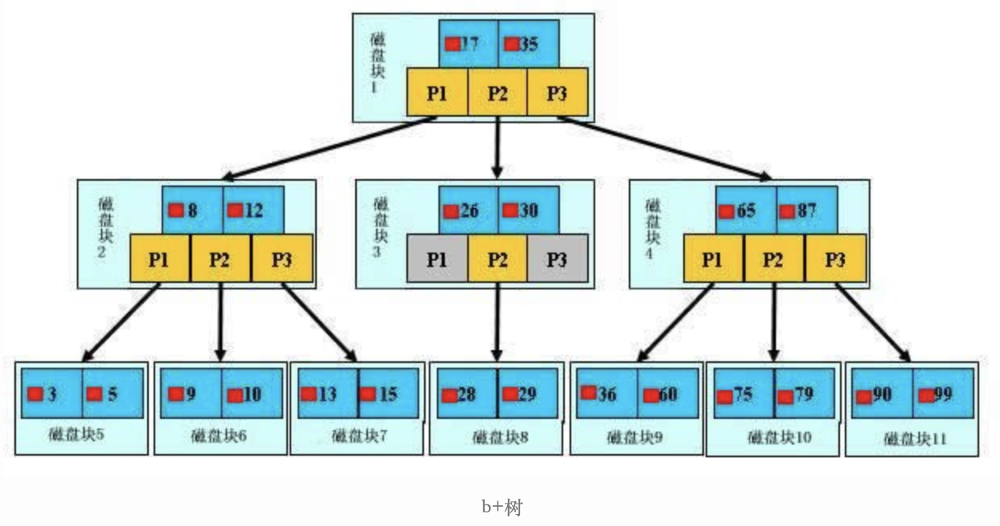

### 结构
多叉平衡树，只有叶子节点才会存放数据，非叶子结点只存储指引搜索方向的数据项，叶子节点之间使用双向指针连接，最底层的叶子节点形成了一个双向有序链表。

IO（把磁盘块/数据页由磁盘加载到内存）次数取决于B+树的高度h，假设当前数据表的数据为N，每个磁盘块的数据项的数量是m，则有 <font color=green>**h = log(m+1)N**</font>，当数据量N一定的情况下，m越大，h越小；而m = 磁盘块大小/数据项的大小，磁盘块的大小也就是数据页的大小，是固定的，如果数据项占的空间越小，数据项的数量越多，树的高度越低。
### 查询操作
首先在根节点进行二分查找，找到一个 key 所在的指针，然后递归地在指针所指向的节点进行查找。直到查找到叶子节点，然后在叶子节点上进行二分查找，找出 key 所对应的 data。

插入删除操作会破坏平衡树的平衡性，因此在进行插入删除操作之后，需要对树进行分裂、合并、旋转等操作来维护平衡性。

### B + 树与红黑树的比较

红黑树等平衡树也可以用来实现索引，但是文件系统及数据库系统普遍采用 B+ Tree 作为索引结构，主要有以下两个原因：

（一）磁盘 IO 次数

B+ 树一个节点可以存储多个元素，相对于红黑树（出度为2）的树高更低，磁盘 IO 次数更少。

（二）磁盘预读特性

为了减少磁盘 I/O 操作，磁盘往往不是严格按需读取，而是每次都会预读。预读过程中，磁盘进行顺序读取，顺序读取不需要进行磁盘寻道。每次会读取页的整数倍。

操作系统一般将内存和磁盘分割成固定大小的块，每一块称为一页，内存与磁盘以页为单位交换数据。数据库系统将索引的一个节点的大小设置为页的大小，使得一次 I/O 就能完全载入一个节点。


### B + 树与 B 树的比较

#### B+ 树的磁盘 IO 更低

B+ 树的内部节点并没有指向关键字具体信息的指针。因此其内部节点相对 B 树更小。如果把所有同一内部结点的关键字存放在同一盘块中，那么盘块所能容纳的关键字数量也越多。一次性读入内存中的需要查找的关键字也就越多。相对来说IO读写次数也就降低了。

#### B+ 树的查询效率更加稳定

由于非叶子结点并不是最终指向文件内容的结点，而只是叶子结点中关键字的索引。所以任何关键字的查找必须走一条从根结点到叶子结点的路。所有关键字查询的路径长度相同，导致每一个数据的查询效率相当。

#### B+ 树元素遍历效率高

B 树在提高了磁盘IO性能的同时并没有解决元素遍历的效率低下的问题。正是为了解决这个问题，B+树应运而生。B+树只要遍历叶子节点就可以实现整棵树的遍历。而且在数据库中基于范围的查询是非常频繁的，而 B 树不支持这样的操作（或者说效率太低）。


## 哈希索引

哈希索引基本散列表实现，散列表（也称哈希表）是根据关键码值(Key value)而直接进行访问的数据结构，它让码值经过哈希函数的转换映射到散列表对应的位置上，查找效率非常高。假设我们对名字建立了哈希索引，则查找过程如下图所示：

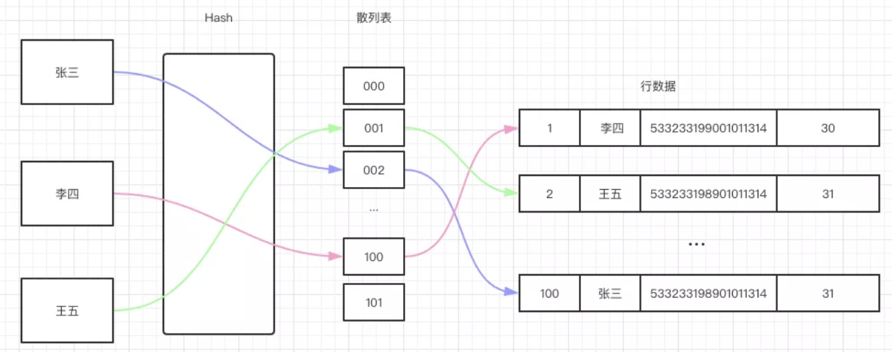

对于每一行数据，存储引擎都会对所有的索引列（上图中的 name 列）计算一个哈希码（上图散列表的位置），散列表里的每个元素指向数据行的指针，由于索引自身只存储对应的哈希值，所以索引的结构十分紧凑，这让哈希索引查找速度非常快！

当然了哈希表的劣势也是比较明显的，不支持区间查找，不支持排序，所以更多的时候哈希表是与 B Tree等一起使用的，在 InnoDB 引擎中就有一种名为「自适应哈希索引」的特殊索引，当 innoDB 注意到某些索引值使用非常频繁时，就会内存中基于 B-Tree 索引之上再创建哈希索引，这样也就让 B+ 树索引也有了哈希索引的快速查找等优点，这是完全自动，内部的行为，用户无法控制或配置，不过如果有必要，可以关闭该功能。

innoDB 引擎本身是不支持显式创建哈希索引的，我们可以在 B+ 树的基础上创建一个伪哈希索引，它与真正的哈希索引不是一回事，它是以哈希值而非键本身来进行索引查找的，这种伪哈希索引的使用场景是怎样的呢，假设我们在 db 某张表中有个 url 字段，我们知道每个 url 的长度都很长，如果以 url 这个字段创建索引，无疑要占用很大的存储空间，如果能通过哈希（比如CRC32）把此 url 映射成 4 个字节，再以此哈希值作索引 ，索引占用无疑大大缩短！不过在查询的时候要记得同时带上 url 和 url_crc,主要是为了避免哈希冲突，导致 url_crc 的值可能一样

```sql
SELECT id FROM url WHERE url = "http://www.baidu.com"  AND url_crc = CRC32("http://www.baidu.com")
```
这样做把基于 url 的字符串索引改成了基于 url_crc 的整型索引，效率更高，同时索引占用的空间也大大减少，一举两得，当然人可能会说需要手动维护索引太麻烦了，那可以改进触发器实现。

## 创建索引语句
CREATE INDEX indexName ON table_name (column_name)

left join语句

 MySQL LEFT JOIN 会读取左边数据表的全部数据，即便右边表无对应数据。

```sql
select a.x from a left join b on a.x=b.x;
```

## 索引设计准则：三星索引

上文我们得出了一个索引列顺序的经验 法则：将选择性最高的列放在索引的最前列，这种建立在某些场景可能有用，但通常不如避免随机 IO 和 排序那么重要，这里引入索引设计中非常著名的一个准则：三星索引。

如果一个查询满足三星索引中三颗星的所有索引条件，理论上可以认为我们设计的索引是最好的索引。什么是三星索引

1. 第一颗星：WHERE 后面参与查询的列可以组成了单列索引或联合索引

2. 第二颗星：避免排序，即如果 SQL 语句中出现 order by column，那么取出的结果集就已经是按照 column 排序好的，不需要再生成临时表

3. 第三颗星：SELECT 对应的列应该尽量是索引列，即尽量避免回表查询。

所以对于如下语句:
```sql
SELECT age, name, city where age = xxx and name = xxx order by age
```
设计的索引应该是 (age, name,city) 或者 (name, age,city)

当然 了三星索引是一个比较理想化的标准，实际操作往往只能满足期望中的一颗或两颗星，考虑如下语句:
```sql
SELECT age, name, city where age >= 10 AND age <= 20 and city = xxx order by name desc
```
假设我们分别为这三列建了联合索引，则显然它符合第三颗星（使用了覆盖索引），如果索引是（city, age, name)，则虽然满足了第一颗星，但排序无法用到索引，不满足第二颗星，如果索引是 (city, name, age)，则第二颗星满足了，但此时 age 在 WHERE 中的搜索条件又无法满足第一星，

另外第三颗星（尽量使用覆盖索引）也无法完全满足，试想我要 SELECT 多列，要把这多列都设置为联合索引吗，这对索引的维护是个问题，因为每一次表的 CURD 都伴随着索引的更新，很可能频繁伴随着页分裂与页合并。

综上所述，三星索引只是给我们构建索引提供了一个参考，索引设计应该尽量靠近三星索引的标准，但实际场景我们一般无法同时满足三星索引，一般我们会优先选择满足第三颗星（因为回表代价较大）至于第一，二颗星就要依赖于实际的成本及实际的业务场景考虑。


# 数据库优化
[详细](https://mp.weixin.qq.com/s/e0CqJG2-PCDgKLjQfh02tw)

## 在本地环境跑一遍SQL，但是要排除缓存干扰，执行SQL的时候，记得加上SQL NoCache去跑SQL
> 如果我们当前的MySQL版本支持缓存而且我们又开启了缓存，那每次请求的查询语句和结果都会以key-value的形式缓存在内存中的，大家也看到我们的结构图了，一个请求会先去看缓存是否存在，不存在才会走解析器。
>
> 但是，缓存会经常失败
>
> 缓存失效比较频繁的原因就是，只要我们一对表进行更新，那这个表所有的缓存都会被清空，其实我们很少存在不更新的表，特别是我之前的电商场景，可能静态表可以用到缓存，但是我们都走大数据离线分析，缓存也就没用了。


## 一条sql语句执行很慢的原因
大多数情况是正常的，只是偶尔很慢
>  数据库在刷新脏页（flush）：往数据库插入或更新一条数据的时候，数据库会在内存中把数据更新，但是不会马上同步持久化到磁盘中，而是写入redo log里，等到空闲的时候再通过redo log把数据同步到磁盘中。当内存数据页和磁盘数据页内容不一致的时候，称这个内存页为“脏页”，内存数据写入到磁盘后，内存和磁盘上的数据页的内容就一致了，称为“干净页”。如果redo log满了，就不能等到空闲再把数据同步到磁盘，只能暂停其它操作，全身心把数据同步到磁盘中去，这时就会导致sql执行很慢

一直很慢
> 没有用索引

## SELECT COUNT(*)的一些问题：
[详细](https://mp.weixin.qq.com/s/SNRvdmyS57oWS_CyYKVvSA)

# MySQL优化

## 1. 查询SQL尽量不要使用select *，而是select具体字段。

理由：

- 只取需要的字段，节省资源、减少网络开销。
- select * 进行查询时，很可能就不会使用到覆盖索引了，就会造成回表查询。

## 2. 如果知道查询结果只有一条或者只要最大/最小一条记录，建议用limit 1

假设现在有employee员工表，要找出一个名字叫jay的人.
```sql
CREATETABLE`employee` (
  `id`int(11) NOTNULL,
  `name`varchar(255) DEFAULTNULL,
  `age`int(11) DEFAULTNULL,
  `date` datetime DEFAULTNULL,
  `sex`int(1) DEFAULTNULL,
  PRIMARY KEY (`id`)
) ENGINE=InnoDBDEFAULTCHARSET=utf8;
```
反例：
```sql
selectid，namefrom employee wherename='jay'
```
正例

```sql
selectid，namefrom employee wherename='jay'limit1;
```
理由：

- 加上limit 1后,只要找到了对应的一条记录,就不会继续向下扫描了,效率将会大大提高。
- 当然，如果name是唯一索引的话，是不必要加上limit 1了，因为limit的存在主要就是为了防止全表扫描，从而提高性能,如果一个语句本身可以预知不用全表扫描，有没有limit ，性能的差别并不大。

## 3. 应尽量避免在where子句中使用or来连接条件

新建一个user表，它有一个普通索引userId，表结构如下：
```sql
CREATETABLE`user` (
  `id`int(11) NOTNULL AUTO_INCREMENT,
  `userId`int(11) NOTNULL,
  `age`int(11) NOTNULL,
  `name`varchar(255) NOTNULL,
  PRIMARY KEY (`id`),
  KEY`idx_userId` (`userId`)
) ENGINE=InnoDBDEFAULTCHARSET=utf8;
```
假设现在需要查询userid为1或者年龄为18岁的用户，很容易有以下sql

反例:
```sql
select * fromuserwhere userid=1or age =18
```
正例：
```sql
//使用union all
select * fromuserwhere userid=1
union all
select * fromuserwhere age = 18

//或者分开两条sql写：

select * fromuserwhere userid=1
select * fromuserwhere age = 18
```
理由：

- 使用or可能会使索引失效，从而全表扫描。
> 对于or+没有索引的age这种情况，假设它走了userId的索引，但是走到age查询条件时，它还得全表扫描，也就是需要三步过程：全表扫描+索引扫描+合并 如果它一开始就走全表扫描，直接一遍扫描就完事。mysql是有优化器的，处于效率与成本考虑，遇到or条件，索引可能失效，看起来也合情合理。


## 4. 优化limit分页

我们日常做分页需求时，一般会用 limit 实现，但是当偏移量特别大的时候，查询效率就变得低下。

反例：
```sql
selectid，name，age from employee limit10000，10
```
正例：
```sql
//方案一 ：返回上次查询的最大记录(偏移量)
selectid，namefrom employee whereid>10000limit10.

//方案二：orderby + 索引
selectid，namefrom employee orderbyidlimit10000，10

//方案三：在业务允许的情况下限制页数：
```
理由：

- 当偏移量最大的时候，查询效率就会越低，因为Mysql并非是跳过偏移量直接去取后面的数据，而是先把偏移量+要取的条数，然后再把前面偏移量这一段的数据抛弃掉再返回的。
- 如果使用优化方案一，返回上次最大查询记录（偏移量），这样可以跳过偏移量，效率提升不少。
- 方案二使用order by+索引，也是可以提高查询效率的。
- 方案三的话，建议跟业务讨论，有没有必要查这么后的分页啦。因为绝大多数用户都不会往后翻太多页。


## 5. 优化你的like语句

日常开发中，如果用到模糊关键字查询，很容易想到like，但是like很可能让你的索引失效。

反例：
```sql
select userId，namefromuserwhere userId like'%123';
```
正例：
```sql
select userId，namefromuserwhere userId like'123%';
```

理由：

- 把%放前面，并不走索引，如下：
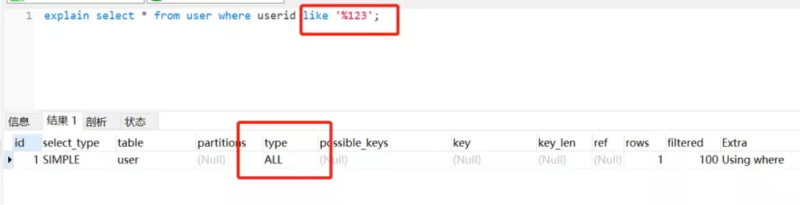

- 把% 放关键字后面，还是会走索引的。如下：
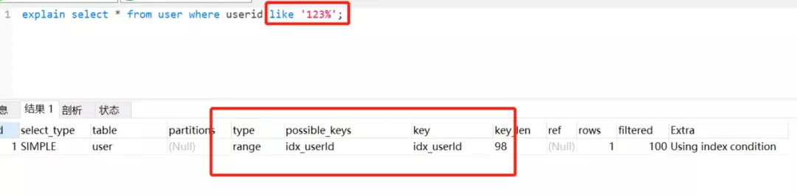


## 6. 使用where条件限定要查询的数据，避免返回多余的行

假设业务场景是这样：查询某个用户是否是会员。曾经看过老的实现代码是这样。。。

反例：
```java
List<Long> userIds = sqlMap.queryList("select userId fromuserwhere isVip=1");
boolean isVip = userIds.contains(userId);
```
正例：
```java
Long userId = sqlMap.queryObject("select userId fromuserwhere userId='userId'and isVip='1'")
boolean isVip = userId！=null;
```
理由：
- 需要什么数据，就去查什么数据，避免返回不必要的数据，节省开销。


## 7. 尽量避免在索引列上使用mysql的内置函数

业务需求：查询最近七天内登陆过的用户(假设loginTime加了索引)

反例：
```sql
select userId,loginTime from loginuser whereDate_ADD(loginTime,Interval7DAY) >=now();
```
正例：
```sql
explainselect userId,loginTime from loginuser where  loginTime >= Date_ADD(NOW(),INTERVAL - 7DAY);
```
理由：

- 索引列上使用mysql的内置函数，索引失效
  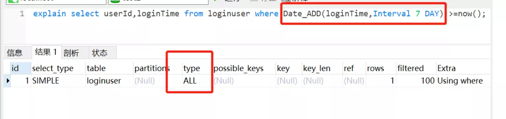

- 如果索引列不加内置函数，索引还是会走的。
  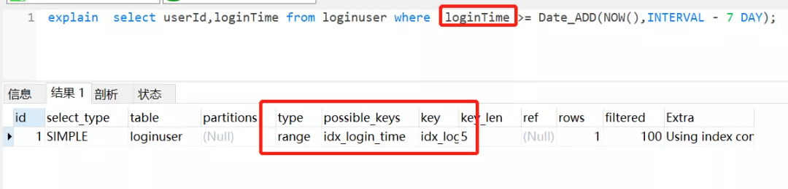

## 8. 应尽量避免在 where 子句中对字段进行表达式操作，这将导致系统放弃使用索引而进行全表扫

反例：
```sql
select * fromuserwhere age-1 =10；
```
正例：
```sql
select * fromuserwhere age =11；
```
理由：
- 虽然age加了索引，但是因为对它进行运算，索引直接迷路了。。。
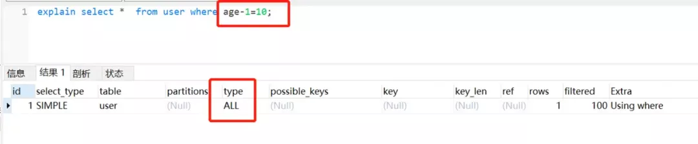


## 9. Inner join 、left join、right join，优先使用Inner join，如果是left join，左边表结果尽量小

- Inner join 内连接，在两张表进行连接查询时，只保留两张表中完全匹配的结果集
- left join 在两张表进行连接查询时，会返回左表所有的行，即使在右表中没有匹配的记录。
- right join 在两张表进行连接查询时，会返回右表所有的行，即使在左表中没有匹配的记录。


都满足SQL需求的前提下，推荐优先使用Inner join（内连接），如果要使用left join，左边表数据结果尽量小，如果有条件的尽量放到左边处理。

反例:
```sql
select * from tab1 t1 left join tab2 t2  on t1.size = t2.size where t1.id>2;
```
正例：
```sql
select * from (select * from tab1 where id >2) t1 left join tab2 t2 on t1.size = t2.size;
```
理由：

- 如果inner join是等值连接，或许返回的行数比较少，所以性能相对会好一点。
- 同理，使用了左连接，左边表数据结果尽量小，条件尽量放到左边处理，意味着返回的行数可能比较少。

## 10. 应尽量避免在 where 子句中使用!=或<>操作符，否则将引擎放弃使用索引而进行全表扫描。
反例：
```sql
select age,name  from user where age <>18;
```
正例：
```sql
//可以考虑分开两条sql写
select age,name  from user where age <18;
select age,name  from user where age >18;
```
理由：

- 使用!=和<>很可能会让索引失效
  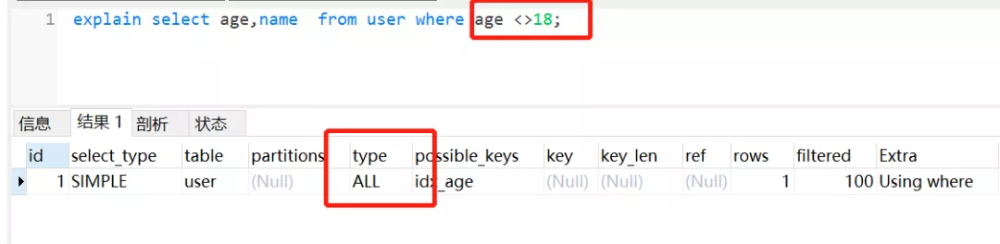


## 11. 使用联合索引时，注意索引列的顺序，一般遵循最左匹配原则。


表结构：（有一个联合索引idx_userid_age，userId在前，age在后）
```sql
CREATE TABLE `user` (
  `id` int(11) NOT NULL AUTO_INCREMENT,
  `userId` int(11) NOT NULL,
  `age` int(11) DEFAULT NULL,
  `name` varchar(255) NOT NULL,
  PRIMARY KEY (`id`),
  KEY `idx_userid_age` (`userId`,`age`) USING BTREE
) ENGINE=InnoDB AUTO_INCREMENT=2 DEFAULT CHARSET=utf8;
```
反例：
```sql
select * from user where age = 10;
```
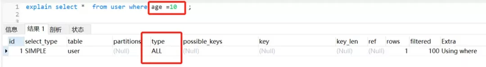

正例：
```sql
//符合最左匹配原则
select * from user where userid=10 and age =10；
//符合最左匹配原则
select * from user where userid =10;
```
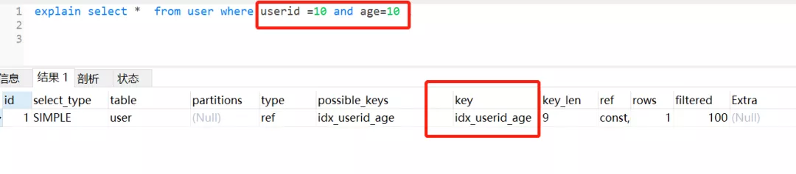
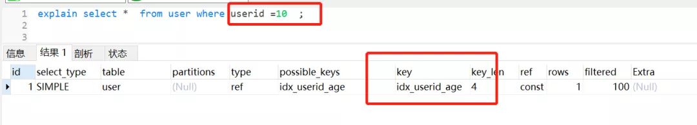


理由：

- 当我们创建一个联合索引的时候，如(k1,k2,k3)，相当于创建了（k1）、(k1,k2)和(k1,k2,k3)三个索引，这就是最左匹配原则。
- 联合索引不满足最左原则，索引一般会失效，但是这个还跟Mysql优化器有关的。


## 12. 对查询进行优化，应考虑在 where 及 order by 涉及的列上建立索引，尽量避免全表扫描。
反例：
```sql
select * from user where address ='深圳' order by age ;
```
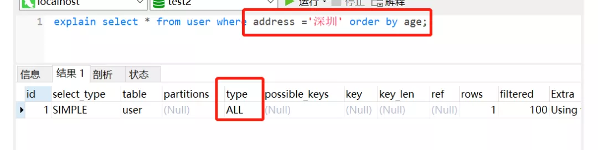
正例：
```sql
// 添加索引
alter table user add index idx_address_age (address,age)
```
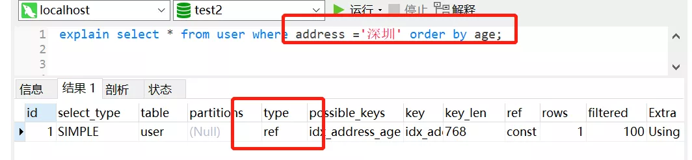


## 13. 如果插入数据过多，考虑批量插入。
反例：
```sql
for(User u :list){
 INSERT into user(name,age) values(#name#,#age#)   
}
```
正例：
```sql
//一次500批量插入，分批进行
insert into user(name,age) values
<foreach collection="list" item="item" index="index" separator=",">
    (#{item.name},#{item.age})
</foreach>
```
理由：

- 批量插入性能好，更加省时间
> 打个比喻:假如你需要搬一万块砖到楼顶,你有一个电梯,电梯一次可以放适量的砖（最多放500）,你可以选择一次运送一块砖,也可以一次运送500,你觉得哪个时间消耗大?


## 14. 在适当的时候，使用覆盖索引。
覆盖索引能够使得你的SQL语句不需要回表，仅仅访问索引就能够得到所有需要的数据，大大提高了查询效率。

反例：
```sql
// like模糊查询，不走索引了
select * from user where userid like '%123%'
```
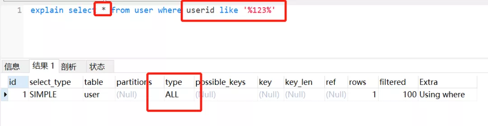


正例：
```sql
//id为主键，那么为普通索引，即覆盖索引登场了。
select id,name from user where userid like '%123%';
```
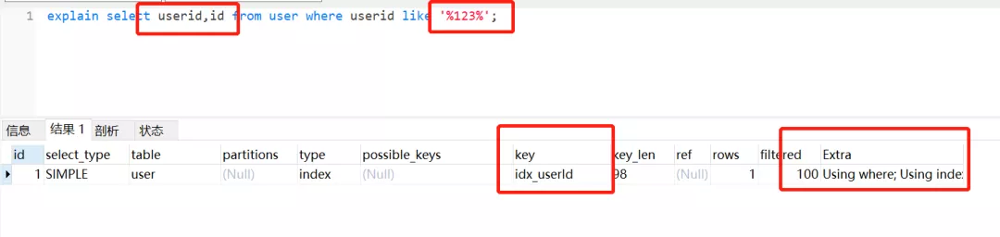


## 15. 慎用distinct关键字
distinct 关键字一般用来过滤重复记录，以返回不重复的记录。在查询一个字段或者很少字段的情况下使用时，给查询带来优化效果。但是在字段很多的时候使用，却会大大降低查询效率。

反例：
```sql
SELECT DISTINCT * from  user;
```
正例：
```sql
select DISTINCT name from user;
```
理由：

- 带distinct的语句cpu时间和占用时间都高于不带distinct的语句。因为当查询很多字段时，如果使用distinct，数据库引擎就会对数据进行比较，过滤掉重复数据，然而这个比较，过滤的过程会占用系统资源，cpu时间。


## 16. 删除冗余和重复索引
反例：
```sql
  KEY `idx_userId` (`userId`)
  KEY `idx_userId_age` (`userId`,`age`)
```
正例:
```sql
//删除userId索引，因为组合索引（A，B）相当于创建了（A）和（A，B）索引
  KEY `idx_userId_age` (`userId`,`age`)
```
理由：

- 重复的索引需要维护，并且优化器在优化查询的时候也需要逐个地进行考虑，这会影响性能的。


## 17. 如果数据量较大，优化你的修改/删除语句。
避免同时修改或删除过多数据，因为会造成cpu利用率过高，从而影响别人对数据库的访问。

反例：
```sql
//一次删除10万或者100万+？
delete from user where id <100000;
//或者采用单一循环操作，效率低，时间漫长
for（User user：list）{
   delete from user；
}
```
正例：
```sql
//分批进行删除,如每次500
delete user where id<500
delete product where id>=500 and id<1000；
```
理由：

- 一次性删除太多数据，可能会有lock wait timeout exceed的错误，所以建议分批操作。


## 18. where子句中考虑使用默认值代替null。
反例：
```sql
select * from user where age is not null;
```
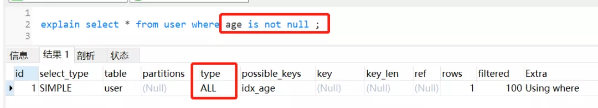


正例：
```sql
//设置0为默认值
select * from user where age>0;
```
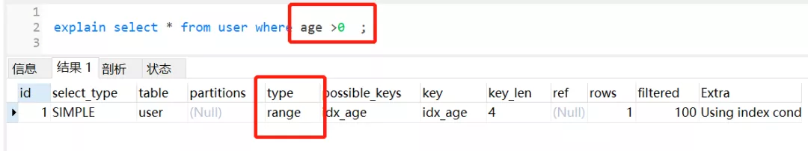

理由：

- 并不是说使用了is null 或者 is not null 就会不走索引了，这个跟mysql版本以及查询成本都有关。
> 如果mysql优化器发现，走索引比不走索引成本还要高，肯定会放弃索引，这些条件！=，>is null，is not null经常被认为让索引失效，其实是因为一般情况下，查询的成本高，优化器自动放弃的。

- 如果把null值，换成默认值，很多时候让走索引成为可能，同时，表达意思会相对清晰一点。

## 19. 不要有超过5个以上的表连接
- 连表越多，编译的时间和开销也就越大。
- 把连接表拆开成较小的几个执行，可读性更高。
- 如果一定需要连接很多表才能得到数据，那么意味着糟糕的设计了。


## 20. exist & in的合理利用
假设表A表示某企业的员工表，表B表示部门表，查询所有部门的所有员工，很容易有以下SQL:
```sql
select * from A where deptId in (select deptId from B);
```
这样写等价于：

先查询部门表B
```sql
select deptId from B
```
再由部门deptId，查询A的员工
```sql
select * from A where A.deptId = B.deptId
```
可以抽象成这样的一个循环：
```java
   List<> resultSet ;
    for(int i=0;i<B.length;i++) {
          for(int j=0;j<A.length;j++) {
          if(A[i].id==B[j].id) {
             resultSet.add(A[i]);
             break;
          }
       }
    }
```
显然，除了使用in，我们也可以用exists实现一样的查询功能，如下：
```sql
select * from A where exists (select 1 from B where A.deptId = B.deptId);
```
因为exists查询的理解就是，先执行主查询，获得数据后，再放到子查询中做条件验证，根据验证结果（true或者false），来决定主查询的数据结果是否得意保留。

那么，这样写就等价于：
```sql
select * from A,先从A表做循环

select * from B where A.deptId = B.deptId,再从B表做循环.
```
同理，可以抽象成这样一个循环：
```java
   List<> resultSet ;
    for(int i=0;i<A.length;i++) {
          for(int j=0;j<B.length;j++) {
          if(A[i].deptId==B[j].deptId) {
             resultSet.add(A[i]);
             break;
          }
       }
    }
```
数据库最费劲的就是跟程序链接释放。假设链接了两次，每次做上百万次的数据集查询，查完就走，这样就只做了两次；相反建立了上百万次链接，申请链接释放反复重复，这样系统就受不了了。即mysql优化原则，就是小表驱动大表，小的数据集驱动大的数据集，从而让性能更优。

因此，我们要选择最外层循环小的，也就是，如果B的数据量小于A，适合使用in，如果B的数据量大于A，即适合选择exist。


## 21. 尽量用 union all 替换 union
如果检索结果中不会有重复的记录，推荐union all 替换 union。

反例：
```sql
select * from user where userid=1
union
select * from user where age = 10
```
正例：
```sql
select * from user where userid=1
union all
select * from user where age = 10
```
理由：

- 如果使用union，不管检索结果有没有重复，都会尝试进行合并，然后在输出最终结果前进行排序。如果已知检索结果没有重复记录，使用union all 代替union，这样会提高效率。<font size=4 color="green">union会自动压缩多个结果集合中的重复结果，而union all则将所有的结果全部显示出来，不管是不是重复</font>。


## 22. 索引不宜太多，一般5个以内。
- 索引并不是越多越好，索引虽然提高了查询的效率，但是也降低了插入和更新的效率。
- insert或update时有可能会重建索引，所以建索引需要慎重考虑，视具体情况来定。
- 一个表的索引数最好不要超过5个，若太多需要考虑一些索引是否没有存在的必要。


## 23. 尽量使用数字型字段，若只含数值信息的字段尽量不要设计为字符型
反例：
```sql
king_id` varchar（20） NOT NULL COMMENT '守护者Id'
```
正例：
```sql
`king_id` int(11) NOT NULL COMMENT '守护者Id'
```
理由：

- 相对于数字型字段，字符型会降低查询和连接的性能，并会增加存储开销。


## 24. 索引不适合建在有大量重复数据的字段上，如性别这类型数据库字段。
因为SQL优化器是根据表中数据量来进行查询优化的，如果索引列有大量重复数据，Mysql查询优化器推算发现不走索引的成本更低，很可能就放弃索引了。


## 25. 尽量避免向客户端返回过多数据量。
假设业务需求是，用户请求查看自己最近一年观看过的直播数据。

反例：
```sql
//一次性查询所有数据回来
select * from LivingInfo where watchId =useId and watchTime >= Date_sub(now(),Interval 1 Y)
```
正例：
```sql
//分页查询
select * from LivingInfo where watchId =useId and watchTime>= Date_sub(now(),Interval 1 Y) limit offset，pageSize

//如果是前端分页，可以先查询前两百条记录，因为一般用户应该也不会往下翻太多页，
select * from LivingInfo where watchId =useId and watchTime>= Date_sub(now(),Interval 1 Y) limit 200 ;
```

## 26. 当在SQL语句中连接多个表时,请使用表的别名，并把别名前缀于每一列上，这样语义更加清晰。
反例：
```sql
select  * from A inner
join B on A.deptId = B.deptId;
```
正例：
```sql
select  memeber.name,deptment.deptName from A member inner
join B deptment on member.deptId = deptment.deptId;
```

## 27. 尽可能使用varchar/nvarchar 代替 char/nchar。
反例：
```sql
  `deptName` char(100) DEFAULT NULL COMMENT '部门名称'
```
正例：
```sql
  `deptName` varchar(100) DEFAULT NULL COMMENT '部门名称'
```
理由：

- 因为首先变长字段存储空间小，可以节省存储空间。
- 其次对于查询来说，在一个相对较小的字段内搜索，效率更高。


## 28. 为了提高group by 语句的效率，可以在执行到该语句前，把不需要的记录过滤掉。
反例：
```sql
select job，avg（salary） from employee  group by job having job ='president'
or job = 'managent'
```
正例：
```sql
select job，avg（salary） from employee where job ='president'
or job = 'managent' group by job；
```


## 29. 如何字段类型是字符串，where时一定用引号括起来，否则索引失效
反例：
```sql
select * from user where userid =123;
```
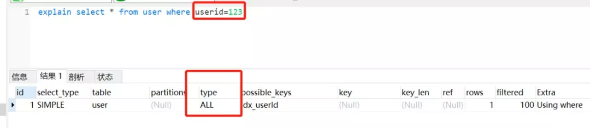

正例：
```sql
select * from user where userid ='123';
```
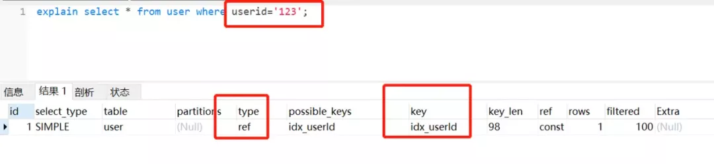

理由：

- 为什么第一条语句未加单引号就不走索引了呢？这是因为不加单引号时，是字符串跟数字的比较，它们类型不匹配，MySQL会做隐式的类型转换，把它们转换为浮点数再做比较。


## 30. 使用explain 分析你SQL的计划
日常开发写SQL的时候，尽量养成一个习惯吧。用explain分析一下你写的SQL，尤其是走不走索引这一块。
```sql
explain select * from user where userid =10086 or age =18;
```

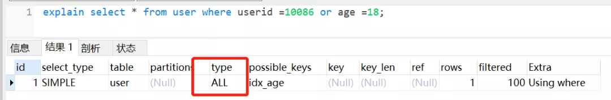

explain 用来分析 SELECT 查询语句，开发人员可以通过分析 Explain 结果来优化查询语句。

### select_type
常用的有 SIMPLE 简单查询，UNION 联合查询，SUBQUERY 子查询等。

### table
要查询的表

### possible_keys
可能选择的索引

### key
实际使用的索引

### rows
扫描的行数

### type

#### system
触发条件：表只有一行，这是一个 const type 的特殊情况

#### const
触发条件：在使用主键或者唯一索引进行查询的时候只有一行匹配。

#### eq_ref
触发条件：在进行联接查询的，使用主键或者唯一索引并且只匹配到一行记录的时候

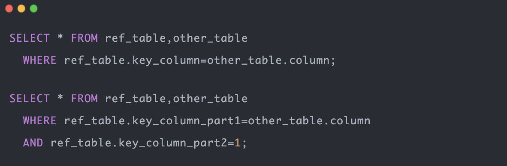

#### ref
触发条件：使用非唯一索引

#### range
触发条件：只有在使用主键、单个字段的辅助索引、多个字段的辅助索引的最后一个字段进行范围查询才是 range

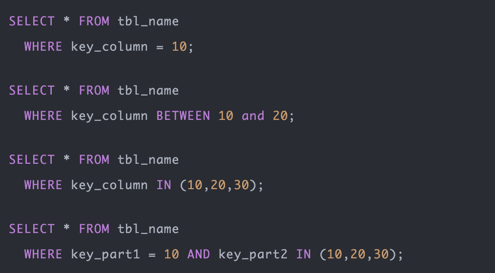

#### index
触发条件：

只扫描索引树

1）查询的字段是索引的一部分，覆盖索引。2）使用主键进行排序

#### all
触发条件：全表扫描，不走索引


# 解释一下什么是池化设计思想。什么是数据库连接池?为什么需要数据库连接池?

池化设计应该不是一个新名词。我们常⻅的如java线程池、jdbc连接池、redis连接池等就是这类设计 的代表实现。这种设计会初始预设资源，解决的问题就是抵消每次获取资源的消耗，如创建线程的开 销，获取远程连接的开销等。就好比你去⻝堂打饭，打饭的大妈会先把饭盛好几份放那里，你来了就直 接拿着饭盒加菜即可，不用再临时又盛饭又打菜，效率就高了。除了初始化资源，池化设计还包括如下 这些特征:池子的初始值、池子的活跃值、池子的最大值等，这些特征可以直接映射到java线程池和数 据库连接池的成员属性中。

数据库连接本质就是一个 socket 的连接。数据库服务端还要维护一些缓存和用户权限信息之类的 所 以占用了一些内存。我们可以把数据库连接池是看做是维护的数据库连接的缓存，以便将来需要对数据 库的请求时可以重用这些连接。为每个用户打开和维护数据库连接，尤其是对动态数据库驱动的网站应 用程序的请求，既昂贵又浪费资源。在连接池中，创建连接后，将其放置在池中，并再次使用它，因此 不必建立新的连接。如果使用了所有连接，则会建立一个新连接并将其添加到池中。 连接池还减少了 用户必须等待建立与数据库的连接的时间。


# 主从复制

## 什么是主从复制
主从复制是指将主数据库的DDL和DML操作通过二进制日志传到从数据库上，然后在从数据库上对这些日志进行重新执行，从而使从数据库和主数据库的数据保持一致。

## 主从复制的原理
- MySql主库在事务提交时会把数据变更作为事件记录在二进制日志Binlog中；
- 主库推送二进制日志文件Binlog中的事件到从库的中继日志Relay Log中，之后从库根据中继日志重做数据变更操作，通过逻辑复制来达到主库和从库的数据一致性；
- MySql通过三个线程来完成主从库间的数据复制，其中Binlog Dump线程跑在主库上，I/O线程和SQL线程跑着从库上；
- 当在从库上启动复制时，首先创建I/O线程连接主库，主库随后创建Binlog Dump线程读取数据库事件并发送给I/O线程，I/O线程获取到事件数据后更新到从库的中继日志Relay Log中去，之后从库上的SQL线程读取中继日志Relay Log中更新的数据库事件并应用，如下图所示。

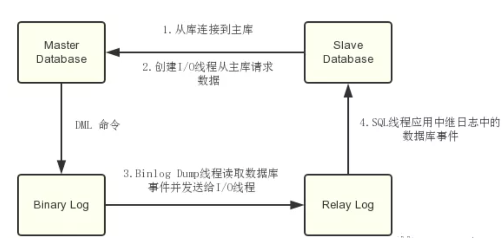


# Mysql架构
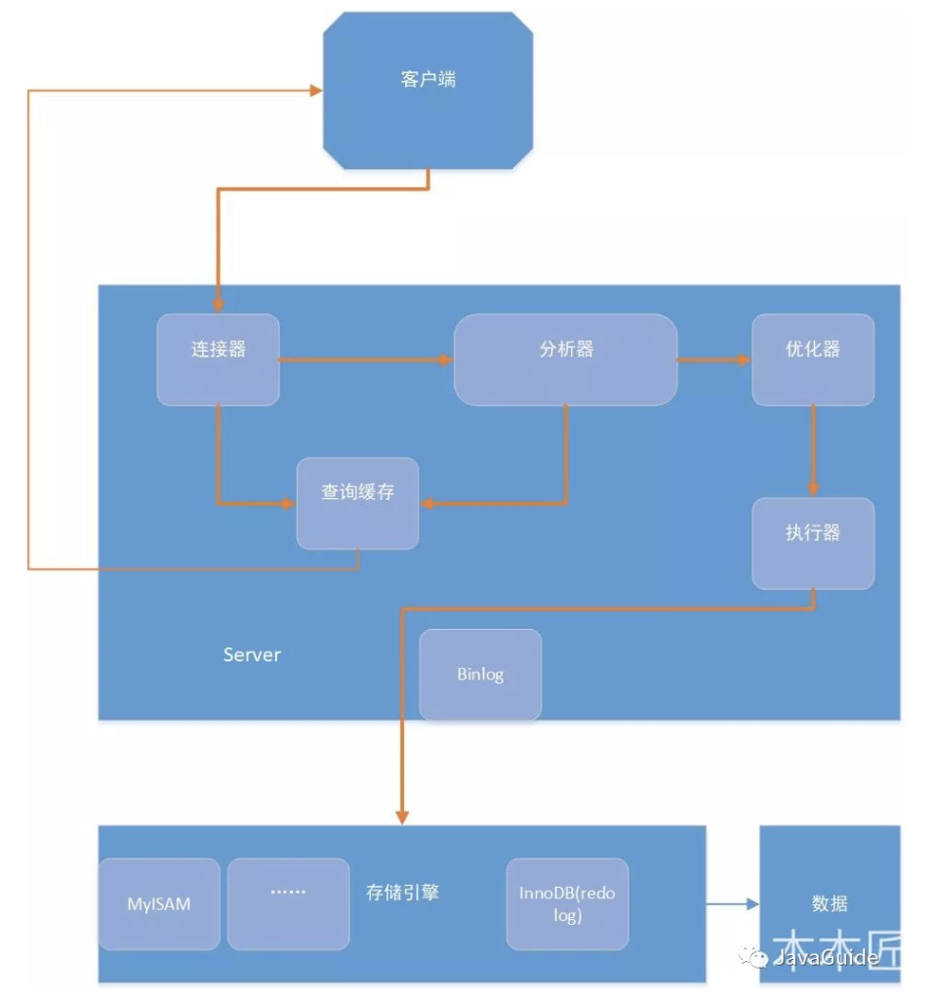

- 连接器： 身份认证和权限相关(登录 MySQL 的时候)。
- 查询缓存:  执行查询语句的时候，会先查询缓存（MySQL 8.0 版本后移除，因为这个功能不太实用）。
- 分析器:  没有命中缓存的话，SQL 语句就会经过分析器，分析器说白了就是要先看你的 SQL 语句要干嘛，再检查你的 SQL 语句语法是否正确。
- 优化器： 按照 MySQL 认为最优的方案去执行。
- 执行器:  执行语句，然后从存储引擎返回数据。


<font size=4 color="green">简单来说 MySQL 主要分为 Server 层和存储引擎层：</font>

- Server 层：主要包括连接器、查询缓存、分析器、优化器、执行器等，所有跨存储引擎的功能都在这一层实现，比如存储过程、触发器、视图，函数等，还有一个通用的日志模块 binglog 日志模块。
- 存储引擎： 主要负责数据的存储和读取，采用可以替换的插件式架构，支持 InnoDB、MyISAM、Memory 等多个存储引擎，其中 InnoDB 引擎有自有的日志模块 redolog 模块。现在最常用的存储引擎是 InnoDB，它从 MySQL 5.5.5 版本开始就被当做默认存储引擎了。

## Server 层基本组件介绍
### 选择器
连接器主要和身份认证和权限相关的功能相关，就好比一个级别很高的门卫一样。

主要负责用户登录数据库，进行用户的身份认证，包括校验账户密码，权限等操作，如果用户账户密码已通过，连接器会到权限表中查询该用户的所有权限，之后在这个连接里的权限逻辑判断都是会依赖此时读取到的权限数据，也就是说，后续只要这个连接不断开，即时管理员修改了该用户的权限，该用户也是不受影响的。

### 查询缓存(MySQL 8.0 版本后移除)
查询缓存主要用来缓存我们所执行的 SELECT 语句以及该语句的结果集。

连接建立后，执行查询语句的时候，会先查询缓存，MySQL 会先校验这个 sql 是否执行过，以 Key-Value 的形式缓存在内存中，Key 是查询预计，Value 是结果集。如果缓存 key 被命中，就会直接返回给客户端，如果没有命中，就会执行后续的操作，完成后也会把结果缓存起来，方便下一次调用。当然在真正执行缓存查询的时候还是会校验用户的权限，是否有该表的查询条件。

MySQL 查询不建议使用缓存，因为查询缓存失效在实际业务场景中可能会非常频繁，假如你对一个表更新的话，这个表上的所有的查询缓存都会被清空。对于不经常更新的数据来说，使用缓存还是可以的。

所以，一般在大多数情况下我们都是不推荐去使用查询缓存的。

MySQL 8.0 版本后删除了缓存的功能，官方也是认为该功能在实际的应用场景比较少，所以干脆直接删掉了。


### 分析器
MySQL 没有命中缓存，那么就会进入分析器，分析器主要是用来分析 SQL 语句是来干嘛的，分析器也会分为几步：

<font size=4 color="green">第一步，词法分析</font>，一条 SQL 语句有多个字符串组成，首先要提取关键字，比如 select，提出查询的表，提出字段名，提出查询条件等等。做完这些操作后，就会进入第二步。

<font size=4 color="green">第二步，语法分析</font>，主要就是判断你输入的 sql 是否正确，是否符合 MySQL 的语法。

完成这 2 步之后，MySQL 就准备开始执行了，但是如何执行，怎么执行是最好的结果呢？这个时候就需要优化器上场了。

### 优化器
优化器的作用就是它认为的最优的执行方案去执行（有时候可能也不是最优，这篇文章涉及对这部分知识的深入讲解），比如多个索引的时候该如何选择索引，多表查询的时候如何选择关联顺序等。

可以说，经过了优化器之后可以说这个语句具体该如何执行就已经定下来。

### 执行器
当选择了执行方案后，MySQL 就准备开始执行了，首先执行前会校验该用户有没有权限，如果没有权限，就会返回错误信息，如果有权限，就会去调用引擎的接口，返回接口执行的结果。

## 语句分析

###  查询语句
说了以上这么多，那么究竟一条 sql 语句是如何执行的呢？其实我们的 sql 可以分为两种，一种是查询，一种是更新（增加，更新，删除）。我们先分析下查询语句，语句如下：
```sql
select * from tb_student  A where A.age='18' and A.name=' 张三 ';
```
结合上面的说明，我们分析下这个语句的执行流程：
- 先检查该语句是否有权限，如果没有权限，直接返回错误信息，如果有权限，在 MySQL8.0 版本以前，会先查询缓存，以这条 sql 语句为 key 在内存中查询是否有结果，如果有直接缓存，如果没有，执行下一步。
- 通过分析器进行词法分析，提取 sql 语句的关键元素，比如提取上面这个语句是查询 select，提取需要查询的表名为 tb_student,需要查询所有的列，查询条件是这个表的 id='1'。然后判断这个 sql 语句是否有语法错误，比如关键词是否正确等等，如果检查没问题就执行下一步。

接下来就是优化器进行确定执行方案，上面的 sql 语句，可以有两种执行方案：
```sql
a.先查询学生表中姓名为“张三”的学生，然后判断是否年龄是 18。
b.先找出学生中年龄 18 岁的学生，然后再查询姓名为“张三”的学生。
```
那么优化器根据自己的优化算法进行选择执行效率最好的一个方案（优化器认为，有时候不一定最好）。那么确认了执行计划后就准备开始执行了。

- 进行权限校验，如果没有权限就会返回错误信息，如果有权限就会调用数据库引擎接口，返回引擎的执行结果。

### 更新语句
以上就是一条查询 sql 的执行流程，那么接下来我们看看一条更新语句如何执行的呢？sql 语句如下：
```sql
update tb_student A set A.age='19' where A.name=' 张三 ';
```
我们来给张三修改下年龄，在实际数据库肯定不会设置年龄这个字段的，不然要被技术负责人打的。其实条语句也基本上会沿着上一个查询的流程走，只不过执行更新的时候肯定要记录日志啦，这就会引入日志模块了，MySQL 自带的日志模块式<font size=4 color="green"> binlog（归档日志）</font> ，所有的存储引擎都可以使用，我们常用的 InnoDB 引擎还自带了一个日志模块<font size=4 color="green"> redo log（重做日志）</font>，我们就以 InnoDB 模式下来探讨这个语句的执行流程。流程如下：

- 先查询到张三这一条数据，如果有缓存，也是会用到缓存。
- 然后拿到查询的语句，把 age 改为 19，然后调用引擎 API 接口，写入这一行数据，InnoDB 引擎把数据保存在内存中，同时记录 redo log，此时 redo log 进入 prepare 状态，然后告诉执行器，执行完成了，随时可以提交。
- 执行器收到通知后记录 binlog，然后调用引擎接口，提交 redo log 为提交状态。
- 更新完成。

<font size=4 color="green">这里肯定有同学会问，为什么要用两个日志模块，用一个日志模块不行吗?</font>

这是因为最开始 MySQL 并没与 InnoDB 引擎( InnoDB 引擎是其他公司以插件形式插入 MySQL 的) ，MySQL 自带的引擎是 MyISAM，但是我们知道 redo log 是 InnoDB 引擎特有的，其他存储引擎都没有，这就导致会没有 crash-safe 的能力(crash-safe 的能力即使数据库发生异常重启，之前提交的记录都不会丢失)，binlog 日志只能用来归档。

并不是说只用一个日志模块不可以，只是 InnoDB 引擎就是通过 redo log 来支持事务的。那么，又会有同学问，我用两个日志模块，但是不要这么复杂行不行，为什么 redo log 要引入 prepare 预提交状态？这里我们用反证法来说明下为什么要这么做？

- <font size=4 color="green">先写 redo log 直接提交，然后写 binlog</font>，假设写完 redo log 后，机器挂了，binlog 日志没有被写入，那么机器重启后，这台机器会通过 redo log 恢复数据，但是这个时候 bingog 并没有记录该数据，后续进行机器备份的时候，就会丢失这一条数据，同时主从同步也会丢失这一条数据。
- <font size=4 color="green">先写 binlog，然后写 redo log</font>，假设写完了 binlog，机器异常重启了，由于没有 redo log，本机是无法恢复这一条记录的，但是 binlog 又有记录，那么和上面同样的道理，就会产生数据不一致的情况。

如果采用 redo log 两阶段提交的方式就不一样了，写完 binglog 后，然后再提交 redo log 就会防止出现上述的问题，从而保证了数据的一致性。那么问题来了，有没有一个极端的情况呢？假设 redo log 处于预提交状态，binglog 也已经写完了，这个时候发生了异常重启会怎么样呢？ 这个就要依赖于 MySQL 的处理机制了，MySQL 的处理过程如下：

- 判断 redo log 是否完整，如果判断是完整的，就立即提交。
- 如果 redo log 只是预提交但不是 commit 状态，这个时候就会去判断 binlog 是否完整，如果完整就提交 redo log, 不完整就回滚事务。

这样就解决了数据一致性的问题。

## 总结
- MySQL 主要分为 Server 层和引擎层，Server 层主要包括连接器、查询缓存、分析器、优化器、执行器，同时还有一个日志模块（binlog），这个日志模块所有执行引擎都可以共用,redolog 只有 InnoDB 有。
- 引擎层是插件式的，目前主要包括，MyISAM,InnoDB,Memory 等。
- SQL 等执行过程分为两类，一类对于查询等过程如下：权限校验---》查询缓存---》分析器---》优化器---》权限校验---》执行器---》引擎
- 对于更新等语句执行流程如下：分析器----》权限校验----》执行器---》引擎---redo log prepare---》binlog---》redo log commit

