# redis

## redis特点

- 读写性能优异
- 数据类型丰富：支持Strings，Lists，Hashes，Sets，Ordered Sets
- 原子性：redis的所有操作都是原子性的
- 丰富的特性：redis支持publish/subscribe，通知，key过期等特性
- 持久化：redis支持rdb，aof等持久化方式
- 发布订阅
- 分布式：redis cluster

## 为什么redis是单线程以及为什么这么快

- redis完全基于内存，绝大部分请求时纯粹的内存操作，非常快
- 数据结构简单，对数据操作也简单
- 高效的IO模型：使用单线程事件循环配合IO多路复用技术，让单个线程可以同时处理多个网络连接上的IO事件
- 简洁高效的通信协议（RESP）：客户端和服务端之间通信的序列化/反序列化开销很小，有助于提升整体的交互速度

## redis数据结构

- String：用来缓存 Session、Token、图片地址、序列化后的对象(
- List：用来缓存最新文章、最新动态等
- Hash：缓存用户信息、商品信息等
- Set：适合需要存放的数据不能重复的场景，比如点赞数等，交集、并集、差集场景，比如共同好友、共同关注等
- Sorted Set：适合用于排行榜等
- Bitmap：需要保存状态信息（0/1即可表示）的场景，比如用户签到、活跃用户等
- Hyperloglog：统计基数，类似Set，适合数量巨大（百万、千万级别以上）的计数场景，比如热门网站每日访问数等
- Geospatial：存储地理空间数据，比如附近的人（`GEORADIUS personLocation 116.33 39.87 3 km`查询（116.33， 39.87）附近3km的人

## redis对象机制

对redis存入的键值对，会根据他们的类型和编码方式分别封装成一个redisObject，其中有一个指针指向实际存储数据的底层数据结构

```c
/*
 * Redis 对象
 */
typedef struct redisObject {

    // 类型
    unsigned type:4bit;

    // 编码方式
    unsigned encoding:4bit;

    // LRU - 24位, 记录最末一次访问时间（相对于lru_clock）; 或者 LFU（最少使用的数据：8位频率，16位访问时间）
    unsigned lru:LRU_BITS; // LRU_BITS: 24

    // 引用计数
    int refcount; // 32bit

    // 指向底层数据结构实例
    void *ptr; // 64bit

} robj;
```


## redis底层数据结构

- 简单动态字符串-sds
- 压缩列表-ZipList
- 快表-QuickList
- 字典/哈希表-Dict
- 整数集-IntSet
- 跳表-ZSkipList

### SDS


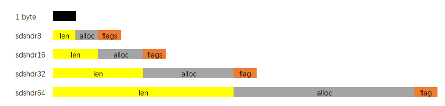

- len：保存SDS字符串的长度
- buf[]：用来保存字符串每个元素
- alloc：分别以uint8, uint16, uint32, uint64表示整个SDS空间大小
- flags始终为一字节, 以低三位标示着头部的类型, 高5位未使用.

#### 为什么使用SDS

- 常数复杂度获取字符串长度

    - 直接读取len属性，时间复杂度为O(1)

- 杜绝缓冲区溢出

    - 使用strcat函数进行两个字符串拼接时，一旦没有分配足够长度内存空间，就会造成缓冲区溢出，而对于SDS，在进行字符串修改时，会首先根据记录的len属性检查内存空间是否满足需求，如果不满足，会进行相应空间扩展，再进行修改操作，不会出现缓冲区溢出

- 减少修改字符串的内存重新分配次数

    - C语言如果要修改字符串，会重新分配内存，因为如果没有重新分配，字符串长度变大会导致内存缓冲区溢出，长度变小时会导致内存泄漏

    - 对于SDS，修改字符串使用了**空间预分配**和**惰性空间释放**两种策略

        - 空间预分配：对字符串进行空间扩展时，扩展的内存比实际需要的多（当新字符串的长度小于1M时，redis会分配他们所需大小一倍的空间，如果大于1M，就额外多分配1M的空间），这样就可以减少**连续执行字符串**增长操作所需的内存重分配次数

          ```shell
          # 1. 创建初始键
          > SET key "Hello World"
          OK
          
          # 2. 查看内存分配（DEBUG 命令）
          > DEBUG SDSLEN key
          1) "len"
          2) (integer) 11      # 内容长度
          3) "free"  
          4) (integer) 0       # 初始空闲=0（未预分配）
          
          # 3. 追加操作
          > APPEND key " again!"
          (integer) 18        # 新长度=18
          
          # 4. 再次查看
          > DEBUG SDSLEN key
          1) "len"
          2) (integer) 18     # 新内容长度
          3) "free"
          4) (integer) 18     # 空闲空间=18
          ```

          因为执行APPEND命令的字符串键数量通常不多，占用内存通常不大，如果执行APPEND操作的键很多，字符串体积又大，可能就需要修改redis，让它定时释放一些字符串键的预分配空间

        - 惰性空间释放：在字符串缩短时不立即回收内存，而是通过调整 `len` 和保留 `alloc` 来标记空闲空间，以备将来扩展使用

- 二进制安全

    - C字符串是以空字符串`0x00`作为字符串结束标识，对于一些二进制文件（如图片等），内容可能包括空字符串，因此C字符串无法正确存取
    - SDS的API都是以处理二进制的方式来处理buf里的元素，是以len属性表示的长度判断字符串是否结束

### ziplist

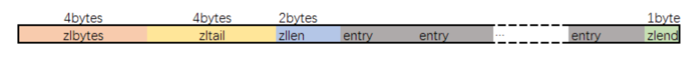

#### 为什么ziplist内存占用小

跟传统双向链表相比，没有指针

每个元素按照实际内容大小存储

缺点：每次写操作都要进行内存分配操作

### quicklist

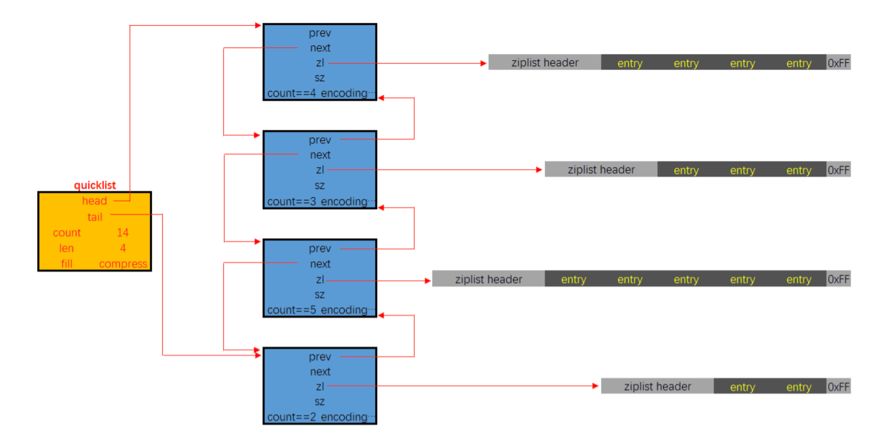

### skiplist

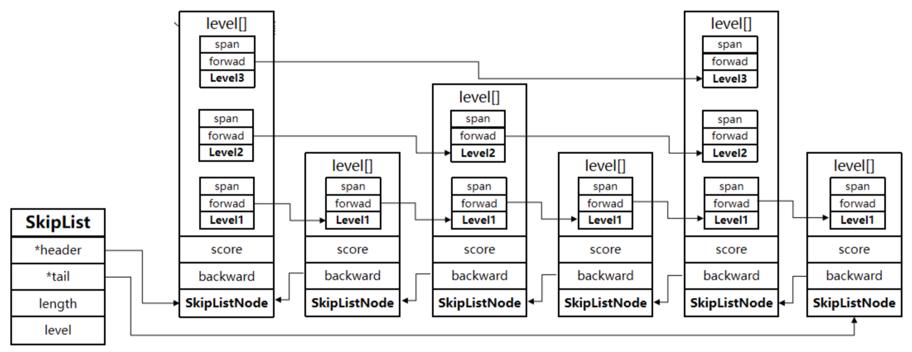

为什么不用哈希表或平衡树

skiplist和平衡树（avl、红黑树等）的元素是有序排列，哈希表是无序的，哈希表只适合做单个key的查找，不适合范围查找

平衡树的插入、删除操作可能导致子树的调整，而skiplist的插入和修改只需要修改相邻节点的指针

## redis持久化机制

一般使用混合aof和内存快照的的方法：内存快照以一定频率执行，在两次快照之间，使用aof日志记录这期间的所有命令操作

### RDB

把当前进程数据生成快照保存到磁盘中

#### RDB触发过程

- 手动触发：
    - save命令：阻塞redis，直到RDB过程完成为止，不适合在线上环境使用
    - bgsave命令：redis主进程通过fork操作创建子进程，RDB持久化过程由子进程负责，阻塞只发生在fork阶段，时间较短
- 自动触发：
    - redis conf中配置 `save m n`，即在m秒内有n次修改，自动触发bgsave生成rdb文件
    - 主从复制时，从节点从主节点中进行全量复制时触发bgsave，生成rdb文件然后发送到从节点
    - 执行debug reload命令重新加载redis时，会触发bgsave
    - 默认情况下执行shutdown命令时，如果没有开启aof持久化，也会触发bgsave

#### RDB如何保证数据一致性

rdb的核心思想是copy-on-write，在快照操作中，主进程会通过fork操作创建子进程，使得主进程能够继续响应用户请求，持久化操作交给子进程完成；在仅有读数据的情况下，主进程和子进程读取的是同一块内存区域，当有修改操作的时候，就会对该数据对应的内存区域进行复制（写时复制），得到一块新的内存区域，主进程会在该新的内存区域进行修改操作，而子进程依然访问的是原本的内存区域，读取的数据是修改前的数据。

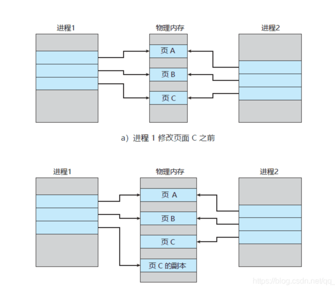

#### RDB快照操作过程中，如果发生服务崩溃会怎么样

在没有将数据全部写入磁盘前，这次快照操作都不算成功，如果出现了服务崩溃，将以上一次完整的rdb快照文件作为恢复内存数据的参考。在快照操作过程中，redis服务会在磁盘中创建一个临时文件进行数据操作，待操作成功后才会用这个临时文件替换上一次的备份。


### AOF

AOF（append only file）只记录写操作命令

#### AOF是写前日志还是写后日志

写后日志，先写内存，后写日志到磁盘中

- 好处

    - 避免额外检查开销：redis在向aof中写日志时，并不会先对这些命令进行语法检查，所以如果先写日志，日志有可能记录错误的命令，导致redis使用日志恢复数据时出错

    - 不会阻塞当前的写操作

- 潜在风险

    - 如果命令执行完成，写日志前宕机，会丢失数据
    - 写日志导致磁盘压力大，写盘慢，阻塞后续操作

#### 如何实现AOF

AOF日志记录redis的每个写命令，分为：命令追加（append）、文件写入（write）、文件同步（sync）

- 命令追加：当AOF持久化功能开启时，服务器在执行完一个写命令后，会以协议格式（**RESP（Redis Serialization Protocol）协议格式**将被执行的写命令序列化）将被执行的写命令追加到服务器的aof_buf缓冲区
- 文件写入和同步：redis提供三种策略决定何时将aof_buf缓冲区的内容写入AOF文件中
    - Always，同步写回：每个写命令执行完，立马同步地将日志写回磁盘
    - Everysec，每秒写回：每个写命令执行完，只是先把日志写到AOF文件的内存缓冲区（和aof_buf的区别：aof_buf是用户态缓冲区，aof文件的内存缓冲区是内核缓冲区），每隔1秒把缓冲区中的内容写入磁盘
    - No，操作系统控制的写回：每个写命令执行完，只是先把日志写到AOF文件的内存缓冲区中，何时写入磁盘由操作系统控制

#### 什么是AOF重写

redis通过创建一个新的AOF文件，替换原有的AOF，新的AOF文件保存同样的数据，但是没有了冗余命令

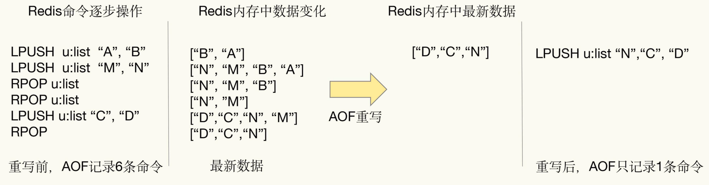

#### AOF重写会阻塞吗

AOF重写时，在fork进程时会阻塞主线程

AOF重写过程是由后台进程bgrewriteaof来完成的，主线程fork出后台的bgrewriteaof子进程，子进程负责记入重写日志

#### AOF日志何时会重写

- auto-aof-rewrite-min-size：表示运行AOF重写时文件的最小大小，默认为64M
- auto-aof-rewrite-percentage：当前AOF文件大小和上一次重写后AOF文件大小的差值，再除以上一次重写后AOF文件的大小，即增加了百分之多少

#### 在重写日志整个过程，主线程有哪些地方会被阻塞

1. fork子进程时，需要拷贝虚拟页表（每个进程独立维护虚拟页表），会对主线程阻塞
2. 主进程有修改操作时（修改了与子进程共享的数据页）触发写时复制，将数据拷贝到新的内存区域，会对主线程阻塞
3. 主进程追加命令到aof_buf缓冲区中时会对主线程阻塞

#### 为什么重写不复用原AOF日志

1. 重写过程中，主进程还是会操作原AOF，如果父子进程写同一个AOF文件，会产生竞争问题，影响性能
2. 重写过程失败的话，会污染原本的AOF文件，无法再恢复数据

## Redis过期键的删除策略有哪些

- 惰性删除：服务器不主动删除数据，只有当客户端查询某个数据，服务器判断该数据已过期，才删除
- 定期删除：服务器执行定时任务删除过期数据

Redis3.2中，从节点在读取数据时，会判断数据是否已过期，如果过期则不返回数据

## Redis内存淘汰算法

redis共支持8种淘汰策略

- 不淘汰
    - noeviction
- 对设置了过期时间的数据进行淘汰
    - volatile-random
    - volatile-ttl
    - volatile-lru
    - volatile-lfu
- 全部数据进行淘汰
    - allkeys-random
    - allkeys-lru
    - allkeys-lfu

**LRU：最近最少使用**

redis优化的LRU算法实现：

redis会记录每个数据的最近一次被访问的时间戳，在redis决定淘汰的数据时，会随机选出N个数据，作为候选集合，然后比较这N个数据的LRU字段（24bit），把LRU字段值最小的数据从缓存中删除。通过随机读取待删除集合，能避免维护一个巨大的链表， 从而提升性能

**LFU：在LRU的基础上，增加一个计数器，统计这个数据的访问次数，当使用LFU策略淘汰数据时，先根据访问次数进行筛选，淘汰访问次数最低的数据，如果访问次数相等，则再选最近最少使用的数据淘汰**

redis的LFU实现：

redis在候选集合中，根据数据的lru字段的后8bit选择访问次数最少的数据进行淘汰，当访问次数相同时，再根据lru字段的前16bit值大小，选择访问时间最久远的数据进行淘汰

由于只使用8bit记录数据的访问次数，即最大值是255次，在快速访问下，易饱和，从而退化成lru，所以使用了**概率递增**的方法，使得高频访问的键需要指数级更多访问才能提升计数（可通过lfu_log_factor控制增长斜率，斜率越大，增长越缓慢：递增概率 P = 1 / (当前计数值 * lfu*_log_*factor + 1)），还使用lfu_decay_time（每过lfu_decay_time分钟，计数器值减1）控制将长期未访问的键计数降低。


## Redis内存用完会发生什么

写命令会返回错误信息，读命令仍然正常返回，如果配置了内存淘汰机制，当内存达到上限时，会冲刷掉旧的内容

## Redis内存优化

1. 缩减键值对的长度
    - key在设计时，在保证业务的情况下越短越好
    - value：常见的需求是把业务对象序列化成二进制数组放入redis，所以要精简业务对象，去掉不必要的属性，其次在序列化时，可以使用protostuff、kyro等
2. 共享对象池
    - redis内部维护了[0-9999]的整数对象池，在启动的时候就会创建0-9999的整数对象（参考redisObject，只是指向底层数据结构的内存指针变为整数本身），这样不同键的同值整数都共享同一个整数对象
3. 字符串优化：SDS
4. 编码优化：动态选择底层数据结构
5. 控制key的数量


## Redis过期时间和永久有效如何设置

`EXPIRE`和`PERSIST`命令


## Redis事务

### Redis事务相关命令

- MULTI：开启事务，redis会将后续的命令逐个放入队列中，使用EXEC命令来原子化执行这个命令系列
- EXEC：执行事务中的所有操作命令
- DISCARD：取消事务，放弃执行事务中的所有命令
- WATCH：监视一个或多个键值对，如果事务在执行前，监视的键值对被其他命令修改，则事务中断，不会执行事务中的任何命令
- UNWATCH：取消对所有键的监控

### Redis事务的三个阶段

- 开启：以MULTI开始一个事务
- 入队：将多个命令放到等待执行的事务队列中，而不是立即执行
- 执行：EXEC命令触发事务

事务状态下的操作流程

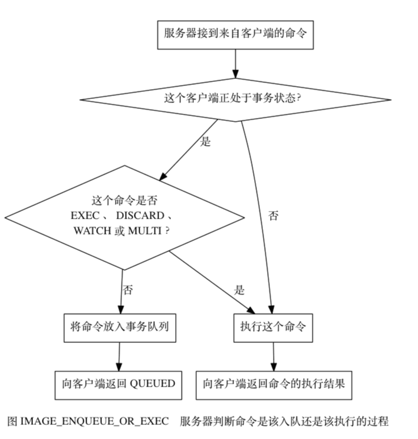

### Redis事务其他实现

- Lua脚本，Redis可以保证脚本内的命令一次性、按顺序地执行，但不提供事务运行错误的回滚，如果部分命令运行错误，剩下的命令仍然会继续执行
- 基于中间标记变量，读取数据时，先通过中间标记变量判断事务是否完成

### Redis事务中出现错误的处理

- 语法错误（编译器错误）

  事务提交失败，key对应值保留原值

  ```shell
  127.0.0.1:6379> set k1 v1
  OK
  127.0.0.1:6379> set k2 v2
  OK
  127.0.0.1:6379> MULTI
  OK
  127.0.0.1:6379> set k1 11
  QUEUED
  127.0.0.1:6379> sets k2 22
  (error) ERR unknown command `sets`, with args beginning with: `k2`, `22`, 
  127.0.0.1:6379> exec
  (error) EXECABORT Transaction discarded because of previous errors.
  127.0.0.1:6379> get k1
  "v1"
  127.0.0.1:6379> get k2
  "v2"
  127.0.0.1:6379>
  ```

- redis类型错误（运行时错误）

  在运行时检测类型错误，最终导致事务提交失败，此时事务不回滚，而是跳过错误命令继续执行

  ```shell
  127.0.0.1:6379> set k1 v1
  OK
  127.0.0.1:6379> set k1 v2
  OK
  127.0.0.1:6379> MULTI
  OK
  127.0.0.1:6379> set k1 11
  QUEUED
  127.0.0.1:6379> lpush k2 22
  QUEUED
  127.0.0.1:6379> EXEC
  1) OK
  2) (error) WRONGTYPE Operation against a key holding the wrong kind of value
  127.0.0.1:6379> get k1
  "11"
  127.0.0.1:6379> get k2
  "v2"
  127.0.0.1:6379>
  ```

### 为什么Redis不支持回滚

- Redis命令只会因为错误的语法，或是命令用在错误类型的键上而失败，因此失败是由编程错误造成的，在开发过程中应该被发现，而不应该在生产环境中。通常情况下，回滚并不能解决编程错误带来的问题，比如错误INCR
- 因为不支持回滚，所以Redis内部可以保持简单且快速


### Redis对ACID的支持性

Redis不保证持久性，因为持久化策略不管是RDB还是AOF出于对性能考虑，都是异步执行，RDB在fork后新写入的数据有可能丢失，AOF在每隔一秒写入时有可能数据丢失


## Redis主从复制

主从库之间采用的是**读写分离**的方式

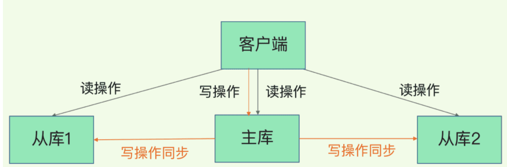


- 全量（同步）复制：第一次同步时
- 增量（同步）复制：只会把主从库网络断连期间主库收到的命令，同步给从库

在2.8版本之前只有全量复制，而2.8版本后有全量和增量复制，因为如果主从库在命令传播时出现了网络闪断，那么，从库就会和主库重新进行一次全量复制，开销非常大

### 全量复制三个阶段

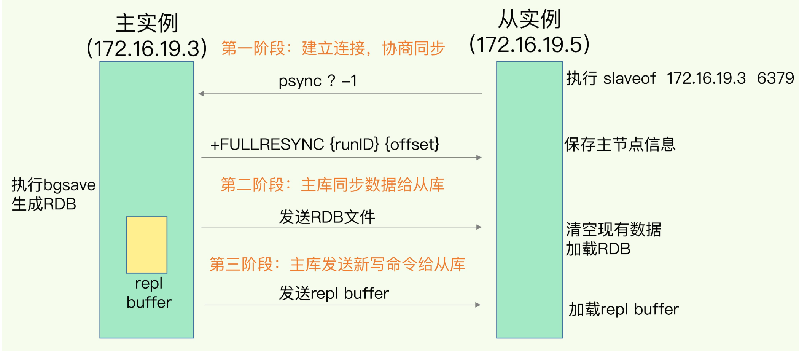

- 第一阶段：主从库间建立连接，协商同步。从库和主库建立连接，并告诉主库即将进行同步，主库确认回复后，主从库间就可以开始同步

    - 从库发送psync命令给主库，表示要进行数据同步，psync包含主库的runId和复制进度offset两个参数，runId是每个Redis实例启动时都会生成的一个随机ID，用来标示这个实例，当从库和主库第一次复制时，因为不知道主库的runId，所以将runId设为？，offset设为-1，表示第一次复制。主库收到psync命令后，会用FULLRESYNC响应命令带上两个参数：主库 runID 和主库目前的复制进度 offset，返回给从库。从库收到响应后，会记录下这两个参数。这里有个地方需要注意，FULLRESYNC 响应表示第一次复制采用的全量复制，也就是说，主库会把当前所有的数据都复制给从库。

- **第二阶段，主库将所有数据同步给从库**。从库收到数据后，在本地完成数据加载。这个过程依赖于内存快照生成的 RDB 文件。

  具体来说，主库执行 bgsave 命令，生成 RDB 文件，接着将文件发给从库。从库接收到 RDB 文件后，会先清空当前数据库，然后加载 RDB 文件。这是因为从库在通过 replicaof 命令开始和主库同步前，可能保存了其他数据。为了避免之前数据的影响，从库需要先把当前数据库清空。在主库将数据同步给从库的过程中，主库不会被阻塞，仍然可以正常接收请求。否则，Redis 的服务就被中断了。但是，这些请求中的写操作并没有记录到刚刚生成的 RDB 文件中。为了保证主从库的数据一致性，主库会在内存中用专门的 replication buffer，记录 RDB 文件生成后收到的所有写操作。

- **第三个阶段，主库会把第二阶段执行过程中新收到的写命令，再发送给从库**。具体的操作是，当主库完成 RDB 文件发送后，就会把此时 replication buffer 中的修改操作发给从库，从库再重新执行这些操作。这样一来，主从库就实现同步了。


### Redis增量复制流程

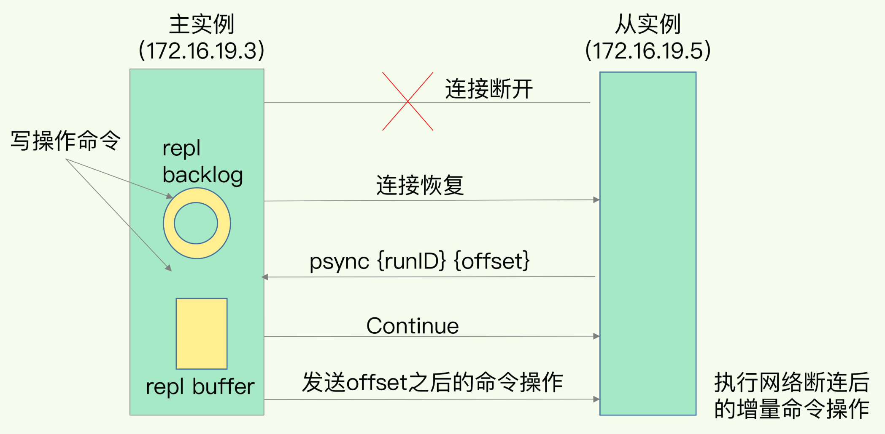

`repl_backlog_buffer`：它是为了从库断开之后，如何找到主从差异数据而设计的环形缓冲区，从而避免全量复制带来的性能开销。如果从库断开时间太久，repl_backlog_buffer环形缓冲区被主库的写命令覆盖了，那么从库连上主库后只能乖乖地进行一次全量复制，所以**repl_backlog_buffer配置尽量大一些，可以降低主从断开后全量复制的概率**。而在repl_backlog_buffer中找主从差异的数据（master_repl_offset主库当前偏移，减去slave_repl_offset，从库最后复制位置）后，如何发给从库呢？这就用到了replication buffer。

`replication buffer`：Redis和客户端通信也好，和从库通信也好，Redis都需要给分配一个 内存buffer进行数据交互，客户端是一个client，从库也是一个client，我们每个client连上Redis后，Redis都会分配一个client buffer，所有数据交互都是通过这个buffer进行的：Redis先把数据写到这个buffer中，然后再把buffer中的数据发到client socket中再通过网络发送出去，这样就完成了数据交互。所以主从在增量同步时，从库作为一个client，也会分配一个buffer，只不过这个buffer专门用来传播用户的写命令到从库，保证主从数据一致，我们通常把它叫做replication buffer。

### Redis为什么不持久化的主服务器自动重启非常危险

- 设置节点A为主服务器，关闭持久化，节点B和C从节点A复制数据
- 这时出现崩溃，但Redis具有自动重启系统，重启了进程，因为关闭了持久化，节点重启后只有一个空的数据集
- 节点B和C从节点A进行复制，由于现在A是空的，导致B和C上的复制数据也会被删除

如果数据重要，并且在主从复制时关闭了主服务器持久化功能，应该禁止实例自动重启

### 为什么主从全量复制使用RDB而不是AOF

1. RDB文件是经过压缩的二进制数据（不同数据类型数据做了针对性优化），文件很小，而AOF记录的是每次写操作的命令，写操作越多文件越大，其中还包括很多对同一个key的多次冗余操作，在主从全量数据同步时，传输RDB文件可以尽量降低对主库机器网络带宽的消耗，从库在加载RDB时，因为RDB是二进制数据，从库直接按照RDB协议解析还原数据即可，速度非常快，而AOF需要一次重放每个写命令，这个过程会很慢
2. 假设要使用AOF，就必须打开AOF功能，就要选择文件刷盘的策略，选择不当回严重影响Redis性能，而RDB只有在需要定时备份和主从全量复制数据时，才会触发生成一次快照，而在很多丢失数据不敏感的业务场景，其实不需要AOF

### Redis无磁盘复制模式

Redis默认是磁盘复制（子进程写RDB到磁盘，主进程传输磁盘中的RDB文件到从库），但是如果使用磁盘比较低速，会给主服务器带来较大的压力，使用无磁盘复制，master创建一个新进程直接dump RDB到slave的socket，不经过主进程，不经过磁盘，适用于disk较慢，网络较快的时候

使用`repl-diskless-sync`配置参数来启动无磁盘复制

使用`repl-diskless-sync-delay` 参数来配置传输开始的延迟时间，单位秒，当一个从库请求过来时，等待`repl-diskless-sync-delay`秒，这期间如果还有其他从库请求，在等待完成后，会一并发送给请求的所有从库

### Redis主-从-从模式

如果从库很多，而且都要和主库进行全量复制，就会导致主库忙于fork子进程生成RDB，fork这个操作会阻塞主进程处理正常请求，从而导致响应变慢，此外传输RDB文件也会占用主库的网络带宽，带来资源压力

所以可以使用主-从-从模式，将主库生成RDB和传输RDB的压力，以级联的方式分散到从库

在部署主从集群时，可以先手动选择一个从库（比如内存资源配置较高的），用于级联其他从库，一般选择三分之一的从库，执行以下命令，让他们和一开始选的从库建立主从关系

```shell
replicaof 所选从库的IP 6379
```

这样，这些从库就知道，在进行同步时，不需要再和主库交互，只要和级联的从库进行写操作同步就行，从而减轻主库压力

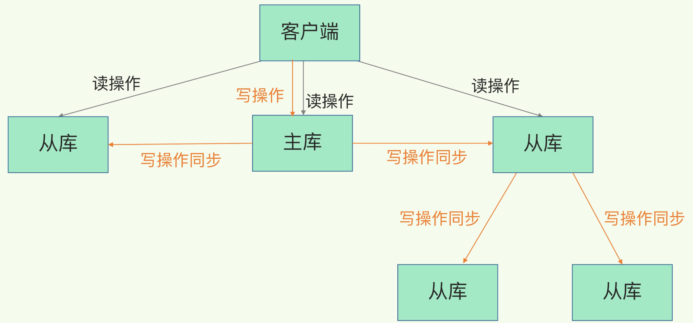

## Redis哨兵机制

适用于 **单实例 + 主从复制** 场景

### 哨兵机制实现的功能

- 监控：哨兵不断检查主节点和从节点是否运作正常
- 自动故障转移：当主节点不能正常工作时，哨兵会开始自动故障转移操作，它会将失效主节点的其中一个从节点升级为新的主节点，并让其他从节点改为复制新的主节点
- 配置提供者：客户端在初始化时，通过连接哨兵来获得当前Redis服务的主节点地址
- 通知：哨兵可以将故障转移的结果发送给客户端

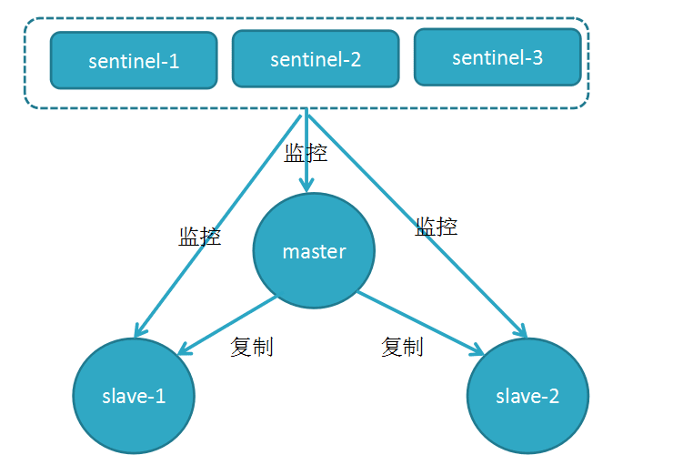

### 哨兵集群通过什么方式组建

哨兵实例之间相互发现，依靠redis提供的发布订阅机制

在主从集群中，主库有一个名为`__sentinel__:hello`的频道，哨兵1把自己的ip和端口发布到这个频道上，哨兵2和3订阅该频道，此时，2和3就可以从这个频道直接获取哨兵1的ip地址和端口号，然后2、3可以和哨兵1建立网络连接

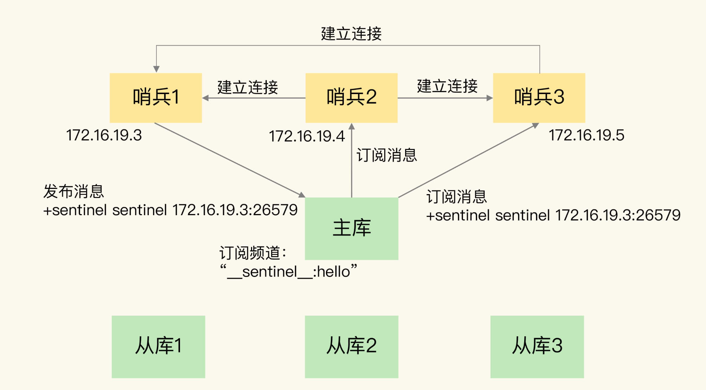

### Redis哨兵如何监控Redis集群

给主库发送 INFO 命令，主库接受到这个命令后，就会把从库列表返回给哨兵。接着，哨兵就可以根据从库列表中的连接信息，和每个从库建立连接，并在这个连接上持续地对从库进行监控。哨兵 1 和 3 可以通过相同的方法和从库建立连接。

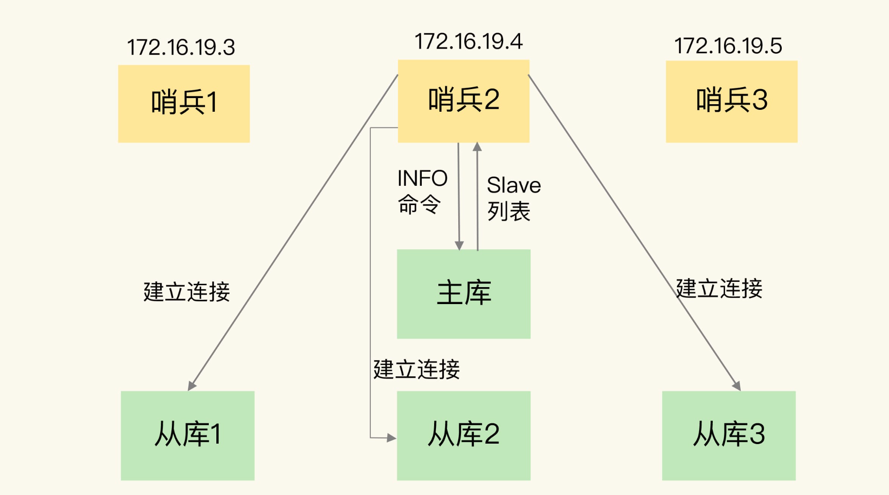

### Redis哨兵如何判断主库下线

- 主观下线：任何一个哨兵都是可以监控探测，并作出Redis节点下线的判断
- 客观下线：由哨兵集群共同决定Redis节点是否下线

当某个哨兵（如下图中的哨兵2）判断主库“主观下线”后，就会给其他哨兵发送 `is-master-down-by-addr` 命令。接着，其他哨兵会根据自己和主库的连接情况，做出 Y 或 N 的响应，Y 相当于赞成票，N 相当于反对票。

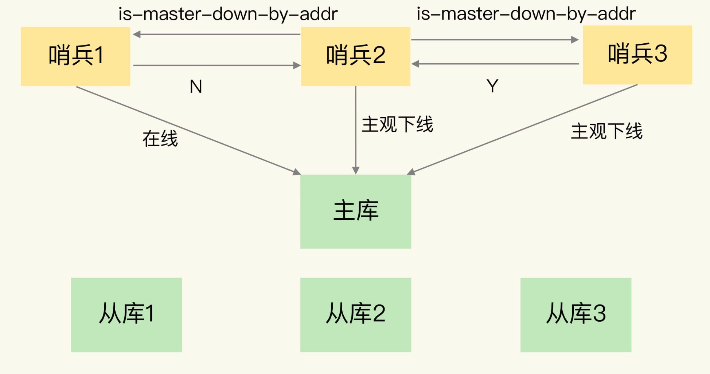

如果赞成票数（这里是2）是大于等于哨兵配置文件中的 `quorum` 配置项（比如这里如果是quorum=2）, 则可以判定**主库客观下线**了

### Redis哨兵的选举机制

#### 为什么要选举

为了避免哨兵的单点情况发生，所以需要一个哨兵的分布式集群。作为分布式集群，必然涉及共识问题（即选举问题）；同时故障的转移和通知都只需要一个主的哨兵节点就可以了。

当主库不可用时，哨兵的一个核心职责是发起故障转移（failover）——选择一个新的主节点并让其替代原来的主节点。

但是为了避免多个哨兵同时发起重复的 failover 操作，**需要选举出一个哨兵 Leader**

#### 哨兵的选举机制

Raft选举算法： **选举的票数大于等于num(sentinels)/2+1时，将成为领导者，如果没有超过，继续选举**

**任何一个想成为 Leader 的哨兵，要满足两个条件**：

- 第一，拿到半数以上的赞成票；
- 第二，拿到的票数同时还需要大于等于哨兵配置文件中的 quorum 值

#### Redis 1主4从，5个哨兵，哨兵配置quorum为2，如果3个哨兵故障，当主库宕机时，哨兵能否判断主库“客观下线”？能否自动切换？

经过实际测试：

1、哨兵集群可以判定主库“主观下线”。由于quorum=2，所以当一个哨兵判断主库“主观下线”后，询问另外一个哨兵后也会得到同样的结果，2个哨兵都判定“主观下线”，达到了quorum的值，因此，**哨兵集群可以判定主库为“客观下线”**。

2、**但哨兵不能完成主从切换**。哨兵标记主库“客观下线后”，在选举“哨兵领导者”时，一个哨兵必须拿到超过多数的选票(5/2+1=3票)。但目前只有2个哨兵活着，无论怎么投票，一个哨兵最多只能拿到2票，永远无法达到`N/2+1`选票的结果

#### 主库判断客观下线后，如何选择新主库

- 过滤掉不健康的（下线或断线），没有回复过哨兵ping响应的从节点
- 选择slave-priority从节点优先级最高的（redis.conf），数值越小，**优先级越高**
- 选择复制偏移量大的，即复制进度最快

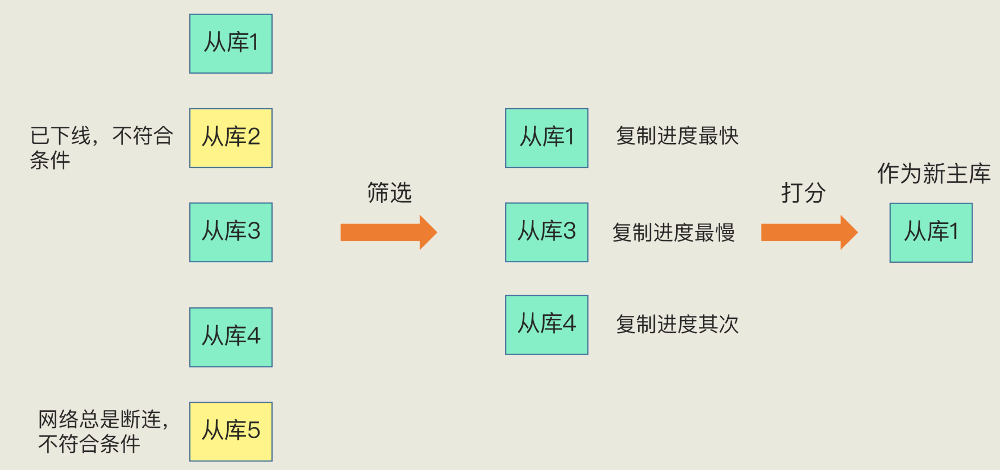

#### 新的主库选择出来后，如何进行故障的转移

假设，判断主库客观下线了，同时选出`sentinel 3`是哨兵leader

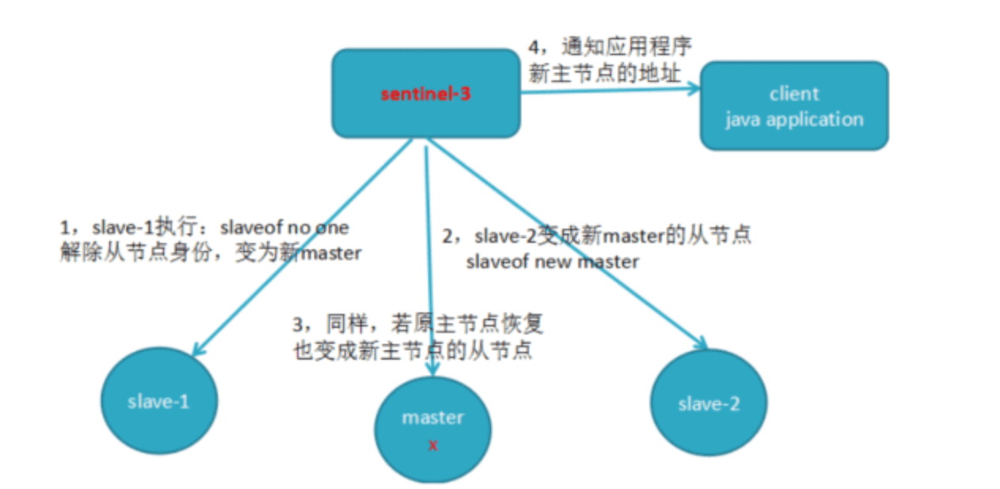

- 将slave-1脱离原从节点（PS: 5.0 中应该是`replicaof no one`)，升级主节点
- 将从节点slave-2指向新的主节点
- 通知客户端主节点已更换
- 将原主节点（oldMaster）变成从节点，指向新的主节点

转移后

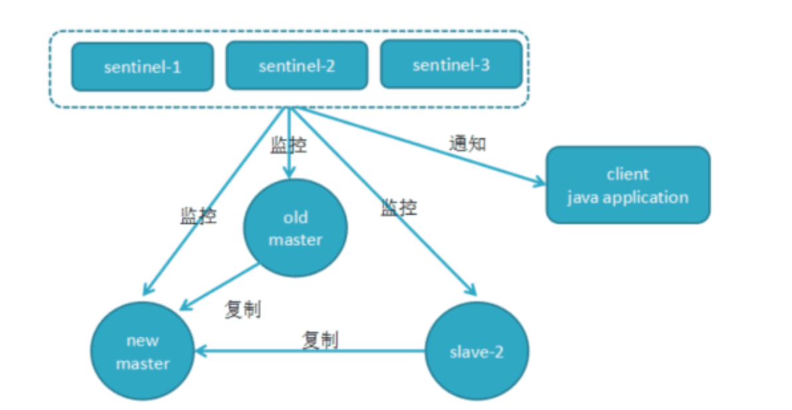

## 为什么Redis单线程这么快

Redis的瓶颈主要在IO而不是CPU，所以为了省开发量，在6.0版本前是单线程模型；其次，Redis 是单线程主要是指 **Redis 的网络 IO 和键值对读写是由一个线程来完成的**，这也是 Redis 对外提供键值存储服务的主要流程。（但 Redis 的其他功能，比如持久化、异步删除、集群数据同步等，其实是由额外的线程执行的）。

Redis 采用了多路复用机制使其在网络 IO 操作中能并发处理大量的客户端请求，实现高吞吐率。

**总结为什么快**

- 单线程避免了锁和线程切换
- 命令执行快（内存操作）
- 网络 IO 使用高效的事件驱动模型
- Redis 6+ 还引入了 IO 多线程优化网络部分（**主线程**：负责事件监听 + 命令解析与执行；**IO 线程**：负责读取客户端请求数据（可选） 和 写入响应数据（并行））

### Redis6.0多线程的实现机制

核心思路是，将主线程的IO读写任务拆分出来给一组独立的线程执行，使得多个 socket 的读写可以并行化

- 主线程负责接收建立连接的请求,获取socket放到全局等待处理队列
- 主线程监听到socket可读之后，通过Round Robin将这些连接分配给IO线程(并不会等待队列满)
- 主线程阻塞等待IO线程读取socket完毕
- 主线程通过单线程的方式执行请求命令，构造响应后，交给IO线程写出
- 主线程阻塞等待IO线程将数据回写socket完毕
- 解除绑定，清空等待队列

该线程有如下特点:

- IO线程要么同时在读socket，要么同时在写，不会同时读或写
- IO线程只负责读写socket解析命令，不负责命令处理（主线程串行执行命令）

### 开启多线程后，是否会存在线程并发安全问题？

Redis的多线程部分只是用来处理网络数据的读写和协议解析，执行命令仍然是单线程顺序执行,因此不存在线程的并发安全问题

### 

## Redis发布订阅方式

- 基于channel

  "发布/订阅"模式包含两种角色，分别是发布者和订阅者。发布者可以向指定的频道(channel)发送消息; 订阅者可以订阅一个或者多个频道(channel),所有订阅此频道的订阅者都会收到此消息。

  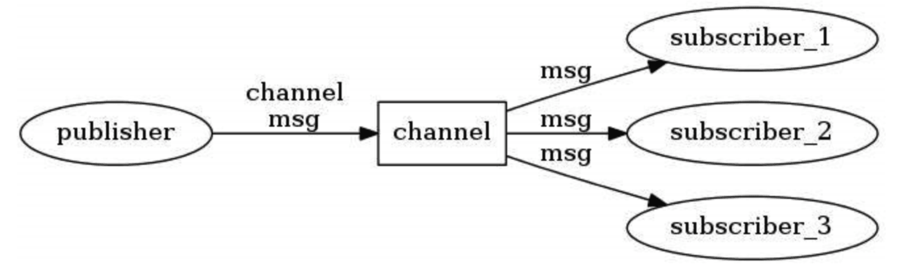

- **基于模式(pattern)的发布/订阅**

  下图展示了一个带有频道和模式的例子， 其中 tweet.shop.* 模式匹配了 tweet.shop.kindle 频道和 tweet.shop.ipad 频道， 并且有不同的客户端分别订阅它们三个：

  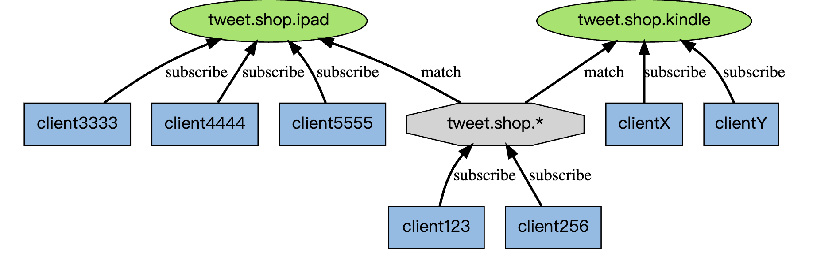

  当有信息发送到 tweet.shop.kindle 频道时， 信息除了发送给 clientX 和 clientY 之外， 还会发送给订阅 tweet.shop.* 模式的 client123 和 client256

  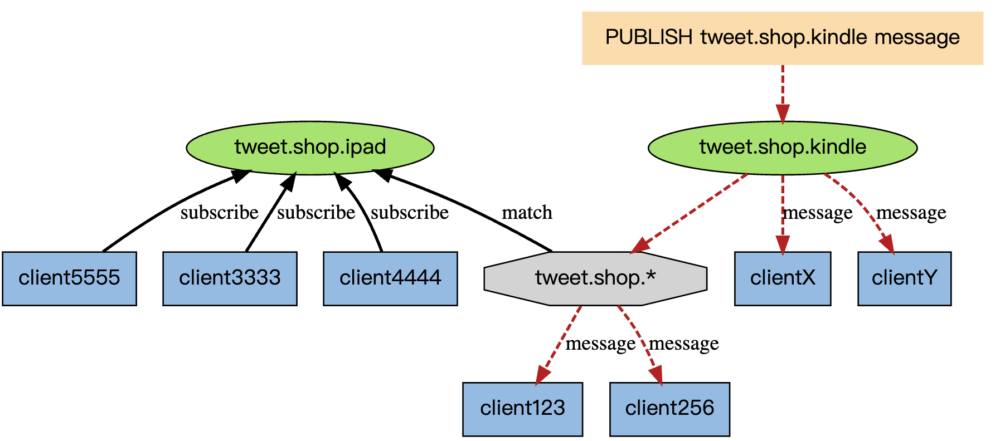

  另一方面， 如果接收到信息的是频道 tweet.shop.ipad ， 那么 client123 和 client256 同样会收到信息：

  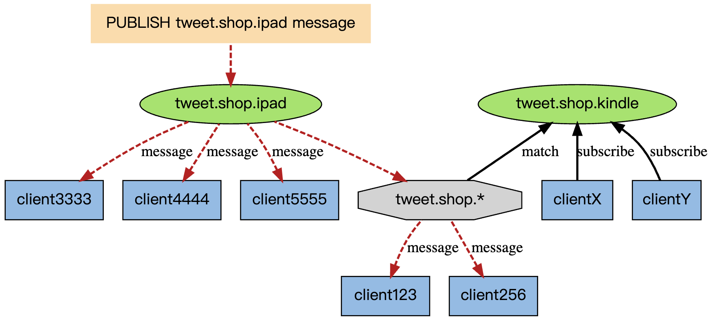


## Redis cluster

适用于 **大规模 + 高并发** 分布式场景

Redis-cluster是一种服务器Sharding技术，Redis3.0以后版本正式提供支持

Redis集群中有16384（2的14次方）个哈希槽，每个key通过CRC16校验后对16384取模来决定放置哪个槽。Cluster中每个节点负责一部分哈希槽

### 为什么是16384

- 16384个槽可以将数据在节点间分得非常均匀，避免热点问题
- 集群扩容、缩容时按槽进行数据迁移，16384 个槽粒度合适，**迁移灵活，迁移成本低，操作可控**
- 16384 = 2¹⁴，方便进行高效的位运算（如 `slot = CRC16(key) & 0x3FFF`），代替 `%`
- 槽信息可用 2KB bitmap 高效表示

```shell
+--------+            +---------+         +---------+
| Client | --> CRC16  | Master1 |  ...    | MasterN |
+--------+            +---------+         +---------+
                         │                     │
                     +--------+           +--------+
                     | Slave1 |           | SlaveN |
                     +--------+           +--------+

```

## Redis缓存问题，如何解决

- 缓存穿透
    - 问题来源：缓存穿透是指缓存和数据库中都没有的数据，而用户不断发起请求。由于缓存是不命中时被动写，且处于容错考虑，如果从存储层查询不到数据则不写入缓存，这将导致这个不存在的数据每次请求都要到存储层去查询，失去了缓存的意义
    - 解决方案：
        - 接口层增加校验，如用户鉴权校验，id做基础校验，id<=0的直接拦截
        - 缓存和数据库中都没有的数据，可以将key-value对写为key-null，缓存有效时间可以设置短点，如30s，这样可以防止攻击者反复用同一个ID暴力攻击
        - 使用布隆过滤器，快速判断一个key是否存在
- 缓存击穿
    - 问题来源：缓存击穿是指缓存中没有但数据库有的数据（一般是缓存时间到期），这时由于并发用户很多，同时读缓存没读到数据，又同时去数据库取数据，引起数据库压力瞬间增大，造成过大压力
    - 解决方案：
        - 设置热点数据永不过期
        - 接口限流、熔断、降级
        - 加互斥锁
- 缓存雪崩
    - 问题来源：缓存雪崩是指缓存中数据大批量到过期时间，而查询数据量巨大，引起数据库压力过大甚至宕机。和缓存击穿不同的是，缓存击穿指并发查询同一条数据，缓存雪崩是不同数据都过期了，很多数据都查不到从而查数据库
    - 解决方案：
        - 缓存数据过期时间设置随机，防止同一时间大量数据过期
        - 如果缓存数据库是分布式部署，将热点数据均匀分布在不同的缓存数据库中
        - 设置热点数据永不过期
- 缓存污染
    - 问题来源：缓存污染是缓存中一些只会被访问一次或者几次的数据，被访问完后，再也不会被访问到，但这部分数据依然留存在缓存中，消耗缓存空间
    - 解决方案：设置合理过期时间


## Redis性能问题如何分析定位

### 问题

- 慢查询
- bigkey
- 集中过期
- fork耗时严重
- 使用swap：当内存中的数据被换到磁盘上后，Redis 再访问这些数据时，就需要从磁盘上读取，访问磁盘的速度要比访问内存慢几百倍
- 内存碎片

### 解决

- 看延迟

  60 秒内的最大响应延迟

  ```shell
  $ redis-cli -h 127.0.0.1 -p 6379 --intrinsic-latency 60
  Max latency so far: 1 microseconds.
  Max latency so far: 15 microseconds.
  Max latency so far: 17 microseconds.
  Max latency so far: 18 microseconds.
  Max latency so far: 31 microseconds.
  Max latency so far: 32 microseconds.
  Max latency so far: 59 microseconds.
  Max latency so far: 72 microseconds.
   
  1428669267 total runs (avg latency: 0.0420 microseconds / 42.00 nanoseconds per run).
  Worst run took 1429x longer than the average latency.
  ```

- 慢日志

  ```shell
  CONFIG SET slowlog-log-slower-than 5000      # 设置阈值为 5ms
  CONFIG SET slowlog-max-len 512               # 设置最大记录数为 512 条
  ```

  ```shell
  SLOWLOG GET # 查看慢日志
  ```

- 集中过期

    - 集中过期 key 增加一个随机过期时间，把集中过期的时间打散，降低 Redis 清理过期 key 的压力
    - 如果使用的 Redis 是 4.0 以上版本，可以开启 lazy-free 机制，当删除过期 key 时，把释放内存的操作放到后台线程中执行，避免阻塞主线程

- 内存碎片

    - Redis 4.0 版本，它正好提供了自动碎片整理的功能，可以通过配置开启碎片自动整理