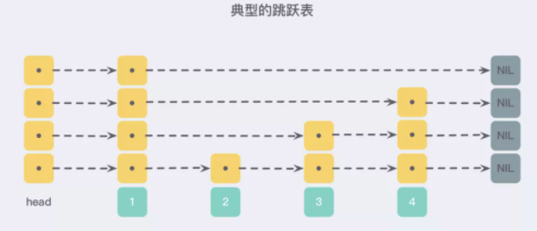

# redis为啥快
> redis是单线程的多路复用IO，单线程避免了线程切换的开销，而多路复用避免了IO等待的开销

> redis6.0引入了多线程，但是，需要提醒大家的是，Redis 6.0中的多线程，也只是针对处理网络请求过程采用了多线程，而数据的读写命令，仍然是单线程处理的。
>
> 在多路复用的IO模型中，在处理网络请求时，调用 select （其他函数同理）的过程是阻塞的，也就是说这个过程会阻塞线程，如果并发量很高，此处可能会成为瓶颈。
>
> 如果能采用多线程，使得网络处理的请求并发进行，就可以大大的提升性能。多线程除了可以减少由于网络 I/O 等待造成的影响，还可以充分利用 CPU 的多核优势。


# 跳跃表
层次化链表结构



## 为什么使用跳跃表
首先，因为 zset 要支持随机的插入和删除，所以它<font size=4 color="green">不宜使用数组来实现</font>，关于排序问题，我们也很容易就想到红黑树/ 平衡树 这样的树形结构，为什么 Redis 不使用这样一些结构呢？

1. 性能考虑： 在高并发的情况下，树形结构需要执行一些类似于 rebalance 这样的可能涉及整棵树的操作，相对来说跳跃表的变化只涉及局部 (下面详细说)；
2. 实现考虑： 在复杂度与红黑树相同的情况下，跳跃表实现起来更简单，看起来也更加直观；
   
基于以上的一些考虑，Redis 基于 William Pugh 的论文做出一些改进后采用了 跳跃表 这样的结构。


# 渐进式哈希
[详细](http://redisbook.com/preview/dict/incremental_rehashing.html)

扩展或收缩哈希表需要将 ht[0] 里面的所有键值对 rehash 到 ht[1] 里面， 但是， 这个 rehash 动作并不是一次性、集中式地完成的， 而是分多次、渐进式地完成的。

这样做的原因在于， 如果 ht[0] 里只保存着四个键值对， 那么服务器可以在瞬间就将这些键值对全部 rehash 到 ht[1] ； 但是， 如果哈希表里保存的键值对数量不是四个， 而是四百万、四千万甚至四亿个键值对， 那么要一次性将这些键值对全部 rehash 到 ht[1] 的话， 庞大的计算量可能会导致服务器在一段时间内停止服务。

因此， 为了避免 rehash 对服务器性能造成影响， 服务器不是一次性将 ht[0] 里面的所有键值对全部 rehash 到 ht[1] ， 而是分多次、渐进式地将 ht[0] 里面的键值对慢慢地 rehash 到 ht[1] 。

以下是哈希表渐进式 rehash 的详细步骤：
1. 为 ht[1] 分配空间， 让字典同时持有 ht[0] 和 ht[1] 两个哈希表。
2. 在字典中维持一个索引计数器变量 rehashidx ， 并将它的值设置为 0 ， 表示 rehash 工作正式开始。
3. 在 rehash 进行期间， 每次对字典执行添加、删除、查找或者更新操作时， 程序除了执行指定的操作以外， 还会顺带将 ht[0] 哈希表在 rehashidx 索引上的所有键值对 rehash 到 ht[1] ， 当 rehash 工作完成之后， 程序将 rehashidx 属性的值增一。
4. 随着字典操作的不断执行， 最终在某个时间点上， ht[0] 的所有键值对都会被 rehash 至 ht[1] ， 这时程序将 rehashidx 属性的值设为 -1 ， 表示 rehash 操作已完成。

渐进式 rehash 的好处在于它采取分而治之的方式， 将 rehash 键值对所需的计算工作均滩到对字典的每个添加、删除、查找和更新操作上， 从而避免了集中式 rehash 而带来的庞大计算量。


## 渐进式 rehash 执行期间的哈希表操作
因为在进行渐进式 rehash 的过程中， 字典会同时使用 ht[0] 和 ht[1] 两个哈希表， 所以在渐进式 rehash 进行期间， 字典的删除（delete）、查找（find）、更新（update）等操作会在两个哈希表上进行： 比如说， 要在字典里面查找一个键的话， 程序会先在 ht[0] 里面进行查找， 如果没找到的话， 就会继续到 ht[1] 里面进行查找， 诸如此类。

另外， 在渐进式 rehash 执行期间， 新添加到字典的键值对一律会被保存到 ht[1] 里面， 而 ht[0] 则不再进行任何添加操作： 这一措施保证了 ht[0] 包含的键值对数量会只减不增， 并随着 rehash 操作的执行而最终变成空表。

# redis并发问题
## 一、 如何解决缓存雪崩
### 什么是缓存雪崩
> - Redis挂掉了，请求全部走数据库
> - 对缓存数据设置相同的过期时间（不可能把所有的数据都缓存起来(内存昂贵且有限)），导致某段时间内缓存失效，请求全部走数据库

### 解决方法：
对于“对缓存数据设置相同的过期时间，导致某段时间内缓存失效，请求全部走数据库。”这种情况，非常好解决：
> 在缓存的时候给过期时间加上一个随机值，这样就会大幅度的减少缓存在同一时间过期。

对于“Redis挂掉了，请求全部走数据库”这种情况，我们可以有以下的思路
> - 事发前：实现Redis的高可用(主从架构+Sentinel 或者Redis Cluster)，尽量避免Redis挂掉这种情况发生。
> - 事发中：万一Redis真的挂了，我们可以设置本地缓存(ehcache)+限流(hystrix)，尽量避免我们的数据库被干掉(起码能保证我们的服务还是能正常工作的)
> - 事发后：redis持久化，重启后自动从磁盘上加载数据，快速恢复缓存数据。
## 二、缓存穿透
### 是什么
> 缓存穿透是指查询一个一定不存在的数据。由于缓存不命中，并且出于容错考虑，如果从数据库查不到数据则不写入缓存，这将导致这个不存在的数据每次请求都要到数据库去查询，失去了缓存的意义
### 解决方案：
> - 由于请求的参数是不合法的(每次都请求不存在的参数)，于是我们可以使用布隆过滤器(BloomFilter)或者压缩filter提前拦截，不合法就不让这个请求到数据库层！
> - 当我们从数据库找不到的时候，我们也将这个空对象设置到缓存里边去。下次再请求的时候，就可以从缓存里边获取了。
> 这种情况我们一般会将空对象设置一个较短的过期时间。

## 三、缓存与数据库双写一致
### 读操作流程
> - 如果我们的数据在缓存里边有，那么就直接取缓存的。
> - 如果缓存里没有我们想要的数据，我们会先去查询数据库，然后将数据库查出来的数据写到缓存中。
> - 最后将数据返回给请求

### 缓存与数据库双写一致问题
> 当我们要更新时候, 各种情况很可能就造成数据库和缓存的数据不一致了

### 解决方案
- 先删除缓存，再更新数据库
(1. 删除缓存直接和简单很多，2. 体现懒加载，所以应该删除缓存而不是更新缓存)
> 1. 如果原子性被破坏：
> - 第一步成功(删除缓存)，第二步失败(更新数据库)，数据库和缓存的数据还是一致的。
> - 如果第一步(删除缓存)就失败了，我们可以直接返回错误(Exception)，数据库和缓存的数据还是一致的。
> 2. 高并发下
> - 线程A删除了缓存
> - 线程B查询，发现缓存已不存在
> - 线程B去数据库查询得到旧值
> - 线程B将旧值写入缓存
> - 线程A将新值写入数据库
>
> 总结：
> 在高并发下表现不如意，在原子性被破坏时表现优异

- 先更新数据库，再删除缓存(Cache Aside Pattern设计模式)
> 1. 如果原子性被破坏了：
> - 第一步成功(操作数据库)，第二步失败(删除缓存)，会导致数据库里是新数据，而缓存里是旧数据。
> - 如果第一步(操作数据库)就失败了，我们可以直接返回错误(Exception)，不会出现数据不一致。
> 2. 高并发下
> - 缓存刚好失效
> - 线程A查询数据库，得一个旧值
> - 线程B将新值写入数据库
> - 线程B删除缓存
> - 线程A将查到的旧值写入缓存

>总结：
>  在高并发下表现优异，在原子性被破坏时表现不如意

# 主从复制流程
> 1. slave节点接受slaveof命令，向master发起tcp连接
> 2. master与slave(此时只认为是一个普通的client)端建立tcp连接
> 3. client发送PING命令，确认对方是一个redis实例
> 4. master响应PING命令并发送PONG回复表示master OK
> 5. slave(此时认为是一个slave节点了)发送SYNC同步命令
> 6. master把slae添加进slave列表，并启动一个子线程保存RDB文件，当RDB文件保存成功时，向所有slave发送数据


# redis

## redis特点

- 读写性能优异
- 数据类型丰富：支持Strings，Lists，Hashes，Sets，Ordered Sets
- 原子性：redis的所有操作都是原子性的
- 丰富的特性：redis支持publish/subscribe，通知，key过期等特性
- 持久化：redis支持rdb，aof等持久化方式
- 发布订阅
- 分布式：redis cluster

## 为什么redis是单线程以及为什么这么快

- redis完全基于内存，绝大部分请求时纯粹的内存操作，非常快
- 数据结构简单，对数据操作也简单
- 高效的IO模型：使用单线程事件循环配合IO多路复用技术，让单个线程可以同时处理多个网络连接上的IO事件
- 简洁高效的通信协议（RESP）：客户端和服务端之间通信的序列化/反序列化开销很小，有助于提升整体的交互速度

## redis数据结构

- String：用来缓存 Session、Token、图片地址、序列化后的对象(
- List：用来缓存最新文章、最新动态等
- Hash：缓存用户信息、商品信息等
- Set：适合需要存放的数据不能重复的场景，比如点赞数等，交集、并集、差集场景，比如共同好友、共同关注等
- Sorted Set：适合用于排行榜等
- Bitmap：需要保存状态信息（0/1即可表示）的场景，比如用户签到、活跃用户等
- Hyperloglog：统计基数，类似Set，适合数量巨大（百万、千万级别以上）的计数场景，比如热门网站每日访问数等
- Geospatial：存储地理空间数据，比如附近的人（`GEORADIUS personLocation 116.33 39.87 3 km`查询（116.33， 39.87）附近3km的人

## redis对象机制

对redis存入的键值对，会根据他们的类型和编码方式分别封装成一个redisObject，其中有一个指针指向实际存储数据的底层数据结构

```c
/*
 * Redis 对象
 */
typedef struct redisObject {

    // 类型
    unsigned type:4bit;

    // 编码方式
    unsigned encoding:4bit;

    // LRU - 24位, 记录最末一次访问时间（相对于lru_clock）; 或者 LFU（最少使用的数据：8位频率，16位访问时间）
    unsigned lru:LRU_BITS; // LRU_BITS: 24

    // 引用计数
    int refcount; // 32bit

    // 指向底层数据结构实例
    void *ptr; // 64bit

} robj;
```


## redis底层数据结构

- 简单动态字符串-sds
- 压缩列表-ZipList
- 快表-QuickList
- 字典/哈希表-Dict
- 整数集-IntSet
- 跳表-ZSkipList

### SDS


- len：保存SDS字符串的长度
- buf[]：用来保存字符串每个元素
- alloc：分别以uint8, uint16, uint32, uint64表示整个SDS空间大小
- flags始终为一字节, 以低三位标示着头部的类型, 高5位未使用.

#### 为什么使用SDS

- 常数复杂度获取字符串长度

    - 直接读取len属性，时间复杂度为O(1)

- 杜绝缓冲区溢出

    - 使用strcat函数进行两个字符串拼接时，一旦没有分配足够长度内存空间，就会造成缓冲区溢出，而对于SDS，在进行字符串修改时，会首先根据记录的len属性检查内存空间是否满足需求，如果不满足，会进行相应空间扩展，再进行修改操作，不会出现缓冲区溢出

- 减少修改字符串的内存重新分配次数

    - C语言如果要修改字符串，会重新分配内存，因为如果没有重新分配，字符串长度变大会导致内存缓冲区溢出，长度变小时会导致内存泄漏

    - 对于SDS，修改字符串使用了**空间预分配**和**惰性空间释放**两种策略

        - 空间预分配：对字符串进行空间扩展时，扩展的内存比实际需要的多（当新字符串的长度小于1M时，redis会分配他们所需大小一倍的空间，如果大于1M，就额外多分配1M的空间），这样就可以减少**连续执行字符串**增长操作所需的内存重分配次数

          ```shell
          # 1. 创建初始键
          > SET key "Hello World"
          OK
          
          # 2. 查看内存分配（DEBUG 命令）
          > DEBUG SDSLEN key
          1) "len"
          2) (integer) 11      # 内容长度
          3) "free"  
          4) (integer) 0       # 初始空闲=0（未预分配）
          
          # 3. 追加操作
          > APPEND key " again!"
          (integer) 18        # 新长度=18
          
          # 4. 再次查看
          > DEBUG SDSLEN key
          1) "len"
          2) (integer) 18     # 新内容长度
          3) "free"
          4) (integer) 18     # 空闲空间=18
          ```

          因为执行APPEND命令的字符串键数量通常不多，占用内存通常不大，如果执行APPEND操作的键很多，字符串体积又大，可能就需要修改redis，让它定时释放一些字符串键的预分配空间

        - 惰性空间释放：在字符串缩短时不立即回收内存，而是通过调整 `len` 和保留 `alloc` 来标记空闲空间，以备将来扩展使用

- 二进制安全

    - C字符串是以空字符串`0x00`作为字符串结束标识，对于一些二进制文件（如图片等），内容可能包括空字符串，因此C字符串无法正确存取
    - SDS的API都是以处理二进制的方式来处理buf里的元素，是以len属性表示的长度判断字符串是否结束

### ziplist


#### 为什么ziplist内存占用小

跟传统双向链表相比，没有指针

每个元素按照实际内容大小存储

缺点：每次写操作都要进行内存分配操作

### quicklist


### skiplist


为什么不用哈希表或平衡树

skiplist和平衡树（avl、红黑树等）的元素是有序排列，哈希表是无序的，哈希表只适合做单个key的查找，不适合范围查找

平衡树的插入、删除操作可能导致子树的调整，而skiplist的插入和修改只需要修改相邻节点的指针

## redis持久化机制

一般使用混合aof和内存快照的的方法：内存快照以一定频率执行，在两次快照之间，使用aof日志记录这期间的所有命令操作

### RDB

把当前进程数据生成快照保存到磁盘中

#### RDB触发过程

- 手动触发：
    - save命令：阻塞redis，直到RDB过程完成为止，不适合在线上环境使用
    - bgsave命令：redis主进程通过fork操作创建子进程，RDB持久化过程由子进程负责，阻塞只发生在fork阶段，时间较短
- 自动触发：
    - redis conf中配置 `save m n`，即在m秒内有n次修改，自动触发bgsave生成rdb文件
    - 主从复制时，从节点从主节点中进行全量复制时触发bgsave，生成rdb文件然后发送到从节点
    - 执行debug reload命令重新加载redis时，会触发bgsave
    - 默认情况下执行shutdown命令时，如果没有开启aof持久化，也会触发bgsave

#### RDB如何保证数据一致性

rdb的核心思想是copy-on-write，在快照操作中，主进程会通过fork操作创建子进程，使得主进程能够继续响应用户请求，持久化操作交给子进程完成；在仅有读数据的情况下，主进程和子进程读取的是同一块内存区域，当有修改操作的时候，就会对该数据对应的内存区域进行复制（写时复制），得到一块新的内存区域，主进程会在该新的内存区域进行修改操作，而子进程依然访问的是原本的内存区域，读取的数据是修改前的数据。


#### RDB快照操作过程中，如果发生服务崩溃会怎么样

在没有将数据全部写入磁盘前，这次快照操作都不算成功，如果出现了服务崩溃，将以上一次完整的rdb快照文件作为恢复内存数据的参考。在快照操作过程中，redis服务会在磁盘中创建一个临时文件进行数据操作，待操作成功后才会用这个临时文件替换上一次的备份。


### AOF

AOF（append only file）只记录写操作命令

#### AOF是写前日志还是写后日志

写后日志，先写内存，后写日志到磁盘中

- 好处

    - 避免额外检查开销：redis在向aof中写日志时，并不会先对这些命令进行语法检查，所以如果先写日志，日志有可能记录错误的命令，导致redis使用日志恢复数据时出错

    - 不会阻塞当前的写操作

- 潜在风险

    - 如果命令执行完成，写日志前宕机，会丢失数据
    - 写日志导致磁盘压力大，写盘慢，阻塞后续操作

#### 如何实现AOF

AOF日志记录redis的每个写命令，分为：命令追加（append）、文件写入（write）、文件同步（sync）

- 命令追加：当AOF持久化功能开启时，服务器在执行完一个写命令后，会以协议格式（**RESP（Redis Serialization Protocol）协议格式**将被执行的写命令序列化）将被执行的写命令追加到服务器的aof_buf缓冲区
- 文件写入和同步：redis提供三种策略决定何时将aof_buf缓冲区的内容写入AOF文件中
    - Always，同步写回：每个写命令执行完，立马同步地将日志写回磁盘
    - Everysec，每秒写回：每个写命令执行完，只是先把日志写到AOF文件的内存缓冲区（和aof_buf的区别：aof_buf是用户态缓冲区，aof文件的内存缓冲区是内核缓冲区），每隔1秒把缓冲区中的内容写入磁盘
    - No，操作系统控制的写回：每个写命令执行完，只是先把日志写到AOF文件的内存缓冲区中，何时写入磁盘由操作系统控制

#### 什么是AOF重写

redis通过创建一个新的AOF文件，替换原有的AOF，新的AOF文件保存同样的数据，但是没有了冗余命令


#### AOF重写会阻塞吗

AOF重写时，在fork进程时会阻塞主线程

AOF重写过程是由后台进程bgrewriteaof来完成的，主线程fork出后台的bgrewriteaof子进程，子进程负责记入重写日志

#### AOF日志何时会重写

- auto-aof-rewrite-min-size：表示运行AOF重写时文件的最小大小，默认为64M
- auto-aof-rewrite-percentage：当前AOF文件大小和上一次重写后AOF文件大小的差值，再除以上一次重写后AOF文件的大小，即增加了百分之多少

#### 在重写日志整个过程，主线程有哪些地方会被阻塞

1. fork子进程时，需要拷贝虚拟页表（每个进程独立维护虚拟页表），会对主线程阻塞
2. 主进程有修改操作时（修改了与子进程共享的数据页）触发写时复制，将数据拷贝到新的内存区域，会对主线程阻塞
3. 主进程追加命令到aof_buf缓冲区中时会对主线程阻塞

#### 为什么重写不复用原AOF日志

1. 重写过程中，主进程还是会操作原AOF，如果父子进程写同一个AOF文件，会产生竞争问题，影响性能
2. 重写过程失败的话，会污染原本的AOF文件，无法再恢复数据

## Redis过期键的删除策略有哪些

- 惰性删除：服务器不主动删除数据，只有当客户端查询某个数据，服务器判断该数据已过期，才删除
- 定期删除：服务器执行定时任务删除过期数据

Redis3.2中，从节点在读取数据时，会判断数据是否已过期，如果过期则不返回数据

## Redis内存淘汰算法

redis共支持8种淘汰策略

- 不淘汰
    - noeviction
- 对设置了过期时间的数据进行淘汰
    - volatile-random
    - volatile-ttl
    - volatile-lru
    - volatile-lfu
- 全部数据进行淘汰
    - allkeys-random
    - allkeys-lru
    - allkeys-lfu

**LRU：最近最少使用**

redis优化的LRU算法实现：

redis会记录每个数据的最近一次被访问的时间戳，在redis决定淘汰的数据时，会随机选出N个数据，作为候选集合，然后比较这N个数据的LRU字段（24bit），把LRU字段值最小的数据从缓存中删除。通过随机读取待删除集合，能避免维护一个巨大的链表， 从而提升性能

**LFU：在LRU的基础上，增加一个计数器，统计这个数据的访问次数，当使用LFU策略淘汰数据时，先根据访问次数进行筛选，淘汰访问次数最低的数据，如果访问次数相等，则再选最近最少使用的数据淘汰**

redis的LFU实现：

redis在候选集合中，根据数据的lru字段的后8bit选择访问次数最少的数据进行淘汰，当访问次数相同时，再根据lru字段的前16bit值大小，选择访问时间最久远的数据进行淘汰

由于只使用8bit记录数据的访问次数，即最大值是255次，在快速访问下，易饱和，从而退化成lru，所以使用了**概率递增**的方法，使得高频访问的键需要指数级更多访问才能提升计数（可通过lfu_log_factor控制增长斜率，斜率越大，增长越缓慢：递增概率 P = 1 / (当前计数值 * lfu*_log_*factor + 1)），还使用lfu_decay_time（每过lfu_decay_time分钟，计数器值减1）控制将长期未访问的键计数降低。


## Redis内存用完会发生什么

写命令会返回错误信息，读命令仍然正常返回，如果配置了内存淘汰机制，当内存达到上限时，会冲刷掉旧的内容

## Redis内存优化

1. 缩减键值对的长度
    - key在设计时，在保证业务的情况下越短越好
    - value：常见的需求是把业务对象序列化成二进制数组放入redis，所以要精简业务对象，去掉不必要的属性，其次在序列化时，可以使用protostuff、kyro等
2. 共享对象池
    - redis内部维护了[0-9999]的整数对象池，在启动的时候就会创建0-9999的整数对象（参考redisObject，只是指向底层数据结构的内存指针变为整数本身），这样不同键的同值整数都共享同一个整数对象
3. 字符串优化：SDS
4. 编码优化：动态选择底层数据结构
5. 控制key的数量


## Redis过期时间和永久有效如何设置

`EXPIRE`和`PERSIST`命令