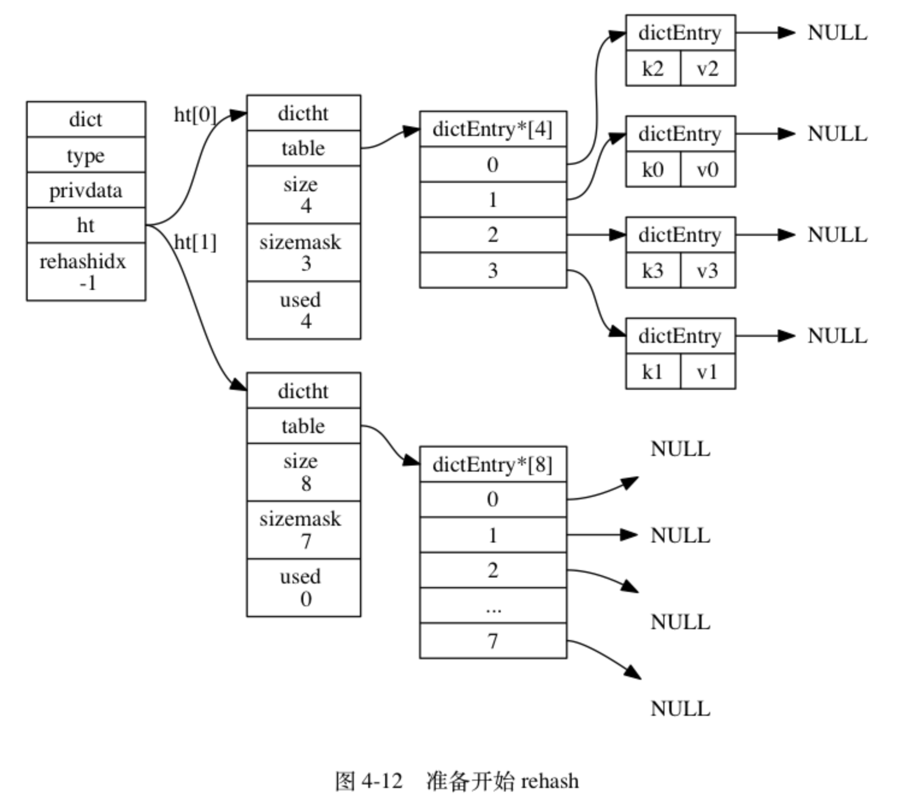
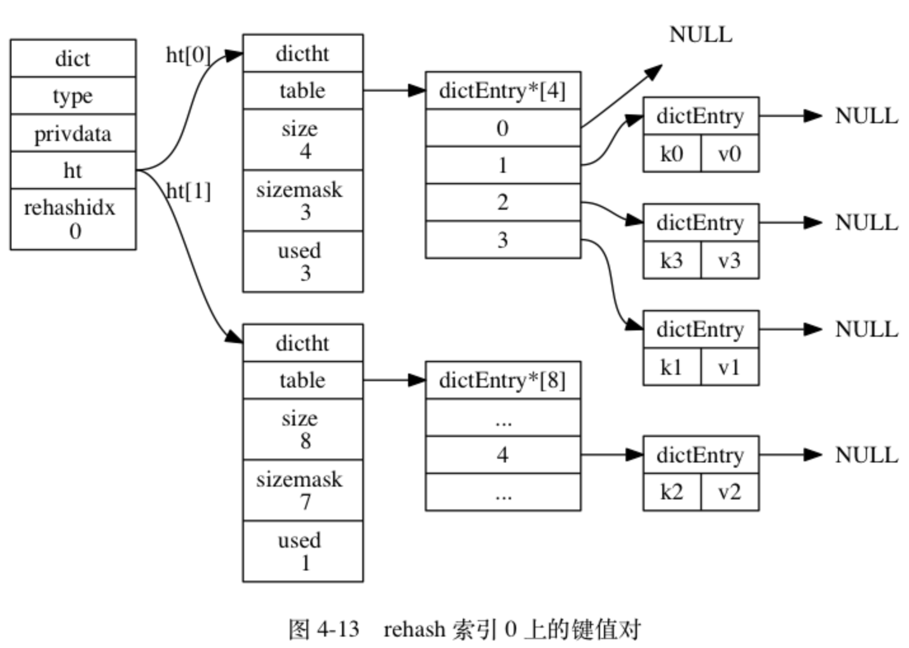
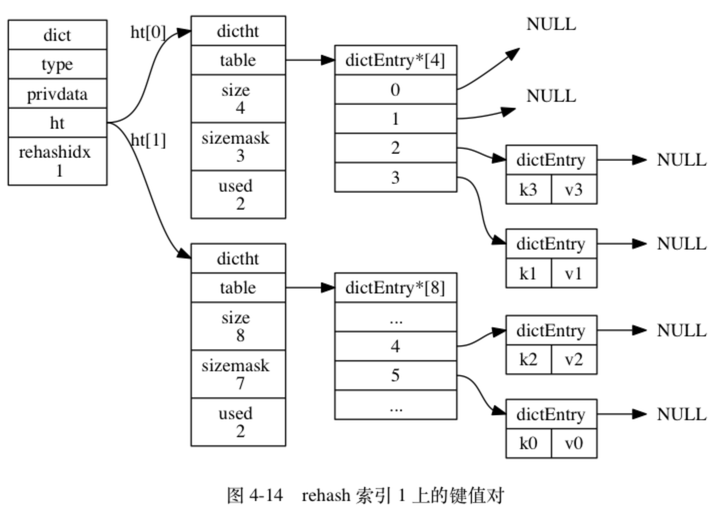
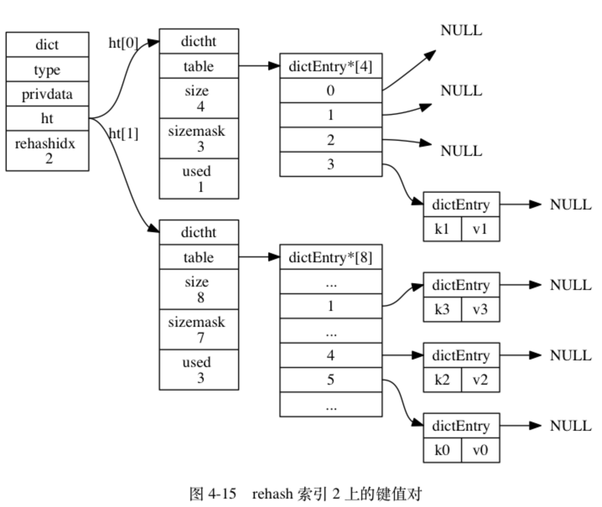
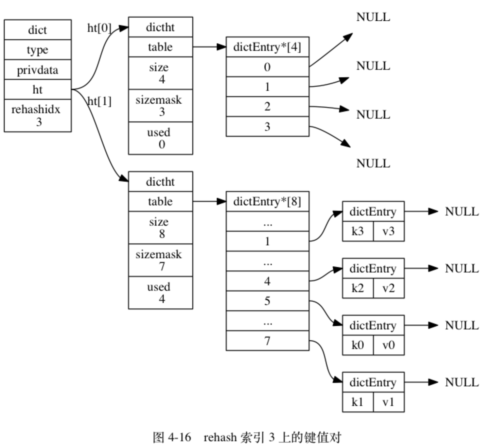
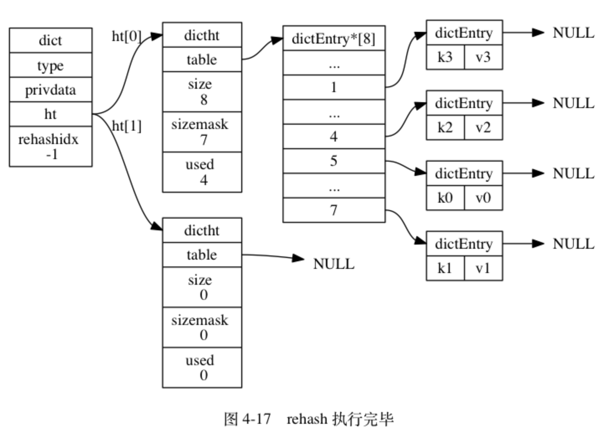

# redis为啥快
> redis是单线程的多路复用IO，单线程避免了线程切换的开销，而多路复用避免了IO等待的开销

> redis6.0引入了多线程，但是，需要提醒大家的是，Redis 6.0中的多线程，也只是针对处理网络请求过程采用了多线程，而数据的读写命令，仍然是单线程处理的。
>
> 在多路复用的IO模型中，在处理网络请求时，调用 select （其他函数同理）的过程是阻塞的，也就是说这个过程会阻塞线程，如果并发量很高，此处可能会成为瓶颈。
>
> 如果能采用多线程，使得网络处理的请求并发进行，就可以大大的提升性能。多线程除了可以减少由于网络 I/O 等待造成的影响，还可以充分利用 CPU 的多核优势。

## 渐进式哈希
[详细](http://redisbook.com/preview/dict/incremental_rehashing.html)

扩展或收缩哈希表需要将 ht[0] 里面的所有键值对 rehash 到 ht[1] 里面， 但是， 这个 rehash 动作并不是一次性、集中式地完成的， 而是分多次、渐进式地完成的。

这样做的原因在于， 如果 ht[0] 里只保存着四个键值对， 那么服务器可以在瞬间就将这些键值对全部 rehash 到 ht[1] ； 但是， 如果哈希表里保存的键值对数量不是四个， 而是四百万、四千万甚至四亿个键值对， 那么要一次性将这些键值对全部 rehash 到 ht[1] 的话， 庞大的计算量可能会导致服务器在一段时间内停止服务。

因此， 为了避免 rehash 对服务器性能造成影响， 服务器不是一次性将 ht[0] 里面的所有键值对全部 rehash 到 ht[1] ， 而是分多次、渐进式地将 ht[0] 里面的键值对慢慢地 rehash 到 ht[1] 。

以下是哈希表渐进式 rehash 的详细步骤：
1. 为 ht[1] 分配空间， 让字典同时持有 ht[0] 和 ht[1] 两个哈希表。
2. 在字典中维持一个索引计数器变量 rehashidx ， 并将它的值设置为 0 ， 表示 rehash 工作正式开始。
3. 在 rehash 进行期间， 每次对字典执行添加、删除、查找或者更新操作时， 程序除了执行指定的操作以外， 还会顺带将 ht[0] 哈希表在 rehashidx 索引上的所有键值对 rehash 到 ht[1] ， 当 rehash 工作完成之后， 程序将 rehashidx 属性的值增一。
4. 随着字典操作的不断执行， 最终在某个时间点上， ht[0] 的所有键值对都会被 rehash 至 ht[1] ， 这时程序将 rehashidx 属性的值设为 -1 ， 表示 rehash 操作已完成。

渐进式 rehash 的好处在于它采取分而治之的方式， 将 rehash 键值对所需的计算工作均滩到对字典的每个添加、删除、查找和更新操作上， 从而避免了集中式 rehash 而带来的庞大计算量。

### 渐进式 rehash 执行期间的哈希表操作
因为在进行渐进式 rehash 的过程中， 字典会同时使用 ht[0] 和 ht[1] 两个哈希表， 所以在渐进式 rehash 进行期间， 字典的删除（delete）、查找（find）、更新（update）等操作会在两个哈希表上进行： 比如说， 要在字典里面查找一个键的话， 程序会先在 ht[0] 里面进行查找， 如果没找到的话， 就会继续到 ht[1] 里面进行查找， 诸如此类。

另外， 在渐进式 rehash 执行期间， 新添加到字典的键值对一律会被保存到 ht[1] 里面， 而 ht[0] 则不再进行任何添加操作： 这一措施保证了 ht[0] 包含的键值对数量会只减不增， 并随着 rehash 操作的执行而最终变成空表。

# redis并发问题
## 一、 如何解决缓存雪崩
### 什么是缓存雪崩
> - Redis挂掉了，请求全部走数据库
> - 对缓存数据设置相同的过期时间（不可能把所有的数据都缓存起来(内存昂贵且有限)），导致某段时间内缓存失效，请求全部走数据库

### 解决方法：
对于“对缓存数据设置相同的过期时间，导致某段时间内缓存失效，请求全部走数据库。”这种情况，非常好解决：
> 在缓存的时候给过期时间加上一个随机值，这样就会大幅度的减少缓存在同一时间过期。

对于“Redis挂掉了，请求全部走数据库”这种情况，我们可以有以下的思路
> - 事发前：实现Redis的高可用(主从架构+Sentinel 或者Redis Cluster)，尽量避免Redis挂掉这种情况发生。
> - 事发中：万一Redis真的挂了，我们可以设置本地缓存(ehcache)+限流(hystrix)，尽量避免我们的数据库被干掉(起码能保证我们的服务还是能正常工作的)
> - 事发后：redis持久化，重启后自动从磁盘上加载数据，快速恢复缓存数据。
## 二、缓存穿透
### 是什么
> 缓存穿透是指查询一个一定不存在的数据。由于缓存不命中，并且出于容错考虑，如果从数据库查不到数据则不写入缓存，这将导致这个不存在的数据每次请求都要到数据库去查询，失去了缓存的意义
### 解决方案：
> - 由于请求的参数是不合法的(每次都请求不存在的参数)，于是我们可以使用布隆过滤器(BloomFilter)或者压缩filter提前拦截，不合法就不让这个请求到数据库层！
> - 当我们从数据库找不到的时候，我们也将这个空对象设置到缓存里边去。下次再请求的时候，就可以从缓存里边获取了。
> 这种情况我们一般会将空对象设置一个较短的过期时间。

## 三、缓存与数据库双写一致
### 读操作流程
> - 如果我们的数据在缓存里边有，那么就直接取缓存的。
> - 如果缓存里没有我们想要的数据，我们会先去查询数据库，然后将数据库查出来的数据写到缓存中。
> - 最后将数据返回给请求

### 缓存与数据库双写一致问题
> 当我们要更新时候, 各种情况很可能就造成数据库和缓存的数据不一致了

### 解决方案
- 先删除缓存，再更新数据库
(1. 删除缓存直接和简单很多，2. 体现懒加载，所以应该删除缓存而不是更新缓存)
> 1. 如果原子性被破坏：
> - 第一步成功(删除缓存)，第二步失败(更新数据库)，数据库和缓存的数据还是一致的。
> - 如果第一步(删除缓存)就失败了，我们可以直接返回错误(Exception)，数据库和缓存的数据还是一致的。
> 2. 高并发下
> - 线程A删除了缓存
> - 线程B查询，发现缓存已不存在
> - 线程B去数据库查询得到旧值
> - 线程B将旧值写入缓存
> - 线程A将新值写入数据库
>
> 总结：
> 在高并发下表现不如意，在原子性被破坏时表现优异

- 先更新数据库，再删除缓存(Cache Aside Pattern设计模式)
> 1. 如果原子性被破坏了：
> - 第一步成功(操作数据库)，第二步失败(删除缓存)，会导致数据库里是新数据，而缓存里是旧数据。
> - 如果第一步(操作数据库)就失败了，我们可以直接返回错误(Exception)，不会出现数据不一致。
> 2. 高并发下
> - 缓存刚好失效
> - 线程A查询数据库，得一个旧值
> - 线程B将新值写入数据库
> - 线程B删除缓存
> - 线程A将查到的旧值写入缓存

>总结：
>  在高并发下表现优异，在原子性被破坏时表现不如意

# 主从复制流程
> 1. slave节点接受slaveof命令，向master发起tcp连接
> 2. master与slave(此时只认为是一个普通的client)端建立tcp连接
> 3. client发送PING命令，确认对方是一个redis实例
> 4. master响应PING命令并发送PONG回复表示master OK
> 5. slave(此时认为是一个slave节点了)发送SYNC同步命令
> 6. master把slae添加进slave列表，并启动一个子线程保存RDB文件，当RDB文件保存成功时，向所有slave发送数据
