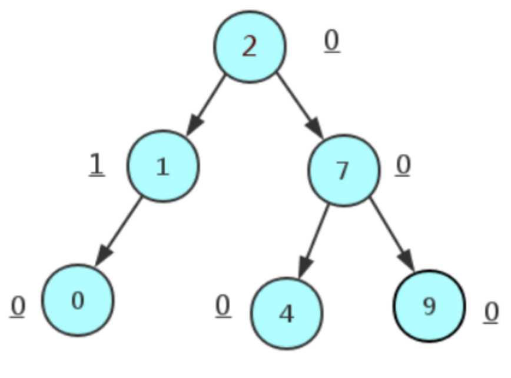
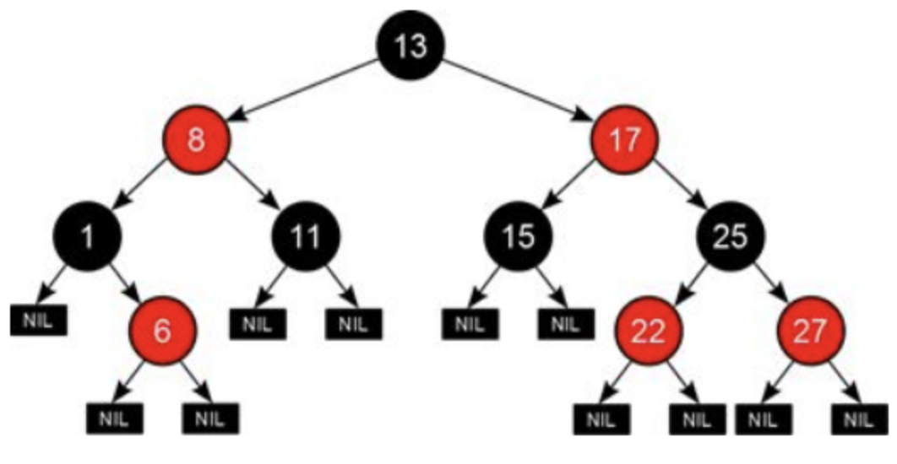

# AVL树
循环的时间复杂度为O(log2n)

## 简介

AVL树是带有平衡条件的二叉查找树,一般是用平衡因子差值判断是否平衡并通过旋转来实现平衡,左右子树树高不超过1,和红黑树相比,它是严格的平衡二叉树,平衡条件必须满足(所有节点的左右子树高度差不超过1)。不管我们是执行插入还是删除操作,只要不满足上面的条件,就要通过旋转来保持平衡,而旋转是非常耗时的,由此我们可以知道AVL树适合用于插入删除次数比较少，但查找多的情况。

## 局限性
由于维护这种高度平衡所付出的代价比从中获得的效率收益还大,故而实际的应用不多，更多的地方是用追求局部而不是非常严格整体平衡的红黑树.当然,如果应用场景中对插入删除不频繁,只是对查找要求较高,那么AVL还是较优于红黑树. 查找效率：O(longn)。

## 应用
Windows进程地址空间管理

# 红黑树

## 简介

一种二叉查找树,但在每个节点增加一个存储位表示节点的颜色,可以是red或black. 通过对任何一条从根到叶子的路径上各个节点着色的方式的限制,红黑树确保没有一条路径会比其它路径长出两倍.它是一种弱平衡二叉树(由于是弱平衡,可以推出,相同的节点情况下,AVL树的高度低于红黑树),相对于要求严格的AVL树来说,它的旋转次数变少,所以对于搜索,插入,删除操作多的情况下,我们就用红黑树.

它虽然是复杂的，但它的最坏情况运行时间也是非常良好的，并且在实践中是高效的： 它可以在O(log2 n)（2为底）时间内做查找，插入和删除，这里的n 是树中元素的数目。

## 性质
- 每个节点非红即黑.
- 根节点是黑的。
- 每个叶节点(叶节点即树尾端NUL指针或NULL节点)都是黑的.
- 如果一个节点是红的,那么它的两儿子都是黑的.
- 对于任意节点而言,其到叶子节点的每条路径都包含相同数目的黑节点.

## 应用
- 广泛用于C++的STL中,map和set都是用红黑树实现的.
- 著名的linux进程调度Completely Fair Scheduler,用红黑树管理进程控制块,进程的虚拟内存区域都存储在一颗红黑树上,每个虚拟地址区域都对应红黑树的一个节点,左指针指向相邻的地址虚拟存储区域,右指针指向相邻的高地址虚拟地址空间.
- IO多路复用epoll的实现采用红黑树组织管理sockfd，以支持快速的增删改查.
- ngnix中,用红黑树管理timer,因为红黑树是有序的,可以很快的得到距离当前最小的定时器.
- java中TreeMap的实现.