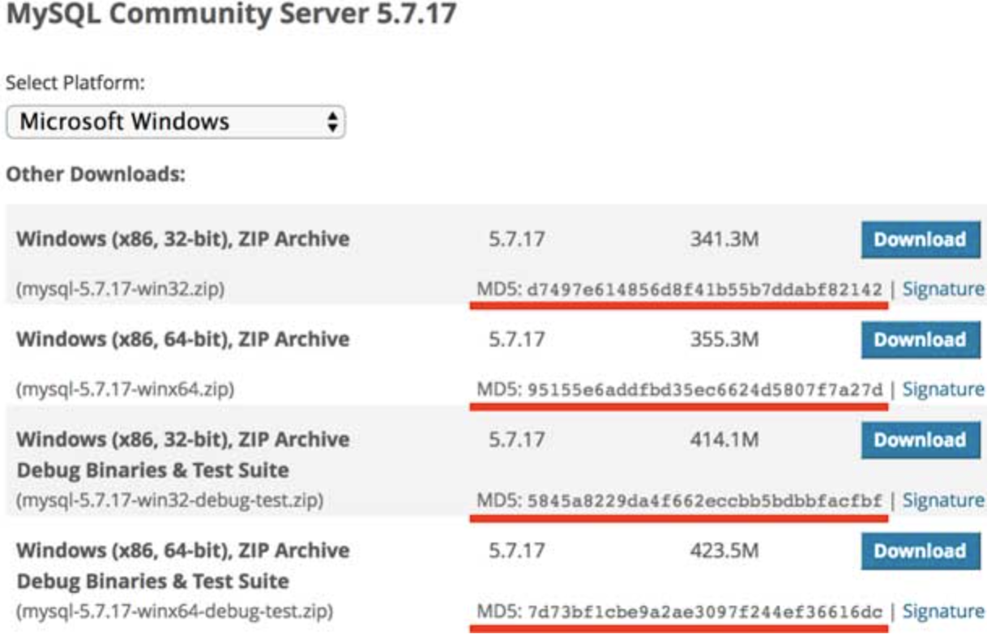
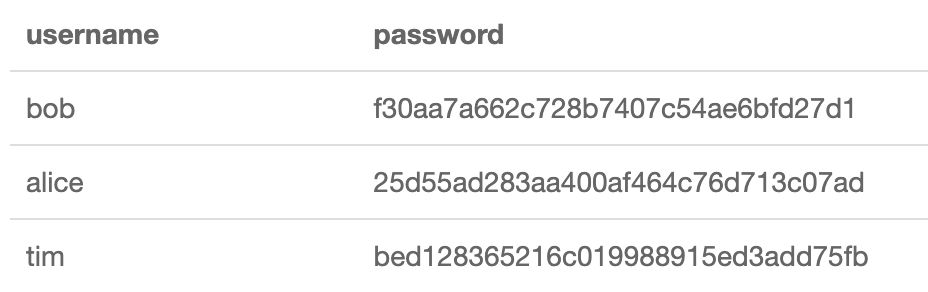
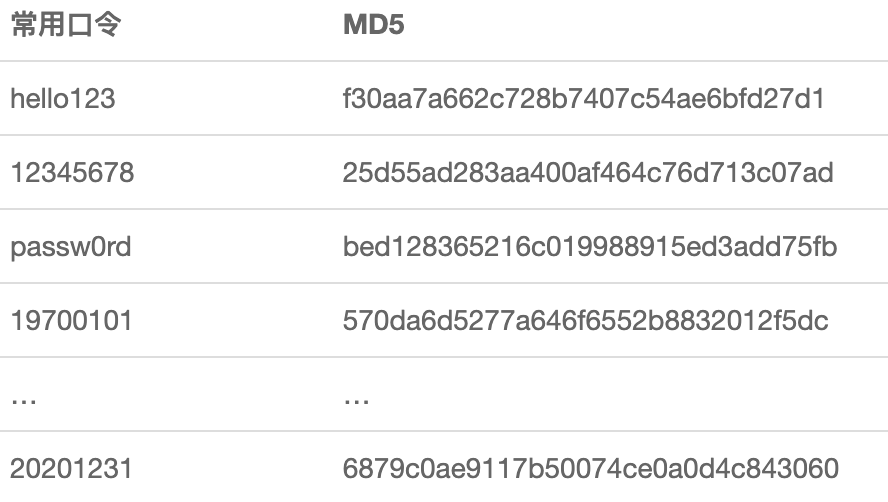

# HTTPS
HTTP 有以下安全性问题：
- 使用明文进行通信，内容可能会被窃听；
- 不验证通信方的身份，通信方的身份有可能遭遇伪装；
- 无法证明报文的完整性，报文有可能遭篡改。

<font color=green>HTTPS其实就是将HTTP的数据包再通过SSL/TLS加密后传输</font>

SSL（Secure Sockets Layer）安全套接层和TLS（Transport Layer Security）传输层安全协议其实是一套东西。

## HTTPS工作流程
1. 用户在浏览器发起HTTPS请求，默认使用服务端的443端口进行连接；
2. 服务端收到请求，生成一对公私钥，去经过认证的CA机构申请颁发一份数字证书，数字证书里包含有证书持有者、证书有效期、服务器生成的公钥等信息。CA机构在颁发证书时会对证书明文信息进行哈希，然后使用CA机构的私钥进行加密，得到数字签名；
3. 服务端返回配置好的包含公钥Pub的证书给客户端；
4. 客户端收到证书，将证书分解成明文部分和数字签名，用操作系统或浏览器内置的CA机构的公钥进行解签，得到一个值A，再用证书里声明的哈希算法对明文进行哈希得到另一个值B，然后对比A和B，如果相等，则证明证书没有被篡改，然后再校验合法性，主要包括是否在有效期内、证书的域名与请求的域名是否匹配，上一级证书是否有效（递归判断，直到判断到系统内置或浏览器配置好的根证书），如果不通过，则显示HTTPS警告信息，如果通过则继续；
5. 客户端生成一个用于对称加密的随机Key，并用证书内的公钥Pub进行加密，发送给服务端；
6. 服务端收到随机Key的密文，使用与公钥Pub配对的私钥Private进行解密，得到客户端真正想发送的随机Key；
7. 服务端使用客户端发送过来的随机Key对要传输的HTTP数据进行对称加密，将密文返回客户端；
8. 客户端使用随机Key对称解密密文，得到HTTP数据明文；
9. 后续HTTPS请求使用之前交换好的随机Key进行对称加解密。

# 对称加密算法
AES

# 非对称加密算法
RSA

# 哈希算法
哈希算法（Hash）又称摘要算法（Digest），它的作用是：对任意一组输入数据进行计算，得到一个固定长度的输出摘要。

哈希算法最重要的特点就是：

- 相同的输入一定得到相同的输出；
- 不同的输入大概率得到不同的输出。

## 常用哈希算法
| 算法	| 输出长度（位）| 输出长度（字节）|
| ---- | ---- | ----|
|MD5	|128 bits	|16 bytes
|SHA-1	|160 bits	|20 bytes
|RipeMD-160	|160 bits	|20 bytes
|SHA-256	|256 bits	|32 bytes
| SHA-512	|512 bits	|64 bytes

## 哈希算法的用途
因为相同的输入永远会得到相同的输出，因此，如果输入被修改了，得到的输出就会不同。

我们在网站上下载软件的时候，经常看到下载页显示的哈希：



如何判断下载到本地的软件是原始的、未经篡改的文件？我们只需要自己计算一下本地文件的哈希值，再与官网公开的哈希值对比，如果相同，说明文件下载正确，否则，说明文件已被篡改。

哈希算法的另一个重要用途是存储用户口令。如果直接将用户的原始口令存放到数据库中，会产生极大的安全风险：

- 数据库管理员能够看到用户明文口令；
- 数据库数据一旦泄漏，黑客即可获取用户明文口令。
不存储用户的原始口令，那么如何对用户进行认证？

方法是存储用户口令的哈希，例如，MD5。

在用户输入原始口令后，系统计算用户输入的原始口令的MD5并与数据库存储的MD5对比，如果一致，说明口令正确，否则，口令错误。

因此，数据库存储用户名和口令的表内容应该像下面这样：



这样一来，数据库管理员看不到用户的原始口令。即使数据库泄漏，黑客也无法拿到用户的原始口令。想要拿到用户的原始口令，必须用暴力穷举的方法，一个口令一个口令地试，直到某个口令计算的MD5恰好等于指定值。

使用哈希口令时，还要注意防止彩虹表攻击。

什么是彩虹表呢？上面讲到了，如果只拿到MD5，从MD5反推明文口令，只能使用暴力穷举的方法。

然而黑客并不笨，暴力穷举会消耗大量的算力和时间。但是，如果有一个预先计算好的常用口令和它们的MD5的对照表：



这个表就是彩虹表。如果用户使用了常用口令，黑客从MD5一下就能反查到原始口令：

bob的MD5：<kbd>f30aa7a662c728b7407c54ae6bfd27d1</kbd>，原始口令：<kbd>hello123</kbd>；

alice的MD5：<kbd>25d55ad283aa400af464c76d713c07ad</kbd>，原始口令：<kbd>12345678</kbd>；

tim的MD5：<kbd>bed128365216c019988915ed3add75fb</kbd>，原始口令：<kbd>passw0rd</kbd>。

这就是为什么不要使用常用密码，以及不要使用生日作为密码的原因。

即使用户使用了常用口令，我们也可以采取措施来抵御彩虹表攻击，方法是对每个口令额外添加随机数，这个方法称之为加盐（salt）：
```
digest = md5(salt+inputPassword)
```

加盐的目的在于使黑客的彩虹表失效，即使用户使用常用口令，也无法从MD5反推原始口令。