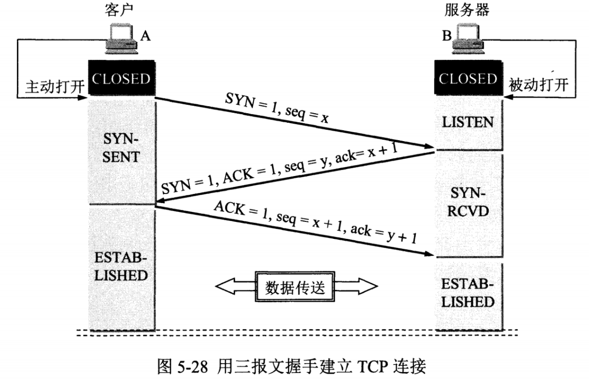
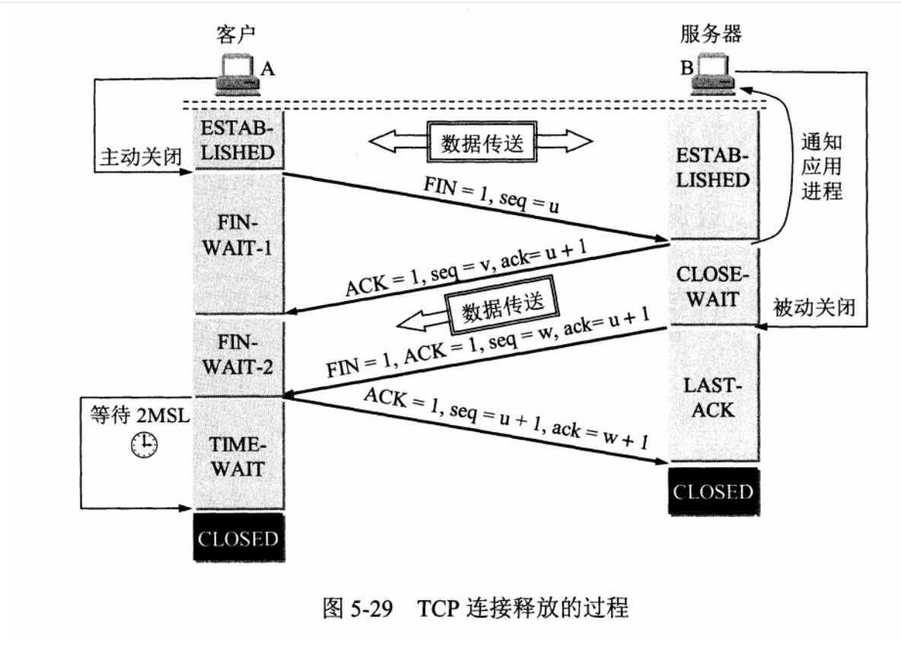
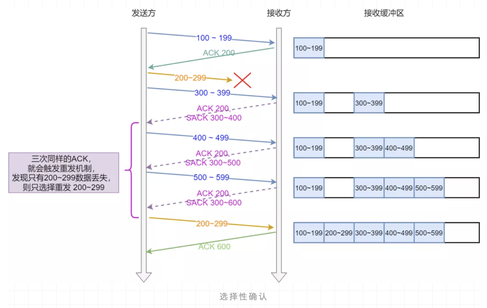
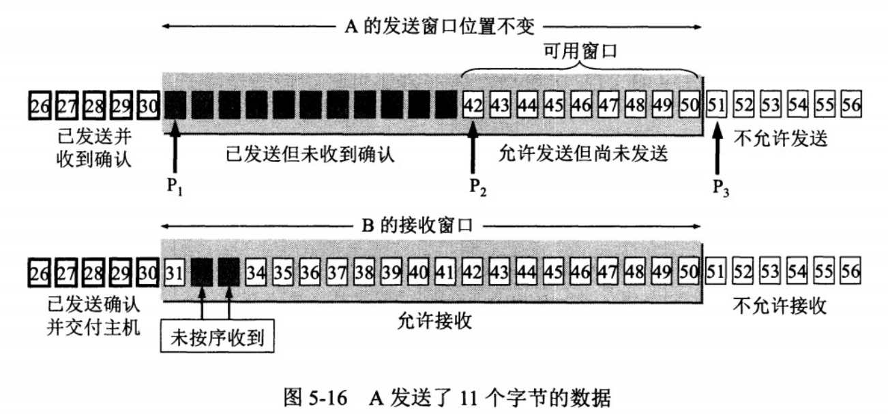
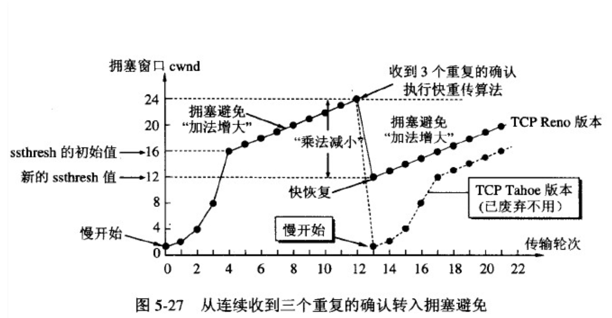

# TCP
## TCP用来解决什么问题
TCP 即 Transmission Control Protocol，可以看到是一个传输控制协议，重点就在这个控制。

控制可靠、按序地传输以及端与端之间的流量控制，还需要为整体网络的情况考虑，所以加上拥塞控制。

## 为什么要TCP，而不是IP层实现控制
IP层涉及到的设备很多，一条数据在网络上传输需要经过很多设备，而设备之间需要靠IP来寻址，假设IP层实现了控制，涉及到的设备都需要关心很多事情，整体传输的效率大打折扣。

所以把控制的逻辑独立出来成TCP层，让真正的接收端来处理，这样网络整体的传输效率就高了。

## 何为TCP连接
TCP是面向连接的，所谓的连接其实只是双方都维护了一个状态，通过每一次通信来维护状态的变更。

## 三次握手

假设 A 为客户端，B 为服务器端。

> - 首先 B 处于 LISTEN（监听）状态，等待客户的连接请求。
>
> - A 向 B 发送连接请求报文，SYN=1，ACK=0，选择一个初始的序号 x。
>
>- B 收到连接请求报文，如果同意建立连接，则向 A 发送连接确认报文，SYN=1，ACK=1，确认号为 x+1，同时也选择一个初始的序号 y。
>
> - A 收到 B 的连接确认报文后，还要向 B 发出确认，确认号为 y+1，序号为 x+1。
>
> - B 收到 A 的确认后，连接建立。
### 三次握手的原因
第三次握手是为了防止失效的连接请求到达服务器，让服务器错误打开连接。

客户端发送的连接请求如果在网络中滞留，那么就会隔很长一段时间才能收到服务器端发回的连接确认。客户端等待一个超时重传时间之后，就会重新请求连接。但是这个滞留的连接请求最后还是会到达服务器，如果不进行三次握手，那么服务器就会打开两个连接。如果有第三次握手，客户端会忽略服务器之后发送的对滞留连接请求的连接确认，不进行第三次握手，因此就不会再次打开连接。

### 初始序列号ISN的取值
想象一下如果写死一个值，比如 0 ，那么假设已经建立好连接了，client 也发了很多包比如已经第 20 个包了，然后网络断了之后 client 重新，端口号还是之前那个，然后序列号又从 0 开始，此时服务端返回第 20 个包的ack，客户端是不是傻了？

所以 RFC793 中认为 ISN 要和一个假的时钟绑定在一起，ISN 每四微秒加一，当超过 2 的 32 次方之后又从 0 开始，要四个半小时左右发生 ISN 回绕。

所以 ISN 变成一个递增值，真实的实现还需要加一些随机值在里面，防止被不法份子猜到 ISN。

## 四次挥手

> - A 发送连接释放报文，FIN=1。
>
>- B 收到之后发出确认，此时 TCP 属于半关闭状态，B 能向 A 发送数据但是 A 不能向 B 发送数据。
>
> - 当 B 不再需要连接时，发送连接释放报文，FIN=1。
>
> - A 收到后发出确认，进入 TIME-WAIT 状态，等待 2 MSL（最大报文存活时间）后释放连接。
>
> - B 收到 A 的确认后释放连接。
### 四次挥手原因
因为 TCP 是全双工协议，也就是说双方都要关闭，每一方都向对方发送 FIN 和回应 ACK。

### 为什么要有 TIME_WAIT
客户端接收到服务器端的 FIN 报文后进入此状态，此时并不是直接进入 CLOSED 状态，还需要等待一个时间计时器设置的时间 2MSL。这么做有两个理由：

> - 确保最后一个确认报文能够到达。如果 B 没收到 A 发送来的确认报文，那么就会重新发送连接释放请求报文，A 等待一段时间就是为了处理这种情况的发生。
>
>- 等待一段时间是为了让本连接持续时间内所产生的所有报文都从网络中消失，使得下一个新的连接不会出现旧的连接请求报文。

### 等待 2MSL 会产生什么问题
如果服务器主动关闭大量的连接，那么会出现大量的资源占用，需要等到 2MSL 才会释放资源。

如果是客户端主动关闭大量的连接，那么在 2MSL 里面那些端口都是被占用的，端口只有 65535 个，如果端口耗尽了就无法发起送的连接了，不过我觉得这个概率很低，这么多端口你这是要建立多少个连接？

## SYN超时怎么办？
> 客户端发送SYN至服务端，然后就挂了，此时服务端发送SYN+ACK就一直得不到回复，于是它会慢慢重试，阶梯性重试，比如linux默认重试5次，间隔是1s，2s，4s，8s，16s，再第五次还得等32s才能知道这次重试的结果，所以一共等63s才能断开连接。

## SYN Flood攻击
> SYN超时需要耗费服务端63s才会断开连接，也就是说63s内服务端需要保持足够资源，所以坏人就有可能构造出大量的客户端向服务端发送SYN，但就是不回复，使得服务端的SYN队列耗尽，无法处理正常的连接请求。

### 解决
> 可以开启 tcp_syncookies，那就用不到 SYN 队列了。
> SYN 队列满了之后 TCP 根据自己的 ip、端口、然后对方的 ip、端口，对方 SYN 的序号，时间戳等一波操作生成一个特殊的序号（即 cookie）发回去，如果对方是正常的 client 会把这个序号发回来，然后 server 根据这个序号建连。
或者调整 tcp_synack_retries 减少重试的次数，设置 tcp_max_syn_backlog 增加 SYN 队列数，设置 tcp_abort_on_overflow SYN 队列满了直接拒绝连接。

## 为什么还要快重传
超时重传是按时间来驱动的，如果是网络状况真的不好的情况，超时重传没问题，但是如果网络状况好的时候，只是恰巧丢包了，那等这么长时间就没必要。

于是又引入了数据驱动的重传叫快速重传，什么意思呢？就是发送方如果连续三次收到对方相同的确认号，那么马上重传数据。

因为连续收到三次相同 ACK 证明当前网络状况是 ok 的，那么确认是丢包了，于是立马重发，没必要等这么久。

看起来好像挺完美的，但是你有没有想过我发送1、2、3、4这4个包，就 2 对方没收到，1、3、4都收到了，然后不管是超时重传还是快速重传反正对方就回 ACK 2。

这时候要重传 2、3、4 呢还是就 2 呢？
## SACK 
SACK 即 Selective Acknowledgment，它的引入就是为了解决发送方不知道该重传哪些数据的问题。

SACK 就是接收方会回传它已经接受到的数据，这样发送方就知道哪一些数据对方已经收到了，所以就可以选择性的发送丢失的数据。

如图，通过 ACK 告知我接下来要 5500 开始的数据，并一直更新 SACK，6000-6500 我收到了，6000-7000的数据我收到了，6000-7500的数据我收到了，发送方很明确的知道，5500-5999 的那一波数据应该是丢了，于是重传。

而且如果数据是多段不连续的， SACK 也可以发送，比如 SACK 0-500,1000-1500，2000-2500。就表明这几段已经收到了。

## D-SACK
D-SACK 其实是 SACK 的扩展，它利用 SACK 的第一段来描述重复接受的不连续的数据序号，如果第一段描述的范围被 ACK 覆盖，说明重复了，比如我都 ACK 到6000了你还给我回 SACK 5000-5500 呢？

说白了就是从第一段的反馈来和已经接受到的 ACK 比一比，参数是 tcp_dsack，Linux 2.4 之后默认开启。

那知道重复了有什么用呢？

1、知道重复了说明对方收到刚才那个包了，所以是回来的 ACK 包丢了。2、是不是包乱序的，先发的包后到？3、是不是自己太着急了，RTO 太小了？4、是不是被数据复制了，抢先一步呢？

## 流量控制
流量控制是为了控制发送方发送速率，保证接收方来得及接收。

接收方发送的确认报文中的窗口字段可以用来控制发送方窗口大小，从而影响发送方的发送速率。将窗口字段设置为 0，则发送方不能发送数据。

### 滑动窗口
窗口是缓存的一部分，用来暂时存放字节流。发送方和接收方各有一个窗口，接收方通过 TCP 报文段中的窗口字段告诉发送方自己的窗口大小，发送方根据这个值和其它信息设置自己的窗口大小。

发送窗口内的字节都允许被发送，接收窗口内的字节都允许被接收。如果发送窗口左部的字节已经发送并且收到了确认，那么就将发送窗口向右滑动一定距离，直到左部第一个字节不是已发送并且已确认的状态；接收窗口的滑动类似，接收窗口左部字节已经发送确认并交付主机，就向右滑动接收窗口。

接收窗口只会对窗口内最后一个按序到达的字节进行确认，例如接收窗口已经收到的字节为 {31, 34, 35}，其中 {31} 按序到达，而 {34, 35} 就不是，因此只对字节 31 进行确认。发送方得到一个字节的确认之后，就知道这个字节之前的所有字节都已经被接收。

## 已经有滑动窗口了为什么还要拥塞控制
 TCP 不仅仅就管两端之间的情况，还需要知晓一下整体的网络情形。

 如果不管网络整体情况，当发送方没有接收到ACK，就重传，如果此时网络状况很差，所有的连接都重传，就会使网络情况更差。

 ## 拥塞控制
 
慢启动，初始化 cwnd（Congestion Window）为 1，然后每收到一个 ACK 就 cwnd++ 并且每过一个RTT(一个报文段从发送再到接收到确认所经过的时间称为往返时间) ，cwnd = 2*cwnd 。

然后到了一个阈值，也就是 ssthresh（slow start threshold，慢开始门限）的时候就进入了拥塞避免阶段。

每收到一个 ACK 就 cwnd = cwnd + 1/cwnd并且每一个 RTT 就 cwnd++。可以看到都是线性增。

然后就是一直增，直到开始丢包的情况发生，前面已经分析到重传有两种，一种是超时重传，一种是快速重传。

如果发生超时重传的时候，那说明情况有点糟糕，于是直接把 ssthresh 置为当前 cwnd 的一半，然后 cwnd 直接变为 1，进入慢启动阶段。

如果是快速重传，那么这里有两种实现，一种是 TCP Tahoe ，和超时重传一样的处理。

一种是 TCP Reno，这个实现是把 cwnd = cwnd/2 ，然后把 ssthresh 设置为当前的 cwnd。

然后进入快速恢复阶段，将 cwnd = cwnd + 3（因为快速重传有三次），重传 DACK 指定的包，如果再收到一个DACK则 cwnd++，如果收到是正常的 ACK 那么就将 cwnd 设为 ssthresh 大小，进入拥塞避免阶段。

