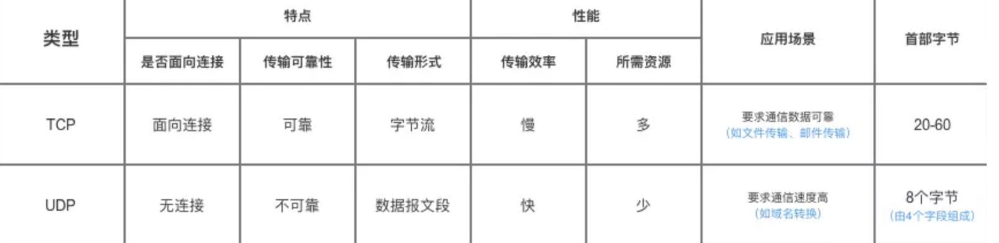
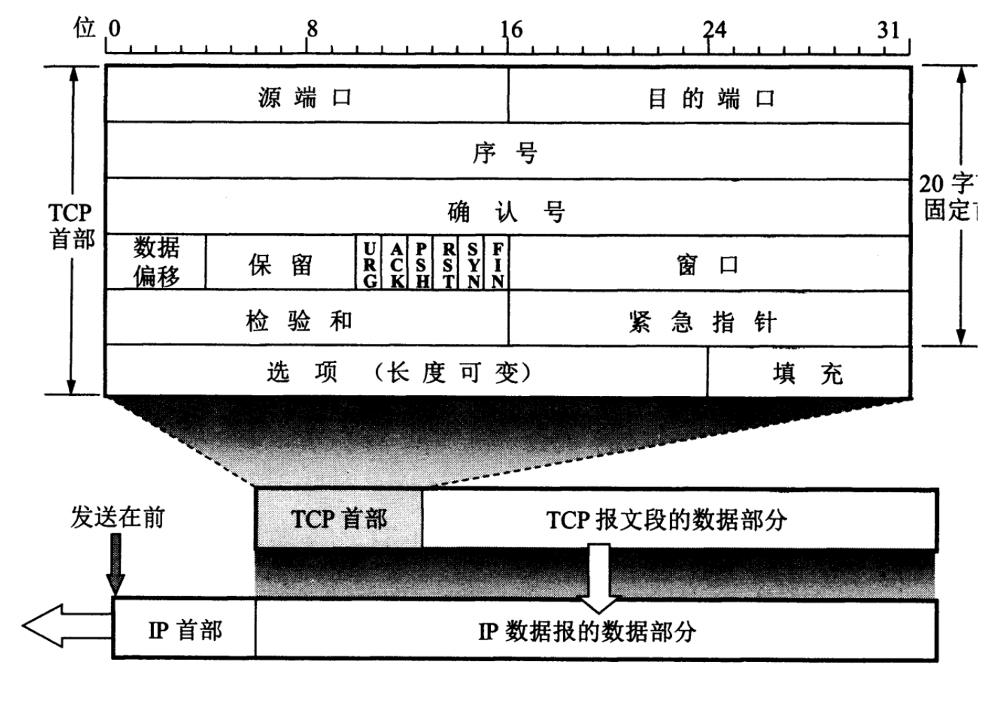
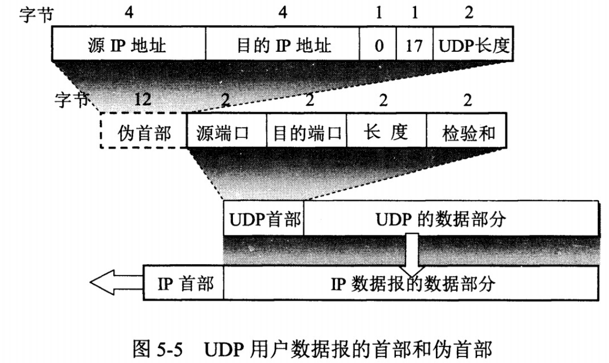
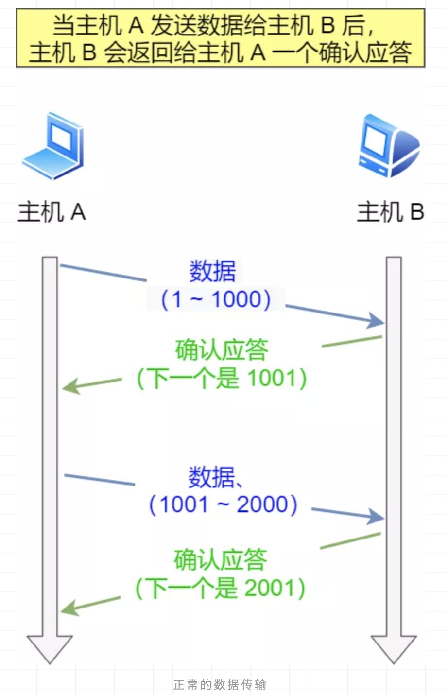
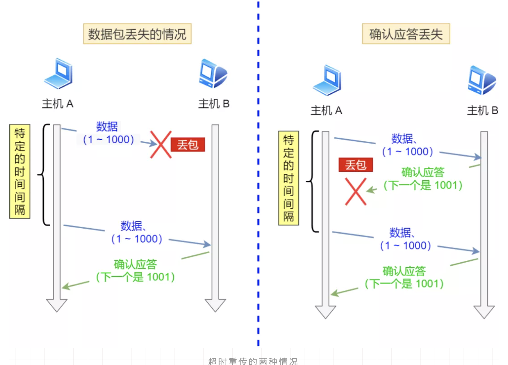
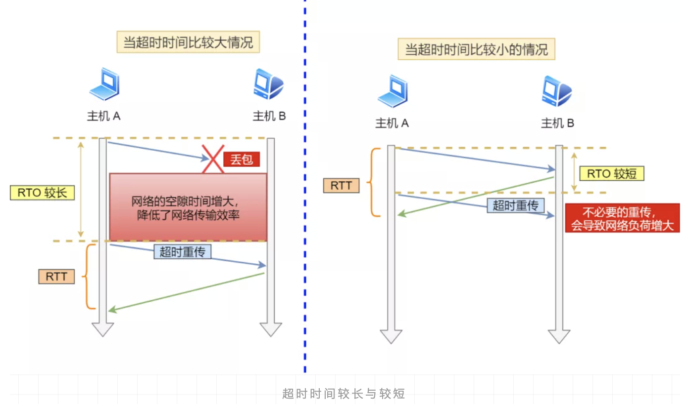
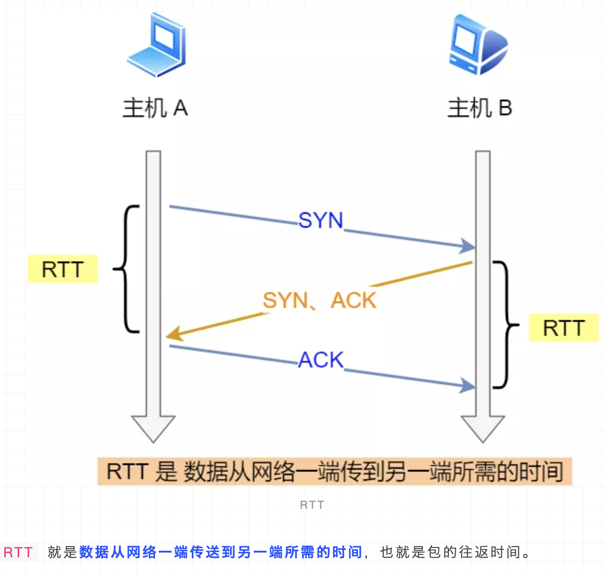
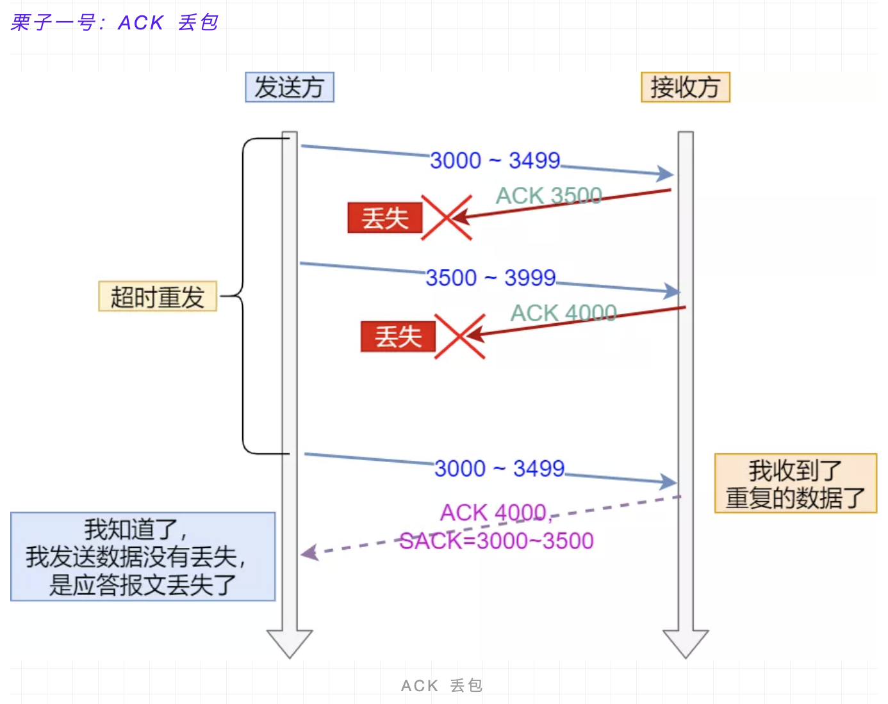
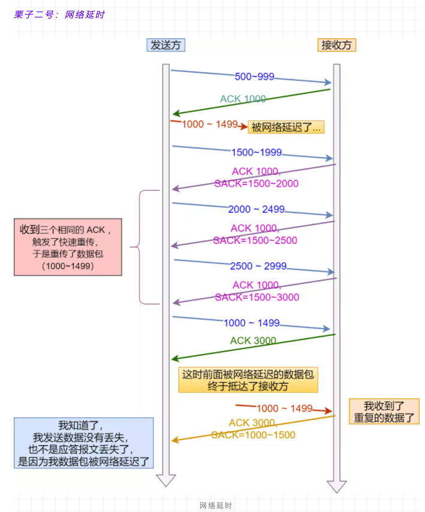
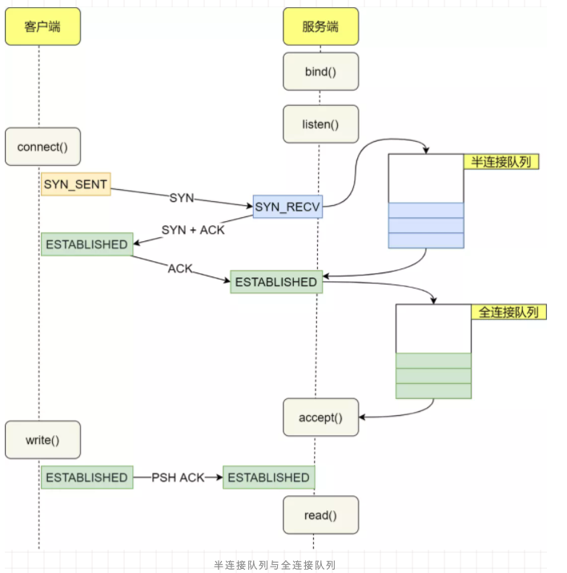

# TCP和UDP比较

- 用户数据报协议 UDP（User Datagram Protocol）是无连接的，尽最大可能交付，没有拥塞控制，面向报文（对于应用程序传下来的报文不合并也不拆分，只是添加 UDP 首部），支持一对一、一对多、多对一和多对多的交互通信。

- 传输控制协议 TCP（Transmission Control Protocol）是面向连接的，提供可靠交付，有流量控制，拥塞控制，提供全双工通信，面向字节流（把应用层传下来的报文看成字节流，把字节流组织成大小不等的数据块），每一条 TCP 连接只能是点对点的（一对一）。

- 序号 ：用于对字节流进行编号，例如序号为 301，表示第一个字节的编号为 301，如果携带的数据长度为 100 字节，那么下一个报文段的序号应为 401。

- 确认号 ：期望收到的下一个报文段的序号。例如 B 正确收到 A 发送来的一个报文段，序号为 501，携带的数据长度为 200 字节，因此 B 期望下一个报文段的序号为 701，B 发送给 A 的确认报文段中确认号就为 701。

- 数据偏移 ：指的是数据部分距离报文段起始处的偏移量，实际上指的是首部的长度。

- 确认 ACK ：当 ACK=1 时确认号字段有效，否则无效。TCP 规定，在连接建立后所有传送的报文段都必须把 ACK 置 1。

- 同步 SYN ：在连接建立时用来同步序号。当 SYN=1，ACK=0 时表示这是一个连接请求报文段。若对方同意建立连接，则响应报文中 SYN=1，ACK=1。

- 终止 FIN ：用来释放一个连接，当 FIN=1 时，表示此报文段的发送方的数据已发送完毕，并要求释放连接。

- 窗口 ：窗口值作为接收方让发送方设置其发送窗口的依据。之所以要有这个限制，是因为接收方的数据缓存空间是有限的。

首部字段只有 8 个字节，包括源端口、目的端口、长度、检验和。12 字节的伪首部是为了计算检验和临时添加的。

# TCP
## TCP用来解决什么问题
TCP 即 Transmission Control Protocol，可以看到是一个传输控制协议，重点就在这个控制。

控制可靠、按序地传输以及端与端之间的流量控制，还需要为整体网络的情况考虑，所以加上拥塞控制。

## 为什么要TCP，而不是IP层实现控制
IP层涉及到的设备很多，一条数据在网络上传输需要经过很多设备，而设备之间需要靠IP来寻址，假设IP层实现了控制，涉及到的设备都需要关心很多事情，整体传输的效率大打折扣。

所以把控制的逻辑独立出来成TCP层，让真正的接收端来处理，这样网络整体的传输效率就高了。

## 何为TCP连接
TCP是面向连接的，所谓的连接其实只是双方都维护了一个状态，通过每一次通信来维护状态的变更。

## 三次握手

假设 A 为客户端，B 为服务器端。

> - 首先 B 处于 LISTEN（监听）状态，等待客户的连接请求。
>
> - A 向 B 发送连接请求报文，SYN=1，ACK=0，选择一个初始的序号 x。
>
>- B 收到连接请求报文，如果同意建立连接，则向 A 发送连接确认报文，SYN=1，ACK=1，确认号为 x+1，同时也选择一个初始的序号 y。
>
> - A 收到 B 的连接确认报文后，还要向 B 发出确认，确认号为 y+1，序号为 x+1。
>
> - B 收到 A 的确认后，连接建立。

通过netstat -a 查看状态
### 三次握手的原因
第三次握手是为了防止失效的连接请求到达服务器，让服务器错误打开连接。

客户端发送的连接请求如果在网络中滞留，那么就会隔很长一段时间才能收到服务器端发回的连接确认。客户端等待一个超时重传时间之后，就会重新请求连接。但是这个滞留的连接请求最后还是会到达服务器，如果不进行三次握手，那么服务器就会打开两个连接。如果有第三次握手，客户端会忽略服务器之后发送的对滞留连接请求的连接确认，不进行第三次握手，因此就不会再次打开连接。

### 初始序列号ISN的取值
想象一下如果写死一个值，比如 0 ，那么假设已经建立好连接了，client 也发了很多包比如已经第 20 个包了，然后网络断了之后 client 重新，端口号还是之前那个，然后序列号又从 0 开始，此时服务端返回第 20 个包的ack，客户端是不是傻了？

所以 RFC793 中认为 ISN 要和一个假的时钟绑定在一起，ISN 每四微秒加一，当超过 2 的 32 次方之后又从 0 开始，要四个半小时左右发生 ISN 回绕。

所以 ISN 变成一个递增值，真实的实现还需要加一些随机值在里面，防止被不法份子猜到 ISN。

## 四次挥手

> - A 发送连接释放报文，FIN=1。
>
>- B 收到之后发出确认，此时 TCP 属于半关闭状态，B 能向 A 发送数据但是 A 不能向 B 发送数据。
>
> - 当 B 不再需要连接时，发送连接释放报文，FIN=1。
>
> - A 收到后发出确认，进入 TIME-WAIT 状态，等待 2 MSL（最大报文存活时间）后释放连接。
>
> - B 收到 A 的确认后释放连接。
### 四次挥手原因
因为 TCP 是全双工协议，也就是说双方都要关闭，每一方都向对方发送 FIN 和回应 ACK。

### 为什么要有 TIME_WAIT
客户端接收到服务器端的 FIN 报文后进入此状态，此时并不是直接进入 CLOSED 状态，还需要等待一个时间计时器设置的时间 2MSL。这么做有两个理由：

> - 确保最后一个确认报文能够到达。如果 B 没收到 A 发送来的确认报文，那么就会重新发送连接释放请求报文，A 等待一段时间就是为了处理这种情况的发生。
>
>- 等待一段时间是为了让本连接持续时间内所产生的所有报文都从网络中消失，使得下一个新的连接不会出现旧的连接请求报文。

### 等待 2MSL 会产生什么问题
如果服务器主动关闭大量的连接，那么会出现大量的资源占用，需要等到 2MSL 才会释放资源。

如果是客户端主动关闭大量的连接，那么在 2MSL 里面那些端口都是被占用的，端口只有 65535 个，如果端口耗尽了就无法发起送的连接了，不过我觉得这个概率很低，这么多端口你这是要建立多少个连接？

## SYN超时怎么办？
> 客户端发送SYN至服务端，然后就挂了，此时服务端发送SYN+ACK就一直得不到回复，于是它会慢慢重试，阶梯性重试，比如linux默认重试5次，间隔是1s，2s，4s，8s，16s，再第五次还得等32s才能知道这次重试的结果，所以一共等63s才能断开连接。

## SYN Flood攻击
> SYN超时需要耗费服务端63s才会断开连接，也就是说63s内服务端需要保持足够资源，所以坏人就有可能构造出大量的客户端向服务端发送SYN，但就是不回复，使得服务端的SYN队列耗尽，无法处理正常的连接请求。

### 解决
> 可以开启 tcp_syncookies，那就用不到 SYN 队列了。
> SYN 队列满了之后 TCP 根据自己的 ip、端口、然后对方的 ip、端口，对方 SYN 的序号，时间戳等一波操作生成一个特殊的序号（即 cookie）发回去，如果对方是正常的 client 会把这个序号发回来，然后 server 根据这个序号建连。或者调整 tcp_synack_retries 减少重试的次数，设置 tcp_max_syn_backlog 增加 SYN 队列数，设置 tcp_abort_on_overflow SYN 队列满了直接拒绝连接。

## 重传机制
TCP 实现可靠传输的方式之一，是通过序列号与确认应答。

在 TCP 中，当发送端的数据到达接收主机时，接收端主机会返回一个确认应答消息，表示已收到消息。

但在错综复杂的网络，并不一定能如上图那么顺利能正常的数据传输，万一数据在传输过程中丢失了呢？

所以 TCP 针对数据包丢失的情况，会用重传机制解决。

接下来说说常见的重传机制：

- 超时重传

- 快速重传

- SACK

- D-SACK

### 超时重传
重传机制的其中一个方式，就是在发送数据时，设定一个定时器，当超过指定的时间后，没有收到对方的 ACK 确认应答报文，就会重发该数据，也就是我们常说的超时重传。

TCP 会在以下两种情况发生超时重传：

- 数据包丢失

- 确认应答丢失

超时重传时间是以  RTO （Retransmission Timeout 超时重传时间）表示。

假设在重传的情况下，超时时间 RTO 「较长或较短」时，会发生什么事情呢？

上图中有两种超时时间不同的情况：

- 当超时时间 RTO 较大时，重发就慢，丢了老半天才重发，没有效率，性能差；

- 当超时时间 RTO 较小时，会导致可能并没有丢就重发，于是重发的就快，会增加网络拥塞，导致更多的超时，更多的超时导致更多的重发。

根据上述的两种情况，我们可以得知，超时重传时间 RTO 的值应该略大于报文往返时间  RTT 的值

实际上「报文往返 RTT 的值」是经常变化的，因为我们的网络也是时常变化的。也就因为「报文往返 RTT 的值」 是经常波动变化的，所以「超时重传时间 RTO 的值」应该是一个动态变化的值。

### 为什么还要快重传
超时重传是按时间来驱动的，如果是网络状况真的不好的情况，超时重传没问题，但是如果网络状况好的时候，只是恰巧丢包了，那等这么长时间就没必要。

于是又引入了数据驱动的重传叫快速重传，什么意思呢？就是发送方如果连续三次收到对方相同的确认号，那么马上重传数据。

因为连续收到三次相同 ACK 证明当前网络状况是 ok 的，那么确认是丢包了，于是立马重发，没必要等这么久。

看起来好像挺完美的，但是你有没有想过我发送1、2、3、4这4个包，就 2 对方没收到，1、3、4都收到了，然后不管是超时重传还是快速重传反正对方就回 ACK 2。

这时候要重传 2、3、4 呢还是就 2 呢？

### SACK 
SACK 即 Selective Acknowledgment，它的引入就是为了解决发送方不知道该重传哪些数据的问题。

如下图，发送方收到了三次同样的 ACK 确认报文，于是就会触发快速重发机制，通过 SACK 信息发现只有 200~299 这段数据丢失，则重发时，就只选择了这个 TCP 段进行重复。
   

### D-SACK
Duplicate SACK 又称 D-SACK，其主要使用了 SACK 来告诉「发送方」有哪些数据被重复接收了。

下面举例两个栗子，来说明 D-SACK 的作用。

- 「接收方」发给「发送方」的两个 ACK 确认应答都丢失了，所以发送方超时后，重传第一个数据包（3000 ~ 3499）

- 于是「接收方」发现数据是重复收到的，于是回了一个 SACK = 3000~3500，告诉「发送方」 3000~3500 的数据早已被接收了，因为 ACK 都到了 4000 了，已经意味着 4000 之前的所有数据都已收到，所以这个 SACK 就代表着 D-SACK。

- 这样「发送方」就知道了，数据没有丢，是「接收方」的 ACK 确认报文丢了。

- 数据包（1000~1499） 被网络延迟了，导致「发送方」没有收到 Ack 1500 的确认报文。

- 而后面报文到达的三个相同的 ACK 确认报文，就触发了快速重传机制，但是在重传后，被延迟的数据包（1000~1499）又到了「接收方」；

- 所以「接收方」回了一个 SACK=1000~1500，因为 ACK 已经到了 3000，所以这个 SACK 是 D-SACK，表示收到了重复的包。

- 这样发送方就知道快速重传触发的原因不是发出去的包丢了，也不是因为回应的 ACK 包丢了，而是因为网络延迟了。

可见，D-SACK 有这么几个好处：

1. 可以让「发送方」知道，是发出去的包丢了，还是接收方回应的 ACK 包丢了;

2. 可以知道是不是「发送方」的数据包被网络延迟了;

3. 可以知道网络中是不是把「发送方」的数据包给复制了;

### 流量控制
流量控制是为了控制发送方发送速率，保证接收方来得及接收。

接收方发送的确认报文中的窗口字段可以用来控制发送方窗口大小，从而影响发送方的发送速率。将窗口字段设置为 0，则发送方不能发送数据。

#### 滑动窗口
窗口是缓存的一部分，用来暂时存放字节流。发送方和接收方各有一个窗口，接收方通过 TCP 报文段中的窗口字段告诉发送方自己的窗口大小，发送方根据这个值和其它信息设置自己的窗口大小。

发送窗口内的字节都允许被发送，接收窗口内的字节都允许被接收。如果发送窗口左部的字节已经发送并且收到了确认，那么就将发送窗口向右滑动一定距离，直到左部第一个字节不是已发送并且已确认的状态；接收窗口的滑动类似，接收窗口左部字节已经发送确认并交付主机，就向右滑动接收窗口。

接收窗口只会对窗口内最后一个按序到达的字节进行确认，例如接收窗口已经收到的字节为 {31, 34, 35}，其中 {31} 按序到达，而 {34, 35} 就不是，因此只对字节 31 进行确认。发送方得到一个字节的确认之后，就知道这个字节之前的所有字节都已经被接收。

### 已经有滑动窗口了为什么还要拥塞控制
 TCP 不仅仅就管两端之间的情况，还需要知晓一下整体的网络情形。

 如果不管网络整体情况，当发送方没有接收到ACK，就重传，如果此时网络状况很差，所有的连接都重传，就会使网络情况更差。

 ### 拥塞控制
 

慢启动，初始化 cwnd（Congestion Window）为 1，然后每收到一个 ACK 就 cwnd++ 并且每过一个RTT(一个报文段从发送再到接收到确认所经过的时间称为往返时间) ，cwnd = 2*cwnd 。

然后到了一个阈值，也就是 ssthresh（slow start threshold，慢开始门限）的时候就进入了拥塞避免阶段。

每收到一个 ACK 就 cwnd = cwnd + 1/cwnd并且每一个 RTT 就 cwnd++。可以看到都是线性增。

然后就是一直增，直到开始丢包的情况发生，前面已经分析到重传有两种，一种是超时重传，一种是快速重传。

如果发生超时重传的时候，那说明情况有点糟糕，于是直接把 ssthresh 置为当前 cwnd 的一半，然后 cwnd 直接变为 1，进入慢启动阶段。

如果是快速重传，那么这里有两种实现，一种是 TCP Tahoe ，和超时重传一样的处理。

一种是 TCP Reno，这个实现是把 cwnd = cwnd/2 ，然后把 ssthresh 设置为当前的 cwnd。

然后进入快速恢复阶段，将 cwnd = cwnd + 3（因为快速重传有三次），重传 DACK 指定的包，如果再收到一个DACK则 cwnd++，如果收到是正常的 ACK 那么就将 cwnd 设为 ssthresh 大小，进入拥塞避免阶段。

## 半连接和长连接
[详细](https://mp.weixin.qq.com/s/tRXlq1hErqKQLMMLcxoXvg)

在 TCP 三次握手的时候，Linux 内核会维护两个队列，分别是：

- 半连接队列，也称 SYN 队列；

- 全连接队列，也称 accepet 队列；

服务端收到客户端发起的 SYN 请求后，内核会把该连接存储到半连接队列，并向客户端响应 SYN+ACK，接着客户端会返回 ACK，服务端收到第三次握手的 ACK 后，内核会把连接从半连接队列移除，然后创建新的完全的连接，并将其添加到 accept 队列，等待进程调用 accept 函数时把连接取出来。

不管是半连接队列还是全连接队列，都有最大长度限制，超过限制时，内核会直接丢弃，或返回 RST （复位报文）包。

### 如果 SYN 半连接队列已满，只能丢弃连接吗？
并不是这样，开启 syncookies 功能就可以在不使用 SYN 半连接队列的情况下成功建立连接。

syncookies 的工作原理：服务器根据当前状态计算出一个值，放在己方发出的 SYN+ACK 报文中发出，当客户端返回 ACK 报文时，取出该值验证，如果合法，就认为连接建立成功，如下图所示。

### 全连接队列满了，就只会丢弃连接吗？
实际上，丢弃连接只是 Linux 的默认行为，我们还可以选择向客户端发送 RST 复位报文，告诉客户端连接已经建立失败。

# UDP
## UDP如何实现可靠传输
UDP不属于连接协议，具有资源消耗少，处理速度快的优点，所以通常音频，视频和普通数据在传送时，使用UDP较多，因为即使丢失少量的包，也不会对接受结果产生较大的影响。

传输层无法保证数据的可靠传输，只能通过应用层来实现了。实现的方式可以参照tcp可靠性传输的方式，只是实现不在传输层，实现转移到了应用层。

最简单的方式是在应用层模仿传输层TCP的可靠性传输。下面不考虑拥塞处理，可靠UDP的简单设计。

1. 添加seq/ack机制，确保数据发送到对端
2. 添加发送和接收缓冲区，主要是用户超时重传。
3. 添加超时重传机制。

详细说明：发送端发送数据时，生成一个随机seq=x，然后每一片按照数据大小分配seq。数据到达接收端后接收端放入缓存，并发送一个ack=x的包，表示对方已经收到了数据。发送端收到了ack包后，删除缓冲区对应的数据。时间到后，定时任务检查是否需要重传数据。

目前有如下开源程序利用udp实现了可靠的数据传输。分别为RUDP、RTP、UDT。

[详细](https://www.jianshu.com/p/6c73a4585eba)
