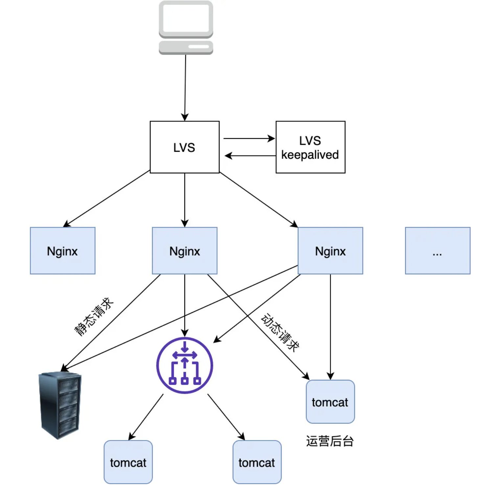

# 浏览器键入网址后到显示期间发生了什么？
[详细](https://mp.weixin.qq.com/s/I6BLwbIpfGEJnxjDcPXc1A)
- 通过浏览器解析URL生成http消息
- 通过DNS查询服务器域名对应的ip地址
- DNS过程
> 1. 客户端首先会发出一个 DNS 请求，问 www.server.com 的 IP 是啥，并发给本地 DNS 服务器（也就是客户端的 TCP/IP 设置中填写的 DNS 服务器地址）。
>
> 2. 本地域名服务器收到客户端的请求后，如果缓存里的表格能找到 www.server.com，则它直接返回 IP 地址。如果没有，本地 DNS 会去问它的根域名服务器：“老大， 能告诉我 www.server.com 的 IP 地址吗？” 根域名服务器是最高层次的，它不直接用于域名解析，但能指明一条道路。
>
> 3. 根 DNS 收到来自本地 DNS 的请求后，发现后置是 .com，说：“www.server.com 这个域名归 .com 区域管理”，我给你 .com 顶级域名服务器地址给你，你去问问它吧。”
>
> 4. 本地 DNS 收到顶级域名服务器的地址后，发起请求问“老二， 你能告诉我 www.server.com  的 IP 地址吗？”
>
> 5. 顶级域名服务器说：“我给你负责 www.server.com 区域的权威 DNS 服务器的地址，你去问它应该能问到”。
>
> 6. 本地 DNS 于是转向问权威 DNS 服务器：“老三，www.server.com对应的IP是啥呀？” server.com 的权威 DNS 服务器，它是域名解析结果的原出处。为啥叫权威呢？就是我的域名我做主。
>
> 7. 权威 DNS 服务器查询后将对应的 IP 地址 X.X.X.X 告诉本地 DNS。
>
> 8. 本地 DNS 再将 IP 地址返回客户端，客户端和目标建立连接。

http报文封装成tcp报文，再封装成Ip报文，再封装成MAC报文。

之后网卡会将包转换为电信号，通过网线发送出去。

交换机会根据MAC地址表查找MAC地址，然后将信号发送到相应的端口。

数据包通过交换机转发抵达了路由器，经过多个路由器转发后到达服务端。

## 简练版本

- 用户在自己的浏览器中输入要访问的网站域名。
- 浏览器向本地DNS服务器请求对该域名的解析。
- 本地DNS服务器中如果缓存有这个域名的解析结果，则直接响应用户的解析请求。
- 本地DNS服务器中如果没有关于这个域名的解析结果的缓存，则以迭代方式向整个DNS系统请求解析，获得应答后将结果反馈给浏览器。
- 浏览器得到域名解析结果，就是该域名相应的服务设备的IP地址 。
- 浏览器获取IP地址之后，经过标准的TCP握手流程，建立TCP连接。
- 浏览器向服务器发起HTTP请求。服务器将用户请求内容传送给浏览器。
- 经过标准的TCP挥手流程，断开TCP连接。

引入CDN之后，用户访问网站一般经历以下步骤：
- 当用户点击网站页面上的内容URL，先经过本地DNS系统解析，如果本地DNS服务器没有相应域名的缓存，则本地DNS系统会将域名的解析权交给CNAME指向的CDN专用DNS服务器。
- CDN的DNS服务器将CDN的全局负载均衡设备IP地址返回给用户。
- 用户向CDN的全局负载均衡设备发起URL访问请求。
- CDN全局负载均衡设备根据用户IP地址，以及用户请求的URL，选择一台用户所属区域的区域负载均衡设备，并将请求转发到此设备上。
- 基于以下这些条件的综合分析之后，区域负载均衡设备会选择一个最优的缓存服务器节点，并从缓存服务器节点处得到缓存服务器的IP地址，最终将得到的IP地址返回给全局负载均衡设备：
- 根据用户IP地址，判断哪一个边缘节点距用户最近；
- 根据用户所请求的URL中携带的内容名称，判断哪一个边缘节点上有用户所需内容；
- 查询各个边缘节点当前的负载情况，判断哪一个边缘节点尚有服务能力。
- 全局负载均衡设备把服务器的IP地址返回给用户。
- 用户向缓存服务器发起请求，缓存服务器响应用户请求，将用户所需内容传送到用户终端。如果这台缓存服务器上并没有用户想要的内容，而区域均衡设备依然将它分配给了用户，那么这台服务器就要向它的上一级缓存服务器请求内容，直至追溯到网站的源服务器将内容拉到本地。

## 路由器和交换机的区别
- 路由器是基于IP设计的，工作在网络层，路由器的各个端口都具有MAC地址和IP地址；
- 交换机是基于以太网（一种局域网）设计的，工作在数据链路层，交换机的端口不具有MAC地址。

## 一般请求不会直接到达服务端，而是到达LVS（四层负载均衡器）。

### 为什么需要LVS？
Nginx 是七层（即应用 层）负载均衡器 ，这意味着如果它要转发流量首先得和 client 建立一个 TCP 连接，并且转发的时候也要与转发到的上游 server 建立一个 TCP 连接，而我们知道建立 TCP 连接其实是需要耗费内存（TCP Socket，接收/发送缓存区等需要占用内存）的，客户端和上游服务器要发送数据都需要先发送暂存到到 Nginx 再经由另一端的 TCP 连接传给对方。

所以 Nginx 的负载能力受限于机器I/O，CPU内存等一系列配置，一旦连接很多（比如达到百万）的话，Nginx 抗负载能力就会急遽下降。

经过分析可知 Nginx 的负载能力较差主要是因为它是七层负载均衡器必须要在上下游分别建立两个 TCP 所致，那么是否能设计一个类似路由器那样的只负载转发包但不需要建立连接的负载均衡器呢，这样由于不需要建立连接，只负责转发包，不需要维护额外的 TCP 连接，它的负载能力必然大大提升，于是四层负载均衡器 LVS 就诞生了，简单对比下两者的区别

可以看到  LVS 只是单纯地转发包，不需要和上下游建立连接即可转发包，相比于 Nginx 它的抗负载能力强、性能高（能达到 F5 硬件的 60%），对内存和cpu资源消耗比较低。

### LVS如何工作
负载均衡设备在接收到第一个来自客户端的SYN 请求时，即通过负载均衡算法选择一个最佳的服务器，并对报文中目标IP地址进行修改(改为后端服务器 IP ），直接转发给该服务器。TCP 的连接建立，即三次握手是客户端和服务器直接建立的，负载均衡设备只是起到一个类似路由器的转发动作。在某些部署情况下，为保证服务器回包可以正确返回给负载均衡设备，在转发报文的同时可能还会对报文原来的源地址进行修改。

综上所述，我们在 Nginx 上再加了一层 LVS，以让它来承接我们的所有流量，当然为了保证 LVS 的可用性，我们也采用主备的方式部署 LVS，另外采用这种架构如果 Nginx 容量不够我们可以很方便地进行水平扩容，于是我们的架构改进如下：

另外相信大家也注意到了，如果流量很大时，静态资源应该部署在 CDN 上， CDN 会自动选择离用户最近的节点返回给用户，所以我们最终的架构改进如下:

## 页面渲染
[详细](https://mp.weixin.qq.com/s/11MRrxmiyZybTUbjRDRubQ)